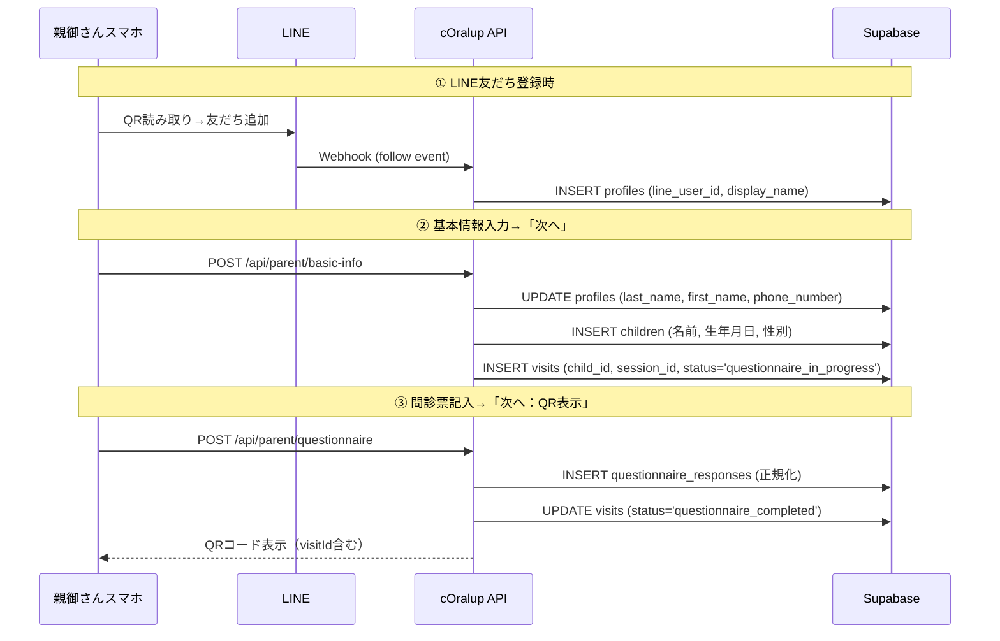

# 02-05 問診画面DB連携

**優先度**: P0（YourTIME必須）
**状態**: 🔧 作業中

---

## 概要

問診画面をハードコードからDB読み込みに変更し、回答を正規化テーブルに保存する。
LINE友だち登録から問診完了・QR表示までの**3段階DB保存フロー**を実装する。

---

## 全体フロー（3段階DB保存）



---

## タスク詳細

### 0. LINE Webhook実装（友だち追加→profiles登録）

**ファイル**: `src/app/api/line/webhook/route.ts`

**処理フロー**:
1. LINE Webhookで `follow` イベントを受信
2. `userId` と `displayName` を取得
3. `profiles` テーブルに即時INSERT

**コード例**:
```typescript
// follow イベント処理
if (event.type === 'follow') {
  const lineUserId = event.source.userId
  
  // LINEプロフィール取得
  const profile = await lineClient.getProfile(lineUserId)
  
  // profiles に登録（存在しなければINSERT）
  await supabase
    .from('profiles')
    .upsert({
      line_user_id: lineUserId,
      display_name: profile.displayName,
      avatar_url: profile.pictureUrl,
      role: 'parent',
    }, { onConflict: 'line_user_id' })
}
```

**確認項目**:
- [ ] LINE Developers Console でWebhook URL設定済み
- [ ] `follow` イベントで profiles に登録される
- [ ] 既存ユーザーは重複登録されない（UPSERT）

---

### 0-1. 基本情報保存API作成

**ファイル**: `src/app/api/parent/basic-info/route.ts`

**エンドポイント**: `POST /api/parent/basic-info`

**リクエストボディ**:
```typescript
{
  line_user_id: string      // LINE ID（Webhook登録済み）
  session_id: string        // セッションID
  // 保護者情報
  parent_last_name: string
  parent_first_name: string
  parent_phone: string
  // 子供情報
  child_last_name: string
  child_first_name: string
  child_birthday: string    // YYYY-MM-DD
  child_gender: 'male' | 'female' | 'other'
  prefecture?: string
}
```

**処理フロー**:
```typescript
// 1. profiles を UPDATE（実名情報追加）
await supabase
  .from('profiles')
  .update({
    last_name: parent_last_name,
    first_name: parent_first_name,
    phone_number: parent_phone,
  })
  .eq('line_user_id', line_user_id)

// 2. profile_id を取得
const { data: profile } = await supabase
  .from('profiles')
  .select('id')
  .eq('line_user_id', line_user_id)
  .single()

// 3. children を INSERT
const { data: child } = await supabase
  .from('children')
  .insert({
    parent_profile_id: profile.id,
    last_name: child_last_name,
    first_name: child_first_name,
    birthday: child_birthday,
    gender: child_gender,
  })
  .select()
  .single()

// 4. visits を作成（QRコード用のvisit_id生成）
const { data: visit } = await supabase
  .from('visits')
  .insert({
    child_id: child.id,
    session_id: session_id,
    status: 'questionnaire_in_progress',
    visit_date: new Date().toISOString(),
    child_age_months: calculateAgeInMonths(child_birthday),
  })
  .select()
  .single()

// 5. sessions テーブルも更新（互換用）
await supabase
  .from('sessions')
  .update({
    parent_name: `${parent_last_name} ${parent_first_name}`,
    parent_phone: parent_phone,
  })
  .eq('session_id', session_id)

return { visit_id: visit.id, child_id: child.id }
```

**確認項目**:
- [ ] profiles に実名・電話番号が保存される
- [ ] children にお子様情報が保存される
- [ ] visits が作成される
- [ ] visit_id が返却される（QRコード用）

---

### 0-2. 問診回答保存API作成（2段階目）

**ファイル**: `src/app/api/parent/questionnaire/route.ts`

**エンドポイント**: `POST /api/parent/questionnaire`

**リクエストボディ**:
```typescript
{
  visit_id: string          // 基本情報保存時に取得
  session_id: string
  responses: [
    { item_id: string, value: string }
  ]
}
```

**処理フロー**:
```typescript
// 1. questionnaire_responses に正規化保存
for (const response of responses) {
  await supabase
    .from('questionnaire_responses')
    .upsert({
      session_id,
      item_id: response.item_id,
      value: response.value,
      answered_at: new Date().toISOString(),
    }, { onConflict: 'session_id,item_id' })
}

// 2. visits ステータス更新
await supabase
  .from('visits')
  .update({ status: 'questionnaire_completed' })
  .eq('id', visit_id)

// 3. 互換用 questionnaires テーブル保存
// ... 既存ロジック

return { visit_id }  // QRコード表示用
```

**確認項目**:
- [ ] questionnaire_responses に正規化保存される
- [ ] visits.status が 'questionnaire_completed' に更新される
- [ ] visit_id が返却される

---

### 1. 問診項目取得API作成

**ファイル**: `src/app/api/questionnaire/items/route.ts`

**エンドポイント**: `GET /api/questionnaire/items`

**クエリパラメータ**:
- `target_age`: 'preschool' | 'elementary'
- `event_id`: (オプション) イベント別設定を適用

**レスポンス**:
```typescript
{
  categories: [
    {
      id: string
      name: string
      display_order: number
      items: [
        {
          id: string
          question: string
          answer_type: string
          options: { value: string, label: string }[]
          is_required: boolean
          placeholder?: string
          helper_text?: string
          validation?: { min?, max?, minLength?, maxLength? }
          display_order: number
        }
      ]
    }
  ]
}
```

**SQL**:
```sql
SELECT 
  qc.id as category_id,
  qc.name as category_name,
  qc.display_order as category_order,
  qi.*
FROM questionnaire_items qi
JOIN questionnaire_categories qc ON qi.category_id = qc.id
WHERE qi.is_active = true
  AND qc.is_active = true
  AND (qc.target_age = $1 OR qc.target_age = 'all')
ORDER BY qc.display_order, qi.display_order
```

---

### 2. 問診画面をDB読み込みに変更

**対象ファイル**:
- `src/app/(exhibition)/(parent)/questionnaire/page.tsx`
- または該当する問診フォームコンポーネント

**変更内容**:
1. `preschoolerFormSchema` / `elementaryFormSchema` のインポートを削除
2. `useEffect` で `/api/questionnaire/items` を fetch
3. 取得したデータでフォームを動的生成

**コード例**:
```typescript
const [schema, setSchema] = useState<QuestionnaireSchema | null>(null)
const [loading, setLoading] = useState(true)

useEffect(() => {
  const fetchSchema = async () => {
    const res = await fetch(`/api/questionnaire/items?target_age=${targetAge}`)
    const data = await res.json()
    setSchema(data)
    setLoading(false)
  }
  fetchSchema()
}, [targetAge])
```

---

### 3. 問診回答保存API作成

**ファイル**: `src/app/api/questionnaire/responses/route.ts`

**エンドポイント**: `POST /api/questionnaire/responses`

**リクエストボディ**:
```typescript
{
  session_id: string
  responses: [
    {
      item_id: string
      value: string
    }
  ]
}
```

**処理フロー**:
1. `session_id` の存在確認
2. `questionnaire_responses` に UPSERT（ON CONFLICT DO UPDATE）
3. 互換用に `questionnaires` テーブルにもJSONB形式で保存

---

### 4. 問診回答を正規化テーブルに保存

**SQL**:
```sql
INSERT INTO questionnaire_responses (session_id, item_id, value, answered_at)
VALUES ($1, $2, $3, NOW())
ON CONFLICT (session_id, item_id) DO UPDATE
SET value = EXCLUDED.value, answered_at = NOW()
```

---

### 5. 旧テーブル互換保存

**処理**:
```typescript
// 正規化テーブルに保存後、互換用にJSONB形式でも保存
const jsonbData = responses.reduce((acc, r) => {
  acc[r.item_id] = r.value
  return acc
}, {})

await supabase
  .from('questionnaires')
  .upsert({
    session_id,
    // 既存フィールドへのマッピング
    child_name: jsonbData['child_name'],
    // ... 他フィールド
    raw_responses: jsonbData, // 全データをJSONBで保存
  })
```

---

### 6. 問診画面E2Eテスト（未就学児）

**テスト項目**:
- [ ] 問診画面が正常に表示される
- [ ] 全カテゴリが表示される（基本情報、きょうだい、睡眠等）
- [ ] 必須項目の入力チェックが機能する
- [ ] 回答が `questionnaire_responses` に保存される
- [ ] 回答が `questionnaires` にも保存される（互換用）
- [ ] QRコード画面に遷移する

---

### 7. 問診画面E2Eテスト（小学生）

**テスト項目**:
- [ ] 小学生用カテゴリのみ表示される（気になること等）
- [ ] 未就学児専用カテゴリは非表示（きょうだい、食べ物の好み等）
- [ ] 回答が正常に保存される

---

## 確認項目（全体）

### LINE Webhook → profiles登録
- [ ] LINE友だち追加で `profiles` に `line_user_id`, `display_name` が登録される
- [ ] 既存ユーザーは重複登録されない

### 基本情報 → profiles/children/visits
- [ ] 「次へ」ボタンで `profiles` に実名・電話番号が UPDATE される
- [ ] `children` にお子様情報が INSERT される
- [ ] `visits` が作成され、`visit_id` が返却される

### 問診回答 → questionnaire_responses
- [ ] 「次へ：QR表示」ボタンで `questionnaire_responses` に正規化保存される
- [ ] `visits.status` が `questionnaire_completed` に更新される
- [ ] QRコード画面に `visit_id` が渡される

### API確認
- [ ] `/api/questionnaire/items?target_age=preschool` が正常にレスポンスを返す
- [ ] `/api/questionnaire/items?target_age=elementary` が正常にレスポンスを返す
- [ ] `POST /api/parent/basic-info` が正常に動作する
- [ ] `POST /api/parent/questionnaire` が正常に動作する

### 画面確認
- [ ] 問診画面がDB読み込みで表示される
- [ ] 回答が `questionnaire_responses` に保存される
- [ ] 回答が `questionnaires` にも保存される（互換用）
- [ ] 未就学児/小学生で表示項目が切り替わる

---

## スタッフ側QRスキャン後の引き継ぎ

### QRスキャン → 問診データ取得

**ファイル**: `src/app/api/staff/session/route.ts`

**エンドポイント**: `GET /api/staff/session?visit_id=xxx`

**処理**:
```typescript
// visit_id から関連データを取得
const { data: visit } = await supabase
  .from('visits')
  .select(`
    *,
    children (
      *,
      profiles:parent_profile_id (*)
    ),
    sessions (*)
  `)
  .eq('id', visit_id)
  .single()

// 問診回答を取得
const { data: questionnaireResponses } = await supabase
  .from('questionnaire_responses')
  .select(`
    *,
    questionnaire_items (question, category_id)
  `)
  .eq('session_id', visit.session_id)

return {
  visit,
  child: visit.children,
  parent: visit.children.profiles,
  questionnaire: questionnaireResponses,
}
```

**確認項目**:
- [ ] QRスキャン後、子供情報が表示される
- [ ] 保護者情報が表示される
- [ ] 問診回答が表示される
- [ ] 診断開始ボタンで診断画面に遷移できる

---

## 参照

- [21-QRコード仕様書.md](../../designe/21-QRコード仕様書.md)
- [27-問診項目DB設計書.md](../../designe/27-問診項目DB設計書.md)
- [08-問診票データ構造仕様書.md](../../designe/08-問診票データ構造仕様書.md)
- [06-DB設計書.md](../../designe/06-DB設計書.md)


