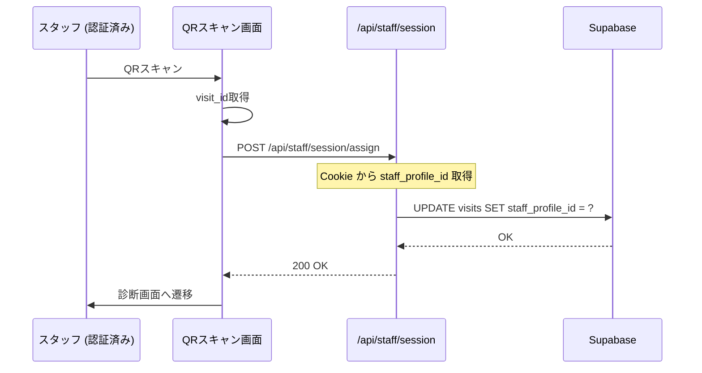

# 03-06: スタッフLINE認証（LIFF最小構成）

**優先度**: 🔴 P0（YourTIMEイベント必須）  
**関連仕様書**: [28-スタッフLINE認証仕様書.md](../../designe/28-スタッフLINE認証仕様書.md)

---

## 概要

スタッフの識別・認証にLINE公式アカウント（Messaging API）+ LIFF（最小構成）を採用。
**LIFFは初回ログイン時のみ使用**し、以降は通常Webアプリをブラウザで利用。

### なぜこの構成か

| 案 | チャネル数 | 初回UX | 実装コスト |
|----|-----------|--------|-----------|
| Messaging + LINEログイン | 2つ | OAuth認可画面あり | 中 |
| **Messaging + LIFF（初回のみ）** | **1つ** | **自動（許可不要）** | **低** ✅採用 |

---

## タスク一覧

### Phase 1: LINE Developers設定

| # | タスク | 詳細 | 状態 | 工数 |
|---|--------|------|------|------|
| 1.1 | LINE公式アカウント作成 | 「cOralupスタッフ」Messaging APIチャネル作成 | 📋 | 15min |
| 1.2 | LINE Loginチャネル作成 | 「cOralupスタッフ（ログイン用）」LINE Loginチャネル作成 | 📋 | 15min |
| 1.3 | LIFF作成 | LINE Loginチャネル内でLIFFアプリ追加（ログイン専用） | 📋 | 10min |
| 1.4 | Webhook URL設定 | `/api/line/staff-webhook` を登録（Messaging APIチャネル） | 📋 | 5min |
| 1.5 | リッチメニュー作成 | 「アプリを開く」→ LIFF URL | 📋 | 15min |
| 1.6 | 環境変数設定 | Vercel + ローカルに追加（Messaging API + LINE Login） | 📋 | 10min |

### Phase 2: Webhook実装

| # | タスク | 詳細 | 状態 | 工数 |
|---|--------|------|------|------|
| 2.1 | Webhook API作成 | `src/app/api/line/staff-webhook/route.ts` | 📋 | 30min |
| 2.2 | 署名検証実装 | x-line-signature検証 | 📋 | 15min |
| 2.3 | followイベント処理 | profiles作成（role: staff） | 📋 | 30min |
| 2.4 | unfollowイベント処理 | is_active = false に更新 | 📋 | 15min |
| 2.5 | 登録完了メッセージ送信 | push message API呼び出し | 📋 | 15min |

### Phase 3: LIFF認証実装

| # | タスク | 詳細 | 状態 | 工数 |
|---|--------|------|------|------|
| 3.1 | LIFFログイン画面 | `src/app/staff/liff-login/page.tsx`（1画面のみ） | 📋 | 30min |
| 3.2 | セッション発行API | `src/app/api/auth/staff-session/route.ts` | 📋 | 30min |
| 3.3 | セッションCookie発行 | JWT生成 + httpOnly Cookie設定 | 📋 | 20min |
| 3.4 | セッション検証ユーティリティ | `src/lib/staff-auth.ts` | 📋 | 20min |
| 3.5 | @line/liff パッケージ追加 | `pnpm add @line/liff` | 📋 | 5min |

### Phase 4: スタッフ画面実装

| # | タスク | 詳細 | 状態 | 工数 |
|---|--------|------|------|------|
| 4.1 | ログイン案内画面 | `src/app/staff/login/page.tsx`（Cookie切れ時用） | 📋 | 20min |
| 4.2 | ホーム画面 | `src/app/staff/home/page.tsx` | 📋 | 45min |
| 4.3 | 履歴一覧画面 | `src/app/staff/history/page.tsx` | 📋 | 45min |
| 4.4 | 履歴詳細画面 | `src/app/staff/history/[sessionId]/page.tsx` | 📋 | 60min |

### Phase 5: 診断フローへの統合

| # | タスク | 詳細 | 状態 | 工数 |
|---|--------|------|------|------|
| 5.1 | QRスキャン時のスタッフ紐付け | visits.staff_profile_id 設定 | 📋 | 30min |
| 5.2 | 診断画面でスタッフ情報表示 | セッションからスタッフ名取得 | 📋 | 15min |
| 5.3 | 対応履歴API | `src/app/api/staff/history/route.ts` | 📋 | 30min |

#### 5.1 詳細: スタッフ紐付けフロー



**API設計:**
```typescript
// POST /api/staff/session/assign
{
  visit_id: string  // QRから取得
}
// → Cookie の staff_session から staff_profile_id を取得
// → visits.staff_profile_id を更新
```

#### 5.3 詳細: 対応履歴API

```typescript
// GET /api/staff/history
// Cookie認証必須
// Response:
{
  data: [
    {
      id: string,           // visit_id
      visit_date: string,
      status: string,
      child: {
        first_name: string,
        last_name: string,
        birthday: string
      },
      session_id: string
    }
  ]
}
```

### Phase 6: テスト

| # | タスク | 詳細 | 状態 | 工数 |
|---|--------|------|------|------|
| 6.1 | 友だち追加テスト | Webhookが正しく動作するか | 📋 | 15min |
| 6.2 | LIFFログインテスト | 初回ログインフロー確認 | 📋 | 15min |
| 6.3 | 2回目ログインテスト | ブックマークからCookie認証確認 | 📋 | 10min |
| 6.4 | 履歴表示テスト | 自分の対応のみ表示されるか | 📋 | 15min |
| 6.5 | E2Eテスト | 友だち追加→ログイン→診断→履歴確認 | 📋 | 30min |

---

## 環境変数

```env
# スタッフ用LINE Messaging API
LINE_STAFF_CHANNEL_ID=
LINE_STAFF_CHANNEL_SECRET=
LINE_STAFF_CHANNEL_ACCESS_TOKEN=

# LIFF ID（Messaging APIチャネル内で発行）
NEXT_PUBLIC_STAFF_LIFF_ID=

# セッション暗号化キー
STAFF_SESSION_SECRET=

# cOralup組織ID（profiles.organization_id用）
CORALUP_ORG_ID=
```

---

## ファイル構成

```
src/
├── app/
│   ├── api/
│   │   ├── auth/
│   │   │   └── staff-session/
│   │   │       └── route.ts          # LIFF→セッション発行
│   │   ├── line/
│   │   │   └── staff-webhook/
│   │   │       └── route.ts          # Webhook
│   │   └── staff/
│   │       └── history/
│   │           └── route.ts          # 履歴API
│   └── staff/
│       ├── liff-login/
│       │   └── page.tsx              # LIFFログイン画面（初回のみ）
│       ├── login/
│       │   └── page.tsx              # ログイン案内画面
│       ├── home/
│       │   └── page.tsx              # ホーム画面
│       └── history/
│           ├── page.tsx              # 履歴一覧
│           └── [sessionId]/
│               └── page.tsx          # 履歴詳細
└── lib/
    └── staff-auth.ts                 # 認証ユーティリティ
```

---

## 依存パッケージ

```bash
pnpm add @line/liff jose
```

---

## DB変更

```sql
-- profiles に is_active カラム追加（未追加の場合）
ALTER TABLE profiles ADD COLUMN IF NOT EXISTS is_active BOOLEAN DEFAULT true;

-- インデックス追加
CREATE INDEX IF NOT EXISTS idx_profiles_line_user_id_role 
ON profiles(line_user_id, role);
```

---

## 実装順序（推奨）

```
1. LINE Developers設定（Phase 1）
   ↓
2. Webhook実装（Phase 2）
   ↓
3. スタッフを友だち追加してもらう
   ↓
4. LIFF認証実装（Phase 3）
   ↓
5. スタッフ画面実装（Phase 4）
   ↓
6. 診断フロー統合（Phase 5）
   ↓
7. テスト（Phase 6）
```

---

## 見積もり工数

| Phase | 工数 |
|-------|------|
| Phase 1: LINE設定 | 1時間 |
| Phase 2: Webhook | 2時間 |
| Phase 3: LIFF認証 | 2時間 |
| Phase 4: 画面 | 3時間 |
| Phase 5: 統合 | 1.5時間 |
| Phase 6: テスト | 1.5時間 |
| **合計** | **約11時間** |

---

## チェックリスト

- [ ] LINE公式「cOralupスタッフ」作成
- [ ] LIFF作成（同チャネル内）
- [ ] リッチメニュー設定
- [ ] 環境変数設定（ローカル + Vercel）
- [ ] Webhook実装・デプロイ
- [ ] テストスタッフで友だち追加確認
- [ ] LIFF認証実装・デプロイ
- [ ] 初回ログイン動作確認
- [ ] 2回目以降（Cookie）動作確認
- [ ] ホーム画面・履歴画面実装
- [ ] 診断時のスタッフ紐付け実装
- [ ] E2Eテスト完了

