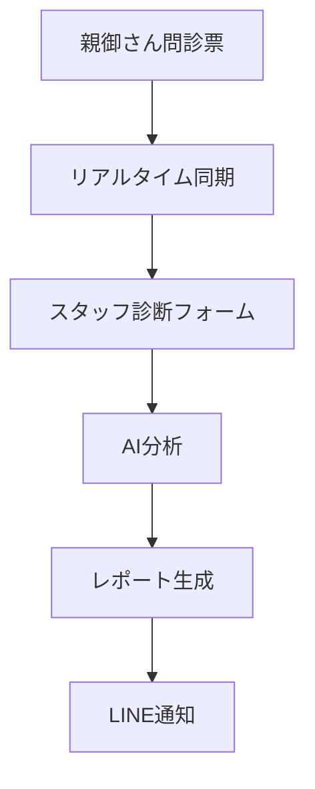
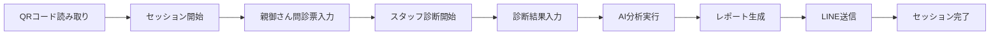

# Coralup TODO プロジェクト管理

## 概要
Coralup 問診票・ユーザー管理DXプロジェクトのタスク管理ドキュメントです。Linearで管理されているイシュー・ストーリー・エピックを構造化して整理しています。

## ディレクトリ構造

```
TODO/
├── 01-infra-setup/           # インフラ・セットアップ関連
├── 02-form-builder/          # フォームビルダー関連
├── 03-parent-features/       # 親向け機能関連
├── 04-staff-features/        # スタッフ向け機能関連
├── 05-admin-features/        # 管理者向け機能関連
└── 06-business/              # ビジネス関連タスク
```

## エピック一覧（最適開発順序）

### Phase 1: 基盤構築（インフラ・認証）
#### 01. インフラ・セットアップ
- **セッション管理システム (KS-102)**
  - セッションライフサイクル管理とセキュリティ
- **Supabaseプロジェクト初期設定 (KS-153)** ✅ 完了済み
  - 基本的なデータベース・認証設定

#### 02. フォームビルダー
- **データ同期メカニズム (KS-101)**
  - 親御さんとスタッフ間のリアルタイム同期
- **動的フォームビルダー (KS-35)**
  - 管理画面でのフォーム作成・編集機能

### Phase 2: コア機能開発（ユーザー体験）
#### 03. 親向け機能
- **セッション開始フォーム改善 (KS-25)**
- **LINE連携 (KS-100)**
  - QRコード・友だち登録・通知連携
- **問診フォーム動的レンダリング (KS-26)**
- **結果表示画面実装 (KS-27)**

#### 04. スタッフ向け機能
- **セッション一覧・検索機能 (KS-28)** ✅ 完了済み
- **リアルタイム通知システム (KS-103)**
  - スタッフ・親御さん間の通知連携
- **診断フォーム入力 (KS-29)**
- **AI分析実行・結果確認 (KS-30)**
- **レポート生成・送信 (KS-31)**

### Phase 3: 高度機能（分析・管理）
#### 05. 管理者向け機能
- **ダッシュボード実装 (KS-32)**
- **ユーザー管理画面 (KS-33)**
- **データ分析・BI機能 (KS-34)**

### Phase 4: ビジネス統合
#### 06. ビジネス関連
- **外部サービス連携完成 (KS-14)**
  - LINE・Lark Baseとの完全連携
- **ビジネス関連タスク**
  - 契約・見積・請求関連

## 使用方法

各ストーリーファイルには以下の情報が含まれています：
- ✅ 完了済みタスク（チェックマーク付き）
- ⏳ 進行中のタスク
- 📋 未着手のタスク

各タスクの詳細な説明と進捗は、各ファイル内で確認できます。

## 更新方法

新しいタスクやストーリーが追加された場合：
1. 対応するエピックディレクトリにストーリーファイルを作成
2. タスクのチェックボックスを適切に設定
3. 進捗記録を更新

## 開発優先順位の考え方

### Phase 1: 基盤構築の理由
1. **セッション管理**: 全機能の基盤となるため最初に実装
2. **データ同期**: 親御さんとスタッフの連携に不可欠
3. **インフラ設定**: 開発の基盤となるSupabase環境

### Phase 2: コア機能開発の理由
1. **親向け機能**: ユーザーが最初に触れる重要な体験
2. **LINE連携**: シームレスなユーザー体験に必須
3. **スタッフ機能**: 実際の診断業務に必要な機能

### Phase 3: 高度機能の理由
1. **管理者機能**: システム全体の管理・分析機能
2. **データ分析**: ビジネスインサイトのための機能

### Phase 4: ビジネス統合の理由
1. **外部連携**: 実際の業務運用に必要な連携
2. **ビジネスプロセス**: 契約・運用関連の機能

## 重要な設計原則

### データ同期アーキテクチャ


### セッションライフサイクル


### 親御さん・スタッフ同期の重要性

**同期タイミングの最適化:**
1. **親御さん問診票完了 → スタッフ即時通知**
   - 問診票入力完了時にリアルタイム通知
   - スタッフはすぐに診断を開始可能

2. **スタッフ診断開始 → 親御さん進捗通知**
   - 診断開始時にLINE通知
   - 親御さんに安心感を提供

3. **スタッフ診断完了 → 親御さん結果通知**
   - 診断完了時に即時LINE通知
   - レポートPDFも自動送信

**LINE連携のポイント:**
- **QRコード**: セッションID付きで生成
- **友だち登録**: 自動でLINE IDとセッションIDを紐づけ
- **通知タイミング**: 各ステップ完了時に適切な通知
- **データ連携**: 問診票・診断結果・レポートの自動同期

**ユーザビリティの観点:**
- **直感的な操作**: 親御さんが迷わず入力可能
- **リアルタイム性**: 待ち時間を最小限に
- **エラーハンドリング**: ネットワーク切断時もデータ保持
- **アクセシビリティ**: 全てのユーザーが利用可能

## 関連リンク

- [Linearプロジェクト](https://linear.app/ks-classic/project/coralup-問診票・ユーザー管理dx-16c9b1a33223)
- [GitHubリポジトリ](https://github.com/yasuhikokohata/cOralup)
