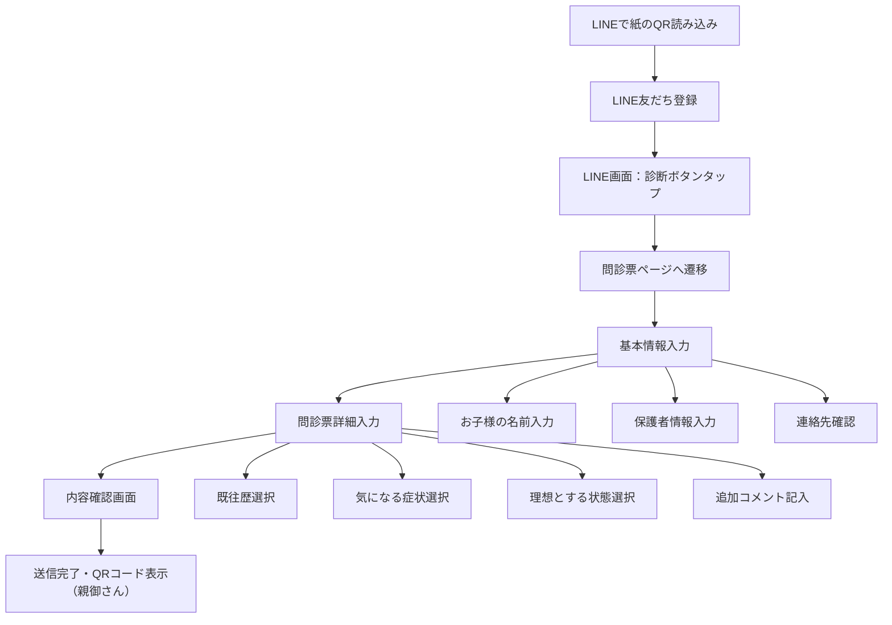
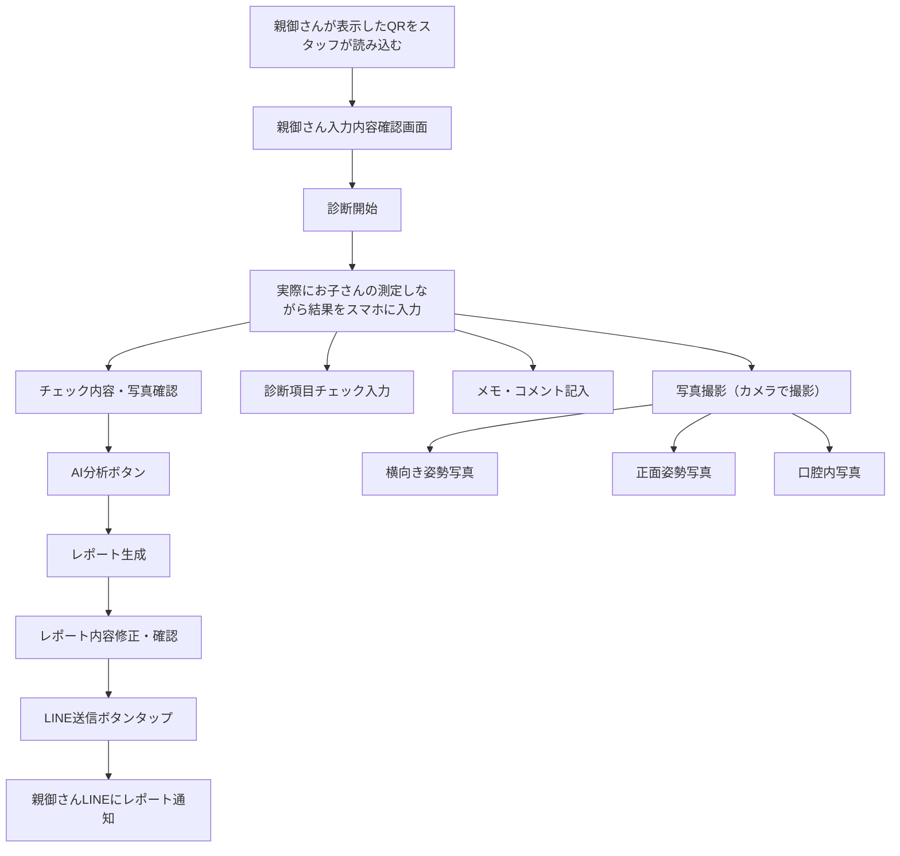

# Coralup 技術仕様書

## 1. システムアーキテクチャ

### 1.1 全体構成
```
┌─────────────────┐    ┌─────────────────┐    ┌─────────────────┐
│   親御さん      │    │    スタッフ     │    │    管理者       │
│   Webアプリ     │    │   Webアプリ     │    │   管理画面      │
└─────────┬───────┘    └─────────┬───────┘    └─────────┬───────┘
          │                    │                    │
          └────────────────────┼────────────────────┘
                               │
                    ┌─────────────────┐
                    │  Next.js API    │
                    │   Routes        │
                    └─────────┬───────┘
                              │
                    ┌─────────────────┐
                    │    Supabase     │
                    │   Database      │
                    └─────────┬───────┘
                              │
                    ┌─────────────────┐
                    │  External APIs   │
                    │  (LINE, Gemini) │
                    └─────────────────┘
```

### 1.2 フロントエンドアーキテクチャ
- **フレームワーク**: Next.js 14 (App Router)
- **言語**: TypeScript
- **スタイリング**: Tailwind CSS
- **状態管理**: Zustand
- **フォーム管理**: React Hook Form + Zod
- **UIコンポーネント**: Radix UI + Tailwind

#### コンポーネント構造設計

**統合診断ページのコンポーネント分割:**

設計方針:
- 1つのページで完結（UX維持）
- コンポーネントを機能別に分割（保守性向上）
- 動的インポートによるコード分割（パフォーマンス向上）
- プリロード戦略によるUX最適化

ディレクトリ構造:
```
src/app/(staff)/diagnosis/
├── page.tsx                    # エントリーポイント
├── [id]/page.tsx              # 統合診断ページ（ステップ管理）
├── demo/page.tsx              # デモページ
└── components/
    ├── steps/                 # ステップコンポーネント
    ├── shared/                # 共通UIコンポーネント
    ├── hooks/                 # 共通フック
    └── types.ts               # 共通型定義
```

パフォーマンス最適化:
- 動的インポート（`next/dynamic`）によるコード分割
- プリロード戦略（次のステップを事前読み込み）
- 並列プリロード（主要ステップを同時読み込み）
- スケルトンローディング（視覚的フィードバック）

効果:
- 初期バンドルサイズ: 約50%削減
- 初回ページロード: 約60%削減（500-800ms → 200-300ms）
- ステップ切り替え: 0ms（プリロード + キャッシュ）
- メモリ使用量: 約50%削減

詳細は [17-diagnosis-component-split-implementation-guide.md](./17-diagnosis-component-split-implementation-guide.md) を参照。

### 1.3 バックエンドアーキテクチャ

## 2. データベース設計

### 2.1 テーブル設計

#### sessions（セッション管理）
```sql
CREATE TABLE sessions (
  id UUID PRIMARY KEY DEFAULT gen_random_uuid(),
  session_id VARCHAR(10) UNIQUE NOT NULL,
  line_user_id VARCHAR(255),
  status VARCHAR(20) DEFAULT 'active',
  created_at TIMESTAMP WITH TIME ZONE DEFAULT NOW(),
  updated_at TIMESTAMP WITH TIME ZONE DEFAULT NOW()
);
```

#### questionnaires（問診票）
```sql
CREATE TABLE questionnaires (
  id UUID PRIMARY KEY DEFAULT gen_random_uuid(),
  session_id UUID REFERENCES sessions(id),
  child_name VARCHAR(100) NOT NULL,
  child_age INTEGER NOT NULL,
  child_gender VARCHAR(10) NOT NULL,
  parent_name VARCHAR(100) NOT NULL,
  parent_phone VARCHAR(20) NOT NULL,
  medical_history TEXT[],
  concerns TEXT[],
  ideal_goals TEXT[],
  notes TEXT,
  created_at TIMESTAMP WITH TIME ZONE DEFAULT NOW(),
  updated_at TIMESTAMP WITH TIME ZONE DEFAULT NOW()
);
```

#### diagnoses（診断結果）
```sql
CREATE TABLE diagnoses (
  id UUID PRIMARY KEY DEFAULT gen_random_uuid(),
  session_id UUID REFERENCES sessions(id),
  posture_analysis JSONB,
  oral_analysis JSONB,
  diagnosis_items JSONB,
  ai_analysis TEXT,
  staff_notes TEXT,
  photos JSONB,
  created_at TIMESTAMP WITH TIME ZONE DEFAULT NOW(),
  updated_at TIMESTAMP WITH TIME ZONE DEFAULT NOW()
);
```

#### reports（レポート）
```sql
CREATE TABLE reports (
  id UUID PRIMARY KEY DEFAULT gen_random_uuid(),
  session_id UUID REFERENCES sessions(id),
  pdf_url TEXT,
  line_sent_at TIMESTAMP WITH TIME ZONE,
  status VARCHAR(20) DEFAULT 'pending',
  created_at TIMESTAMP WITH TIME ZONE DEFAULT NOW()
);
```

### 2.2 インデックス
- sessions.session_id (UNIQUE)
- sessions.line_user_id
- questionnaires.session_id
- diagnoses.session_id
- reports.session_id

## 3. API設計

### 3.1 エンドポイント一覧

#### セッション管理
- `POST /api/sessions` - セッション作成
- `GET /api/sessions/[id]` - セッション情報取得
- `PATCH /api/sessions/[id]` - セッション更新

#### 問診票管理
- `POST /api/questionnaires` - 問診票保存
- `GET /api/questionnaires/[sessionId]` - 問診票取得
- `PUT /api/questionnaires/[sessionId]` - 問診票更新

#### 診断管理
- `POST /api/diagnoses` - 診断結果保存
- `GET /api/diagnoses/[sessionId]` - 診断結果取得
- `PUT /api/diagnoses/[sessionId]` - 診断結果更新
- `POST /api/diagnoses/[sessionId]/photos` - 写真アップロード

#### レポート管理
- `POST /api/reports` - レポート生成
- `GET /api/reports/[sessionId]` - レポート取得
- `POST /api/reports/[sessionId]/send` - LINE送信

#### AI分析
- `POST /api/analysis` - 統合AI分析（visitIdベース、Gemini 2.5 Pro）
- `GET /api/analysis?visitId=xxx` - 分析結果取得
- `PATCH /api/analysis` - 分析結果更新（final_content, feedbackScore）
- `POST /api/ai/analyze-posture` - 姿勢分析（レガシー）
- `POST /api/ai/analyze-oral` - 口腔分析（レガシー）
- `POST /api/ai/generate-report` - レポート生成（レガシー）

##### AI分析実装詳細
| ファイル | 役割 |
|---------|------|
| `src/lib/gemini.ts` | Geminiクライアント（リトライ、モックモード対応） |
| `src/agents/oral-diagnosis/schema.ts` | Zodスキーマ、プロンプトビルダー |
| `src/agents/oral-diagnosis/prompt.md` | プロンプトテンプレート |

##### 環境変数
```
GOOGLE_AI_API_KEY=xxx           # Gemini APIキー
GOOGLE_GEMINI_MODEL=gemini-2.5-pro-preview-05-06  # モデル名（省略可）
```

#### LINE連携
- `POST /api/line/webhook` - LINE Webhook
- `POST /api/line/send-message` - メッセージ送信

### 3.2 APIレスポンス形式
```typescript
interface ApiResponse<T> {
  success: boolean;
  data?: T;
  error?: {
    code: string;
    message: string;
  };
  timestamp: string;
}
```

## 4. AIエージェント設計

### 4.1 エージェント構造
```
src/app/agents/
├── index.ts                    # エージェントランタイム
├── posture-analyzer/
│   ├── prompt.md              # 姿勢分析プロンプト
│   └── schema.ts              # 入出力スキーマ
├── oral-analyzer/
│   ├── prompt.md              # 口腔分析プロンプト
│   └── schema.ts              # 入出力スキーマ
└── report-generator/
    ├── prompt.md              # レポート生成プロンプト
    └── schema.ts              # 入出力スキーマ
```

### 4.2 プロンプト設計

#### 姿勢分析エージェント
```markdown
# 役割
あなたは口腔育成の専門家として、姿勢写真からお子様の姿勢状態を分析します。

# 分析項目
1. 頭部の位置と傾き
2. 肩の高さの左右差
3. 背骨のカーブ状態
4. 骨盤の傾き
5. 足の位置とバランス

# 出力形式
JSON形式で以下の情報を出力してください：
- overall_score: 全体評価（1-10）
- issues: 問題点の配列
- recommendations: 改善提案の配列
- severity: 深刻度（low/medium/high）
```

#### 口腔分析エージェント
```markdown
# 役割
あなたは口腔機能の専門家として、口腔内写真からお子様の口腔状態を分析します。

# 分析項目
1. 咬合状態
2. 歯並びの評価
3. 舌の位置と機能
4. 口腔内の清潔度
5. 発音・嚥下機能の推定

# 出力形式
JSON形式で以下の情報を出力してください：
- overall_score: 全体評価（1-10）
- issues: 問題点の配列
- recommendations: 改善提案の配列
- severity: 深刻度（low/medium/high）
```

### 4.3 スキーマ定義
```typescript
// 姿勢分析結果の型
export const PostureAnalysisSchema = z.object({
  overall_score: z.number().min(1).max(10),
  issues: z.array(z.string()),
  recommendations: z.array(z.string()),
  severity: z.enum(['low', 'medium', 'high']),
  details: z.object({
    head_position: z.string(),
    shoulder_balance: z.string(),
    spine_curve: z.string(),
    pelvis_tilt: z.string(),
    foot_balance: z.string()
  })
});

// 口腔分析結果の型
export const OralAnalysisSchema = z.object({
  overall_score: z.number().min(1).max(10),
  issues: z.array(z.string()),
  recommendations: z.array(z.string()),
  severity: z.enum(['low', 'medium', 'high']),
  details: z.object({
    bite_condition: z.string(),
    teeth_alignment: z.string(),
    tongue_position: z.string(),
    oral_cleanliness: z.string(),
    function_estimation: z.string()
  })
});
```

## 5. UI/UX設計

### 5.1 親御さん向け画面

#### 問診票入力画面
- プログレスバーによる進捗表示
- 1画面1項目のシンプル設計
- バリデーションエラーの即時表示
- レスポンシブデザイン（モバイル優先）

#### 結果確認画面
- 診断結果のグラフィカル表示
- PDFダウンロード機能
- 次のアクションの明確な誘導
- 満足度フィードバック機能

### 5.2 スタッフ向け画面

#### 診断画面
- タブ切り替え（写真/診断/結果）
- リアルタイムプレビュー
- ドラッグ&ドロップによる操作
- キーボードショートカット対応

#### 管理画面
- セッション一覧のフィルタリング
- リアルタイムステータス表示
- バルク操作機能
- エクスポート機能

### 5.3 レスポンシブデザイン
- **Desktop**: フル機能表示
- **Tablet**: 最適化されたレイアウト
- **Mobile**: タッチ操作に最適化

## 6. セキュリティ設計

### 6.1 認証・認可
- Supabase Authによるユーザー管理
- ロールベースアクセス制御（RBAC）
- JWTトークンによるAPI認証
- セッションタイムアウト

### 6.2 データ保護
- 個人情報の暗号化保存
- PII（個人識別情報）のマスキング
- セキュアなファイルアップロード
- CORS設定

### 6.3 監査・ログ
- 全操作のログ記録
- 異常アクセスの検知
- 定期的なセキュリティスキャン
- インシデント対応計画

## 7. デプロイ・運用

### 7.1 環境構成
- **Development**: localhost + Supabase Local
- **Staging**: Vercel Preview Deployment
- **Production**: Vercel Production

### 7.2 CI/CD
- GitHub Actionsによる自動デプロイ
- テスト自動実行
- コード品質チェック（ESLint, Prettier）
- セキュリティスキャン

### 7.3 監視・通知
- Vercel Analyticsによるパフォーマンス監視
- Sentryによるエラー追跡
- LINE通知によるシステムアラート
- 定期的なバックアップ確認

## 8. テスト戦略

### 8.1 単体テスト
- コンポーネント単体テスト（Jest + React Testing Library）
- API関数単体テスト（Jest）
- ユーティリティ関数テスト

### 8.2 統合テスト
- ユーザーシナリオテスト
- API統合テスト
- データベース統合テスト

### 8.3 E2Eテスト
- PlaywrightによるE2Eテスト
- 主要ユーザーシナリオのカバレッジ
- クロスブラウザテスト

## 9. パフォーマンス最適化

### 9.1 フロントエンド
- 画像の最適化（Next.js Image）
- コード分割と遅延ローディング
- キャッシュ戦略の実装
- バンドルサイズ最適化

### 9.2 バックエンド
- データベースクエリ最適化
- APIレスポンスのキャッシュ
- バックグラウンド処理の活用
- レート制限の実装

### 9.3 インフラ
- Vercel Edge Runtimeの活用
- Supabaseエッジファンクション
- CDNによる静的アセット配信
- データベース接続プーリング

## 10. 拡張性・保守性

### 10.1 コード設計
- SOLID原則の適用
- 関心の分離（SoC）
- 依存性注入（DI）の活用
- 設定の外部化

### 10.2 アーキテクチャ
- マイクロサービス指向の設計
- APIファーストアプローチ
- イベント駆動アーキテクチャ
- 設定可能なプラグイン構造

### 10.3 ドキュメンテーション
- APIドキュメントの自動生成
- コンポーネントストーリーブック
- アーキテクチャ決定記録（ADR）
- 運用マニュアルの整備

## 11. UI/UX設計詳細

### 11.1 ユーザーフロー詳細

#### 親御さんユーザー メインフロー


#### スタッフユーザー メインフロー


### 11.2 ワイヤーフレーム詳細

#### 親御さん向け画面ワイヤーフレーム

##### 1. 基本情報入力画面
```
┌─────────────────────────────────────┐
│            Coralup 問診票           │
├─────────────────────────────────────┤
│                                     │
│ 👶 お子様の情報                    │
│ ┌─────────────────────────────────┐ │
│ │ お名前: [テキスト入力]          │ │
│ │ 年齢: [数値入力]歳             │ │
│ │ 性別: ○男 ○女 ○その他         │ │
│ └─────────────────────────────────┘ │
│                                     │
│ 👨‍👩‍👧‍👦 保護者情報                 │
│ ┌─────────────────────────────────┐ │
│ │ お名前: [テキスト入力]          │ │
│ │ 電話番号: [テキスト入力]        │ │
│ └─────────────────────────────────┘ │
│                                     │
│ 📱 LINE通知について                │
│ 診断結果はLINEでお送りします      │
│                                     │
│         [次へ進む] ボタン          │
└─────────────────────────────────────┘
```

##### 2. 問診票詳細入力画面
```
┌─────────────────────────────────────┐
│        問診票詳細入力 (1/4)        │
├─────────────────────────────────────┤
│ 現在の悩みや気になること            │
│ □ 歯並びが気になる                 │
│ □ 口呼吸をしている                 │
│ □ 姿勢が悪いと言われる             │
│ □ 発音が不明瞭                     │
│ □ 食事中にこぼす                   │
│ □ その他: [テキスト入力]          │
│                                     │
│ 理想とする状態                      │
│ □ きれいな歯並びになりたい         │
│ □ 正しい姿勢を身につけたい         │
│ □ 鼻呼吸ができるようになりたい     │
│ □ 発音がはっきりするようになりたい │
│ □ 食事のマナーが良くなる           │
│ □ その他: [テキスト入力]          │
│                                     │
│   [前へ] ボタン    [次へ] ボタン   │
└─────────────────────────────────────┘
```

##### 3. 内容確認・送信画面
```
┌─────────────────────────────────────┐
│           内容確認・送信           │
├─────────────────────────────────────┤
│ ✅ 入力内容の確認                  │
│                                     │
│ 👶 お子様情報                       │
│ • 名前: 田中 太郎                  │
│ • 年齢: 8歳                        │
│ • 性別: 男                         │
│                                     │
│ 👨‍👩‍👧‍👦 保護者情報                │
│ • 名前: 田中 花子                  │
│ • 電話: 090-1234-5678             │
│                                     │
│ 📝 問診票内容                       │
│ • 気になること: 歯並び、口呼吸      │
│ • 理想の状態: きれいな歯並び        │
│                                     │
│ 📱 LINE連携                        │
│ 診断結果は登録したLINEアカウント   │
│ 宛にお送りします                   │
│                                     │
│         [修正する] ボタン          │
│         [送信する] ボタン          │
└─────────────────────────────────────┘
```

##### 4. QRコード表示画面
```
┌─────────────────────────────────────┐
│           送信完了・QRコード       │
├─────────────────────────────────────┤
│ ✅ 問診票の送信が完了しました      │
│                                     │
│ 📱 スタッフの方にこちらのQRコード  │
│    を読み取ってもらってください    │
│                                     │
│          QRコード表示領域          │
│         [大きなQRコード]           │
│                                     │
│ 🔄 別のQRコードを生成              │
│ 📋 送信内容の確認                  │
│                                     │
│ この画面をスタッフの方に           │
│ 提示してください                   │
└─────────────────────────────────────┘
```

#### スタッフ向け画面ワイヤーフレーム

##### 1. セッション管理画面
```
┌─────────────────────────────────────┐
│          診断セッション管理         │
├─────────────────────────────────────┤
│ [検索バー: セッションID・児童名]   │
│                                     │
│ 📊 セッション一覧                  │
│ ┌─────────────────────────────────┐ │
│ │ 🆔 SESSION-ABC123              │ │
│ │ 👶 田中 太郎 (8歳)             │ │
│ │ 👨‍👩‍👧‍👦 田中 花子                │ │
│ │ 📅 2024/01/15 14:30           │ │
│ │ 🟢 診断中                      │ │
│ │ [詳細] [診断開始] ボタン       │ │
│ └─────────────────────────────────┘ │
│                                     │
│ [+ 新規セッション作成] ボタン      │
└─────────────────────────────────────┘
```

##### 2. 写真撮影画面
```
┌─────────────────────────────────────┐
│           写真撮影・管理           │
├─────────────────────────────────────┤
│ 👶 田中 太郎 (8歳) 様の診断       │
│                                     │
│ 📸 写真撮影                        │
│ ┌─────────┬─────────┬─────────┐   │
│ │ 横向き  │ 正面姿勢 │ 口腔内  │   │
│ │ 姿勢    │ 写真     │ 写真    │   │
│ │ [撮影]  │ [撮影]   │ [撮影]   │   │
│ │ □済み   │ □済み    │ □済み    │   │
│ └─────────┴─────────┴─────────┘   │
│                                     │
│ 📷 撮影済み写真一覧                │
│ [サムネイル] [サムネイル] [削除]  │
│                                     │
│ [写真撮影完了] [一時保存] ボタン   │
└─────────────────────────────────────┘
```

##### 3. 診断結果入力画面
```
┌─────────────────────────────────────┐
│           診断結果入力             │
├─────────────────────────────────────┤
│ 👶 田中 太郎 (8歳) 様              │
│                                     │
│ 📋 診断項目                        │
│ 姿勢評価                           │
│ □ 頭部位置: 良好・不良             │
│ □ 肩バランス: 左右差あり・なし     │
│ □ 背骨カーブ: 正常・異常           │
│ □ 骨盤傾き: 問題なし・要改善       │
│ □ 足部バランス: 良好・不良         │
│                                     │
│ 🦷 口腔機能評価                     │
│ □ 咬合状態: 正常・異常             │
│ □ 歯並び: 良好・要矯正             │
│ □ 舌位置: 正常・異常               │
│ □ 清潔度: 良好・不良               │
│                                     │
│ 📝 スタッフメモ                    │
│ [複数行テキスト入力領域]           │
│                                     │
│ [一時保存] [診断完了] ボタン       │
└─────────────────────────────────────┘
```

##### 4. 最終確認・分析画面
```
┌─────────────────────────────────────┐
│         最終確認・分析             │
├─────────────────────────────────────┤
│ 👶 田中 太郎 (8歳) 様              │
│                                     │
│ 📊 診断サマリー                   │
│ • 姿勢評価: 7/10点                 │
│ • 口腔評価: 6/10点                 │
│ • 総合評価: 良好                   │
│                                     │
│ 🤖 AI分析結果                      │
│ 姿勢の改善点とアドバイス            │
│ [AI生成テキスト領域]               │
│                                     │
│ 📄 生成されるPDF内容               │
│ [プレビュー表示領域]               │
│                                     │
│ ✏️ 編集機能                        │
│ [テキスト編集ボタン] [画像追加]    │
│                                     │
│ [内容修正] [確定・送信] ボタン     │
└─────────────────────────────────────┘
```

### 11.3 UX最適化のための修正・追加ポイント

#### 優先度: 高
1. **プログレッシブディスクロージャー**
   - 情報入力の負担を軽減するため、段階的に詳細を求める設計
   - 必須項目と任意項目の明確な区別

2. **リアルタイムバリデーション**
   - 入力中の即時フィードバック
   - エラー箇所の明確な表示

3. **モバイルファースト設計**
   - タッチ操作の最適化
   - 片手操作を考慮したUI配置

#### 優先度: 中
4. **アクセシビリティ向上**
   - スクリーンリーダー対応
   - キーボードナビゲーション
   - コントラスト比の最適化

5. **パーソナライズ機能**
   - 過去の診断履歴表示
   - 入力の自動補完機能

#### 優先度: 低（将来的）
6. **オフライン対応**
   - 入力データのローカル保存
   - オンライン復帰時の自動同期

7. **マルチ言語対応**
   - 英語・中国語対応
   - 専門用語の多言語対応

### 11.4 画面遷移と状態管理

#### 親御さんフロー状態遷移
```typescript
type ParentFlowState =
  | 'basic_info'      // 基本情報入力
  | 'questionnaire'   // 問診票入力
  | 'confirmation'    // 確認画面
  | 'qr_display'      // QRコード表示
  | 'completed'       // 完了状態
```

#### スタッフフロー状態遷移
```typescript
type StaffFlowState =
  | 'session_select'  // セッション選択
  | 'photo_capture'   // 写真撮影
  | 'diagnosis_input' // 診断入力
  | 'ai_analysis'     // AI分析中
  | 'final_review'    // 最終確認
  | 'line_notification' // LINE通知
```

### 11.5 エラーハンドリング設計

#### ユーザビリティを考慮したエラー処理
- **ネットワークエラー**: 自動リトライ機能
- **入力エラー**: 具体的な修正方法の提示
- **システムエラー**: 代替フローの提供
- **タイムアウト**: 進捗状況の可視化

### 11.6 パフォーマンス最適化

#### フロントエンド最適化
- 画像の遅延読み込み
- フォームの状態永続化
- PWA対応による高速化
- キャッシュ戦略の実装

#### バックエンド最適化
- APIレスポンスの最適化
- リアルタイム通信の効率化
- バッチ処理の活用
- CDNによる配信最適化

