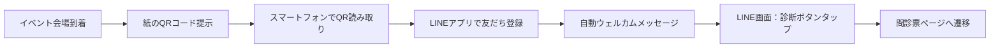
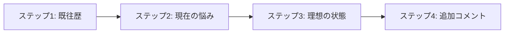
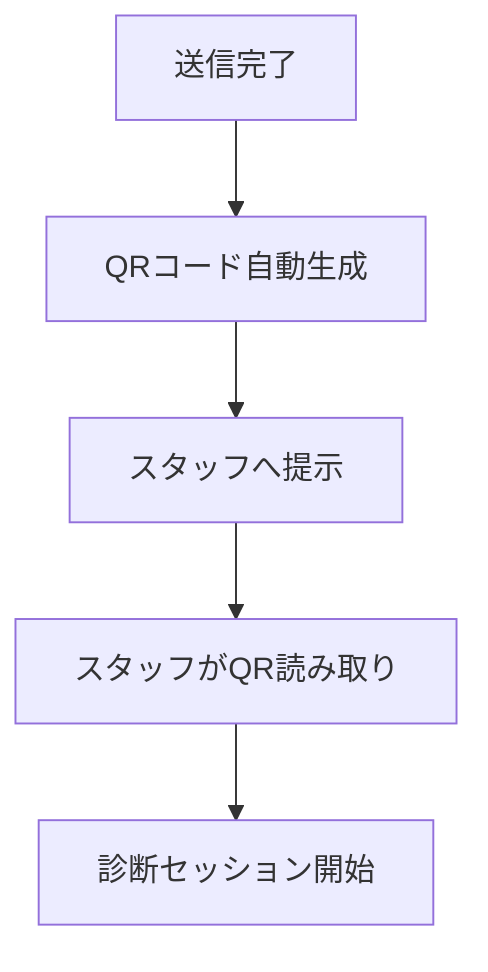
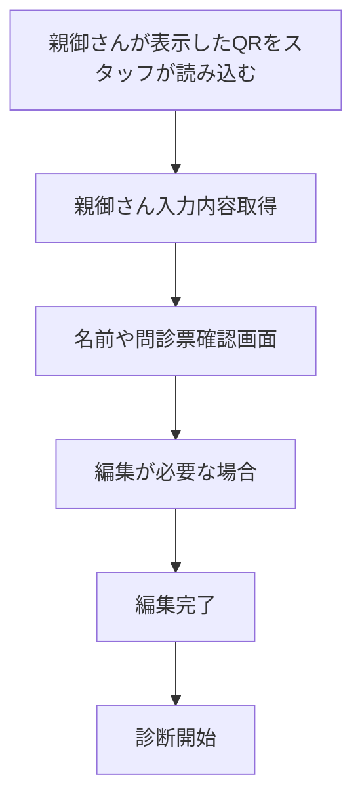
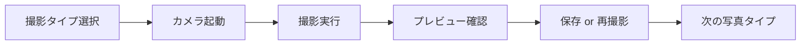
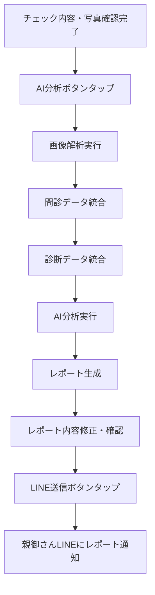

# Coralup 詳細ユーザーフローとUI設計

## 親御さんユーザー 詳細フロー

### 1. LINE友だち登録フロー


**LINE画面イメージ:**
```
┌─────────────────────────────────────────┐
│           LINE チャット画面             │
├─────────────────────────────────────────┤
│                                         │
│ Coralup Bot                             │
│ ┌─────────────────────────────────────┐ │
│ │ こんにちは！Coralupです。           │ │
│ │                                     │ │
│ │ お子様の口腔育成診断を               │ │
│ │ 始めましょう。                      │ │
│ │                                     │ │
│ │ [診断を開始する] ボタン             │ │
│ └─────────────────────────────────────┘ │
│                                         │
└─────────────────────────────────────────┘
```

### 2. 問診票入力フロー詳細

#### 基本情報入力画面
```
┌─────────────────────────────────────────┐
│           🏥 Coralup 問診票            │
├─────────────────────────────────────────┤
│ 📍 イベント情報                         │
│ イベント名: 口腔育成セミナー            │
│ 日時: 2024年1月15日 10:00-16:00       │
│ 会場: 東京国際フォーラム                │
│                                         │
│ 👶 お子様の情報                        │
│ ┌─────────────────────────────────────┐ │
│ │ お名前 ※必須                        │ │
│ │ [お子様 花子                ]     │ │
│ │                                     │ │
│ │ 生年月日 ※必須                      │ │
│ │ [2016]年 [01]月 [15]日             │ │
│ │ 年齢: 8歳（自動計算）               │ │
│ │                                     │ │
│ │ 性別 ※必須                          │ │
│ │ ○ 男  ○ 女  ○ その他               │ │
│ │                                     │ │
│ │ 都道府県                             │ │
│ │ [東京都                        ]   │ │
│ └─────────────────────────────────────┘ │
│                                         │
│ 👨‍👩‍👧‍👦 保護者情報                     │
│ ┌─────────────────────────────────────┐ │
│ │ お名前 ※必須                        │ │
│ │ [保護者 太郎                  ]     │ │
│ │                                     │ │
│ │ 電話番号 ※必須                      │ │
│ │ [090-1234-5678               ]     │ │
│ │ ※LINE通知に使用します               │ │
│ └─────────────────────────────────────┘ │
│                                         │
│ 💡 プライバシーポリシー                │
│ 入力いただいた情報は診断目的のみで     │
│ 使用し、厳重に管理いたします。         │
│                                         │
│             [次へ進む] ボタン           │
└─────────────────────────────────────────┘
```

#### 問診票詳細入力画面（マルチステップ）


**各ステップの詳細設計:**

**ステップ1: 既往歴**
- チェックボックス形式で複数選択可能
- 「特になし」オプションの設置
- スクロール可能な領域で情報の詰め込みすぎを防ぐ

**ステップ2: 現在の悩み**
- 口腔・姿勢関連の悩みをカテゴリ別に分類
- 各カテゴリで具体的な症状を選択
- 自由記述欄で詳細な説明を可能に

**ステップ3: 理想の状態**
- ポジティブな目標設定を促す項目
- 複数の理想像を選択可能
- モチベーション向上につながる表現

**ステップ4: 追加コメント**
- スタッフへの伝達事項を記入
- 任意項目だが、詳細な情報提供を促すUI

### 3. 内容確認フロー

#### 確認画面設計
```
┌─────────────────────────────────────────┐
│           ✅ 内容確認                   │
├─────────────────────────────────────────┤
│ 以下の内容で送信します。                │
│ 確認後「送信する」ボタンを押してください│
│                                         │
│ 👶 お子様情報                           │
│ • お名前: お子様 花子                  │
│ • 年齢: 8歳                            │
│ • 性別: 女                             │
│                                         │
│ 👨‍👩‍👧‍👦 保護者情報                     │
│ • お名前: 保護者 太郎                  │
│ • 電話番号: 090-1234-5678             │
│                                         │
│ 📝 問診票内容                           │
│ 現在の悩み                              │
│ • 歯並びが気になる                      │
│ • 口呼吸をしている                      │
│ • 姿勢が悪いと言われる                  │
│                                         │
│ 理想とする状態                          │
│ • きれいな歯並びになりたい              │
│ • 正しい姿勢を身につけたい              │
│                                         │
│ 既往歴                                  │
│ • アレルギー                             │
│                                         │
│ 💬 追加コメント                         │
│ 特に気になることはありません。          │
│                                         │
│ 📱 LINE通知について                     │
│ 診断結果はご登録いただいたLINEアカウント│
│ 宛に送信いたします。                    │
│                                         │
│           [修正する] [送信する]          │
└─────────────────────────────────────────┘
```

### 4. QRコード表示フロー

#### 送信完了・QR表示画面


**画面設計:**
```
┌─────────────────────────────────────────┐
│           📱 QRコード提示               │
├─────────────────────────────────────────┤
│ ✅ 問診票の送信が完了しました          │
│                                         │
│ スタッフの方がこのQRコードを            │
│ 読み取ることで診断が開始されます。     │
│                                         │
│ ┌─────────────────────────────────────┐ │
│ │        📱 スキャン用QRコード         │ │
│ │                                     │ │
│ │        [QRコード画像]               │ │
│ │                                     │ │
│ │  セッションID: ABC-123-XYZ        │ │
│ └─────────────────────────────────────┘ │
│                                         │
│ 📋 送信内容の確認                       │
│ • お子様: お子様 花子 (8歳)           │
│ • 保護者: 保護者 太郎                 │
│ • 問診票: 完了                         │
│                                         │
│ 🔄 別のQRコードを生成                  │
│ ❓ スタッフを呼ぶ                      │
│                                         │
│ この画面をスタッフの方に                │
│ 提示してください                        │
└─────────────────────────────────────────┘
```

## スタッフユーザー 詳細フロー

### 1. QRコード読み取りフロー

#### セッション開始画面
```
┌─────────────────────────────────────────┐
│           📱 セッション開始            │
├─────────────────────────────────────────┤
│ QRコードを読み取ることで               │
│ 診断セッションを開始できます           │
│                                         │
│ ┌─────────────────────────────────────┐ │
│ │         📷 カメラ起動               │ │
│ │                                     │ │
│ │     [カメラ起動ボタン]              │ │
│ │                                     │ │
│ └─────────────────────────────────────┘ │
│                                         │
│ 🔍 セッションID直接入力                │
│ 📋 セッション一覧                      │
│                                         │
│ 読み取り後のセッション情報は           │
│ リアルタイムで同期されます             │
└─────────────────────────────────────────┘
```

### 2. ユーザー情報確認フロー

#### 確認・編集画面


**画面設計:**
```
┌─────────────────────────────────────────┐
│           👤 親御さん入力内容確認      │
├─────────────────────────────────────────┤
│ 👶 お子様情報                           │
│ • お名前: 田中 太郎                    │
│ • 年齢: 8歳                            │
│ • 性別: 男                             │
│                                         │
│ 👨‍👩‍👧‍👦 保護者情報                     │
│ • お名前: 田中 花子                    │
│ • 電話番号: 090-1234-5678             │
│                                         │
│ 📝 問診票内容                           │
│ 現在の悩み                              │
│ • 歯並びが気になる                      │
│ • 口呼吸をしている                      │
│ • 姿勢が悪いと言われる                  │
│                                         │
│ ✏️ 情報を修正する                      │
│                                         │
│           [診断開始] ボタン             │
└─────────────────────────────────────────┘
```

**重要なポイント:**
- 親御さんが表示したQRコードをスタッフが読み込む
- 親御さんが入力した名前や問診票の内容を確認できる
- 必要に応じて情報を修正可能

### 3. 写真撮影フロー詳細

#### 写真撮影インターフェース


**画面設計:**
```
┌─────────────────────────────────────────┐
│           📸 写真撮影・管理            │
├─────────────────────────────────────────┤
│ 👶 お子様 花子 (8歳) 様                │
│                                         │
│ 📷 撮影項目                            │
│ ┌─────────────────────────────────────┐ │
│ │ 📸 横向き姿勢                        │ │
│ │ 横向きから全身を撮影                 │ │
│ │ [撮影済み] ✅                        │ │
│ │ [画像プレビュー 20x20]               │ │
│ │ 👆 タップしてカメラを起動            │ │
│ └─────────────────────────────────────┘ │
│                                         │
│ ┌─────────────────────────────────────┐ │
│ │ 📸 正面姿勢                          │ │
│ │ 正面から全身を撮影                   │ │
│ │ [撮影済み] ✅                        │ │
│ │ [画像プレビュー 20x20]               │ │
│ └─────────────────────────────────────┘ │
│                                         │
│ ┌─────────────────────────────────────┐ │
│ │ 🦷 口腔内（正面）                    │ │
│ │ 口を開けて口腔内を撮影               │ │
│ │ [撮影済み] ✅                        │ │
│ │ [画像プレビュー 20x20]               │ │
│ └─────────────────────────────────────┘ │
│                                         │
│ 💡 カメラの使い方                       │
│ 各写真タイプの枠をタップすると、       │
│ カメラが起動します。                   │
│ 初回はブラウザからカメラへの           │
│ アクセス許可が必要です。               │
│                                         │
│           [前へ] [次へ] ボタン          │
└─────────────────────────────────────────┘
```

#### カメラ撮影画面（フルスクリーン）
```
┌─────────────────────────────────────────┐
│           📷 カメラ撮影中              │
├─────────────────────────────────────────┤
│                                         │
│         [カメラプレビュー画面]          │
│         ┌─────────────────────┐         │
│         │                     │         │
│         │   [撮影ガイドライン] │         │
│         │   ┌─────────────┐   │         │
│         │   │             │   │         │
│         │   │             │   │         │
│         │   └─────────────┘   │         │
│         │                     │         │
│         └─────────────────────┘         │
│                                         │
│ 横向き姿勢                              │
│ 横向きから全身を撮影                    │
│                                         │
│ ┌─────────────────────────────────────┐ │
│ │         [キャンセル] [📷 撮影]      │ │
│ └─────────────────────────────────────┘ │
└─────────────────────────────────────────┘
```

#### 撮影後のプレビュー画面
```
┌─────────────────────────────────────────┐
│           📸 撮影プレビュー            │
├─────────────────────────────────────────┤
│ 👶 田中 太郎 (8歳) 様                  │
│                                         │
│ 📷 横向き姿勢写真                       │
│ ┌─────────────────────────────────────┐ │
│ │        [撮影画像プレビュー]         │ │
│ │                                     │ │
│ │ 撮影日時: 2024/01/15 14:30        │ │
│ └─────────────────────────────────────┘ │
│                                         │
│ ✅ 画像の品質チェック                   │
│ • 画像が鮮明か: 良好                  │
│ • 被写体が適切か: 良好                │
│ • 照明が十分か: 良好                  │
│                                         │
│           [再撮影] [この画像を使用]     │
└─────────────────────────────────────────┘
```

### 4. 診断結果入力フロー

**診断開始で実際にお子さんの測定しながら、結果をスマホに入力**

#### 診断項目詳細設計
**姿勢評価セクション:**
- 頭部位置: 正常・前方突出・後方傾斜
- 肩バランス: 左右対称・左肩挙上・右肩挙上
- 背骨カーブ: 正常・過剰前弯・過剰後弯
- 骨盤傾き: 正常・前方傾斜・後方傾斜
- 足部バランス: 正常・内反・外反

**口腔機能評価セクション:**
- 咬合状態: 正常咬合・開咬・過蓋咬合・交叉咬合
- 歯並び: 正常・叢生・上顎前突・下顎前突・開咬
- 舌位置: 正常・低位舌・舌突出
- 清潔度: 良好・要改善・不良

#### 診断入力の特徴
- **リアルタイム入力**: 実際にお子さんを測定しながら、その場でスマホに入力
- **写真撮影**: カメラで撮影しながら診断項目を入力（横向き姿勢、正面姿勢、口腔内写真など）
- **チェックボックス入力**: 診断項目をチェックボックスで選択しながら測定
- **メモ・コメント機能**: 構造化されたメモテンプレート、音声入力機能、画像添付機能

#### 診断入力画面設計
```
┌─────────────────────────────────────────┐
│           📋 診断実施                  │
├─────────────────────────────────────────┤
│ 👶 お子様 花子 (8歳)                   │
│                                         │
│ 📊 入力進捗                             │
│ 4 / 6 項目                              │
│ ████████░░░░░░░░░░ 67%                │
│                                         │
│ ┌─────────────────────────────────────┐ │
│ │ 📐 姿勢評価                         │ │
│ │                                     │ │
│ │ 頭部位置                             │ │
│ │ ○ 正常  ○ 前方突出  ○ 後方傾斜     │ │
│ │                                     │ │
│ │ 肩バランス                           │ │
│ │ ○ 左右対称  ○ 左肩挙上  ○ 右肩挙上 │ │
│ │                                     │ │
│ │ [分析利用] バッジ                   │ │
│ └─────────────────────────────────────┘ │
│                                         │
│ ┌─────────────────────────────────────┐ │
│ │ 🦷 口腔機能評価                     │ │
│ │                                     │ │
│ │ 咬合状態                             │ │
│ │ ○ 正常咬合  ○ 開咬  ○ 過蓋咬合    │ │
│ │                                     │ │
│ │ 歯並び                               │ │
│ │ ○ 正常  ○ 叢生  ○ 上顎前突        │ │
│ └─────────────────────────────────────┘ │
│                                         │
│ 📝 スタッフメモ                         │
│ [複数行テキスト入力領域]               │
│                                         │
│           [前へ] [次へ] ボタン          │
└─────────────────────────────────────────┘
```

### 5. チェック内容・写真確認フロー

**診断入力完了後、チェック内容と写真を確認**

#### 確認画面設計
```
┌─────────────────────────────────────────┐
│           ✅ チェック内容・写真確認    │
├─────────────────────────────────────────┤
│ 👶 お子様 花子 (8歳) 様                │
│                                         │
│ 📊 診断進捗                            │
│ 写真: 3/3 | 診断項目: 6件             │
│ ████████████████████ 100%              │
│                                         │
│ 📋 診断項目チェック内容                 │
│ ┌─────────────────────────────────────┐ │
│ │ 姿勢評価                             │ │
│ │ • 頭部位置: 正常                     │ │
│ │ • 肩バランス: 左右差あり             │ │
│ │ • 背骨カーブ: 正常                   │ │
│ │                                     │ │
│ │ 口腔機能評価                         │ │
│ │ • 咬合状態: 開咬                     │ │
│ │ • 歯並び: 叢生                       │ │
│ │ • 舌位置: 低位舌                     │ │
│ └─────────────────────────────────────┘ │
│                                         │
│ 📸 撮影した写真                         │
│ ┌─────────┬─────────┬──────────────┐   │
│ │ 横向き  │ 正面姿勢 │  口腔内写真   │   │
│ │ 姿勢    │ 写真     │               │   │
│ │ [画像]  │ [画像]   │   [画像]      │   │
│ │ ✅済み   │ ✅済み    │   ✅済み       │   │
│ └─────────┴─────────┴──────────────┘   │
│                                         │
│ ✏️ [内容を修正する]                    │
│                                         │
│           [AI分析へ進む] →              │
└─────────────────────────────────────────┘
```

**重要なポイント:**
- 診断項目と写真を一覧で確認できる
- 修正が必要な場合は「内容を修正する」ボタンで診断画面に戻れる
- 確認完了後、「AI分析へ進む」ボタンで次のステップへ

### 6. AI分析・レポート生成フロー

#### 分析プロセス詳細


**画面設計:**
```
┌─────────────────────────────────────────┐
│           🤖 AI分析・レポート生成      │
├─────────────────────────────────────────┤
│ 👶 田中 太郎 (8歳) 様                  │
│                                         │
│ 📊 分析ステータス                       │
│ • 画像解析: 完了 🔵                     │
│ • データ統合: 完了 🔵                   │
│ • AI分析: 実行中 🟡                     │
│ • レポート生成: 待機中 ⚪                │
│                                         │
│ 📈 分析結果プレビュー                   │
│ 姿勢評価: 7/10点                        │
│ 口腔評価: 6/10点                        │
│ 総合評価: 良好                          │
│                                         │
│ 📝 生成されたレポート                   │
│ [レポート内容プレビュー]                 │
│                                         │
│ ✏️ レポート内容修正・確認                │
│ [テキスト編集] [画像追加] [アドバイス修正] │
│                                         │
│ [内容修正] [LINE送信] ボタン            │
└─────────────────────────────────────────┘
```

**重要なポイント:**
- AI分析ボタンをタップするとAI分析が実行される
- レポート生成後、内容を修正・確認できる
- LINE送信ボタンをタップすると親御さんのLINEにレポート通知が送信される

### 7. LINE通知フロー

#### 通知内容詳細
**通知メッセージ構造:**
1. 診断完了のお知らせ
2. PDFレポートのダウンロードリンク
3. 次回フォローアップの案内
4. 追加相談の連絡方法

**通知タイミング:**
- **即時通知**: スタッフがLINE送信ボタンをタップした時点で親御さんのLINEにレポート通知が送信される
- フォローアップ通知（1週間後）
- リマインド通知（1ヶ月後）

**通知フロー:**
```
スタッフがLINE送信ボタンをタップ
    ↓
親御さんが登録したLINEアカウントに通知送信
    ↓
診断レポート（PDF）のダウンロードリンクを含むメッセージ
    ↓
親御さんがLINEでレポートを確認
```

**LINE通知画面イメージ:**
```
┌─────────────────────────────────────────┐
│           LINE チャット画面             │
├─────────────────────────────────────────┤
│                                         │
│ Coralup Bot                             │
│ ┌─────────────────────────────────────┐ │
│ │ 診断が完了しました！                │ │
│ │                                     │ │
│ │ お子様 花子様の診断結果を           │ │
│ │ お送りします。                      │ │
│ │                                     │ │
│ │ 【診断サマリー】                    │ │
│ │ • 姿勢評価: 7/10点                  │ │
│ │ • 口腔評価: 6/10点                  │ │
│ │                                     │ │
│ │ 詳細な診断レポートはPDF形式で        │ │
│ │ お送りいたします。                  │ │
│ │                                     │ │
│ │ [レポートをダウンロード] ボタン     │ │
│ └─────────────────────────────────────┘ │
│                                         │
└─────────────────────────────────────────┘
```

## UX最適化のための追加機能

### 1. リアルタイム進捗共有
- スタッフと親御さんの進捗状況の共有
- 待ち時間の予測表示
- 現在の進行状況の可視化

### 2. 音声・画像ガイド
- 写真撮影時の音声ガイド
- 撮影アングルのガイド画像
- 診断項目の説明動画

### 3. アクセシビリティ対応
- スクリーンリーダー完全対応
- キーボードナビゲーション
- 高コントラストモード

### 4. エラーリカバリー
- ネットワークエラー時の自動復旧
- 入力中断時のデータ保存
- 代替連絡手段の提供

### 5. パーソナライズ機能
- 過去診断履歴の参照
- 個別化されたアドバイス
- フォローアップスケジュールの最適化

## 実装優先度マトリクス

| 機能 | ユーザビリティ | 技術的複雑さ | 実装優先度 |
|------|----------------|--------------|------------|
| 基本的なフォーム入力 | 高 | 低 | 高 |
| QRコード連携 | 高 | 中 | 高 |
| 写真撮影・管理 | 高 | 中 | 高 |
| AI分析・レポート生成 | 中 | 高 | 中 |
| リアルタイム進捗共有 | 中 | 中 | 中 |
| 高度なアクセシビリティ | 中 | 中 | 低 |

この詳細なフローに基づいて、実際のアプリケーション開発を進めることで、ユーザビリティの高い口腔育成診断システムを実現できます。

