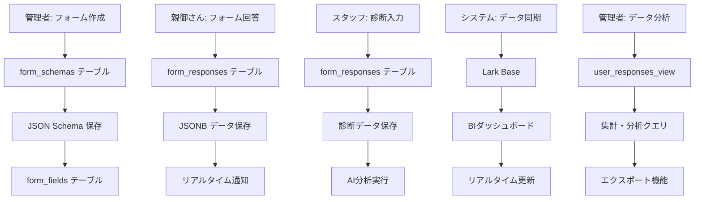

# Coralup 動的フォームシステム設計

## 1. システム概要

### 1.1 目的
動的フォームシステムは、管理者による柔軟なフォーム作成を可能にし、回答データを効率的に管理・分析できるようにする。SupabaseとLark Baseとのリアルタイム連携により、データの一元管理と高度な分析を実現する。

### 1.2 設計原則
- **柔軟性**: フォーム項目の動的な追加・変更に対応
- **拡張性**: 新しいフォームタイプの容易な追加
- **パフォーマンス**: 大量データの高速検索・集計
- **リアルタイム性**: SupabaseとLark Base間の同期
- **保守性**: メタデータ駆動による変更容易性

## 2. データベース設計（ER図）

### 2.1 コアテーブル設計

```sql
-- イベント情報
CREATE TABLE events (
    id UUID PRIMARY KEY DEFAULT gen_random_uuid(),
    event_id VARCHAR(50) UNIQUE NOT NULL,
    name VARCHAR(200) NOT NULL,
    description TEXT,
    start_date TIMESTAMP WITH TIME ZONE,
    end_date TIMESTAMP WITH TIME ZONE,
    venue VARCHAR(200),
    status VARCHAR(20) DEFAULT 'draft', -- draft, active, completed, cancelled
    created_by UUID REFERENCES auth.users(id),
    created_at TIMESTAMP WITH TIME ZONE DEFAULT NOW(),
    updated_at TIMESTAMP WITH TIME ZONE DEFAULT NOW()
);

-- フォーム定義（メタデータ）
CREATE TABLE form_schemas (
    id UUID PRIMARY KEY DEFAULT gen_random_uuid(),
    schema_id VARCHAR(50) UNIQUE NOT NULL,
    event_id UUID REFERENCES events(id),
    form_type VARCHAR(20) NOT NULL, -- 'questionnaire', 'diagnosis'
    name VARCHAR(200) NOT NULL,
    description TEXT,
    version VARCHAR(20) NOT NULL DEFAULT '1.0',
    is_active BOOLEAN DEFAULT true,
    config JSONB NOT NULL, -- フォーム構造定義
    created_by UUID REFERENCES auth.users(id),
    created_at TIMESTAMP WITH TIME ZONE DEFAULT NOW(),
    updated_at TIMESTAMP WITH TIME ZONE DEFAULT NOW()
);

-- フォーム回答データ
CREATE TABLE form_responses (
    id UUID PRIMARY KEY DEFAULT gen_random_uuid(),
    response_id VARCHAR(100) UNIQUE NOT NULL,
    schema_id UUID REFERENCES form_schemas(id),
    session_id UUID REFERENCES sessions(id),
    user_id VARCHAR(255), -- LINEユーザーIDなど
    event_id UUID REFERENCES events(id),
    response_data JSONB NOT NULL, -- 実際の回答データ
    metadata JSONB, -- 追加のメタデータ（IP、ユーザーエージェント等）
    submitted_at TIMESTAMP WITH TIME ZONE DEFAULT NOW(),
    created_at TIMESTAMP WITH TIME ZONE DEFAULT NOW()
);

-- フォーム項目定義（詳細）
CREATE TABLE form_fields (
    id UUID PRIMARY KEY DEFAULT gen_random_uuid(),
    schema_id UUID REFERENCES form_schemas(id),
    field_id VARCHAR(50) NOT NULL,
    field_name VARCHAR(200) NOT NULL,
    field_type VARCHAR(50) NOT NULL, -- text, number, select, radio, checkbox, etc.
    field_config JSONB, -- バリデーション、選択肢等
    display_order INTEGER,
    is_required BOOLEAN DEFAULT false,
    is_active BOOLEAN DEFAULT true,
    created_at TIMESTAMP WITH TIME ZONE DEFAULT NOW()
);

-- フォームバージョン履歴
CREATE TABLE form_schema_versions (
    id UUID PRIMARY KEY DEFAULT gen_random_uuid(),
    schema_id UUID REFERENCES form_schemas(id),
    version VARCHAR(20) NOT NULL,
    config JSONB NOT NULL,
    change_log TEXT,
    created_by UUID REFERENCES auth.users(id),
    created_at TIMESTAMP WITH TIME ZONE DEFAULT NOW()
);

-- キャッシュテーブル（パフォーマンス向上用）
CREATE TABLE form_cache (
    id UUID PRIMARY KEY DEFAULT gen_random_uuid(),
    cache_key VARCHAR(500) UNIQUE NOT NULL,
    cache_data JSONB,
    expires_at TIMESTAMP WITH TIME ZONE,
    created_at TIMESTAMP WITH TIME ZONE DEFAULT NOW()
);
```

### 2.2 インデックス設計（パフォーマンス最適化）

```sql
-- 高速検索用インデックス
CREATE INDEX idx_form_responses_schema_session ON form_responses(schema_id, session_id);
CREATE INDEX idx_form_responses_event_user ON form_responses(event_id, user_id);
CREATE INDEX idx_form_responses_submitted_at ON form_responses(submitted_at);
CREATE INDEX idx_form_schemas_event_type ON form_schemas(event_id, form_type);
CREATE INDEX idx_form_schemas_active ON form_schemas(is_active) WHERE is_active = true;

-- JSONB用インデックス（PostgreSQL 12+）
CREATE INDEX idx_form_responses_data ON form_responses USING GIN(response_data);
CREATE INDEX idx_form_schemas_config ON form_schemas USING GIN(config);

-- 集計・分析用インデックス
CREATE INDEX idx_events_status_dates ON events(status, start_date, end_date);
CREATE INDEX idx_form_responses_response_id ON form_responses(response_id);
```

### 2.3 ビュー設計（データ統合）

```sql
-- ユーザー統合ビュー
CREATE VIEW user_responses_view AS
SELECT
    fr.id,
    fr.response_id,
    fr.session_id,
    fr.submitted_at,
    s.parent_name,
    s.parent_phone,
    e.name as event_name,
    fs.name as form_name,
    fs.form_type,
    fr.response_data,
    fr.metadata
FROM form_responses fr
LEFT JOIN sessions s ON fr.session_id = s.id
LEFT JOIN events e ON fr.event_id = e.id
LEFT JOIN form_schemas fs ON fr.schema_id = fs.id;

-- 診断データ統合ビュー
CREATE VIEW diagnosis_analytics_view AS
SELECT
    fr.session_id,
    s.parent_name,
    s.parent_phone,
    e.name as event_name,
    fr.submitted_at,
    (fr.response_data->>'posture_score')::integer as posture_score,
    (fr.response_data->>'oral_score')::integer as oral_score,
    (fr.response_data->>'overall_score')::integer as overall_score,
    fr.response_data->>'diagnosis_notes' as notes,
    fr.response_data->>'ai_analysis' as ai_analysis
FROM form_responses fr
LEFT JOIN sessions s ON fr.session_id = s.id
LEFT JOIN events e ON fr.event_id = e.id
WHERE fr.response_data->>'form_type' = 'diagnosis';
```

## 3. フォーム構造定義（JSON Schema）

### 3.1 フォームメタデータ構造

```json
{
  "schema_id": "questionnaire_v1",
  "form_type": "questionnaire",
  "name": "口腔育成問診票",
  "version": "1.0",
  "sections": [
    {
      "id": "basic_info",
      "title": "基本情報",
      "order": 1,
      "fields": [
        {
          "id": "child_name",
          "name": "お子様のお名前",
          "type": "text",
          "required": true,
          "validation": {
            "minLength": 1,
            "maxLength": 100
          },
          "placeholder": "例: 田中 太郎"
        },
        {
          "id": "child_age",
          "name": "年齢",
          "type": "number",
          "required": true,
          "validation": {
            "min": 1,
            "max": 18
          },
          "unit": "歳"
        }
      ]
    },
    {
      "id": "medical_history",
      "title": "既往歴",
      "order": 2,
      "fields": [
        {
          "id": "medical_conditions",
          "name": "気になる症状",
          "type": "checkbox",
          "required": false,
          "options": [
            "歯並びが気になる",
            "口呼吸をしている",
            "姿勢が悪いと言われる",
            "発音が不明瞭",
            "食事中にこぼす"
          ]
        }
      ]
    }
  ],
  "settings": {
    "show_progress": true,
    "allow_back_navigation": true,
    "auto_save": true,
    "submit_button_text": "送信する"
  }
}
```

### 3.2 回答データ構造

```json
{
  "response_id": "resp_abc123",
  "schema_id": "questionnaire_v1",
  "session_id": "sess_xyz789",
  "user_id": "line_user_123",
  "event_id": "event_456",
  "submitted_at": "2024-01-15T10:30:00Z",
  "responses": {
    "basic_info": {
      "child_name": "田中 太郎",
      "child_age": 8,
      "child_gender": "male",
      "parent_name": "田中 花子",
      "parent_phone": "090-1234-5678"
    },
    "medical_history": {
      "medical_conditions": [
        "歯並びが気になる",
        "口呼吸をしている"
      ],
      "other_notes": "特にありません"
    }
  },
  "metadata": {
    "user_agent": "Mozilla/5.0...",
    "ip_address": "192.168.1.1",
    "completion_time_seconds": 180,
    "form_version": "1.0"
  }
}
```

## 4. システムアーキテクチャ

### 4.1 コンポーネント構成

```
┌─────────────────────────────────────────────────────────────────┐
│                    Coralup 動的フォームシステム                  │
├─────────────────────────────────────────────────────────────────┤
│  ┌─────────────────┐  ┌─────────────────┐  ┌─────────────────┐  │
│  │   フォームビルダ │  │   フォームレンダ │  │   データ管理    │  │
│  │                 │  │   ラー          │  │                 │  │
│  │ • ドラッグ&ドロ │  │ • 動的フォーム生 │  │ • 回答データ保存 │  │
│  │   ップエディタ  │  │   成            │  │ • バリデーション │  │
│  │ • JSON Schema   │  │ • リアルタイム更 │  │ • バージョン管理 │  │
│  │   生成          │  │   新            │  │ • エクスポート  │  │
│  │ • プレビュー    │  │ • レスポンシブ  │  │                 │  │
│  └─────────────────┘  └─────────────────┘  └─────────────────┘  │
├─────────────────────────────────────────────────────────────────┤
│              Supabase Database (JSONB + Indexing)               │
│  ┌─────────────────────────────────────────────────────────────┐  │
│  │ form_schemas │ form_responses │ form_fields │ form_cache  │  │
│  │ events       │ user_responses │ analytics   │ versions    │  │
│  │              │ _view         │ _view       │             │  │
│  └─────────────────────────────────────────────────────────────┘  │
├─────────────────────────────────────────────────────────────────┤
│                External Services (Sync & Export)               │
│  ┌─────────────────────────────────────────────────────────────┐  │
│  │  Lark Base (BI連携) │ Google Sheets │ CSV Export │ PDF Gen  │  │
│  │  リアルタイム同期   │ データエクス  │            │          │  │
│  │                     │ ポート機能   │            │          │  │
│  └─────────────────────────────────────────────────────────────┘  │
└─────────────────────────────────────────────────────────────────┘
```

### 4.2 データフロー



## 5. 実装戦略

### 5.1 フェーズ1: 基礎実装（優先度: 高）

#### 5.1.1 コアテーブル作成
```sql
-- イベント管理
CREATE TABLE events (
    id UUID PRIMARY KEY DEFAULT gen_random_uuid(),
    event_id VARCHAR(50) UNIQUE NOT NULL,
    name VARCHAR(200) NOT NULL,
    status VARCHAR(20) DEFAULT 'draft',
    created_at TIMESTAMP WITH TIME ZONE DEFAULT NOW(),
    updated_at TIMESTAMP WITH TIME ZONE DEFAULT NOW()
);

-- フォームスキーマ
CREATE TABLE form_schemas (
    id UUID PRIMARY KEY DEFAULT gen_random_uuid(),
    schema_id VARCHAR(50) UNIQUE NOT NULL,
    event_id UUID REFERENCES events(id),
    form_type VARCHAR(20) NOT NULL,
    name VARCHAR(200) NOT NULL,
    config JSONB NOT NULL,
    is_active BOOLEAN DEFAULT true,
    version VARCHAR(20) DEFAULT '1.0',
    created_at TIMESTAMP WITH TIME ZONE DEFAULT NOW(),
    updated_at TIMESTAMP WITH TIME ZONE DEFAULT NOW()
);

-- 回答データ
CREATE TABLE form_responses (
    id UUID PRIMARY KEY DEFAULT gen_random_uuid(),
    response_id VARCHAR(100) UNIQUE NOT NULL,
    schema_id UUID REFERENCES form_schemas(id),
    session_id UUID REFERENCES sessions(id),
    response_data JSONB NOT NULL,
    submitted_at TIMESTAMP WITH TIME ZONE DEFAULT NOW(),
    created_at TIMESTAMP WITH TIME ZONE DEFAULT NOW()
);
```

#### 5.1.2 基本的なインデックス
```sql
-- パフォーマンス最適化
CREATE INDEX idx_form_responses_schema_session ON form_responses(schema_id, session_id);
CREATE INDEX idx_form_responses_submitted_at ON form_responses(submitted_at);
CREATE INDEX idx_form_schemas_event_active ON form_schemas(event_id, is_active);
CREATE INDEX idx_form_responses_response_id ON form_responses(response_id);

-- JSONB検索用
CREATE INDEX idx_form_responses_data ON form_responses USING GIN(response_data jsonb_path_ops);
```

### 5.2 フェーズ2: 高度な機能（優先度: 中）

#### 5.2.1 キャッシュシステム
```sql
-- キャッシュテーブル
CREATE TABLE form_cache (
    cache_key VARCHAR(500) PRIMARY KEY,
    cache_data JSONB,
    expires_at TIMESTAMP WITH TIME ZONE,
    created_at TIMESTAMP WITH TIME ZONE DEFAULT NOW()
);

-- キャッシュインデックス
CREATE INDEX idx_form_cache_expires_at ON form_cache(expires_at) WHERE expires_at IS NOT NULL;
```

#### 5.2.2 分析ビュー
```sql
-- 分析用ビュー
CREATE VIEW form_analytics_view AS
SELECT
    fs.form_type,
    fs.name as form_name,
    e.name as event_name,
    COUNT(fr.id) as total_responses,
    AVG(EXTRACT(EPOCH FROM (fr.submitted_at - fr.created_at))/60) as avg_completion_time,
    COUNT(DISTINCT fr.session_id) as unique_users,
    fr.submitted_at::date as response_date
FROM form_responses fr
LEFT JOIN form_schemas fs ON fr.schema_id = fs.id
LEFT JOIN events e ON fs.event_id = e.id
GROUP BY fs.form_type, fs.name, e.name, fr.submitted_at::date;
```

### 5.3 フェーズ3: 最適化・連携（優先度: 低）

#### 5.3.1 Lark Base同期
- リアルタイムデータ同期
- カスタムダッシュボード連携
- 自動レポート生成

#### 5.3.2 高度な分析機能
- 機械学習による傾向分析
- リアルタイム異常検知
- パーソナライズドレポート

## 6. API設計

### 6.1 フォーム管理API

#### 6.1.1 フォームスキーマ取得
```typescript
GET /api/admin/forms/{eventId}
Response: {
  schemas: Array<{
    id: string,
    name: string,
    form_type: string,
    config: FormSchema,
    is_active: boolean,
    version: string
  }>
}
```

#### 6.1.2 フォーム回答送信
```typescript
POST /api/forms/submit
Body: {
  schema_id: string,
  session_id: string,
  response_data: Record<string, any>,
  metadata?: Record<string, any>
}
```

#### 6.1.3 回答データ取得
```typescript
GET /api/admin/responses?eventId={eventId}&formType={formType}&dateFrom={dateFrom}&dateTo={dateTo}
Response: {
  responses: Array<{
    id: string,
    session_id: string,
    response_data: Record<string, any>,
    submitted_at: string,
    user_info: {
      parent_name: string,
      child_name: string
    }
  }>,
  total: number,
  summary: {
    total_responses: number,
    completion_rate: number,
    avg_completion_time: number
  }
}
```

## 7. パフォーマンス最適化

### 7.1 クエリ最適化
```sql
-- 回答データの高速検索
SELECT
    fr.response_data->>'child_name' as child_name,
    fr.response_data->'basic_info'->>'parent_name' as parent_name,
    COUNT(*) as response_count
FROM form_responses fr
WHERE fr.schema_id = $1
  AND fr.submitted_at >= $2
  AND fr.submitted_at <= $3
  AND fr.response_data->>'event_id' = $4
GROUP BY fr.response_data->>'child_name', fr.response_data->'basic_info'->>'parent_name'
ORDER BY response_count DESC;
```

### 7.2 キャッシュ戦略
- フォームスキーマのRedisキャッシュ
- 集計データの事前計算
- ホットデータのメモリ保持

### 7.3 データアーカイブ
- 古いデータの圧縮保存
- インデックスの定期最適化
- 不要データの自動削除

## 8. セキュリティ考慮事項

### 8.1 データ保護
- JSONBデータの暗号化（機密項目）
- アクセスログの記録
- データバックアップの暗号化

### 8.2 権限制御
- イベント・フォーム単位のアクセス制御
- 管理者権限の階層化
- APIレート制限

### 8.3 監査機能
- フォーム変更履歴の記録
- 回答データ改ざんの検知
- アクセスログの分析

## 9. 実装メリット

### 9.1 柔軟性の利点
- ✅ フォーム項目の動的変更可能
- ✅ 新しい診断項目の即時追加
- ✅ イベント固有のカスタマイズ容易
- ✅ バージョン管理による安全な更新

### 9.2 パフォーマンスの利点
- ✅ JSONBによる高速検索
- ✅ 適切なインデックスによるクエリ最適化
- ✅ キャッシュによるレスポンス高速化
- ✅ 集計ビューの事前計算

### 9.3 保守性の利点
- ✅ メタデータ駆動による変更容易性
- ✅ 統一的なデータ構造
- ✅ 拡張性の高い設計
- ✅ ドキュメントとコードの整合性

この設計により、動的フォームシステムの柔軟性とパフォーマンスを両立し、SupabaseとLark Baseとの効率的な連携を実現できます。

