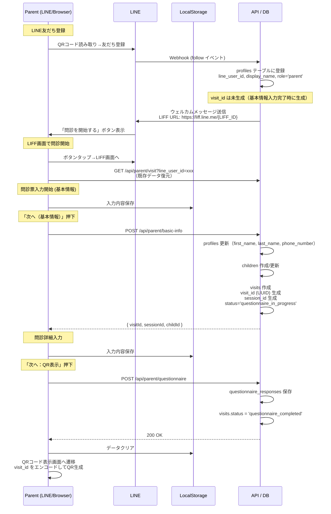
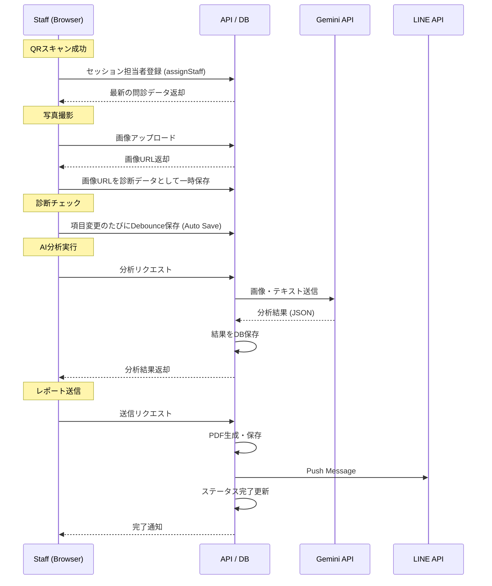
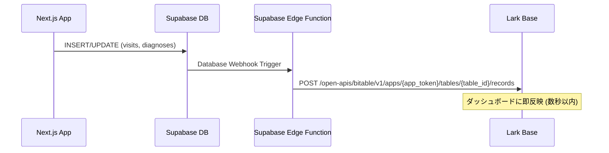

# cOralup データフロー設計 (Data Flow)

**最終更新: 2025-12-16**

---

## 0. RLS・APIアクセス方針

### 0.1 アーキテクチャ概要

```
┌─────────────────────────────────────────────────────────────────┐
│                    クライアント (Browser)                        │
│            ※ Supabase直接呼び出し禁止（RLS ON）                  │
└─────────────────────┬───────────────────────────────────────────┘
                      │ fetch() / API呼び出し
                      ▼
┌─────────────────────────────────────────────────────────────────┐
│                    Next.js API Routes                           │
│                    (サーバーサイド)                               │
│                                                                 │
│  管理画面API: ADMIN_API_KEY認証                                  │
│  本番API: キー不要（サーバー内部処理）                            │
└─────────────────────┬───────────────────────────────────────────┘
                      │ SUPABASE_SERVICE_ROLE_KEY
                      ▼
┌─────────────────────────────────────────────────────────────────┐
│                    Supabase (RLS ON)                            │
│                    service_role のみアクセス可                   │
└─────────────────────────────────────────────────────────────────┘
```

### 0.2 API認証方式

| API種別 | 用途 | 認証方式 | Supabaseキー |
|---------|------|----------|--------------|
| 管理画面API | スキーマ編集、設定変更 | `ADMIN_API_KEY` (Bearer) | Service Role |
| 本番API | 問診/診断/LINE連携 | なし（サーバー内部） | Service Role |
| Webhook | LINE Webhook | LINE署名検証 | Service Role |

### 0.3 クライアント実装ルール

```typescript
// ❌ 禁止: クライアントから直接Supabase呼び出し
import { supabase } from '@/lib/supabase'
const { data } = await supabase.from('visits').select('*')

// ✅ 正解: API経由で呼び出し
const res = await fetch('/api/staff/session?visit_id=xxx')
const { data } = await res.json()
```

---

## 1. データ保存タイミング図

データの消失を防ぎ、スムーズな体験を提供するための保存戦略。

### 親御さんサイド


### スタッフサイド


---

## 2. データ同期フロー (localStorage ↔ DB)

### 親御さんフォーム (Parent Form)
*   **State Management**: React Hook Form + Zustand
*   **Persistence**: `zustand/middleware/persist` を使用して `localStorage` にフォームの状態を常時同期。
*   **Submission Strategy**:
    1.  **友だち登録時**: LINE Webhook経由で `profiles` レコード作成（`line_user_id`, `display_name`, `role='parent'`）。**この時点では `visit_id` は未生成**。
    2.  **基本情報**: 「次へ」ボタンで `profiles` 更新 & `children` 作成/更新 & **`visits` 作成（`visit_id` UUID生成、`session_id` 生成）**。
    3.  **問診回答**: 「次へ：QR表示」ボタンで `questionnaire_responses` 保存 & `visits.status = 'questionnaire_completed'`。
*   **Cleanup**: 全完了時に `localStorage` をクリア。
*   **問診開始URL**: `https://liff.line.me/{NEXT_PUBLIC_PARENT_LIFF_ID}`（LINE友だち登録時にウェルカムメッセージで自動送信）

### スタッフ診断画面 (Staff Diagnosis)
*   **Optimistic UI**: チェックボックス操作などは即座にUI反映。
*   **Auto Save**: 操作から一定時間（例: 500ms）後、またはフォーカス外れ時にAPIへ `PATCH` リクエスト。
*   **Network Error**: オフライン時はリクエストをキューイングし、再接続時に送信（`tanstack-query` の機能活用）。

---

## 3. Lark Base リアルタイム同期フロー (当日監視用)

### 目的
展示会当日、**現場スタッフ（非エンジニア）がLarkで状況をリアルタイム監視**できるようにする。

### アーキテクチャ


### Lark Base テーブル設計

#### テーブル1: `来場者ログ` (visits_log)
| フィールド | 型 | 説明 |
|---|---|---|
| visit_id | Text | Supabase visits.id |
| child_name | Text | お子様の名前 |
| parent_name | Text | 親御さんの名前 |
| status | Select | waiting / in_progress / completed / report_sent |
| staff_name | Text | 担当スタッフ名 |
| visit_time | DateTime | 来場時刻 |
| updated_at | DateTime | 最終更新時刻 |

#### テーブル2: `リアルタイム集計` (realtime_stats)
| フィールド | 型 | 説明 |
|---|---|---|
| metric_name | Text | 指標名 |
| value | Number | 値 |
| updated_at | DateTime | 更新時刻 |

**集計指標:**
*   本日の来場者数
*   診断完了数
*   待機中の人数
*   LINE友だち登録数
*   スタッフ別診断数

#### テーブル3: `異常検知アラート` (alerts)
| フィールド | 型 | 説明 |
|---|---|---|
| alert_type | Select | timeout / error / data_mismatch |
| description | Text | 詳細 |
| visit_id | Text | 関連するvisit |
| created_at | DateTime | 検知時刻 |
| resolved | Checkbox | 解決済みか |

**検知ルール:**
*   問診完了から30分経過しても診断開始されていない
*   APIエラーが発生した
*   データ不整合（問診あり・診断なし等）

### Supabase Edge Function 実装概要

```typescript
// supabase/functions/sync-to-lark/index.ts
import { serve } from 'https://deno.land/std@0.168.0/http/server.ts'

const LARK_APP_TOKEN = Deno.env.get('LARK_APP_TOKEN')
const LARK_TABLE_ID = Deno.env.get('LARK_TABLE_ID')
const LARK_ACCESS_TOKEN = Deno.env.get('LARK_ACCESS_TOKEN')

serve(async (req) => {
  const payload = await req.json()
  const { type, table, record } = payload
  
  // Lark Base API にレコードを追加/更新
  const response = await fetch(
    `https://open.larksuite.com/open-apis/bitable/v1/apps/${LARK_APP_TOKEN}/tables/${LARK_TABLE_ID}/records`,
    {
      method: 'POST',
      headers: {
        'Authorization': `Bearer ${LARK_ACCESS_TOKEN}`,
        'Content-Type': 'application/json',
      },
      body: JSON.stringify({
        fields: {
          visit_id: record.id,
          status: record.status,
          // ... 他のフィールド
        }
      })
    }
  )
  
  return new Response(JSON.stringify({ success: true }), {
    headers: { 'Content-Type': 'application/json' }
  })
})
```

---

## 4. データモデル (簡易ER)

詳細は `06-DB設計書.md`。

*   **profiles**: 親御さん・スタッフ情報、LINE UserID（全ユーザー統一台帳）
  * `line_user_id` (PK): LINE友だち登録時に登録
  * `display_name`: LINE表示名
  * `role`: 'parent' | 'staff'
*   **children**: お子様情報（診断対象）、`parent_profile_id` で親御さんと紐付け
  * `id` (PK, UUID): 基本情報入力完了時に生成
*   **visits**: 来場・診断セッション（**全トランザクションの中心テーブル**）
  * `id` (PK, UUID): **基本情報入力完了時に生成（QRコードに使用）**
  * `session_id`: 基本情報入力完了時に生成（後方互換用）
  * `child_id` (FK): children.id
  * `staff_profile_id` (FK): QRスキャン時に更新
  * `status`: 'waiting' → 'questionnaire_in_progress' → 'questionnaire_completed' → 'in_progress' → 'diagnosis_completed' → 'report_sent'
*   **questionnaire_responses**: 問診回答データ（正規化、`visit_id` で紐付け）
*   **diagnosis_responses**: 診断結果（正規化、`visit_id` で紐付け）
*   **reports**: レポート（`visit_id` で紐付け、`uuid` でURL生成）
  * `uuid` (UUID): **診断完了時に生成（レポートURLに使用）**
  * URL形式: `https://{APP_URL}/report/{uuid}`
*   **line_message_logs**: LINE送信ログ（`visit_id` で紐付け）

**データ参照パス**:
```
visits.id
  → visits.child_id → children.parent_profile_id → profiles.line_user_id
  → diagnosis_responses, questionnaire_responses, reports
```

**ID生成タイミング**:
| ID | 生成タイミング | 用途 |
|----|--------------|------|
| `line_user_id` | LINE友だち登録時 | 親御さん識別 |
| `visit_id` | 基本情報入力完了時 | QRコード、DB主キー |
| `session_id` | 基本情報入力完了時 | 後方互換用（非推奨） |
| `report_uuid` | 診断完了時 | レポートURL |

---

## 5. 当日監視運用フロー

1.  **事前準備**: Lark Base にテーブル作成、ダッシュボードビュー設定。
2.  **当日朝**: Edge Function の動作確認（テストレコード投入）。
3.  **運用中**: Lark ダッシュボードを常時表示（大画面モニター推奨）。
4.  **異常検知時**: アラートテーブルを確認し、該当者をフォロー。

---

## 6. Supabase → Lark リアルタイム同期詳細

### 6.1 同期アーキテクチャ

```
┌─────────────────────────────────────────────────────────────────┐
│                    スタッフ診断画面                              │
│                    「保存」ボタン押下                            │
└─────────────────────┬───────────────────────────────────────────┘
                      │ 1. INSERT/UPDATE
                      ▼
┌─────────────────────────────────────────────────────────────────┐
│                    Supabase                                     │
│            diagnosis_responses / questionnaire_responses         │
└─────────────────────┬───────────────────────────────────────────┘
                      │ 2. Database Webhook (トリガー)
                      ▼
┌─────────────────────────────────────────────────────────────────┐
│                    Supabase Edge Function                       │
│                    sync-to-lark                                 │
│                                                                 │
│  処理内容:                                                       │
│  - 関連データをJOINで取得                                        │
│  - 横持ちフォーマットに変換                                       │
│  - Lark API呼び出し                                             │
└─────────────────────┬───────────────────────────────────────────┘
                      │ 3. Lark API呼び出し (1〜3秒)
                      ▼
┌─────────────────────────────────────────────────────────────────┐
│                    Lark Base                                    │
│                    診断結果テーブル（リアルタイム更新）            │
└─────────────────────────────────────────────────────────────────┘
```

### 6.2 同期タイミング

| トリガー | 同期先テーブル | 備考 |
|---------|---------------|------|
| `diagnosis_responses` INSERT | 診断ログ | 項目ごとにリアルタイム |
| `visits` UPDATE (status変更) | 来場者ログ | ステータス変更時 |
| `visits` INSERT | 来場者ログ | 新規来場時 |
| `reports` INSERT | レポートログ | レポート生成時 |

### 6.3 データ変換（縦持ち → 横持ち）

**Supabase（縦持ち・正規化）:**
```
visit_id                             | item_id | value
-------------------------------------+---------+-------
550e8400-e29b-41d4-a716-446655440000 | uuid-1  | yes
550e8400-e29b-41d4-a716-446655440000 | uuid-2  | no
550e8400-e29b-41d4-a716-446655440000 | uuid-3  | mouth
```

**Lark Base（横持ち・集計しやすい）:**
```
visit_id                             | 舌小帯短縮症 | 低位舌 | 口呼吸 | ...
-------------------------------------+------------+-------+-------+-----
550e8400-e29b-41d4-a716-446655440000 | あり        | なし   | 口呼吸 | ...
```

### 6.4 Edge Function実装例

```typescript
// supabase/functions/sync-to-lark/index.ts
import { serve } from 'https://deno.land/std@0.168.0/http/server.ts'
import { createClient } from 'https://esm.sh/@supabase/supabase-js@2'

serve(async (req) => {
  const payload = await req.json()
  const { type, table, record } = payload
  
  // 1. 関連データを取得（横持ちビューから）
  const supabase = createClient(
    Deno.env.get('SUPABASE_URL')!,
    Deno.env.get('SUPABASE_SERVICE_ROLE_KEY')!
  )
  
  const { data: diagnosisData } = await supabase
    .from('diagnosis_results_horizontal_view')
    .select('*')
    .eq('session_id', record.session_id)
    .single()
  
  // 2. Lark Base API にUpsert
  const larkResponse = await fetch(
    `https://open.larksuite.com/open-apis/bitable/v1/apps/${LARK_APP_TOKEN}/tables/${LARK_TABLE_ID}/records`,
    {
      method: 'POST',
      headers: {
        'Authorization': `Bearer ${await getLarkAccessToken()}`,
        'Content-Type': 'application/json',
      },
      body: JSON.stringify({
        fields: {
          session_id: diagnosisData.session_id,
          parent_name: diagnosisData.parent_name,
          child_name: diagnosisData.child_name,
          staff_name: diagnosisData.staff_name,
          diagnosed_at: diagnosisData.diagnosed_at,
          // 診断項目（横持ち）
          舌小帯短縮症: diagnosisData.tongue_tie,
          低位舌: diagnosisData.low_tongue,
          口呼吸: diagnosisData.breathing_type,
          // ... 他の項目
        }
      })
    }
  )
  
  return new Response(JSON.stringify({ success: true }))
})
```

---

## 7. AI分析フロー

### 7.1 データ取得からAI分析まで

```
┌─────────────────────────────────────────────────────────────────┐
│                    AI分析フロー                                  │
├─────────────────────────────────────────────────────────────────┤
│                                                                 │
│  ┌─────────────────────────────────────────────────────────┐   │
│  │ 1. データ収集（Supabaseから）                             │   │
│  │                                                         │   │
│  │    sessions → 基本情報（月齢、性別）                      │   │
│  │    questionnaire_responses → 問診回答                    │   │
│  │    diagnosis_responses → 診断回答                        │   │
│  └─────────────────────────────────────────────────────────┘   │
│                      │                                          │
│                      ▼                                          │
│  ┌─────────────────────────────────────────────────────────┐   │
│  │ 2. プロンプト生成                                         │   │
│  │                                                         │   │
│  │    「5歳男児、以下の診断結果をもとに                       │   │
│  │     親御さん向けのアドバイスを生成してください:            │   │
│  │     - 舌小帯短縮症: 有                                    │   │
│  │     - 低位舌: 有                                         │   │
│  │     - 口呼吸: 有                                         │   │
│  │     - 問診: いびきあり、口ぽかんあり                      │   │
│  │     ...」                                                │   │
│  └─────────────────────────────────────────────────────────┘   │
│                      │                                          │
│                      ▼                                          │
│  ┌─────────────────────────────────────────────────────────┐   │
│  │ 3. Gemini API 呼び出し                                    │   │
│  └─────────────────────────────────────────────────────────┘   │
│                      │                                          │
│                      ▼                                          │
│  ┌─────────────────────────────────────────────────────────┐   │
│  │ 4. レポート生成                                           │   │
│  │                                                         │   │
│  │    「太郎くんの診断結果について                            │   │
│  │     舌の動きに少し制限が見られます。                       │   │
│  │     お口がポカンと開いていることが多いようですね。          │   │
│  │     以下のトレーニングをおすすめします...」                │   │
│  └─────────────────────────────────────────────────────────┘   │
│                                                                 │
└─────────────────────────────────────────────────────────────────┘
```

### 7.2 AI分析用データ取得クエリ

```sql
-- 1人分の全データを取得（AI分析用）
-- ※ visit_id ベースに移行
SELECT 
  v.id as visit_id,
  v.session_id,
  p.display_name as parent_name,
  -- 月齢計算
  EXTRACT(YEAR FROM AGE(NOW(), c.birthday)) * 12 + 
  EXTRACT(MONTH FROM AGE(NOW(), c.birthday)) as age_months,
  c.gender,
  -- 問診回答（JSON形式で）
  (
    SELECT jsonb_object_agg(qi.question, qr.value)
    FROM questionnaire_responses qr
    JOIN questionnaire_items qi ON qr.item_id = qi.id
    WHERE qr.visit_id = v.id
  ) as questionnaire_data,
  -- 診断回答（JSON形式で）
  (
    SELECT jsonb_object_agg(di.question, dr.value)
    FROM diagnosis_responses dr
    JOIN diagnosis_items di ON dr.item_id = di.id
    WHERE dr.visit_id = v.id
  ) as diagnosis_data
FROM visits v
LEFT JOIN children c ON v.child_id = c.id
LEFT JOIN profiles p ON c.parent_profile_id = p.id
WHERE v.id = :visit_id;
```

**出力例:**
```json
{
  "visit_id": "550e8400-e29b-41d4-a716-446655440000",
  "session_id": "ABC123",
  "parent_name": "田中花子",
  "age_months": 60,
  "gender": "male",
  "questionnaire_data": {
    "睡眠の様子": "snoring,prone",
    "食事の様子": "picky,fast",
    "習い事": "swimming"
  },
  "diagnosis_data": {
    "舌小帯短縮症": "yes",
    "低位舌": "yes",
    "口呼吸・鼻呼吸": "mouth",
    "過蓋合": "yes"
  }
}
```

### 7.3 Lark連携との独立性

AI分析はSupabaseのデータを直接使用するため、Lark連携とは完全に独立。

```
Supabase DB ─────┬────→ AI分析（Gemini API）→ レポート生成
                 │
                 └────→ Lark Base（監視・集計用）
```

**メリット:**
- Lark側の障害がAI分析に影響しない
- データソースが一元化（Supabase）
- 分析ロジックの変更がLark連携に影響しない
