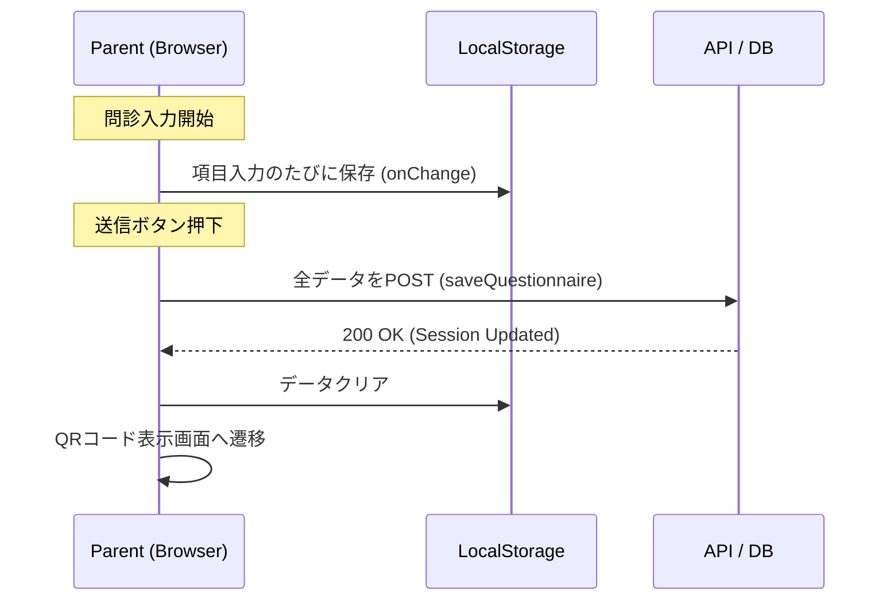
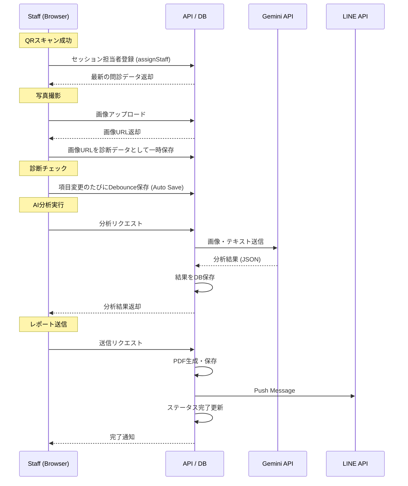
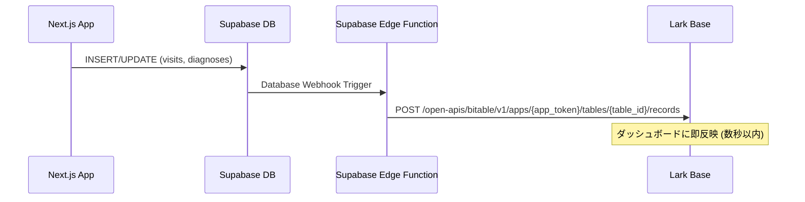

# cOralup データフロー設計 (Data Flow)

## 1. データ保存タイミング図

データの消失を防ぎ、スムーズな体験を提供するための保存戦略。

### 親御さんサイド


### スタッフサイド


---

## 2. データ同期フロー (localStorage ↔ DB)

### 親御さんフォーム (Parent Form)
*   **State Management**: React Hook Form + Zustand
*   **Persistence**: `zustand/middleware/persist` を使用して `localStorage` にフォームの状態を常時同期。
*   **Hydration**: ページロード時に `localStorage` から値を復元。
*   **Submission**: DBへの保存成功時のみ `localStorage` をクリア。

### スタッフ診断画面 (Staff Diagnosis)
*   **Optimistic UI**: チェックボックス操作などは即座にUI反映。
*   **Auto Save**: 操作から一定時間（例: 500ms）後、またはフォーカス外れ時にAPIへ `PATCH` リクエスト。
*   **Network Error**: オフライン時はリクエストをキューイングし、再接続時に送信（`tanstack-query` の機能活用）。

---

## 3. Lark Base リアルタイム同期フロー (当日監視用)

### 目的
展示会当日、**現場スタッフ（非エンジニア）がLarkで状況をリアルタイム監視**できるようにする。

### アーキテクチャ


### Lark Base テーブル設計

#### テーブル1: `来場者ログ` (visits_log)
| フィールド | 型 | 説明 |
|---|---|---|
| visit_id | Text | Supabase visits.id |
| child_name | Text | お子様の名前 |
| parent_name | Text | 親御さんの名前 |
| status | Select | waiting / in_progress / completed / report_sent |
| staff_name | Text | 担当スタッフ名 |
| visit_time | DateTime | 来場時刻 |
| updated_at | DateTime | 最終更新時刻 |

#### テーブル2: `リアルタイム集計` (realtime_stats)
| フィールド | 型 | 説明 |
|---|---|---|
| metric_name | Text | 指標名 |
| value | Number | 値 |
| updated_at | DateTime | 更新時刻 |

**集計指標:**
*   本日の来場者数
*   診断完了数
*   待機中の人数
*   LINE友だち登録数
*   スタッフ別診断数

#### テーブル3: `異常検知アラート` (alerts)
| フィールド | 型 | 説明 |
|---|---|---|
| alert_type | Select | timeout / error / data_mismatch |
| description | Text | 詳細 |
| visit_id | Text | 関連するvisit |
| created_at | DateTime | 検知時刻 |
| resolved | Checkbox | 解決済みか |

**検知ルール:**
*   問診完了から30分経過しても診断開始されていない
*   APIエラーが発生した
*   データ不整合（問診あり・診断なし等）

### Supabase Edge Function 実装概要

```typescript
// supabase/functions/sync-to-lark/index.ts
import { serve } from 'https://deno.land/std@0.168.0/http/server.ts'

const LARK_APP_TOKEN = Deno.env.get('LARK_APP_TOKEN')
const LARK_TABLE_ID = Deno.env.get('LARK_TABLE_ID')
const LARK_ACCESS_TOKEN = Deno.env.get('LARK_ACCESS_TOKEN')

serve(async (req) => {
  const payload = await req.json()
  const { type, table, record } = payload
  
  // Lark Base API にレコードを追加/更新
  const response = await fetch(
    `https://open.larksuite.com/open-apis/bitable/v1/apps/${LARK_APP_TOKEN}/tables/${LARK_TABLE_ID}/records`,
    {
      method: 'POST',
      headers: {
        'Authorization': `Bearer ${LARK_ACCESS_TOKEN}`,
        'Content-Type': 'application/json',
      },
      body: JSON.stringify({
        fields: {
          visit_id: record.id,
          status: record.status,
          // ... 他のフィールド
        }
      })
    }
  )
  
  return new Response(JSON.stringify({ success: true }), {
    headers: { 'Content-Type': 'application/json' }
  })
})
```

---

## 4. データモデル (簡易ER)

詳細は `06-DB設計書.md`。

*   **profiles**: 親御さん・スタッフ情報、LINE UserID
*   **children**: お子様情報（診断対象）
*   **visits**: 来場・診断セッション
*   **medical_interviews**: 問診回答データ (JSONB)
*   **oral_diagnoses**: 診断結果、写真URL、AI分析結果 (JSONB)

---

## 5. 当日監視運用フロー

1.  **事前準備**: Lark Base にテーブル作成、ダッシュボードビュー設定。
2.  **当日朝**: Edge Function の動作確認（テストレコード投入）。
3.  **運用中**: Lark ダッシュボードを常時表示（大画面モニター推奨）。
4.  **異常検知時**: アラートテーブルを確認し、該当者をフォロー。
