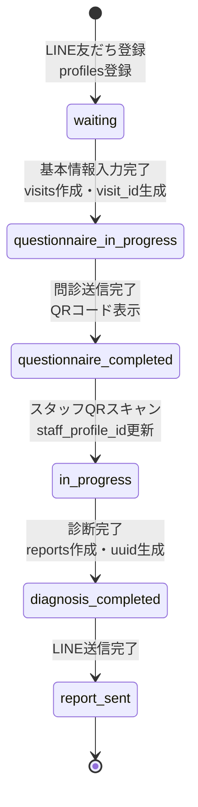

# cOralup ワークフロー設計 (Workflow & State Machine)

## 1. セッション状態遷移図

`visits` テーブルの `status` カラムが管理する状態遷移。

**ID生成タイミング**:
- `line_user_id`: LINE友だち登録時（`profiles` テーブル）
- `visit_id` (UUID): 基本情報入力完了時（`visits` テーブル）
- `report_uuid` (UUID): 診断完了時（`reports` テーブル）

## 2. 診断プロセス詳細ワークフロー

### ステージ定義
1.  **Pre-Diagnosis (親御さん)**
    *   LINE友だち登録: `profiles` テーブルに `line_user_id` 登録（`visit_id` は未生成）
    *   LIFF画面で問診開始: `https://liff.line.me/{LIFF_ID}`
    *   基本情報入力完了: `visits` テーブル作成、`visit_id` (UUID) 生成、`status='questionnaire_in_progress'`
    *   問診データが `questionnaire_responses` テーブルに保存される。
    *   問診完了: `visits.status = 'questionnaire_completed'`、QRコード表示（`visit_id` をエンコード）
    
2.  **Handover (引継ぎ)**
    *   親御さん: QRコード表示画面で待機。
    *   スタッフ: QRスキャン成功時、`visits.staff_profile_id` を更新、`visits.status = 'in_progress'`。
    
3.  **Diagnosis (スタッフ)**
    *   写真は `storage/photos/{visitId}/` にアップロード。
    *   診断データは `diagnosis_responses` テーブルに保存。
    
4.  **Analysis & Review (スタッフ)**
    *   Gemini API からの応答を `reports.ai_summary` に保存。
    *   スタッフが編集した場合、編集内容で上書き保存。
    
5.  **Post-Diagnosis (システム)**
    *   `reports` テーブルにレポート作成、`uuid` (UUID) 生成。
    *   レポートURL: `https://{APP_URL}/report/{uuid}`
    *   LINE送信（Flex Message）: レポートURLを親御さんに送信。
    *   `visits.status = 'report_sent'` に更新。

## 3. エラー・例外処理フロー

### タイムアウト処理
*   **QRコード**: セッションQRには有効期限（例: 24時間）を設ける。期限切れの場合は「スタッフにお声がけください」画面へ。
*   **セッション**: 48時間以上放置された `in_progress` セッションは、バッチ処理で `archived` または `aborted` に変更。

### コンフリクト処理
*   **複数スタッフ**: 誤って2人のスタッフが同じQRを読んだ場合。
    *   後に読んだスタッフの画面に「既に〇〇さんが担当中です」と警告を出し、引き継ぐかキャンセルするか選択させる。
    *   DBレベルでは `optimistic locking` (version column) まではMVPでは導入せず、LWW (Last Write Wins) または警告UIで対応。

### データ不整合
*   **写真なしで分析**: AI分析実行時に必須写真が足りない場合、クライアント側バリデーションでブロックし、アラートを表示。
