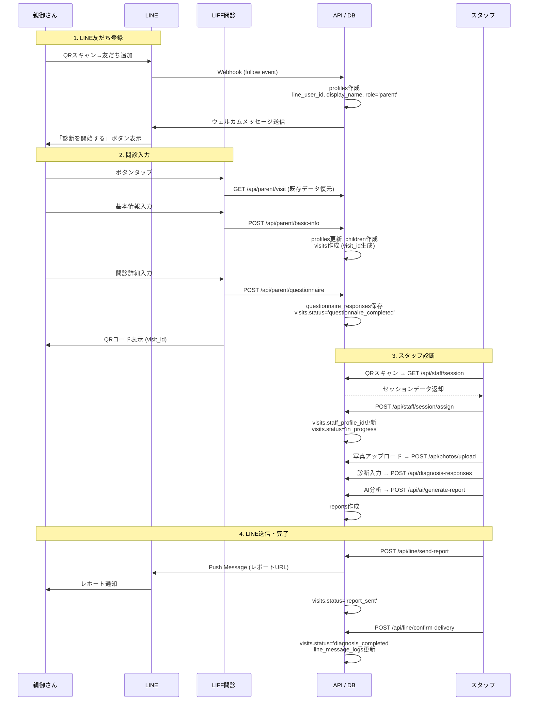
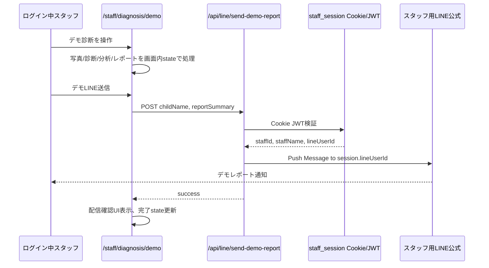
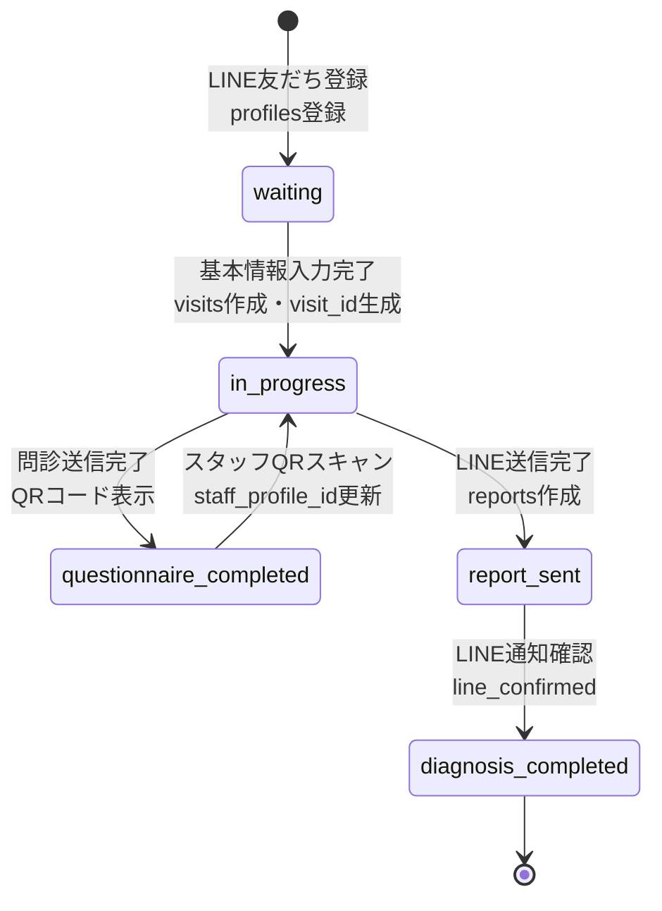

# cOralup ワークフロー設計 (Workflow & State Machine)

**最終更新: 2026-06-29**

---

## 1. 完全フロー: LINE登録から診断完了まで

### 1.1 フロー一覧表

| # | タイミング | ユーザー操作 | API | テーブル.カラム | 更新内容 | 目的 |
|---|-----------|-------------|-----|---------------|---------|------|
| 1 | **LINE友だち登録** | QRスキャン→友だち追加 | `POST /api/line/webhook` (follow event) | `profiles` | `line_user_id`, `display_name`, `role='parent'` 作成 | 親御さん識別、LINE通知送信先 |
| 2 | ↑ 同時 | - | ↑ 同じWebhook内 | - | ウェルカムメッセージ送信（LIFF URL含む） | 問診開始を促す |
| 3 | **LIFF問診開始** | LINEボタンタップ | `GET /api/parent/visit?line_user_id=xxx` | - | 既存データ復元（途中離脱対応） | 途中離脱からの復帰 |
| 4 | **基本情報入力完了** | 「次へ」ボタン | `POST /api/parent/basic-info` | `profiles` | `first_name`, `last_name`, `phone_number` 更新 | 保護者連絡先 |
| 5 | ↑ 同時 | - | ↑ 同じAPI | `children` | 新規作成 or 更新 | お子様情報 |
| 6 | ↑ 同時 | - | ↑ 同じAPI | `visits` | **作成**: `id`(UUID), `session_id`, `child_id`, `status='in_progress'`, `current_step='questionnaire_started'` | 診断セッション開始、**QRコードに使用** |
| 7 | **問診詳細入力完了** | 「次へ：QR表示」ボタン | `POST /api/parent/questionnaire` | `questionnaire_responses` | 問診回答を保存 | 診断時の参照 |
| 8 | ↑ 同時 | - | ↑ 同じAPI | `visits` | `status='questionnaire_completed'`, `current_step='questionnaire_completed'` | 問診完了表示 |
| 9 | **QRコード表示** | 画面表示 | - | - | `visit_id` をQRにエンコード | スタッフがスキャン |
| 10 | **スタッフQRスキャン** | カメラでQR読取 | `GET /api/staff/session?visitId=xxx` | - | セッションデータ取得（問診・写真等） | 問診内容表示 |
| 11 | ↑ 同時 | - | `POST /api/staff/session/assign` | `visits` | **`staff_profile_id`** 更新, `status='in_progress'`, `current_step='diagnosis_started'` | **スタッフ紐付け（履歴表示に必須）** |
| 12 | **写真撮影** | カメラ撮影 | `POST /api/photos/upload` | `visit_photos` | 写真URL保存 | 診断・AI分析用 |
| 13 | **診断入力** | チェック項目入力 | `POST /api/diagnosis-responses` | `diagnosis_responses` | 診断回答保存（auto-save） | AI分析入力 |
| 14 | ↑ 同時 | - | ↑ 同じAPI | `visits` | `current_step` 更新（進捗追跡） | ダッシュボード表示 |
| 15 | **AI分析実行** | 「分析」ボタン | `POST /api/ai/generate-report` | `reports` | AI分析結果、レポート作成 | レポート生成 |
| 16 | **LINE送信** | 「送信」ボタン | `POST /api/line/send-report` | `line_message_logs` | 送信ログ作成 | 送信履歴追跡 |
| 17 | ↑ 同時 | - | ↑ 同じAPI | `visits` | `status='report_sent'`, `current_step='report_sent'` | 送信済み表示 |
| 18 | **LINE通知確認** | 「届いた/届かない」選択 | `POST /api/line/confirm-delivery` | `line_message_logs` | `staff_confirmation_status` 更新 | 確認記録 |
| 19 | ↑ 同時 | - | ↑ 同じAPI | `visits` | `status='diagnosis_completed'`, `current_step='line_confirmed'` | **診断完了（履歴表示条件）** |

### 1.2 シーケンス図



---

### 1.3 デモモードワークフロー

デモモードはスタッフ説明・練習・検証用のフローであり、実運用DBの正本データを変更しない。
ただし、スタッフが一人で患者側/スタッフ側のLINE到達体験を確認できるよう、ログイン中スタッフ本人へのデモLINE送信のみ許可する。

| # | タイミング | ユーザー操作 | API | DB更新 | 目的 |
|---|---|---|---|---|---|
| D1 | デモ開始 | `/staff/diagnosis/demo` を開く | `GET /api/diagnosis-schema?input_type=staff` | なし | 本番と同じ診断マスタを読む |
| D2 | 写真 | カメラ/アップロード | なし | なし | 画面内stateだけで確認 |
| D3 | 診断入力 | 項目入力 | なし | なし | 画面内stateだけで確認 |
| D4 | AI分析 | 「分析」 | なし | なし | モック分析結果を表示 |
| D5 | レポート生成 | 「レポート生成」 | なし | なし | モックレポートを表示 |
| D6 | デモLINE送信 | 「デモLINE送信」 | `POST /api/line/send-demo-report` | なし | ログイン中スタッフ本人にだけ送信 |
| D7 | 完了確認 | 「届いた/届かない」 | なし | なし | 画面内stateだけで完了 |



本人限定・同時ログイン時の不変条件:
- 送信先LINE IDはリクエストbody、URL、localStorage、画面stateから受け取らない。
- 送信先LINE IDはサーバーで検証した `staff_session` JWTの `lineUserId` のみ。
- 複数スタッフが同時ログインしていても、それぞれのCookieに閉じるため本人以外へ送られない。
- 同一スタッフの複数端末ログインでは、同一スタッフ本人のLINEに届く。
- 患者/保護者向け `/api/line/send-report` は使わない。
- `line_message_logs`, `visits`, `reports` は更新しない。

---

## 2. セッション状態遷移図

`visits` テーブルの `status` カラムが管理する状態遷移。



**注意**: `status` と `current_step` は別の役割
- `status`: 大まかな状態（履歴表示条件に使用）
- `current_step`: 詳細な進捗（ダッシュボード表示に使用）

### current_step の値一覧

| current_step | タイミング | 意味 |
|-------------|-----------|------|
| `line_registered` | LINE友だち登録時 | LINE登録完了 |
| `questionnaire_started` | 基本情報入力完了時 | 問診開始 |
| `questionnaire_in_progress` | 問診入力中 | 問診入力中 |
| `questionnaire_completed` | 問診完了時 | 問診完了 |
| `diagnosis_started` | QRスキャン時 | 診断開始 |
| `photos_uploaded` | 写真アップロード時 | 写真撮影完了 |
| `diagnosis_in_progress` | 診断入力中 | 診断入力中 |
| `diagnosis_completed` | 診断入力完了時 | 診断入力完了 |
| `analysis_completed` | AI分析完了時 | AI分析完了 |
| `report_sent` | LINE送信時 | レポート送信済み |
| `line_confirmed` | LINE通知確認時 | LINE確認済み |

---

## 3. 履歴表示条件

### スタッフホーム「最近の対応」

```sql
SELECT * FROM visits
WHERE staff_profile_id = {ログイン中スタッフのID}
AND status IN ('diagnosis_completed', 'report_sent')
ORDER BY visit_date DESC
LIMIT 5
```

### スタッフ履歴ページ

```sql
SELECT * FROM visits
WHERE staff_profile_id = {ログイン中スタッフのID}
ORDER BY visit_date DESC
LIMIT 50
```

**履歴に表示されない原因**:
1. `staff_profile_id` が設定されていない → assign APIが呼ばれていないか失敗
2. `status` が `diagnosis_completed` / `report_sent` になっていない → confirm-delivery APIが呼ばれていないか失敗

---

## 4. ID生成タイミング

| ID | 生成タイミング | テーブル | 用途 |
|----|--------------|---------|------|
| `line_user_id` | LINE友だち登録時 | `profiles` | 親御さん識別、LINE送信先 |
| `visit_id` (UUID) | 基本情報入力完了時 | `visits` | **QRコード、全データの主キー** |
| `session_id` | 基本情報入力完了時 | `visits` | 後方互換用（非推奨） |
| `report.uuid` | AI分析完了時 | `reports` | レポートURL |

---

## 5. 診断プロセス詳細ワークフロー

### ステージ定義

1. **Pre-Diagnosis (親御さん)**
   - LINE友だち登録: `profiles` テーブルに `line_user_id` 登録
   - LIFF画面で問診開始: `https://liff.line.me/{LIFF_ID}`
   - 基本情報入力完了: `visits` テーブル作成、`visit_id` (UUID) 生成
   - 問診詳細入力: `questionnaire_responses` テーブルに保存
   - 問診完了: `visits.status = 'questionnaire_completed'`、QRコード表示

2. **Handover (引継ぎ)**
   - 親御さん: QRコード表示画面で待機
   - スタッフ: QRスキャン成功時、`visits.staff_profile_id` 更新

3. **Diagnosis (スタッフ)**
   - 写真: `storage/photos/{visitId}/` にアップロード、`visit_photos` に記録
   - 診断データ: `diagnosis_responses` テーブルに保存

4. **Analysis & Review (スタッフ)**
   - AI分析: Gemini API呼び出し
   - レポート: `reports` テーブルに保存

5. **Post-Diagnosis (システム)**
   - LINE送信: Push Message送信、`line_message_logs` に記録
   - 完了: `visits.status = 'diagnosis_completed'`

---

## 6. エラー・例外処理フロー

### タイムアウト処理
- **QRコード**: セッションQRには有効期限（例: 24時間）を設ける
- **セッション**: 48時間以上放置された `in_progress` セッションは、バッチ処理で `archived` に変更

### コンフリクト処理
- **複数スタッフ**: 2人のスタッフが同じQRを読んだ場合
  - 後に読んだスタッフの画面に「既に〇〇さんが担当中です」と警告表示
  - LWW (Last Write Wins) で対応

### データ不整合
- **写真なしで分析**: AI分析実行時に必須写真が足りない場合、クライアント側バリデーションでブロック
- **childIdがnull**: フォールバックでsessionIdから子供情報を復旧

---

## 7. 重要なAPIエンドポイント一覧

| API | メソッド | 目的 | 主な更新テーブル |
|-----|---------|------|-----------------|
| `/api/line/webhook` | POST | LINE Webhook受信 | profiles |
| `/api/parent/visit` | GET | 既存データ復元 | - |
| `/api/parent/basic-info` | POST | 基本情報保存 | profiles, children, visits |
| `/api/parent/questionnaire` | POST | 問診回答保存 | questionnaire_responses, visits |
| `/api/staff/session` | GET | セッションデータ取得 | - |
| `/api/staff/session/assign` | POST | スタッフ紐付け | visits |
| `/api/photos/upload` | POST | 写真アップロード | visit_photos |
| `/api/diagnosis-responses` | POST | 診断回答保存 | diagnosis_responses |
| `/api/ai/generate-report` | POST | AI分析・レポート生成 | reports |
| `/api/line/send-report` | POST | LINE送信 | line_message_logs, visits |
| `/api/line/confirm-delivery` | POST | LINE通知確認 | line_message_logs, visits |
