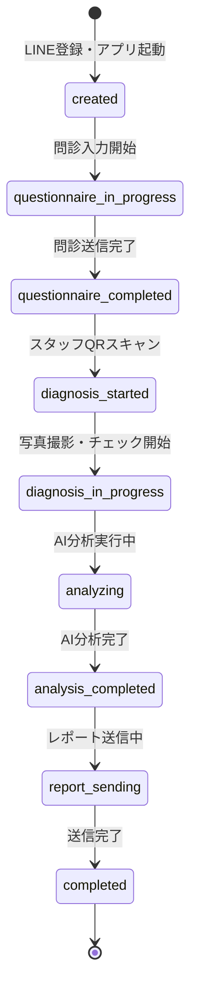

# cOralup ワークフロー設計 (Workflow & State Machine)

## 1. セッション状態遷移図

セッション (`sessions` テーブル) の `status` カラムが管理する状態遷移。

## 2. 診断プロセス詳細ワークフロー

### ステージ定義
1.  **Pre-Diagnosis (親御さん)**
    *   LINE認証済み、セッションID発行済み。
    *   問診データが `questionnaires` テーブルに作成される。
    
2.  **Handover (引継ぎ)**
    *   親御さん: QRコード表示画面で待機（ポーリングまたはRealtimeでステータス監視）。
    *   スタッフ: QRスキャン成功時、`sessions.staff_id` を更新。
    
3.  **Diagnosis (スタッフ)**
    *   写真は `storage/photos/{sessionId}/` にアップロード。
    *   診断データは `diagnoses` テーブルにUpsert。
    
4.  **Analysis & Review (スタッフ)**
    *   Gemini API からの応答を `diagnoses.ai_analysis` に保存。
    *   スタッフが編集した場合、編集内容で上書き保存。
    
5.  **Post-Diagnosis (システム)**
    *   PDF生成 (Puppeteer or PDF lib)。
    *   Supabase Storage にPDF保存。
    *   LINE送信。

## 3. エラー・例外処理フロー

### タイムアウト処理
*   **QRコード**: セッションQRには有効期限（例: 24時間）を設ける。期限切れの場合は「スタッフにお声がけください」画面へ。
*   **セッション**: 48時間以上放置された `in_progress` セッションは、バッチ処理で `archived` または `aborted` に変更。

### コンフリクト処理
*   **複数スタッフ**: 誤って2人のスタッフが同じQRを読んだ場合。
    *   後に読んだスタッフの画面に「既に〇〇さんが担当中です」と警告を出し、引き継ぐかキャンセルするか選択させる。
    *   DBレベルでは `optimistic locking` (version column) まではMVPでは導入せず、LWW (Last Write Wins) または警告UIで対応。

### データ不整合
*   **写真なしで分析**: AI分析実行時に必須写真が足りない場合、クライアント側バリデーションでブロックし、アラートを表示。
