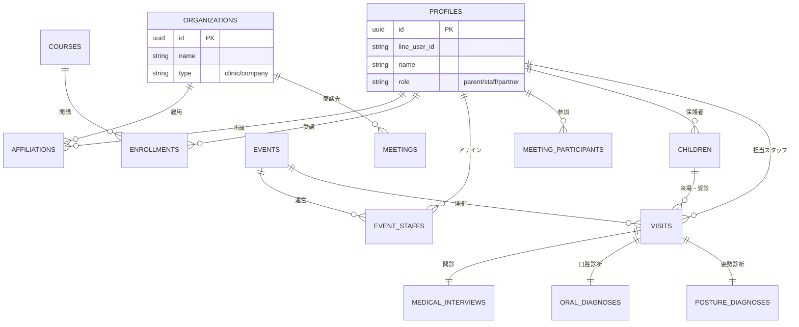

# データベース設計書 (cOralup Platform)

## 1. 設計方針

本システムは単なる「診断アプリ」ではなく、将来的にcOralup社が展開する「歯科医院向けSaaS」「教育事業」「イベント事業」を統合管理するプラットフォームの基盤として設計する。

### コアコンセプト
1.  **ユニバーサルID (Profiles)**: すべての「人（親、スタッフ、医院関係者）」を単一のテーブルで管理し、多面的な役割（ロール）を持たせる。
2.  **CRM・カルテ分離**: 「連絡先（親）」と「診断対象（子）」を明確に分離し、1:Nの関係を構築する。
3.  **BI・Lark連携前提**: 分析に必要な主要属性（年齢、主訴、診断結果サマリなど）はJSONBではなく物理カラムに展開し、SQL/Viewでの集計を容易にする。
4.  **イベントドリブン**: 全ての診断行為は「いつ、どこで（Event）」行われたかに紐づく。

---

## 2. ER図概要 (概念モデル)

---

## 3. テーブル定義詳細

### A. Core Domain (ヒト・組織)

#### `profiles` (全ユーザー基本台帳)
システムの全ユーザー・関係者を管理。
*   **id**: UUID (PK)
*   **line_user_id**: String (Unique, Nullable) - 親御さん・スタッフのLINE連携用
*   **email**: String (Unique, Nullable) - 管理者・医院スタッフ用
*   **last_name**: String - 姓
*   **first_name**: String - 名
*   **last_name_kana**: String - セイ
*   **first_name_kana**: String - メイ
*   **display_name**: String - アプリ/LINE上の表示名
*   **avatar_url**: String - アイコン画像
*   **phone_number**: String - 連絡先
*   **role**: Enum ('admin', 'staff', 'parent', 'doctor') - システム上の主ロール
*   **last_visit_date**: Timestamp - 最終アクティビティ日時（CRM用）
*   **created_at**: Timestamp

#### `organizations` (組織マスタ)
歯科医院、パートナー企業、cOralup社など。
*   **id**: UUID (PK)
*   **name**: String - 組織名（例: 〇〇歯科医院）
*   **type**: Enum ('internal', 'clinic', 'partner')
*   **address**: String
*   **status**: String ('active', 'inactive')

#### `affiliations` (所属)
ヒトと組織の関係。
*   **id**: UUID (PK)
*   **profile_id**: UUID (FK -> profiles)
*   **organization_id**: UUID (FK -> organizations)
*   **role**: String - 組織内での役割（例: 院長, 衛生士）
*   **is_primary**: Boolean - 主所属フラグ

---

### B. Education Domain (教育・資格)

#### `courses` (講座マスタ)
養成講座の管理。
*   **id**: UUID (PK)
*   **title**: String - 講座名
*   **batch_number**: Integer - 期数
*   **start_date**: Date
*   **end_date**: Date

#### `enrollments` (受講履歴)
誰がどの講座をいつ卒業したか。
*   **id**: UUID (PK)
*   **course_id**: UUID (FK -> courses)
*   **profile_id**: UUID (FK -> profiles)
*   **status**: Enum ('enrolled', 'graduated', 'dropped')
*   **completion_date**: Date

---

### C. CRM Domain (イベント・営業)

#### `events` (イベントマスタ)
展示会、相談会、イベントなど。
*   **id**: UUID (PK)
*   **name**: String - イベント名（例: 〇〇フェス2024）
*   **event_date**: Date
*   **location**: String
*   **type**: Enum ('exhibition', 'seminar')

#### `event_staffs` (イベントスタッフ)
そのイベントに誰がスタッフとして参加したか。
*   **id**: UUID (PK)
*   **event_id**: UUID (FK -> events)
*   **profile_id**: UUID (FK -> profiles)
*   **role**: String - 当日の役割（リーダー, 診断担当, 受付）

#### `meetings` (会議・活動ログ)
医院との打合せ、社内会議などの記録。
*   **id**: UUID (PK)
*   **title**: String
*   **date**: Timestamp
*   **organization_id**: UUID (FK -> organizations, Nullable) - 商談相手
*   **content**: Text - 議事録
*   **tags**: Array[String]

---

### D. Clinical Domain (診断・問診)

#### `children` (患者・お子様)
診断対象。
*   **id**: UUID (PK)
*   **parent_profile_id**: UUID (FK -> profiles) - 保護者
*   **first_name**: String
*   **last_name**: String
*   **first_name_kana**: String
*   **last_name_kana**: String
*   **birthday**: Date - **重要** (年齢計算の基準)
*   **gender**: String ('male', 'female', 'other')
*   **notes**: Text - 特記事項

#### `visits` (来場・診療セッション)
「いつ、誰が、誰を診たか」の記録。診断の親テーブル。
*   **id**: UUID (PK)
*   **event_id**: UUID (FK -> events)
*   **child_id**: UUID (FK -> children)
*   **staff_profile_id**: UUID (FK -> profiles) - 担当スタッフ
*   **visit_date**: Timestamp - 来場日時
*   **child_age_months**: Integer - **診断時の月齢** (分析用スナップショット)
*   **status**: Enum ('waiting', 'in_progress', 'completed', 'report_sent')
*   **reception_number**: String - 当日の受付番号

#### `medical_interviews` (問診票データ)
*   **visit_id**: UUID (PK/FK -> visits) - 1来場につき1問診
*   **chief_complaint**: Text - **主訴** (検索用に抽出)
*   **concerns**: Array[String] - 気になることタグ (検索用)
*   **answers**: JSONB - その他の詳細回答データ

#### `oral_diagnoses` (口腔診断データ)
*   **visit_id**: UUID (PK/FK -> visits)
*   **diagnosis_summary**: String - 診断結果サマリ (例: A, B, C判定)
*   **photo_urls**: Array[String] - 口腔内写真
*   **details**: JSONB - 項目ごとの詳細スコア

#### `ai_analysis_logs` (AI分析ログ)
*   **id**: UUID (PK)
*   **visit_id**: UUID (FK -> visits)
*   **input_data**: JSONB - AIに渡したデータ
*   **generated_content**: Text - AIが生成したコメント
*   **final_content**: Text - スタッフが修正した最終コメント
*   **feedback_score**: Integer - AIへの評価 (1-5)

---

## 4. 12/21 MVPでの実装範囲

上記グランドデザインのうち、MVPでは以下のテーブルを優先実装する。

1.  **Profiles**: 親御さん、スタッフの管理に必須。
2.  **Events**: 「今回の展示会」を1レコード登録。
3.  **Children**: 診断対象の管理に必須。
4.  **Visits**: セッション管理の中核。
5.  **MedicalInterviews / OralDiagnoses**: 診断データの保存先。

※ `organizations`, `affiliations`, `courses`, `meetings` などはテーブル定義だけしておくか、Phase 2以降で実装する。ただし、**Profilesテーブルの設計は将来これらが結合できるようにしておく。**
