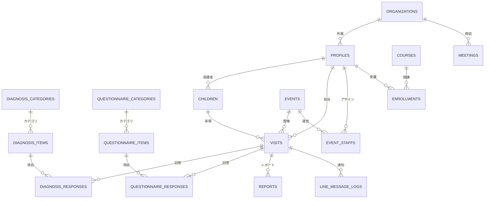

# データベース設計書 (cOralup Platform)

**最終更新: 2025-12-18** （本番デプロイ前リファクタリング完了）

## 1. 設計方針

本システムは単なる「診断アプリ」ではなく、将来的にcOralup社が展開する「歯科医院向けSaaS」「個人トレーナー向けサービス」「教育事業」「イベント事業」を統合管理するプラットフォームの基盤として設計する。

### コアコンセプト

1. **ユニバーサルID (Profiles)**: すべての「人（親、スタッフ、トレーナー、医院関係者）」を単一のテーブルで管理し、多面的な役割（ロール）を持たせる。
2. **CRM・カルテ分離**: 「連絡先（親）」と「診断対象（子）」を明確に分離し、1:Nの関係を構築する。
3. **マスタ管理**: 問診・診断項目はハードコードせず、DBでマスタ管理。正規化された回答データで集計・分析を容易に。
4. **イベントドリブン**: 全ての診断行為は「いつ、どこで（Event）」行われたかに紐づく。
5. **マルチテナント対応準備**: 将来の医院/トレーナー向けSaaS化を見据え、`organization_id`での分離を前提設計。
6. **ハイブリッドID方式**: カテゴリ・項目には`id`（UUID自動生成）と`code`（システム参照用）の2つの識別子を持ち、分析・API連携・国際化に対応。

### アーキテクチャ概要

```
┌─────────────────────────────────────────────────────────────────────┐
│                         Supabase (統合DB)                           │
├─────────────────────────────────────────────────────────────────────┤
│                                                                     │
│  【A. マスタ管理】                                                   │
│  ┌─────────────────────────────────────────────────────────────┐   │
│  │ diagnosis_categories    - 診断カテゴリマスタ                  │   │
│  │ diagnosis_items         - 診断項目マスタ                      │   │
│  │ questionnaire_categories - 問診カテゴリマスタ                 │   │
│  │ questionnaire_items     - 問診項目マスタ                      │   │
│  └─────────────────────────────────────────────────────────────┘   │
│                                                                     │
│  【B. トランザクション】                                             │
│  ┌─────────────────────────────────────────────────────────────┐   │
│  │ visits                  - 来場セッション（中心テーブル）      │   │
│  │ diagnosis_responses     - 診断回答（正規化）                  │   │
│  │ questionnaire_responses - 問診回答（正規化）                  │   │
│  │ reports                 - レポート管理                        │   │
│  │ visit_photos            - 写真管理                            │   │
│  │ ai_analysis_logs        - AI分析ログ                          │   │
│  │ ai_analysis_results     - AI分析結果                          │   │
│  │ line_message_logs       - LINE送信ログ                        │   │
│  └─────────────────────────────────────────────────────────────┘   │
│                                                                     │
│  【C. CRM・自社管理】                                                │
│  ┌─────────────────────────────────────────────────────────────┐   │
│  │ organizations           - 組織マスタ                          │   │
│  │ profiles                - ユーザー台帳                        │   │
│  │ children                - 患者マスタ                          │   │
│  │ events                  - イベント管理                        │   │
│  │ event_staffs            - イベントスタッフ                    │   │
│  │ courses                 - 講座マスタ                          │   │
│  │ enrollments             - 受講履歴                            │   │
│  │ meetings                - MTG/議事録                          │   │
│  └─────────────────────────────────────────────────────────────┘   │
│                                                                     │
│  【D. 設定・カスタマイズ】                                           │
│  ┌─────────────────────────────────────────────────────────────┐   │
│  │ event_form_settings           - イベント別フォーム設定        │   │
│  │ event_diagnosis_settings      - イベント別診断設定            │   │
│  │ organization_diagnosis_settings - 医院別診断設定              │   │
│  └─────────────────────────────────────────────────────────────┘   │
│                                                                     │
└─────────────────────────────────────────────────────────────────────┘
```

---

## 2. ER図概要 (概念モデル)



---

## 3. テーブル定義詳細

### A. マスタ管理テーブル

#### `diagnosis_categories` (診断カテゴリマスタ)

| カラム | 型 | 説明 |
|--------|-----|------|
| id | UUID (PK) | |
| code | VARCHAR(50) UNIQUE | システム参照用コード |
| name | VARCHAR(100) | カテゴリ名（舌、歯列・咬合等） |
| description | TEXT | 説明 |
| display_order | INTEGER | 表示順 |
| owner | VARCHAR(50) | 'system' or organization_id |
| is_active | BOOLEAN | 有効フラグ |

#### `diagnosis_items` (診断項目マスタ)

| カラム | 型 | 説明 |
|--------|-----|------|
| id | UUID (PK) | |
| code | VARCHAR(50) UNIQUE | システム参照用コード |
| category_id | UUID (FK) | カテゴリ |
| question | VARCHAR(500) | 質問文 |
| answer_type | VARCHAR(20) | radio/checkbox/text/number/textarea |
| options | JSONB | 選択肢 [{value, label}] |
| is_required | BOOLEAN | 必須フラグ |
| input_type | VARCHAR(10) | 'staff' or 'parent' |
| note | TEXT | 補足説明 |
| placeholder | VARCHAR(200) | |
| unit | VARCHAR(20) | 単位（kg等） |
| display_order | INTEGER | 表示順 |
| owner | VARCHAR(50) | 'system' or organization_id |
| is_active | BOOLEAN | 有効フラグ |

#### `questionnaire_categories` (問診カテゴリマスタ)

| カラム | 型 | 説明 |
|--------|-----|------|
| id | UUID (PK) | |
| code | VARCHAR(50) UNIQUE | システム参照用コード |
| name | VARCHAR(100) | カテゴリ名（基本情報、睡眠等） |
| description | TEXT | 説明 |
| target_age | VARCHAR(20) | 'preschool', 'elementary', 'all' |
| display_order | INTEGER | 表示順 |
| owner | VARCHAR(50) | 'system' or organization_id |
| is_active | BOOLEAN | 有効フラグ |

#### `questionnaire_items` (問診項目マスタ)

| カラム | 型 | 説明 |
|--------|-----|------|
| id | UUID (PK) | |
| code | VARCHAR(50) UNIQUE | システム参照用コード |
| category_id | UUID (FK) | カテゴリ |
| question | VARCHAR(500) | 質問文 |
| answer_type | VARCHAR(20) | radio/checkbox/text/number/textarea/select |
| options | JSONB | 選択肢 [{value, label}] |
| is_required | BOOLEAN | 必須フラグ |
| placeholder | VARCHAR(200) | |
| helper_text | VARCHAR(500) | 補助テキスト |
| validation | JSONB | {min, max, minLength, maxLength} |
| display_order | INTEGER | 表示順 |
| owner | VARCHAR(50) | 'system' or organization_id |
| is_active | BOOLEAN | 有効フラグ |

---

### B. トランザクションテーブル

#### `visits` (来場セッション) ※統合済み

**設計方針**: `visits.id` (UUID) を全トランザクションの主キーとして統一。
旧 `sessions` テーブルは `visits` に統合済み。`session_id` は後方互換用に残置。

| カラム | 型 | 説明 |
|--------|-----|------|
| id | UUID (PK) | **主キー（全テーブルの外部キー参照先）** |
| session_id | VARCHAR(10) UNIQUE | 短縮ID（QRコード用、後方互換） |
| organization_id | UUID (FK) | 組織 |
| event_id | UUID (FK) | イベント |
| child_id | UUID (FK) | 患者 |
| staff_profile_id | UUID (FK) | 担当スタッフ |
| visit_date | TIMESTAMP | 来場日時 |
| child_age_months | INTEGER | 診断時月齢 |
| status | VARCHAR(50) | **ライフサイクル**: waiting/in_progress/completed/published/cancelled |
| current_step | VARCHAR(50) | **詳細ステップ**: line_registered/questionnaire_started/questionnaire_completed/diagnosis_started/photos_uploaded/analysis_completed/report_generated/line_sent/line_confirmed |
| report_sent_at | TIMESTAMP | レポートLINE送信日時 |
| reception_number | VARCHAR(20) | 受付番号 |
| step_timestamps | JSONB | 各ステップの完了日時記録 |

#### 3.1.1 ステータス・ライフサイクル定義（Two-Layer Status System）

**1. `status` (ライフサイクル)**
システムの大きな状態遷移を管理。ダッシュボードのタブやアクセス制御に使用。

- `waiting`: 待機中（LINE登録〜問診前）
- `in_progress`: 対応中（問診開始〜診断・撮影中）
- `completed`: 完了（現場対応完了・AI分析完了〜レポート作成中）
- `published`: 公開済（レポート送信済み）
- `cancelled`: 中止

**2. `current_step` (詳細プロセス)**
各ライフサイクル内の詳細な進捗状況。プログレスバーやフィルタリングに使用。

- `waiting`
    - `line_registered`: LINE友だち追加・登録完了
- `in_progress`
    - `questionnaire_started`: 問診票入力開始
    - `questionnaire_completed`: 問診票回答完了・診断待ち
    - `diagnosis_started`: スタッフ診断開始
    - `photos_uploaded`: 写真撮影・アップロード完了
- `completed`
    - `analysis_completed`: AI分析完了・スタッフ確認待ち
    - `report_generated`: レポート生成完了・送信待ち
- `published`
    - `line_sent`: LINE送信完了
    - `line_confirmed`: 保護者閲覧確認済み


**※ 重要**: `line_user_id`, `parent_name`, `parent_phone` は削除済み。
これらの情報は `visits.child_id` → `children.parent_profile_id` → `profiles` から取得。

#### `diagnosis_responses` (診断回答)

| カラム | 型 | 説明 |
|--------|-----|------|
| id | UUID (PK) | |
| visit_id | UUID (FK) | **来場セッション（推奨）** |
| session_id | VARCHAR(10) | 後方互換用（非推奨） |
| item_id | UUID (FK) | 診断項目 |
| value | TEXT | 回答値 |
| metadata | JSONB | 追加情報 |
| answered_by | UUID (FK) | 回答者（スタッフ） |
| answered_at | TIMESTAMP | 回答日時 |

#### `questionnaire_responses` (問診回答)

| カラム | 型 | 説明 |
|--------|-----|------|
| id | UUID (PK) | |
| visit_id | UUID (FK) | **来場セッション（推奨）** |
| session_id | VARCHAR(10) | 後方互換用（非推奨） |
| item_id | UUID (FK) | 問診項目 |
| value | TEXT | 回答値 |
| metadata | JSONB | 追加情報 |
| answered_at | TIMESTAMP | 回答日時 |

#### `reports` (レポート管理)

| カラム | 型 | 説明 |
|--------|-----|------|
| id | UUID (PK) | |
| uuid | UUID UNIQUE | **レポートURL用UUID** |
| visit_id | UUID (FK) | **来場セッション（推奨）** |
| session_id | VARCHAR(10) | 後方互換用（非推奨） |
| diagnosis_id | UUID (FK) | 診断ID |
| ai_summary | TEXT | AI分析サマリー |
| age_consideration | TEXT | 月齢考慮コメント |
| posture_analysis | JSONB | 姿勢分析結果 |
| oral_analysis | JSONB | 口腔分析結果 |
| pdf_url | TEXT | PDF URL |
| line_sent_at | TIMESTAMP | LINE送信日時 |
| status | VARCHAR(20) | pending/sent |

#### `line_message_logs` (LINE送信ログ) ※新規

| カラム | 型 | 説明 |
|--------|-----|------|
| id | UUID (PK) | |
| visit_id | UUID (FK) | 来場セッション |
| line_user_id | VARCHAR(255) | LINE User ID |
| message_type | VARCHAR(50) | report/reminder/welcome |
| message_content | JSONB | 送信内容 |
| status | VARCHAR(20) | pending/sent/failed |
| response | JSONB | LINE APIレスポンス |
| error_message | TEXT | エラー詳細 |
| sent_at | TIMESTAMP | 送信日時 |
| staff_confirmation_status | VARCHAR(20) | スタッフ確認結果 (confirmed/not_received/unknown) |
| staff_confirmed_at | TIMESTAMP | スタッフ確認日時 |

#### `visit_photos` (写真管理)

| カラム | 型 | 説明 |
|--------|-----|------|
| id | UUID (PK) | |
| visit_id | UUID (FK) | 来場セッション |
| session_id | VARCHAR(10) | 後方互換用 |
| photo_type | VARCHAR(50) | posture_front/posture_side/oral_front/oral_side/oral_closeup |
| storage_path | TEXT | Storageパス |
| public_url | TEXT | 公開URL |
| file_size | INTEGER | ファイルサイズ |
| mime_type | VARCHAR(50) | MIMEタイプ |
| width | INTEGER | 画像幅 |
| height | INTEGER | 画像高さ |
| metadata | JSONB | 追加情報 |
| uploaded_at | TIMESTAMP | アップロード日時 |

#### `ai_analysis_results` (AI分析結果)

| カラム | 型 | 説明 |
|--------|-----|------|
| id | UUID (PK) | |
| visit_id | UUID (FK) | 来場セッション |
| session_id | VARCHAR(10) | 後方互換用 |
| summary | TEXT | 総合サマリー |
| detailed_analysis | JSONB | 詳細分析結果 |
| improvement_suggestions | JSONB | 改善提案リスト |
| next_steps | JSONB | 次のステップ |
| encouragement_message | TEXT | 励ましメッセージ |
| staff_edited | BOOLEAN | スタッフ編集フラグ |
| staff_edited_summary | TEXT | スタッフ編集後サマリー |
| staff_edited_at | TIMESTAMP | 編集日時 |
| staff_profile_id | UUID (FK) | 編集スタッフ |
| model_version | VARCHAR(50) | AIモデルバージョン |
| prompt_version | VARCHAR(50) | プロンプトバージョン |
| tokens_used | INTEGER | 使用トークン数 |
| processing_time_ms | INTEGER | 処理時間(ms) |
| status | VARCHAR(20) | pending/processing/completed/failed |
| error_message | TEXT | エラー詳細 |

#### `ai_analysis_logs` (AI分析ログ)

| カラム | 型 | 説明 |
|--------|-----|------|
| id | UUID (PK) | |
| visit_id | UUID (FK) | 来場セッション |
| input_data | JSONB | 分析入力データ |
| generated_content | TEXT | AI生成コメント |
| final_content | TEXT | 編集後最終コメント |
| feedback_score | INTEGER | フィードバックスコア (1-5) |
| model_version | VARCHAR(50) | AIモデルバージョン |
| prompt_version | VARCHAR(50) | プロンプトバージョン |
| tokens_used | INTEGER | 使用トークン数 |
| processing_time_ms | INTEGER | 処理時間(ms) |
| status | VARCHAR(20) | ステータス |
| error_message | TEXT | エラー詳細 |

---

### C. CRM・自社管理テーブル

#### `organizations` (組織マスタ)

| カラム | 型 | 説明 |
|--------|-----|------|
| id | UUID (PK) | |
| name | VARCHAR(200) | 組織名 |
| type | VARCHAR(20) | internal/clinic/trainer/partner |
| status | VARCHAR(20) | active/inactive/trial |
| address | TEXT | 住所 |
| phone | VARCHAR(20) | 電話番号 |
| email | VARCHAR(255) | メール |
| settings | JSONB | 組織固有設定 |


#### `profiles` (ユーザー台帳)

| カラム | 型 | 説明 |
|--------|-----|------|
| id | UUID (PK) | **全ユーザー共通ID** |
| organization_id | UUID (FK) | 所属組織 |
| line_user_id | VARCHAR(255) | LINE ID |
| email | VARCHAR(255) | メール |
| last_name | VARCHAR(50) | 姓 (登録時NULL可) |
| first_name | VARCHAR(50) | 名 (登録時NULL可) |
| last_name_kana | VARCHAR(50) | セイ |
| first_name_kana | VARCHAR(50) | メイ |
| display_name | VARCHAR(100) | 表示名 (LINE名) |
| avatar_url | TEXT | アイコン |
| phone_number | VARCHAR(20) | 電話番号 |
| role | VARCHAR(20) | admin/staff/parent/trainer |
| last_activity_at | TIMESTAMP | 最終活動日時 |

**※注**: LINE友だち登録時に `line_user_id` と `display_name` のみでレコード作成。その後、問診票の基本情報入力時に実名情報をUPDATEするフローとする。

#### `children` (患者マスタ)

| カラム | 型 | 説明 |
|--------|-----|------|
| id | UUID (PK) | |
| parent_profile_id | UUID (FK) | **保護者（profiles.id参照）** |
| first_name | VARCHAR(50) | 名 |
| last_name | VARCHAR(50) | 姓 |
| first_name_kana | VARCHAR(50) | メイ |
| last_name_kana | VARCHAR(50) | セイ |
| birthday | DATE | 生年月日 |
| gender | VARCHAR(10) | male/female/other |
| notes | TEXT | 特記事項 |

**※注**: 問診票の「基本情報」ステップ完了時にレコードが作成される。

**データ参照パス**: 
- 親御さん情報: `visits.child_id` → `children.parent_profile_id` → `profiles`
- LINE User ID: `profiles.line_user_id`

#### `events` (イベント管理) ※既存拡張

| カラム | 型 | 説明 |
|--------|-----|------|
| id | UUID (PK) | |
| event_id | VARCHAR(50) | 短縮ID |
| name | VARCHAR(200) | イベント名 |
| description | TEXT | 説明 |
| start_date | TIMESTAMP | 開始日時 |
| end_date | TIMESTAMP | 終了日時 |
| venue | VARCHAR(200) | 会場 |
| status | VARCHAR(20) | draft/active/completed |

#### `event_staffs` (イベントスタッフ)

| カラム | 型 | 説明 |
|--------|-----|------|
| id | UUID (PK) | |
| event_id | UUID (FK) | イベント |
| profile_id | UUID (FK) | スタッフ |
| role | VARCHAR(50) | leader/diagnosis/reception |

#### `courses` (講座マスタ)

| カラム | 型 | 説明 |
|--------|-----|------|
| id | UUID (PK) | |
| title | VARCHAR(200) | 講座名 |
| description | TEXT | 説明 |
| batch_number | INTEGER | 期数 |
| start_date | DATE | 開始日 |
| end_date | DATE | 終了日 |
| status | VARCHAR(20) | draft/active/completed |

#### `enrollments` (受講履歴)

| カラム | 型 | 説明 |
|--------|-----|------|
| id | UUID (PK) | |
| course_id | UUID (FK) | 講座 |
| profile_id | UUID (FK) | 受講者 |
| status | VARCHAR(20) | enrolled/graduated/dropped |
| completion_date | DATE | 修了日 |
| certificate_url | TEXT | 修了証URL |

#### `meetings` (MTG/議事録)

| カラム | 型 | 説明 |
|--------|-----|------|
| id | UUID (PK) | |
| organization_id | UUID (FK) | 商談先 |
| title | VARCHAR(200) | タイトル |
| meeting_date | TIMESTAMP | 日時 |
| location | VARCHAR(200) | 場所 |
| content | TEXT | 内容 |
| summary | TEXT | サマリ |
| tags | VARCHAR[] | タグ |
| attendees | UUID[] | 参加者 |
| created_by | UUID (FK) | 作成者 |

---

### D. 設定・カスタマイズテーブル

#### `event_form_settings` (イベント別フォーム設定)

| カラム | 型 | 説明 |
|--------|-----|------|
| id | UUID (PK) | |
| event_id | UUID (FK) | イベント |
| item_id | UUID | 項目ID |
| item_type | VARCHAR(20) | 'diagnosis' or 'questionnaire' |
| is_enabled | BOOLEAN | 使用フラグ |
| display_order | INTEGER | 表示順上書き |

#### `event_diagnosis_settings` (イベント別診断設定)

| カラム | 型 | 説明 |
|--------|-----|------|
| id | UUID (PK) | |
| event_id | UUID (FK) | イベント |
| item_id | UUID (FK) | 診断項目 |
| is_enabled | BOOLEAN | 使用フラグ |
| display_order | INTEGER | 表示順上書き |

#### `organization_diagnosis_settings` (医院別診断設定)

| カラム | 型 | 説明 |
|--------|-----|------|
| id | UUID (PK) | |
| organization_id | UUID | 組織 |
| item_id | UUID (FK) | 診断項目 |
| is_enabled | BOOLEAN | 使用フラグ |
| display_order | INTEGER | 表示順上書き |

---

## 4. レガシーテーブル（互換用・廃止予定）

以下のテーブル/カラムは既存実装との互換性のために残置。新規実装では正規化テーブルを使用。

| テーブル/カラム | 用途 | 移行先 | 状態 |
|---------|------|--------|------|
| `sessions` | セッション管理 | `visits` | **削除済み（visitsに統合）** |
| `questionnaires` | 問診票（JSONB） | `questionnaire_responses` | 後方互換用 |
| `diagnoses` | 診断結果（JSONB） | `diagnosis_responses` | 後方互換用 |
| `*.session_id` | セッションID参照 | `*.visit_id` | 後方互換用（非推奨） |
| `visits.line_user_id` | LINE ID | `profiles.line_user_id` | **削除済み** |
| `visits.parent_name` | 親御さん名 | `profiles.display_name` | **削除済み** |
| `visits.parent_phone` | 電話番号 | `profiles.phone_number` | **削除済み** |

---

## 5. 実装フェーズ

### Phase 1: YourTIME イベント（2024/12）✅ 完了

**実装済み:**
- `sessions` - 既存活用 → `visits` に統合
- `events` - YourTIME登録
- `diagnosis_categories` + `diagnosis_items` - マスタ投入
- `questionnaire_categories` + `questionnaire_items` - マスタ投入
- `diagnosis_responses` - 正規化回答保存
- `questionnaire_responses` - 正規化回答保存
- `reports` - 既存活用 + ai_analysis_results連携
- `organizations` - cOralup 1件登録
- `profiles` - LINE連携運用開始
- `children` - 問診フロー連携
- `visits` - 中心テーブルとして稼働
- `line_message_logs` - 送信ログ記録

### Phase 2: 自社CRM整備（2025 Q1）🔧 現在

- `profiles` へのデータ移行・整備
- `visits` と旧 `sessions` のデータ統合
- Lark連携によるデータ可視化
- `event_staffs` 運用開始

### Phase 3: マルチテナント化（2025 Q2〜）

- `organizations` の本格運用
- RLS（Row Level Security）による分離
- 医院/トレーナー向け管理画面
- `courses`, `enrollments`, `meetings` 運用開始

---

## 6. 分析・集計用ビュー

```sql
-- イベント別診断項目一覧
event_diagnosis_items_view

-- 問診結果詳細
questionnaire_results_view

-- 診断結果詳細
diagnosis_results_view

-- イベント別問診項目一覧
event_questionnaire_items_view
```

---

## 7. 回答値（value）設計

### 7.1 設計方針

回答値は**短い英語キー**で保存し、表示時にラベル変換する。

**理由:**
- 集計時のグルーピングが容易
- 多言語対応が可能
- データサイズが小さい
- 後から変換・マッピングが可能

### 7.2 value設計例

#### 診断項目

| 項目 | value | 表示ラベル |
|------|-------|----------|
| 舌小帯短縮症 | `yes` | あり |
| 舌小帯短縮症 | `no` | なし |
| 舌小帯短縮症 | `suspected` | 疑い |
| 口呼吸・鼻呼吸 | `mouth` | 口呼吸 |
| 口呼吸・鼻呼吸 | `nose` | 鼻呼吸 |
| 口呼吸・鼻呼吸 | `both` | 両方 |

#### 問診項目

| 項目 | value | 表示ラベル |
|------|-------|----------|
| いびきをかく | `yes` | はい |
| いびきをかく | `no` | いいえ |
| 寝相 | `supine` | 仰向け |
| 寝相 | `prone` | うつ伏せ |
| 寝相 | `side` | 横向き |
| 食べる速さ | `fast` | 早い |
| 食べる速さ | `normal` | 普通 |
| 食べる速さ | `slow` | 遅い |

### 7.3 複数選択の保存形式

チェックボックス（複数選択）の場合、カンマ区切りで保存。

```
value: "snoring,prone,mouth_breathing"
```

**集計時:**
```sql
-- 「いびき」を含む回答を集計
SELECT COUNT(*) 
FROM questionnaire_responses 
WHERE value LIKE '%snoring%';
```

### 7.4 後からの変換

value値は後から変換可能。

```sql
-- 旧value → 新value への変換例
UPDATE diagnosis_responses
SET value = CASE 
  WHEN value = 'あり' THEN 'yes'
  WHEN value = 'なし' THEN 'no'
  ELSE value
END
WHERE item_id = 'uuid-舌小帯短縮症';
```

### 7.5 マスタテーブルでの定義

`options` JSONBカラムにvalue-label対応を保存。

```json
{
  "options": [
    {"value": "yes", "label": "あり"},
    {"value": "no", "label": "なし"},
    {"value": "suspected", "label": "疑い"}
  ]
}
```

---

## 8. 分析・集計用ビュー

### 8.1 診断結果横持ちビュー

```sql
-- 診断結果を横持ちで取得（Lark連携・分析用）
-- ※ visit_id ベースに移行
CREATE VIEW diagnosis_results_horizontal_view AS
SELECT 
  v.id as visit_id,
  v.session_id,
  p.display_name as parent_name,
  v.created_at as visit_date,
  MAX(CASE WHEN di.question = '舌小帯短縮症' THEN dr.value END) as tongue_tie,
  MAX(CASE WHEN di.question = '低位舌' THEN dr.value END) as low_tongue,
  MAX(CASE WHEN di.question = '口呼吸・鼻呼吸' THEN dr.value END) as breathing_type,
  MAX(CASE WHEN di.question = '過蓋合' THEN dr.value END) as deep_bite,
  MAX(CASE WHEN di.question = '反対咬合' THEN dr.value END) as underbite,
  MAX(CASE WHEN di.question = '開咬' THEN dr.value END) as open_bite,
  MAX(CASE WHEN di.question = '叢生' THEN dr.value END) as crowding
FROM visits v
LEFT JOIN children c ON v.child_id = c.id
LEFT JOIN profiles p ON c.parent_profile_id = p.id
LEFT JOIN diagnosis_responses dr ON v.id = dr.visit_id
LEFT JOIN diagnosis_items di ON dr.item_id = di.id
GROUP BY v.id, v.session_id, p.display_name, v.created_at;
```

### 8.2 問診結果横持ちビュー

```sql
-- 問診結果を横持ちで取得
-- ※ visit_id ベースに移行
CREATE VIEW questionnaire_results_horizontal_view AS
SELECT 
  v.id as visit_id,
  v.session_id,
  p.display_name as parent_name,
  MAX(CASE WHEN qi.question LIKE '%いびき%' THEN qr.value END) as snoring,
  MAX(CASE WHEN qi.question LIKE '%口ぽかん%' THEN qr.value END) as mouth_open,
  MAX(CASE WHEN qi.question LIKE '%寝相%' THEN qr.value END) as sleep_position,
  MAX(CASE WHEN qi.question LIKE '%好き嫌い%' THEN qr.value END) as picky_eating,
  MAX(CASE WHEN qi.question LIKE '%食べる速さ%' THEN qr.value END) as eating_speed
FROM visits v
LEFT JOIN children c ON v.child_id = c.id
LEFT JOIN profiles p ON c.parent_profile_id = p.id
LEFT JOIN questionnaire_responses qr ON v.id = qr.visit_id
LEFT JOIN questionnaire_items qi ON qr.item_id = qi.id
GROUP BY v.id, v.session_id, p.display_name;
```

### 8.3 イベント別集計ビュー

```sql
-- イベント別診断項目集計
-- ※ visit_id ベースに移行
CREATE VIEW event_diagnosis_stats_view AS
SELECT 
  e.name as event_name,
  di.question as item_name,
  dr.value,
  COUNT(*) as count,
  ROUND(COUNT(*) * 100.0 / SUM(COUNT(*)) OVER (PARTITION BY e.id, di.id), 1) as percentage
FROM events e
JOIN visits v ON e.id = v.event_id
JOIN diagnosis_responses dr ON v.id = dr.visit_id
JOIN diagnosis_items di ON dr.item_id = di.id
GROUP BY e.id, e.name, di.id, di.question, dr.value
ORDER BY e.name, di.display_order, count DESC;
```

---

## 9. マイグレーションファイル

| ファイル | 内容 |
|---------|------|
| `20241201000000_init_schema.sql` | 初期スキーマ（sessions, questionnaires, diagnoses等） |
| `20241201000001_storage_buckets.sql` | Storageバケット作成 |
| `20241202000001_lark_webhook_trigger.sql` | Lark Webhook トリガー |
| `20241205000000_diagnosis_master_tables.sql` | 診断マスタ・回答テーブル |
| `20241206000000_questionnaire_master_tables.sql` | 問診マスタ・回答テーブル |
| `20241206000001_crm_tables.sql` | CRM・自社管理テーブル |
| `20241208000000_seed_master_data.sql` | マスタデータ初期投入 |
| `20241208000001_reseed_full_diagnosis_items.sql` | 診断項目マスターデータ投入 |
| `20241209000002_enable_rls.sql` | RLS有効化 |
| `20241209100000_additional_tables.sql` | visit_photos, ai_analysis_results, line_message_logs |
| `20241209110000_merge_sessions_to_visits.sql` | sessions→visits統合 |
| `20241209200000_add_code_column.sql` | codeカラム追加 |
| `20241210000000_seed_parent_questionnaire_items.sql` | 問診項目マスターデータ投入 |
| `20241213000000_reports_and_visits_enhancements.sql` | reports拡張 + line_message_logs作成 |
| `20241213100000_cleanup_redundant_columns.sql` | visits冗長カラム削除 + visit_id統一 |
| `20241213200000_create_missing_tables.sql` | profiles, children, organizations作成 |
| `20241214000000_fix_session_id_length.sql` | session_id長さ修正 |
| `20241215000000_reports_visit_id_unique.sql` | reports.visit_idユニーク化 |
| `20241215100000_visit_photos_public_read.sql` | visit_photos公開読み取り |
| `20241216000000_add_secondary_role.sql` | profiles.secondary_role追加 |
| `20241217000000_add_staff_confirmation_status.sql` | LINE確認ステータス追加 |
| `20241217000001_add_detailed_steps.sql` | visits詳細ステップ管理 |
| `20241218000000_db_cleanup_and_fixes.sql` | 本番前DB整備（ai_analysis_logs作成、ビュー更新） |
| `20241218000001_secure_photos.sql` | 写真セキュリティ強化（RLS） |
| `20241218000002_add_basic_policies.sql` | 基本RLSポリシー追加（Admin Dashboard表示対応） |
| `20241218000003_standardize_status.sql` | **ステータス標準化（Status vs Step）とデータ移行** |

---

## 10. ID設計方針

### 10.1 統一ID: `visits.id` (UUID)

全トランザクションデータは `visits.id` を外部キーとして参照。

```
visits.id (UUID)
    ├── diagnosis_responses.visit_id
    ├── questionnaire_responses.visit_id
    ├── reports.visit_id
    ├── line_message_logs.visit_id
    ├── visit_photos.visit_id
    ├── ai_analysis_results.visit_id
    ├── ai_analysis_logs.visit_id
    └── form_responses.visit_id
```

### 10.2 レポートURL用: `reports.uuid`

セキュリティのため、レポートURLには `visits.id` ではなく専用の `reports.uuid` を使用。

```
レポートURL: /report/{reports.uuid}
```

### 10.3 QRコード用: `visits.session_id` (後方互換)

短縮ID（8文字程度）はQRコード表示用に残置。新規実装では `visits.id` の先頭8文字を使用可能。

### 10.4 ユーザーID: `profiles.id` (UUID)

全ユーザー（親御さん、スタッフ、トレーナー、管理者）は `profiles.id` で識別。
`role` カラムで役割を区別。

```
profiles.id (UUID)
    ├── children.parent_profile_id（親御さん）
    ├── visits.staff_profile_id（担当スタッフ）
    └── event_staffs.profile_id（イベントスタッフ）
```

---

## 11. テーブル使用状況（2025-12-18時点）

### 11.1 アクティブに使用中

| テーブル | 参照数 | 用途 |
|---------|-------|------|
| `visits` | 52 | 来場セッション管理（**中心テーブル**） |
| `profiles` | 24 | ユーザー台帳（親・スタッフ） |
| `form_schemas` | 12 | フォームスキーマ定義 |
| `reports` | 11 | レポート管理 |
| `questionnaire_responses` | 9 | 問診回答（正規化版） |
| `questionnaire_items` | 8 | 問診項目マスタ |
| `questionnaire_categories` | 8 | 問診カテゴリマスタ |
| `visit_photos` | 6 | 写真管理テーブル |
| `form_responses` | 6 | フォーム回答 |
| `diagnosis_categories` | 6 | 診断カテゴリマスタ |
| `line_message_logs` | 5 | LINE送信ログ |
| `events` | 5 | イベント管理 |
| `diagnosis_responses` | 4 | 診断回答（正規化版） |
| `diagnosis_items` | 4 | 診断項目マスタ |
| `children` | 4 | 患者（子ども）マスタ |
| `ai_analysis_logs` | 3 | AI分析ログ |
| `ai_analysis_results` | 1 | AI分析結果 |

### 11.2 レガシー（後方互換用、正規化版への移行推奨）

| テーブル | 状態 | 移行先 |
|---------|------|--------|
| `questionnaires` | 使用中（JSONB形式） | `questionnaire_responses` |
| `diagnoses` | 使用中（JSONB形式） | `diagnosis_responses` |

### 11.3 Phase 2/3 用（現在未使用）

| テーブル | フェーズ | 用途 |
|---------|---------|------|
| `event_staffs` | Phase 2 (2025 Q1) | イベントスタッフ割り当て |
| `organizations` | Phase 3 (2025 Q2〜) | マルチテナント組織マスタ |
| `courses` | Phase 3 | 養成講座マスタ |
| `enrollments` | Phase 3 | 受講履歴 |
| `meetings` | Phase 3 | MTG/議事録 |
| `organization_diagnosis_settings` | Phase 3 | 医院別診断設定 |

### 11.4 未使用（要確認）

| テーブル | 状態 | 備考 |
|---------|------|------|
| `form_fields` | 未使用 | form_schemas.config JSOBで代替 |
| `form_cache` | 未使用 | キャッシュ機能未実装 |
| `event_form_settings` | ほぼ未使用 | event_diagnosis_settingsで代替 |

---

## 12. ストレージバケット

| バケット名 | 用途 | 公開設定 |
|-----------|------|---------|
| `diagnosis-photos` | 診断写真（姿勢・口腔） | public |
| `avatars` | ユーザーアイコン | public |
