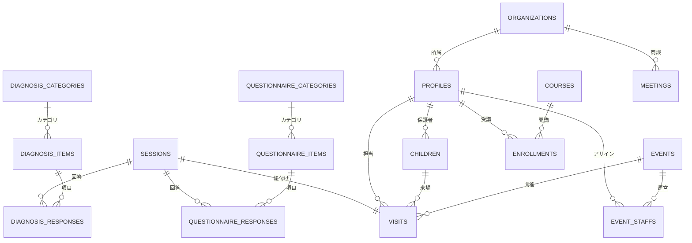

# データベース設計書 (cOralup Platform)

**最終更新: 2024-12-06**

## 1. 設計方針

本システムは単なる「診断アプリ」ではなく、将来的にcOralup社が展開する「歯科医院向けSaaS」「個人トレーナー向けサービス」「教育事業」「イベント事業」を統合管理するプラットフォームの基盤として設計する。

### コアコンセプト

1. **ユニバーサルID (Profiles)**: すべての「人（親、スタッフ、トレーナー、医院関係者）」を単一のテーブルで管理し、多面的な役割（ロール）を持たせる。
2. **CRM・カルテ分離**: 「連絡先（親）」と「診断対象（子）」を明確に分離し、1:Nの関係を構築する。
3. **マスタ管理**: 問診・診断項目はハードコードせず、DBでマスタ管理。正規化された回答データで集計・分析を容易に。
4. **イベントドリブン**: 全ての診断行為は「いつ、どこで（Event）」行われたかに紐づく。
5. **マルチテナント対応準備**: 将来の医院/トレーナー向けSaaS化を見据え、`organization_id`での分離を前提設計。

### アーキテクチャ概要

```
┌─────────────────────────────────────────────────────────────────────┐
│                         Supabase (統合DB)                           │
├─────────────────────────────────────────────────────────────────────┤
│                                                                     │
│  【A. マスタ管理】                                                   │
│  ┌─────────────────────────────────────────────────────────────┐   │
│  │ diagnosis_categories    - 診断カテゴリマスタ                  │   │
│  │ diagnosis_items         - 診断項目マスタ                      │   │
│  │ questionnaire_categories - 問診カテゴリマスタ                 │   │
│  │ questionnaire_items     - 問診項目マスタ                      │   │
│  └─────────────────────────────────────────────────────────────┘   │
│                                                                     │
│  【B. トランザクション】                                             │
│  ┌─────────────────────────────────────────────────────────────┐   │
│  │ sessions                - セッション管理                      │   │
│  │ diagnosis_responses     - 診断回答（正規化）                  │   │
│  │ questionnaire_responses - 問診回答（正規化）                  │   │
│  │ reports                 - レポート管理                        │   │
│  └─────────────────────────────────────────────────────────────┘   │
│                                                                     │
│  【C. CRM・自社管理】                                                │
│  ┌─────────────────────────────────────────────────────────────┐   │
│  │ organizations           - 組織マスタ                          │   │
│  │ profiles                - ユーザー台帳                        │   │
│  │ children                - 患者マスタ                          │   │
│  │ visits                  - 来場セッション                      │   │
│  │ events                  - イベント管理                        │   │
│  │ event_staffs            - イベントスタッフ                    │   │
│  │ courses                 - 講座マスタ                          │   │
│  │ enrollments             - 受講履歴                            │   │
│  │ meetings                - MTG/議事録                          │   │
│  └─────────────────────────────────────────────────────────────┘   │
│                                                                     │
│  【D. 設定・カスタマイズ】                                           │
│  ┌─────────────────────────────────────────────────────────────┐   │
│  │ event_form_settings           - イベント別フォーム設定        │   │
│  │ event_diagnosis_settings      - イベント別診断設定            │   │
│  │ organization_diagnosis_settings - 医院別診断設定              │   │
│  └─────────────────────────────────────────────────────────────┘   │
│                                                                     │
└─────────────────────────────────────────────────────────────────────┘
```

---

## 2. ER図概要 (概念モデル)



---

## 3. テーブル定義詳細

### A. マスタ管理テーブル

#### `diagnosis_categories` (診断カテゴリマスタ)

| カラム | 型 | 説明 |
|--------|-----|------|
| id | UUID (PK) | |
| name | VARCHAR(100) | カテゴリ名（舌、歯列・咬合等） |
| description | TEXT | 説明 |
| display_order | INTEGER | 表示順 |
| owner | VARCHAR(50) | 'system' or organization_id |
| is_active | BOOLEAN | 有効フラグ |

#### `diagnosis_items` (診断項目マスタ)

| カラム | 型 | 説明 |
|--------|-----|------|
| id | UUID (PK) | |
| category_id | UUID (FK) | カテゴリ |
| question | VARCHAR(500) | 質問文 |
| answer_type | VARCHAR(20) | radio/checkbox/text/number/textarea |
| options | JSONB | 選択肢 [{value, label}] |
| is_required | BOOLEAN | 必須フラグ |
| input_type | VARCHAR(10) | 'staff' or 'parent' |
| note | TEXT | 補足説明 |
| placeholder | VARCHAR(200) | |
| unit | VARCHAR(20) | 単位（kg等） |
| display_order | INTEGER | 表示順 |
| owner | VARCHAR(50) | 'system' or organization_id |
| is_active | BOOLEAN | 有効フラグ |

#### `questionnaire_categories` (問診カテゴリマスタ)

| カラム | 型 | 説明 |
|--------|-----|------|
| id | UUID (PK) | |
| name | VARCHAR(100) | カテゴリ名（基本情報、睡眠等） |
| description | TEXT | 説明 |
| target_age | VARCHAR(20) | 'preschool', 'elementary', 'all' |
| display_order | INTEGER | 表示順 |
| owner | VARCHAR(50) | 'system' or organization_id |
| is_active | BOOLEAN | 有効フラグ |

#### `questionnaire_items` (問診項目マスタ)

| カラム | 型 | 説明 |
|--------|-----|------|
| id | UUID (PK) | |
| category_id | UUID (FK) | カテゴリ |
| question | VARCHAR(500) | 質問文 |
| answer_type | VARCHAR(20) | radio/checkbox/text/number/textarea/select |
| options | JSONB | 選択肢 [{value, label}] |
| is_required | BOOLEAN | 必須フラグ |
| placeholder | VARCHAR(200) | |
| helper_text | VARCHAR(500) | 補助テキスト |
| validation | JSONB | {min, max, minLength, maxLength} |
| display_order | INTEGER | 表示順 |
| owner | VARCHAR(50) | 'system' or organization_id |
| is_active | BOOLEAN | 有効フラグ |

---

### B. トランザクションテーブル

#### `sessions` (セッション管理) ※既存

| カラム | 型 | 説明 |
|--------|-----|------|
| id | UUID (PK) | |
| session_id | VARCHAR(10) | 短縮ID（QRコード用） |
| line_user_id | VARCHAR(255) | LINE連携用 |
| parent_name | VARCHAR(100) | 親御さん名 |
| parent_phone | VARCHAR(20) | 電話番号 |
| status | VARCHAR(20) | active/completed |

#### `diagnosis_responses` (診断回答)

| カラム | 型 | 説明 |
|--------|-----|------|
| id | UUID (PK) | |
| session_id | VARCHAR(10) (FK) | セッション |
| item_id | UUID (FK) | 診断項目 |
| value | TEXT | 回答値 |
| metadata | JSONB | 追加情報 |
| answered_at | TIMESTAMP | 回答日時 |

#### `questionnaire_responses` (問診回答)

| カラム | 型 | 説明 |
|--------|-----|------|
| id | UUID (PK) | |
| session_id | VARCHAR(10) (FK) | セッション |
| item_id | UUID (FK) | 問診項目 |
| value | TEXT | 回答値 |
| metadata | JSONB | 追加情報 |
| answered_at | TIMESTAMP | 回答日時 |

#### `reports` (レポート管理) ※既存

| カラム | 型 | 説明 |
|--------|-----|------|
| id | UUID (PK) | |
| session_id | VARCHAR(10) (FK) | セッション |
| pdf_url | TEXT | PDF URL |
| line_sent_at | TIMESTAMP | LINE送信日時 |
| status | VARCHAR(20) | pending/sent |

---

### C. CRM・自社管理テーブル

#### `organizations` (組織マスタ)

| カラム | 型 | 説明 |
|--------|-----|------|
| id | UUID (PK) | |
| name | VARCHAR(200) | 組織名 |
| type | VARCHAR(20) | internal/clinic/trainer/partner |
| status | VARCHAR(20) | active/inactive/trial |
| address | TEXT | 住所 |
| phone | VARCHAR(20) | 電話番号 |
| email | VARCHAR(255) | メール |
| settings | JSONB | 組織固有設定 |

#### `profiles` (ユーザー台帳)

| カラム | 型 | 説明 |
|--------|-----|------|
| id | UUID (PK) | |
| organization_id | UUID (FK) | 所属組織 |
| line_user_id | VARCHAR(255) | LINE ID |
| email | VARCHAR(255) | メール |
| last_name | VARCHAR(50) | 姓 |
| first_name | VARCHAR(50) | 名 |
| last_name_kana | VARCHAR(50) | セイ |
| first_name_kana | VARCHAR(50) | メイ |
| display_name | VARCHAR(100) | 表示名 |
| avatar_url | TEXT | アイコン |
| phone_number | VARCHAR(20) | 電話番号 |
| role | VARCHAR(20) | admin/staff/parent/trainer |
| last_activity_at | TIMESTAMP | 最終活動日時 |

#### `children` (患者マスタ)

| カラム | 型 | 説明 |
|--------|-----|------|
| id | UUID (PK) | |
| parent_profile_id | UUID (FK) | 保護者 |
| first_name | VARCHAR(50) | 名 |
| last_name | VARCHAR(50) | 姓 |
| first_name_kana | VARCHAR(50) | メイ |
| last_name_kana | VARCHAR(50) | セイ |
| birthday | DATE | 生年月日 |
| gender | VARCHAR(10) | male/female/other |
| notes | TEXT | 特記事項 |

#### `visits` (来場セッション)

| カラム | 型 | 説明 |
|--------|-----|------|
| id | UUID (PK) | |
| organization_id | UUID (FK) | 組織 |
| event_id | UUID (FK) | イベント |
| child_id | UUID (FK) | 患者 |
| staff_profile_id | UUID (FK) | 担当スタッフ |
| session_id | VARCHAR(10) (FK) | セッション |
| visit_date | TIMESTAMP | 来場日時 |
| child_age_months | INTEGER | 診断時月齢 |
| status | VARCHAR(20) | waiting/in_progress/completed/report_sent |
| reception_number | VARCHAR(20) | 受付番号 |

#### `events` (イベント管理) ※既存拡張

| カラム | 型 | 説明 |
|--------|-----|------|
| id | UUID (PK) | |
| event_id | VARCHAR(50) | 短縮ID |
| name | VARCHAR(200) | イベント名 |
| description | TEXT | 説明 |
| start_date | TIMESTAMP | 開始日時 |
| end_date | TIMESTAMP | 終了日時 |
| venue | VARCHAR(200) | 会場 |
| status | VARCHAR(20) | draft/active/completed |

#### `event_staffs` (イベントスタッフ)

| カラム | 型 | 説明 |
|--------|-----|------|
| id | UUID (PK) | |
| event_id | UUID (FK) | イベント |
| profile_id | UUID (FK) | スタッフ |
| role | VARCHAR(50) | leader/diagnosis/reception |

#### `courses` (講座マスタ)

| カラム | 型 | 説明 |
|--------|-----|------|
| id | UUID (PK) | |
| title | VARCHAR(200) | 講座名 |
| description | TEXT | 説明 |
| batch_number | INTEGER | 期数 |
| start_date | DATE | 開始日 |
| end_date | DATE | 終了日 |
| status | VARCHAR(20) | draft/active/completed |

#### `enrollments` (受講履歴)

| カラム | 型 | 説明 |
|--------|-----|------|
| id | UUID (PK) | |
| course_id | UUID (FK) | 講座 |
| profile_id | UUID (FK) | 受講者 |
| status | VARCHAR(20) | enrolled/graduated/dropped |
| completion_date | DATE | 修了日 |
| certificate_url | TEXT | 修了証URL |

#### `meetings` (MTG/議事録)

| カラム | 型 | 説明 |
|--------|-----|------|
| id | UUID (PK) | |
| organization_id | UUID (FK) | 商談先 |
| title | VARCHAR(200) | タイトル |
| meeting_date | TIMESTAMP | 日時 |
| location | VARCHAR(200) | 場所 |
| content | TEXT | 内容 |
| summary | TEXT | サマリ |
| tags | VARCHAR[] | タグ |
| attendees | UUID[] | 参加者 |
| created_by | UUID (FK) | 作成者 |

---

### D. 設定・カスタマイズテーブル

#### `event_form_settings` (イベント別フォーム設定)

| カラム | 型 | 説明 |
|--------|-----|------|
| id | UUID (PK) | |
| event_id | UUID (FK) | イベント |
| item_id | UUID | 項目ID |
| item_type | VARCHAR(20) | 'diagnosis' or 'questionnaire' |
| is_enabled | BOOLEAN | 使用フラグ |
| display_order | INTEGER | 表示順上書き |

#### `event_diagnosis_settings` (イベント別診断設定)

| カラム | 型 | 説明 |
|--------|-----|------|
| id | UUID (PK) | |
| event_id | UUID (FK) | イベント |
| item_id | UUID (FK) | 診断項目 |
| is_enabled | BOOLEAN | 使用フラグ |
| display_order | INTEGER | 表示順上書き |

#### `organization_diagnosis_settings` (医院別診断設定)

| カラム | 型 | 説明 |
|--------|-----|------|
| id | UUID (PK) | |
| organization_id | UUID | 組織 |
| item_id | UUID (FK) | 診断項目 |
| is_enabled | BOOLEAN | 使用フラグ |
| display_order | INTEGER | 表示順上書き |

---

## 4. レガシーテーブル（互換用）

以下のテーブルは既存実装との互換性のために残置。新規実装では正規化テーブルを使用。

| テーブル | 用途 | 移行先 |
|---------|------|--------|
| `questionnaires` | 問診票（JSONB） | `questionnaire_responses` |
| `diagnoses` | 診断結果（JSONB） | `diagnosis_responses` |

---

## 5. 実装フェーズ

### Phase 1: YourTIME イベント（2024/12）

**必須実装:**
- `sessions` - 既存活用
- `events` - YourTIME登録
- `diagnosis_categories` + `diagnosis_items` - マスタ投入
- `questionnaire_categories` + `questionnaire_items` - マスタ投入
- `diagnosis_responses` - 正規化回答保存
- `questionnaire_responses` - 正規化回答保存
- `reports` - 既存活用

**箱のみ作成:**
- `organizations` - cOralup 1件登録
- `profiles` - 構造のみ
- `children` - 構造のみ
- `visits` - 構造のみ
- `courses` - 構造のみ
- `enrollments` - 構造のみ
- `meetings` - 構造のみ
- `event_staffs` - 構造のみ

### Phase 2: 自社CRM整備（2025 Q1）

- `profiles` へのデータ移行
- `visits` と `sessions` の紐付け
- Lark連携によるデータ可視化

### Phase 3: マルチテナント化（2025 Q2〜）

- `organizations` の本格運用
- RLS（Row Level Security）による分離
- 医院/トレーナー向け管理画面

---

## 6. 分析・集計用ビュー

```sql
-- イベント別診断項目一覧
event_diagnosis_items_view

-- 問診結果詳細
questionnaire_results_view

-- 診断結果詳細
diagnosis_results_view

-- イベント別問診項目一覧
event_questionnaire_items_view
```

---

## 7. 回答値（value）設計

### 7.1 設計方針

回答値は**短い英語キー**で保存し、表示時にラベル変換する。

**理由:**
- 集計時のグルーピングが容易
- 多言語対応が可能
- データサイズが小さい
- 後から変換・マッピングが可能

### 7.2 value設計例

#### 診断項目

| 項目 | value | 表示ラベル |
|------|-------|----------|
| 舌小帯短縮症 | `yes` | あり |
| 舌小帯短縮症 | `no` | なし |
| 舌小帯短縮症 | `suspected` | 疑い |
| 口呼吸・鼻呼吸 | `mouth` | 口呼吸 |
| 口呼吸・鼻呼吸 | `nose` | 鼻呼吸 |
| 口呼吸・鼻呼吸 | `both` | 両方 |

#### 問診項目

| 項目 | value | 表示ラベル |
|------|-------|----------|
| いびきをかく | `yes` | はい |
| いびきをかく | `no` | いいえ |
| 寝相 | `supine` | 仰向け |
| 寝相 | `prone` | うつ伏せ |
| 寝相 | `side` | 横向き |
| 食べる速さ | `fast` | 早い |
| 食べる速さ | `normal` | 普通 |
| 食べる速さ | `slow` | 遅い |

### 7.3 複数選択の保存形式

チェックボックス（複数選択）の場合、カンマ区切りで保存。

```
value: "snoring,prone,mouth_breathing"
```

**集計時:**
```sql
-- 「いびき」を含む回答を集計
SELECT COUNT(*) 
FROM questionnaire_responses 
WHERE value LIKE '%snoring%';
```

### 7.4 後からの変換

value値は後から変換可能。

```sql
-- 旧value → 新value への変換例
UPDATE diagnosis_responses
SET value = CASE 
  WHEN value = 'あり' THEN 'yes'
  WHEN value = 'なし' THEN 'no'
  ELSE value
END
WHERE item_id = 'uuid-舌小帯短縮症';
```

### 7.5 マスタテーブルでの定義

`options` JSONBカラムにvalue-label対応を保存。

```json
{
  "options": [
    {"value": "yes", "label": "あり"},
    {"value": "no", "label": "なし"},
    {"value": "suspected", "label": "疑い"}
  ]
}
```

---

## 8. 分析・集計用ビュー

### 8.1 診断結果横持ちビュー

```sql
-- 診断結果を横持ちで取得（Lark連携・分析用）
CREATE VIEW diagnosis_results_horizontal_view AS
SELECT 
  s.session_id,
  s.parent_name,
  s.created_at as visit_date,
  MAX(CASE WHEN di.question = '舌小帯短縮症' THEN dr.value END) as tongue_tie,
  MAX(CASE WHEN di.question = '低位舌' THEN dr.value END) as low_tongue,
  MAX(CASE WHEN di.question = '口呼吸・鼻呼吸' THEN dr.value END) as breathing_type,
  MAX(CASE WHEN di.question = '過蓋合' THEN dr.value END) as deep_bite,
  MAX(CASE WHEN di.question = '反対咬合' THEN dr.value END) as underbite,
  MAX(CASE WHEN di.question = '開咬' THEN dr.value END) as open_bite,
  MAX(CASE WHEN di.question = '叢生' THEN dr.value END) as crowding
FROM sessions s
LEFT JOIN diagnosis_responses dr ON s.session_id = dr.session_id
LEFT JOIN diagnosis_items di ON dr.item_id = di.id
GROUP BY s.session_id, s.parent_name, s.created_at;
```

### 8.2 問診結果横持ちビュー

```sql
-- 問診結果を横持ちで取得
CREATE VIEW questionnaire_results_horizontal_view AS
SELECT 
  s.session_id,
  s.parent_name,
  MAX(CASE WHEN qi.question LIKE '%いびき%' THEN qr.value END) as snoring,
  MAX(CASE WHEN qi.question LIKE '%口ぽかん%' THEN qr.value END) as mouth_open,
  MAX(CASE WHEN qi.question LIKE '%寝相%' THEN qr.value END) as sleep_position,
  MAX(CASE WHEN qi.question LIKE '%好き嫌い%' THEN qr.value END) as picky_eating,
  MAX(CASE WHEN qi.question LIKE '%食べる速さ%' THEN qr.value END) as eating_speed
FROM sessions s
LEFT JOIN questionnaire_responses qr ON s.session_id = qr.session_id
LEFT JOIN questionnaire_items qi ON qr.item_id = qi.id
GROUP BY s.session_id, s.parent_name;
```

### 8.3 イベント別集計ビュー

```sql
-- イベント別診断項目集計
CREATE VIEW event_diagnosis_stats_view AS
SELECT 
  e.name as event_name,
  di.question as item_name,
  dr.value,
  COUNT(*) as count,
  ROUND(COUNT(*) * 100.0 / SUM(COUNT(*)) OVER (PARTITION BY e.id, di.id), 1) as percentage
FROM events e
JOIN visits v ON e.id = v.event_id
JOIN diagnosis_responses dr ON v.session_id = dr.session_id
JOIN diagnosis_items di ON dr.item_id = di.id
GROUP BY e.id, e.name, di.id, di.question, dr.value
ORDER BY e.name, di.display_order, count DESC;
```

---

## 9. マイグレーションファイル

| ファイル | 内容 |
|---------|------|
| `20241201000000_init_schema.sql` | 初期スキーマ（sessions, questionnaires, diagnoses等） |
| `20241205000000_diagnosis_master_tables.sql` | 診断マスタ・回答テーブル |
| `20241206000000_questionnaire_master_tables.sql` | 問診マスタ・回答テーブル |
| `20241206000001_crm_tables.sql` | CRM・自社管理テーブル |
| `20241206000002_analysis_views.sql` | 分析用ビュー |
