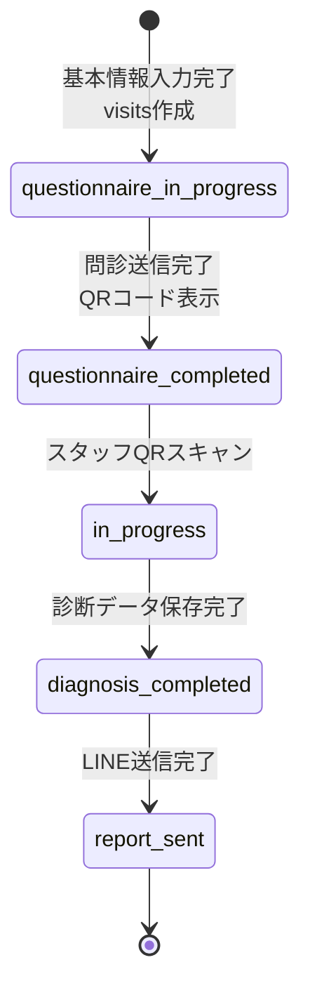
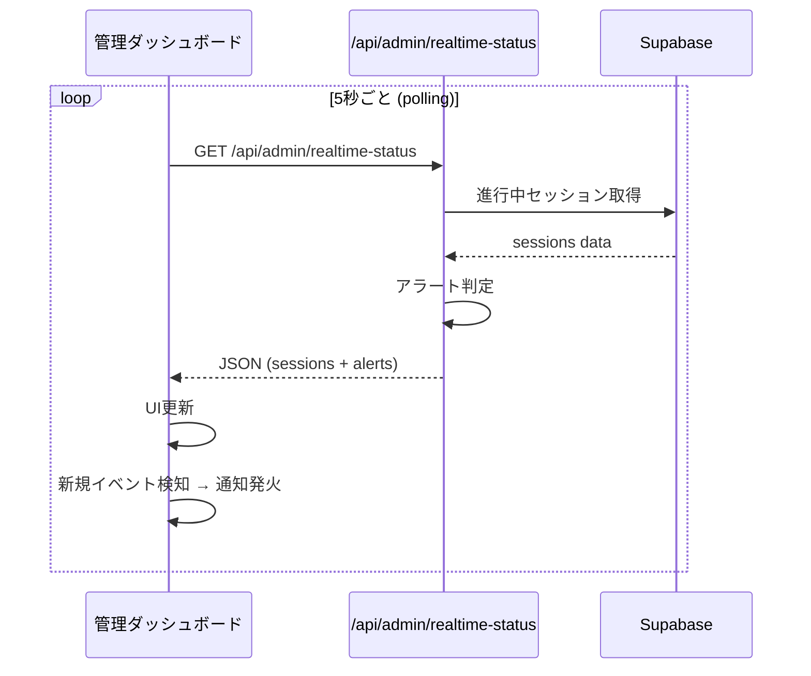
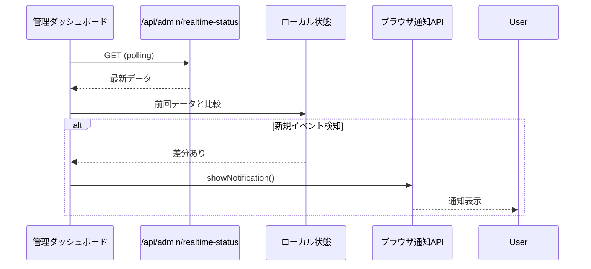

# 管理ダッシュボード設計書

**最終更新: 2024-12-19**

---

## 1. 概要

### 1.1 目的

イベント当日の診断進行状況をリアルタイムで監視し、運営スタッフが効率的に状況把握・対応できる管理ダッシュボードを提供する。

### 1.2 主要機能

| 機能 | 説明 | 実装状況 |
|------|------|----------|
| リアルタイム監視 | 全診断セッションの進行状況を可視化 | ✅ 実装済み |
| 履歴管理 | 完了済みセッションの確認・検索・LINE送信 | ✅ 実装済み |
| AI分析設定 | AI分析のプロンプト設定・テスト実行 | ✅ 実装済み |
| テストデータ | 開発用ダミーデータ生成 | ✅ 実装済み |
| スキーマ編集 | 問診票・診断スキーマの編集 | ✅ 実装済み |
| ブラウザ通知 | 重要イベント発生時にPush通知 | 🔄 設計済み |
| アラート表示 | 対応が必要なセッションをハイライト | 🔄 設計済み |

### 1.3 対象ユーザー

| ユーザー | 用途 |
|---------|------|
| イベント運営スタッフ | 現場でのリアルタイム監視 |
| 管理者 | 全体進捗把握、履歴確認、LINE送信 |
| システム管理者 | スキーマ編集、AI設定、テストデータ生成 |

---

## 2. 画面構成

### 2.1 ナビゲーション構成

#### グローバルナビ（最上部・スレートグレー背景）
```
┌─────────────────────────────────────────────────────────────────┐
│ [c] cOralup          スタッフ診断 │ 親御さん問診 │ 管理者用    │
└─────────────────────────────────────────────────────────────────┘
```

#### 管理画面タブナビ（2段目・白背景）
```
┌─────────────┬─────────────┬─────────────┬─────────────┬─────────────┐
│ 🔴 リアル   │ 📋 履歴    │ 🤖 AI設定  │ 🔧 テスト   │ 💾 スキーマ │
│    タイム   │    管理    │            │    データ   │    編集    │
└─────────────┴─────────────┴─────────────┴─────────────┴─────────────┘
```

| タブ | パス | 説明 | アイコン |
|------|------|------|----------|
| リアルタイム | `/admin` | 進行中セッション監視 | Activity |
| 履歴管理 | `/admin/visits` | 完了済みセッション一覧・LINE送信 | History |
| AI設定 | `/admin/ai-test` | AI分析のプロンプト設定・テスト | Bot |
| テストデータ | `/admin/dev-tools` | 開発用ダミーデータ生成 | Wrench |
| スキーマ編集 | `/admin/schema-editor` | 問診・診断項目編集 | Database |

### 2.2 URL設計

| 画面 | URL | 備考 |
|------|-----|------|
| ダッシュボードTOP | `/admin` | リアルタイム監視画面 |
| 履歴管理 | `/admin/visits` | 全セッション履歴・LINE送信機能 |
| AI設定 | `/admin/ai-test` | AI分析テスト・プロンプト設定 |
| テストデータ | `/admin/dev-tools` | サンプルデータ生成 |
| スキーマ編集 | `/admin/schema-editor` | 問診票・診断スキーマ編集 |

---

## 3. リアルタイム監視画面

### 3.1 レイアウト（PC）

```
┌─────────────────────────────────────────────────────────────────┐
│ 🔴 リアルタイム診断モニター            🔔 通知ON  自動更新: 5秒  │
├─────────────────────────────────────────────────────────────────┤
│                                                                 │
│ ┌─────────────────────────────────────────────────────────────┐ │
│ │ 📊 本日のサマリー                                            │ │
│ │  LINE: 25  問診完了: 22  診断中: 4  診断完了: 18  送信済: 15  │ │
│ └─────────────────────────────────────────────────────────────┘ │
│                                                                 │
│ ┌─────────────────────────────────────────────────────────────┐ │
│ │ 🚨 アラート (2件)                               [すべて確認] │ │
│ │ ⚠️ 高橋一郎(3歳) QR待ち25分 │ ⚠️ 伊藤四郎(6歳) 診断32分      │ │
│ └─────────────────────────────────────────────────────────────┘ │
│                                                                 │
│ ┌─────────────────────────────────────────────────────────────┐ │
│ │ 🔄 進行中 (7件)                                              │ │
│ ├─────────────────────────────────────────────────────────────┤ │
│ │ 田中太郎 (8歳)   [●─●─◉─○─○─○] 診断中  山田   12分  📸3/3   │ │
│ │ 佐藤花子 (5歳)   [◉─○─○─○─○─○] 問診中          16分          │ │
│ │ 高橋一郎 (3歳)   [●─◉─○─○─○─○] QR待ち  ⚠️25分               │ │
│ │ ...                                                          │ │
│ └─────────────────────────────────────────────────────────────┘ │
│                                                                 │
│ ┌─────────────────────────────────────────────────────────────┐ │
│ │ ✅ 本日完了 (直近10件)                           [全件表示→] │ │
│ ├─────────────────────────────────────────────────────────────┤ │
│ │ 山本次郎 (7歳)  [●─●─●─●─●─●] 送信済  佐藤  14:15完了        │ │
│ │ 渡辺三郎 (6歳)  [●─●─●─●─●─●] 送信済  山田  14:02完了        │ │
│ └─────────────────────────────────────────────────────────────┘ │
│                                                                 │
└─────────────────────────────────────────────────────────────────┘
```

### 3.2 レイアウト（スマホ）

```
┌───────────────────────────────────┐
│ 🔴 リアルタイム        🔔 5秒更新 │
├───────────────────────────────────┤
│ 📊 25→22→4→18→15                 │
├───────────────────────────────────┤
│ 🚨 アラート (2)           [確認] │
├───────────────────────────────────┤
│ 🔄 進行中 (7)                     │
├───────────────────────────────────┤
│ 田中 太郎 (8歳)           12分   │
│ ●─●─◉─○─○─○                      │
│ 診断中 │ 山田 │ 📸3/3            │
├───────────────────────────────────┤
│ 高橋 一郎 (3歳)      ⚠️ 25分     │
│ ●─◉─○─○─○─○                      │
│ QR待ち │ 要対応                   │
├───────────────────────────────────┤
│ ...                               │
├───────────────────────────────────┤
│ ✅ 本日完了 (15)         [全件→] │
└───────────────────────────────────┘
```

### 3.3 ワークフローインジケーター

#### 記号の意味

| 記号 | 意味 | 色 |
|------|------|-----|
| `○` | 未達ステップ | グレー `#9ca3af` |
| `●` | 完了ステップ | グリーン `#10b981` |
| `◉` | 現在進行中 | エメラルド `#34d399`（パルスアニメーション） |
| `─` | ステップ間接続 | グレー `#6b7280` |

#### ステップ定義

**注意**: ワークフローインジケーターは `visits` レコードが存在するセッションのみを表示対象とする。
LINE友だち登録のみで問診未開始の状態は、別途「LINE登録済み（問診待ち）」として表示。

```
[◉─○─○─○─○─○]  ← 問診中
[●─◉─○─○─○─○]  ← QR待ち（問診完了）
[●─●─◉─○─○─○]  ← 診断中
[●─●─●─◉─○─○]  ← 診断完了
[●─●─●─●─◉─○]  ← レポート作成
[●─●─●─●─●─●]  ← 送信済み
```

| ステップ | ラベル | ステータス/条件 | 通知イベント |
|---------|--------|----------------|-------------|
| ① | 問診中 | `questionnaire_in_progress` | ー |
| ② | QR待ち | `questionnaire_completed` | 📝 問診完了 |
| ③ | 診断中 | `in_progress` | 🏥 診断開始 |
| ④ | 診断完了 | `diagnosis_completed` | ✅ 診断完了 |
| ⑤ | レポート | `reports` テーブルにレコード存在 | 📊 レポート作成 |
| ⑥ | 送信済 | `report_sent` | ✅ LINE送信完了 |

### 3.4 ステータス定義

#### visits.status の遷移



#### ステータス一覧

| ステータス | 表示名 | 色 | 説明 | インジケーター位置 |
|-----------|--------|-----|------|------------------|
| `questionnaire_in_progress` | 問診中 | 🔵 ブルー | 親御さんが問診入力中 | ① |
| `questionnaire_completed` | QR待ち | 🟠 オレンジ | 問診完了、QR表示中（スタッフスキャン待ち） | ② |
| `in_progress` | 診断中 | 🟠 オレンジ | スタッフが診断実施中 | ③ |
| `diagnosis_completed` | 診断完了 | 🟢 グリーン | 診断完了、レポート未送信 | ④ |
| ー | レポート作成 | 🟢 グリーン | reportsテーブルにレコード存在 | ⑤ |
| `report_sent` | 送信済 | ✅ パープル | レポートLINE送信完了 | ⑥ |

#### LINE登録のみ（visits未作成）の扱い

LINE友だち登録済みだが問診未開始の状態は、`profiles` テーブルにのみ存在し `visits` レコードがない。
この状態は「進行中セッション」ではなく、サマリーの「LINE登録数」としてカウントする。

---

## 4. ブラウザ通知設計

### 4.1 通知イベント一覧

| イベント | トリガー | 通知タイトル | 通知本文 |
|---------|---------|-------------|---------|
| LINE友だち登録 | LINE Webhook (follow) | 🆕 新規LINE登録 | {display_name}さんが友だち登録しました |
| 問診完了 | visits.status → questionnaire_completed | 📝 問診完了 | {child_name}({age}歳)の問診が完了しました |
| 診断開始 | visits.status → in_progress | 🏥 診断開始 | {child_name}({age}歳)の診断を{staff_name}が開始しました |
| レポート作成 | reports INSERT | 📊 レポート作成 | {child_name}のレポートが作成されました |
| LINE送信 | visits.status → report_sent | ✅ LINE送信完了 | {child_name}へのレポートをLINE送信しました |
| 診断完了 | visits.status → diagnosis_completed | ✅ 診断完了 | {child_name}({age}歳)の診断が完了しました |

### 4.2 通知設定UI

```
┌─────────────────────────────────────────────────────────────────┐
│ 🔔 通知設定                                                     │
├─────────────────────────────────────────────────────────────────┤
│                                                                 │
│ ブラウザ通知: [有効にする]                                       │
│                                                                 │
│ 通知を受け取るイベント:                                          │
│ ☑️ LINE友だち登録                                                │
│ ☑️ 問診完了                                                      │
│ ☑️ 診断開始（スタッフQR読み込み）                                 │
│ ☑️ レポート作成                                                  │
│ ☑️ LINE送信完了                                                  │
│ ☑️ 診断完了                                                      │
│                                                                 │
│ アラート通知:                                                    │
│ ☑️ QR待ち20分超過                                                │
│ ☑️ 診断中30分超過                                                │
│                                                                 │
│                                           [設定を保存]           │
└─────────────────────────────────────────────────────────────────┘
```

### 4.3 通知の見た目

```
┌─────────────────────────────────────┐
│ 🏥 cOralup - 診断開始               │
├─────────────────────────────────────┤
│                                     │
│ 田中太郎(8歳)の診断を               │
│ 山田スタッフが開始しました          │
│                                     │
│ 10:15                    [確認する] │
└─────────────────────────────────────┘
```

---

## 5. アラート設計

### 5.1 アラート条件

| 条件 | レベル | 閾値 | 表示 |
|------|--------|------|------|
| QR待ち時間超過 | warning | 15分 | 黄色ハイライト |
| QR待ち時間超過 | critical | 25分 | 赤色ハイライト + 通知 |
| 診断時間超過 | warning | 25分 | 黄色ハイライト |
| 診断時間超過 | critical | 35分 | 赤色ハイライト + 通知 |

### 5.2 アラート表示

```
┌─────────────────────────────────────────────────────────────────┐
│ 🚨 アラート (2件)                                    [確認済み] │
├─────────────────────────────────────────────────────────────────┤
│ ┌─────────────────────────────────────────────────────────────┐ │
│ │ ⚠️ 高橋一郎 (3歳)                                           │ │
│ │ QR待ち 25分経過 - スタッフの対応をお願いします               │ │
│ │ 問診完了: 09:50  現在: 10:15                        [対応→] │ │
│ └─────────────────────────────────────────────────────────────┘ │
│ ┌─────────────────────────────────────────────────────────────┐ │
│ │ ⚠️ 伊藤四郎 (6歳)                                           │ │
│ │ 診断中 32分経過 - 進捗を確認してください                     │ │
│ │ 診断開始: 09:43  担当: 佐藤                         [詳細→] │ │
│ └─────────────────────────────────────────────────────────────┘ │
└─────────────────────────────────────────────────────────────────┘
```

---

## 6. データフロー設計

### 6.1 リアルタイム更新フロー



### 6.2 通知発火フロー



### 6.3 イベント検知ロジック

```typescript
interface SessionEvent {
  type: 'line_registered' | 'questionnaire_completed' | 'diagnosis_started' 
      | 'report_created' | 'line_sent' | 'diagnosis_completed';
  sessionId: string;
  childName: string;
  childAge: number;
  staffName?: string;
  timestamp: string;
}

function detectEvents(
  prevSessions: Session[], 
  currentSessions: Session[]
): SessionEvent[] {
  const events: SessionEvent[] = [];
  
  for (const current of currentSessions) {
    const prev = prevSessions.find(s => s.id === current.id);
    
    // 新規セッション（LINE登録）
    if (!prev) {
      events.push({
        type: 'line_registered',
        sessionId: current.id,
        childName: current.childName,
        childAge: current.childAge,
        timestamp: current.createdAt,
      });
      continue;
    }
    
    // ステータス変更検知
    if (prev.status !== current.status) {
      const eventType = getEventTypeFromStatus(current.status);
      if (eventType) {
        events.push({
          type: eventType,
          sessionId: current.id,
          childName: current.childName,
          childAge: current.childAge,
          staffName: current.staffName,
          timestamp: current.updatedAt,
        });
      }
    }
  }
  
  return events;
}

function getEventTypeFromStatus(status: string): SessionEvent['type'] | null {
  switch (status) {
    case 'questionnaire_completed': return 'questionnaire_completed';
    case 'in_progress': return 'diagnosis_started';
    case 'diagnosis_completed': return 'diagnosis_completed';
    case 'report_sent': return 'line_sent';
    default: return null;
  }
}
```

---

## 7. API設計

### 7.1 リアルタイムステータスAPI

#### エンドポイント

```
GET /api/admin/realtime-status
```

#### リクエストヘッダー

```
Authorization: Bearer {ADMIN_API_KEY}
```

#### レスポンス

```typescript
interface RealtimeStatusResponse {
  timestamp: string;  // ISO8601
  
  summary: {
    lineRegistered: number;      // LINE登録数（本日）
    questionnaireCompleted: number; // 問診完了数
    inProgress: number;          // 診断中数
    diagnosisCompleted: number;  // 診断完了数
    reportSent: number;          // 送信済み数
  };
  
  activeSessions: ActiveSession[];
  recentCompleted: CompletedSession[];
  alerts: Alert[];
}

interface ActiveSession {
  id: string;                    // visit_id (UUID)
  sessionId: string;             // session_id (短縮ID)
  status: VisitStatus;
  childName: string;
  childAge: number;
  staffName: string | null;
  createdAt: string;             // セッション作成日時
  updatedAt: string;             // 最終更新日時
  currentStatusSince: string;    // 現在ステータスになった時刻
  elapsedMinutes: number;        // 現在ステータスからの経過時間
  progress?: {
    photos: { current: number; total: number };
    diagnosisItems: { current: number; total: number };
  };
}

interface CompletedSession {
  id: string;
  sessionId: string;
  childName: string;
  childAge: number;
  staffName: string;
  completedAt: string;
  reportSentAt: string | null;
}

interface Alert {
  id: string;
  sessionId: string;
  childName: string;
  childAge: number;
  type: 'warning' | 'critical';
  condition: 'qr_waiting_long' | 'diagnosis_long';
  elapsedMinutes: number;
  message: string;
}
```

### 7.2 通知設定API

#### 取得

```
GET /api/admin/notification-settings
```

#### 更新

```
PUT /api/admin/notification-settings
Content-Type: application/json

{
  "events": {
    "lineRegistered": true,
    "questionnaireCompleted": true,
    "diagnosisStarted": true,
    "reportCreated": true,
    "lineSent": true,
    "diagnosisCompleted": true
  },
  "alerts": {
    "qrWaitingLong": true,
    "diagnosisLong": true
  }
}
```

---

## 8. コンポーネント設計

### 8.1 ディレクトリ構成（実装済み）

```
src/app/admin/
├── page.tsx                          # リアルタイムモニター画面
├── layout.tsx                        # 共通レイアウト
├── layout-client.tsx                 # クライアントレイアウト（ナビゲーション）
├── visits/                           # 履歴管理
│   └── page.tsx                      # 来訪履歴一覧・LINE送信
├── ai-test/                          # AI設定
│   └── page.tsx                      # AI分析テスト・プロンプト設定
├── dev-tools/                        # テストデータ
│   └── page.tsx                      # サンプルデータ生成
├── schema-editor/                    # スキーマ編集
│   └── page.tsx                      # 問診票・診断スキーマエディタ
├── components/
│   ├── RealtimeMonitor/
│   │   ├── index.tsx                 # リアルタイム監視パネル
│   │   ├── SampleDataPanel.tsx       # サンプルデータ表示
│   │   └── ...
│   └── VisitsHistory/
│       └── index.tsx                 # 履歴管理パネル
└── hooks/
    └── useRealtimeStatus.ts          # リアルタイムデータ取得

### 8.2 主要コンポーネント

#### WorkflowIndicator

```tsx
interface WorkflowIndicatorProps {
  status: VisitStatus;
  hasReport?: boolean;  // reportsテーブルにレコードが存在するか
  size?: 'sm' | 'md' | 'lg';
}

function WorkflowIndicator({ status, hasReport = false, size = 'md' }: WorkflowIndicatorProps) {
  // 6ステップ: 問診中 → QR待ち → 診断中 → 診断完了 → レポート作成 → 送信済み
  const steps = [
    { key: 'questionnaire_in_progress', label: '問診' },
    { key: 'questionnaire_completed', label: 'QR' },
    { key: 'in_progress', label: '診断' },
    { key: 'diagnosis_completed', label: '完了' },
    { key: 'report_created', label: 'レポート' },  // reportsテーブルの存在で判定
    { key: 'report_sent', label: '送信' },
  ];
  
  // ステータスに基づいて現在位置を計算
  // report_created は実際のステータスではなく、hasReport フラグで判定
  const getStepState = (stepKey: string, index: number): 'completed' | 'current' | 'pending' => {
    const statusOrder = ['questionnaire_in_progress', 'questionnaire_completed', 'in_progress', 'diagnosis_completed', 'report_sent'];
    const currentStatusIndex = statusOrder.indexOf(status);
    
    // report_created ステップの特別処理
    if (stepKey === 'report_created') {
      if (status === 'report_sent') return 'completed';
      if (status === 'diagnosis_completed' && hasReport) return 'current';
      if (currentStatusIndex >= statusOrder.indexOf('diagnosis_completed') && hasReport) return 'completed';
      return 'pending';
    }
    
    // report_sent ステップ
    if (stepKey === 'report_sent') {
      if (status === 'report_sent') return 'current';
      return 'pending';
    }
    
    // 通常のステータスに対応するステップ
    const stepStatusIndex = statusOrder.indexOf(stepKey);
    if (stepStatusIndex < currentStatusIndex) return 'completed';
    if (stepStatusIndex === currentStatusIndex) return 'current';
    return 'pending';
  };
  
  return (
    <div className="flex items-center gap-0.5">
      {steps.map((step, index) => {
        const state = getStepState(step.key, index);
        return (
          <React.Fragment key={step.key}>
            <span className={cn(
              'text-sm',
              state === 'completed' && 'text-emerald-500',
              state === 'current' && 'text-emerald-400 animate-pulse font-bold',
              state === 'pending' && 'text-slate-500',
            )}>
              {state === 'completed' ? '●' : state === 'current' ? '◉' : '○'}
            </span>
            {index < steps.length - 1 && (
              <span className="text-slate-600">─</span>
            )}
          </React.Fragment>
        );
      })}
    </div>
  );
}
```

#### ActiveSessionCard

```tsx
interface ActiveSessionCardProps {
  session: ActiveSession;
  hasAlert?: boolean;
}

function ActiveSessionCard({ session, hasAlert }: ActiveSessionCardProps) {
  return (
    <div className={cn(
      'p-3 border-b border-slate-700',
      hasAlert && 'bg-amber-500/10'
    )}>
      {/* PC版 */}
      <div className="hidden md:flex items-center justify-between">
        <div className="flex items-center gap-4">
          <span className="font-medium text-white">
            {session.childName} ({session.childAge}歳)
          </span>
          <WorkflowIndicator status={session.status} />
          <span className="text-slate-400">{getStatusLabel(session.status)}</span>
          {session.staffName && (
            <span className="text-slate-500">{session.staffName}</span>
          )}
        </div>
        <div className="flex items-center gap-3">
          {hasAlert && <span className="text-amber-500">⚠️</span>}
          <span className="text-slate-400">{session.elapsedMinutes}分</span>
          {session.progress && (
            <span className="text-slate-500 text-sm">
              📸{session.progress.photos.current}/{session.progress.photos.total}
            </span>
          )}
        </div>
      </div>
      
      {/* スマホ版 */}
      <div className="md:hidden space-y-1">
        <div className="flex justify-between">
          <span className="font-medium text-white">
            {session.childName} ({session.childAge}歳)
          </span>
          <span className="text-slate-400">
            {hasAlert && '⚠️'} {session.elapsedMinutes}分
          </span>
        </div>
        <WorkflowIndicator status={session.status} size="sm" />
        <div className="flex gap-2 text-sm text-slate-400">
          <span>{getStatusLabel(session.status)}</span>
          {session.staffName && <span>│ {session.staffName}</span>}
          {session.progress && (
            <span>│ 📸{session.progress.photos.current}/{session.progress.photos.total}</span>
          )}
        </div>
      </div>
    </div>
  );
}
```

---

## 9. ブラウザ通知実装

### 9.1 通知権限フック

```typescript
// hooks/useBrowserNotification.ts
import { useState, useEffect, useCallback } from 'react';

interface NotificationOptions {
  title: string;
  body: string;
  icon?: string;
  tag?: string;
  data?: Record<string, unknown>;
}

export function useBrowserNotification() {
  const [permission, setPermission] = useState<NotificationPermission>('default');
  const [isSupported, setIsSupported] = useState(false);

  useEffect(() => {
    setIsSupported('Notification' in window);
    if ('Notification' in window) {
      setPermission(Notification.permission);
    }
  }, []);

  const requestPermission = useCallback(async () => {
    if (!isSupported) return 'denied';
    
    const result = await Notification.requestPermission();
    setPermission(result);
    return result;
  }, [isSupported]);

  const showNotification = useCallback(({ title, body, icon, tag, data }: NotificationOptions) => {
    if (permission !== 'granted') return null;
    
    const notification = new Notification(title, {
      body,
      icon: icon || '/icon-192.png',
      badge: '/badge.png',
      tag,
      data,
    });

    notification.onclick = () => {
      window.focus();
      notification.close();
    };

    return notification;
  }, [permission]);

  return {
    isSupported,
    permission,
    requestPermission,
    showNotification,
  };
}
```

### 9.2 イベント検知フック

```typescript
// hooks/useEventDetection.ts
import { useRef, useEffect, useCallback } from 'react';
import { ActiveSession, SessionEvent } from '@/types/admin';
import { useBrowserNotification } from './useBrowserNotification';
import { useNotificationSettings } from './useNotificationSettings';

export function useEventDetection(sessions: ActiveSession[]) {
  const prevSessionsRef = useRef<ActiveSession[]>([]);
  const { showNotification, permission } = useBrowserNotification();
  const { settings } = useNotificationSettings();

  const detectAndNotify = useCallback(() => {
    const prevSessions = prevSessionsRef.current;
    const events = detectEvents(prevSessions, sessions);
    
    for (const event of events) {
      if (shouldNotify(event, settings)) {
        showNotification(getNotificationContent(event));
      }
    }
    
    prevSessionsRef.current = sessions;
  }, [sessions, settings, showNotification]);

  useEffect(() => {
    if (permission === 'granted') {
      detectAndNotify();
    }
  }, [sessions, permission, detectAndNotify]);
}

function getNotificationContent(event: SessionEvent): NotificationOptions {
  const templates: Record<SessionEvent['type'], { title: string; body: string }> = {
    line_registered: {
      title: '🆕 新規LINE登録',
      body: `${event.childName}さんが友だち登録しました`,
    },
    questionnaire_completed: {
      title: '📝 問診完了',
      body: `${event.childName}(${event.childAge}歳)の問診が完了しました`,
    },
    diagnosis_started: {
      title: '🏥 診断開始',
      body: `${event.childName}(${event.childAge}歳)の診断を${event.staffName}が開始しました`,
    },
    report_created: {
      title: '📊 レポート作成',
      body: `${event.childName}のレポートが作成されました`,
    },
    line_sent: {
      title: '✅ LINE送信完了',
      body: `${event.childName}へのレポートをLINE送信しました`,
    },
    diagnosis_completed: {
      title: '✅ 診断完了',
      body: `${event.childName}(${event.childAge}歳)の診断が完了しました`,
    },
  };
  
  return {
    ...templates[event.type],
    tag: `session-${event.sessionId}`,
    data: { sessionId: event.sessionId },
  };
}

function shouldNotify(event: SessionEvent, settings: NotificationSettings): boolean {
  const eventSettingMap: Record<SessionEvent['type'], keyof NotificationSettings['events']> = {
    line_registered: 'lineRegistered',
    questionnaire_completed: 'questionnaireCompleted',
    diagnosis_started: 'diagnosisStarted',
    report_created: 'reportCreated',
    line_sent: 'lineSent',
    diagnosis_completed: 'diagnosisCompleted',
  };
  
  return settings.events[eventSettingMap[event.type]] ?? true;
}
```

### 9.3 通知設定のローカル保存

```typescript
// hooks/useNotificationSettings.ts
import { useState, useEffect, useCallback } from 'react';

const STORAGE_KEY = 'coralup_notification_settings';

export interface NotificationSettings {
  events: {
    lineRegistered: boolean;
    questionnaireCompleted: boolean;
    diagnosisStarted: boolean;
    reportCreated: boolean;
    lineSent: boolean;
    diagnosisCompleted: boolean;
  };
  alerts: {
    qrWaitingLong: boolean;
    diagnosisLong: boolean;
  };
}

const DEFAULT_SETTINGS: NotificationSettings = {
  events: {
    lineRegistered: true,
    questionnaireCompleted: true,
    diagnosisStarted: true,
    reportCreated: true,
    lineSent: true,
    diagnosisCompleted: true,
  },
  alerts: {
    qrWaitingLong: true,
    diagnosisLong: true,
  },
};

export function useNotificationSettings() {
  const [settings, setSettings] = useState<NotificationSettings>(DEFAULT_SETTINGS);
  const [isLoaded, setIsLoaded] = useState(false);

  useEffect(() => {
    const stored = localStorage.getItem(STORAGE_KEY);
    if (stored) {
      try {
        setSettings(JSON.parse(stored));
      } catch (e) {
        console.error('Failed to parse notification settings:', e);
      }
    }
    setIsLoaded(true);
  }, []);

  const updateSettings = useCallback((newSettings: NotificationSettings) => {
    setSettings(newSettings);
    localStorage.setItem(STORAGE_KEY, JSON.stringify(newSettings));
  }, []);

  return { settings, updateSettings, isLoaded };
}
```

---

## 10. 実装ロードマップ

### Phase 1: 基盤構築 ✅ 完了

- [x] タブUIコンポーネント作成（layout-client.tsx）
- [x] グローバルナビゲーション実装
- [x] 基本的なリアルタイムモニター表示
- [x] サンプルデータ表示機能

### Phase 2: UI実装 ✅ 完了

- [x] `RealtimeMonitor` コンポーネント
- [x] 履歴管理画面（VisitsHistory）
- [x] AI分析設定画面
- [x] テストデータ生成画面
- [x] スキーマ編集画面
- [x] レスポンシブ対応（PC/スマホ）

### Phase 3: 通知システム 🔄 設計済み

- [ ] `useBrowserNotification` フック
- [ ] `useEventDetection` フック
- [ ] `useNotificationSettings` フック
- [ ] 通知設定UI

### Phase 4: 統合・テスト 🔄 進行中

- [x] 履歴管理・LINE送信統合
- [ ] リアルタイムデータ同期（Supabase Realtime）
- [ ] 動作テスト
- [ ] UI/UX微調整

---

## 11. 技術スタック

| 項目 | 技術 |
|------|------|
| フレームワーク | Next.js 14 (App Router) |
| 状態管理 | SWR (polling) |
| スタイリング | Tailwind CSS |
| 通知 | Web Notifications API |
| データ永続化 | localStorage (設定) |

---

## 12. 将来の拡張

| 機能 | 説明 | 優先度 |
|------|------|--------|
| Service Worker通知 | オフライン対応、PWA化 | 中 |
| LINE通知（管理者向け） | スマホへの直接通知 | 中 |
| Supabase Realtime | WebSocketによるリアルタイム更新 | 低 |
| カンバンビュー切り替え | B3レイアウトの追加 | 低 |
