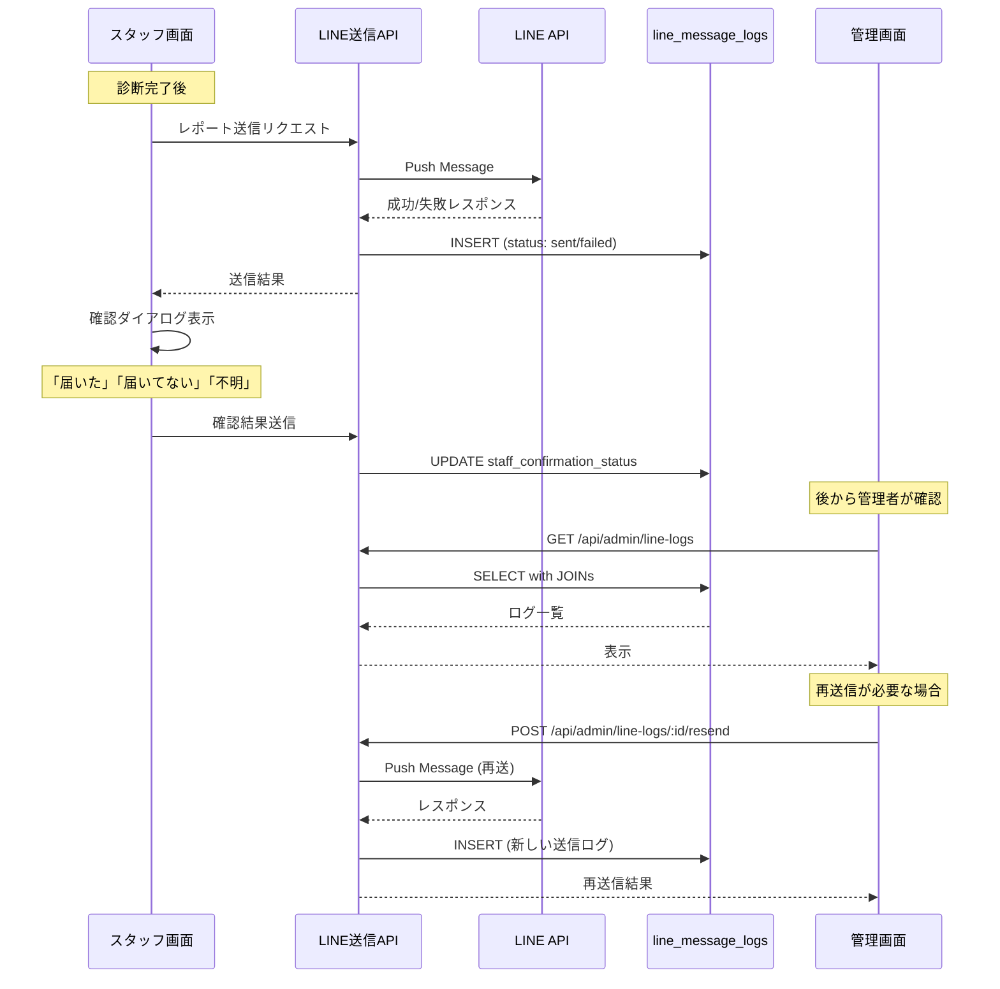

# LINE送信管理機能設計書

**最終更新: 2024-12-16**

---

## 1. 概要

### 1.1 目的

LINE送信の成功/失敗をシステム結果とスタッフ確認結果の両面から把握し、
届いていない親御さんへの再送信を可能にする管理機能を提供する。

### 1.2 背景

診断完了後、レポートをLINEで送信するが、以下のケースで親御さんに届かない可能性がある：

| ケース | システム結果 | 実際の状態 |
|--------|-------------|----------|
| LINE API エラー | `failed` | 届いていない |
| レート制限 | `failed` | 届いていない |
| システム成功だが実際は未着 | `sent` | 届いていない（ブロック等） |
| スタッフが確認できなかった | `sent` | 不明 |

これらを管理画面で把握し、再送信を行えるようにする。

### 1.3 主要機能

| 機能 | 説明 |
|------|------|
| 送信状態一覧 | 全LINE送信記録の確認 |
| 再送信対象の特定 | システムエラー or スタッフ未確認の抽出 |
| 再送信実行 | 選択したvisitへのレポート再送信 |
| 送信詳細確認 | LINE APIレスポンス、エラー内容の確認 |

---

## 2. データ設計

### 2.1 line_message_logs テーブル構造

```sql
CREATE TABLE line_message_logs (
  id UUID PRIMARY KEY DEFAULT gen_random_uuid(),
  visit_id UUID REFERENCES visits(id),
  session_id VARCHAR(50),  -- 後方互換
  line_user_id VARCHAR(255) NOT NULL,
  message_type VARCHAR(50) NOT NULL,  -- 'welcome', 'report', 'reminder', 'notification'
  message_content JSONB,
  status VARCHAR(20) DEFAULT 'pending',  -- 'pending', 'sent', 'failed'
  response JSONB,
  error_message TEXT,
  sent_at TIMESTAMP WITH TIME ZONE,
  created_at TIMESTAMP WITH TIME ZONE DEFAULT NOW(),
  
  -- スタッフ確認結果（12/17追加）
  staff_confirmation_status VARCHAR(20) 
    CHECK (staff_confirmation_status IN ('confirmed', 'not_received', 'unknown')),
  staff_confirmed_at TIMESTAMP WITH TIME ZONE
);
```

### 2.2 カラム定義

#### システム送信結果 (`status`)

| 値 | 説明 | 発生条件 |
|----|------|---------|
| `pending` | 送信中/未送信 | API呼び出し前 |
| `sent` | 送信成功 | LINE API成功レスポンス |
| `failed` | 送信失敗 | LINE APIエラー |

#### スタッフ確認結果 (`staff_confirmation_status`)

| 値 | 説明 | UI表示 |
|----|------|--------|
| `confirmed` | 親御さんが受け取ったことを確認 | ✅ 届いた |
| `not_received` | 親御さんから届いていないと報告 | ❌ 届いていない |
| `unknown` | 確認できなかった | ❓ 不明 |
| `NULL` | 未確認 | ⚠️ 未確認 |

### 2.3 再送信判定ロジック

```typescript
type ResendStatus = 'ok' | 'needs_resend' | 'needs_confirmation' | 'pending';

function getResendStatus(log: LineMessageLog): ResendStatus {
  // システムエラー → 要再送
  if (log.status === 'failed') {
    return 'needs_resend';
  }
  
  // 送信中 → 保留
  if (log.status === 'pending') {
    return 'pending';
  }
  
  // システム成功の場合、スタッフ確認結果で判定
  switch (log.staff_confirmation_status) {
    case 'confirmed':
      return 'ok';
    case 'not_received':
      return 'needs_resend';
    case 'unknown':
    case null:
      return 'needs_confirmation';
    default:
      return 'needs_confirmation';
  }
}
```

### 2.4 マイグレーション確認

```sql
-- マイグレーション適用確認クエリ
SELECT column_name, data_type, is_nullable
FROM information_schema.columns 
WHERE table_name = 'line_message_logs' 
AND column_name IN ('staff_confirmation_status', 'staff_confirmed_at');

-- 期待される結果:
-- | column_name                 | data_type                   | is_nullable |
-- |-----------------------------|-----------------------------| ------------|
-- | staff_confirmation_status   | character varying           | YES         |
-- | staff_confirmed_at          | timestamp with time zone    | YES         |
```

---

## 3. UI設計

### 3.1 LINE送信管理タブ

```
┌─────────────────────────────────────────────────────────────────┐
│ 📱 LINE送信管理                          本日 12/16 | イベント全体│
├─────────────────────────────────────────────────────────────────┤
│                                                                 │
│ ┌─────────────────────────────────────────────────────────────┐ │
│ │ 📊 サマリー                                                  │ │
│ │                                                             │ │
│ │  ┌─────────┐ ┌─────────┐ ┌─────────┐ ┌─────────┐           │ │
│ │  │✅ 確認OK │ │⚠️ 未確認 │ │❌ 要再送 │ │❓ 不明   │           │ │
│ │  │   20    │ │    3    │ │    2    │ │    0    │           │ │
│ │  └─────────┘ └─────────┘ └─────────┘ └─────────┘           │ │
│ │                                                             │ │
│ └─────────────────────────────────────────────────────────────┘ │
│                                                                 │
│ ┌─────────────────────────────────────────────────────────────┐ │
│ │ ⚠️ 要対応 (2件)                              [一括再送信]    │ │
│ ├─────────────────────────────────────────────────────────────┤ │
│ │                                                             │ │
│ │ ┌─────────────────────────────────────────────────────────┐ │ │
│ │ │ 田中 太郎 (8歳)                               ❌ 要再送 │ │ │
│ │ │ システム: ✅ sent    スタッフ確認: ❌ 届いてない         │ │ │
│ │ │ 送信: 12/21 14:15   確認: 12/21 14:20                   │ │ │
│ │ │ 担当: 山田          LINE: 葉加瀬太郎                    │ │ │
│ │ │                                            [再送信] [詳細]│ │ │
│ │ └─────────────────────────────────────────────────────────┘ │ │
│ │                                                             │ │
│ │ ┌─────────────────────────────────────────────────────────┐ │ │
│ │ │ 佐藤 花子 (5歳)                               ❌ 要再送 │ │ │
│ │ │ システム: ❌ failed  エラー: Rate limit exceeded         │ │ │
│ │ │ 送信: 12/21 15:30                                       │ │ │
│ │ │ 担当: 佐藤                                              │ │ │
│ │ │                                            [再送信] [詳細]│ │ │
│ │ └─────────────────────────────────────────────────────────┘ │ │
│ │                                                             │ │
│ └─────────────────────────────────────────────────────────────┘ │
│                                                                 │
│ ┌─────────────────────────────────────────────────────────────┐ │
│ │ 📜 全送信履歴                                               │ │
│ │                                                             │ │
│ │ フィルタ: [全て ▼] [ステータス ▼] [期間 ▼]        [🔍 検索] │ │
│ │                                                             │ │
│ │ ┌─────────────────────────────────────────────────────────┐ │ │
│ │ │ 来場者       | システム | スタッフ確認 | 送信日時 | 操作 │ │ │
│ │ ├─────────────────────────────────────────────────────────┤ │ │
│ │ │ 山本次郎(7歳)│ ✅ sent  │ ✅ 届いた   │12/21 14:02│  -  │ │ │
│ │ │ 渡辺三郎(6歳)│ ✅ sent  │ ⚠️ 未確認  │12/21 14:08│[確認]│ │ │
│ │ │ 高橋一郎(3歳)│ ✅ sent  │ ✅ 届いた   │12/21 14:15│  -  │ │ │
│ │ │ 田中太郎(8歳)│ ✅ sent  │ ❌ 届いてない│12/21 14:15│[再送]│ │ │
│ │ │ 佐藤花子(5歳)│ ❌ failed│     -      │12/21 15:30│[再送]│ │ │
│ │ └─────────────────────────────────────────────────────────┘ │ │
│ │                                                             │ │
│ │                              [1] [2] [3] ... [10]   全100件 │ │
│ │                                                             │ │
│ └─────────────────────────────────────────────────────────────┘ │
│                                                                 │
└─────────────────────────────────────────────────────────────────┘
```

### 3.2 送信詳細モーダル

```
┌─────────────────────────────────────────────────────────────────┐
│ 📱 送信詳細                                              [×]    │
├─────────────────────────────────────────────────────────────────┤
│                                                                 │
│ 👶 来場者情報                                                    │
│ ┌─────────────────────────────────────────────────────────────┐ │
│ │ お子様: 田中 太郎 (8歳)                                      │ │
│ │ 保護者: 田中 花子                                            │ │
│ │ LINE表示名: 葉加瀬太郎                                       │ │
│ │ 担当スタッフ: 山田                                           │ │
│ └─────────────────────────────────────────────────────────────┘ │
│                                                                 │
│ 📊 送信ステータス                                                │
│ ┌─────────────────────────────────────────────────────────────┐ │
│ │ システム結果: ✅ sent                                        │ │
│ │ スタッフ確認: ❌ 届いていない                                 │ │
│ │ 判定: 再送信が必要                                           │ │
│ └─────────────────────────────────────────────────────────────┘ │
│                                                                 │
│ ⏱️ タイムライン                                                  │
│ ┌─────────────────────────────────────────────────────────────┐ │
│ │ 12/21 14:15:32  LINE API送信                                │ │
│ │ 12/21 14:15:33  送信成功 (status: sent)                     │ │
│ │ 12/21 14:20:45  スタッフ確認: 届いていない                   │ │
│ └─────────────────────────────────────────────────────────────┘ │
│                                                                 │
│ 🔧 LINE APIレスポンス                                            │
│ ┌─────────────────────────────────────────────────────────────┐ │
│ │ {                                                           │ │
│ │   "sentMessages": [                                         │ │
│ │     { "id": "xxxxx", "quoteToken": "..." }                  │ │
│ │   ]                                                         │ │
│ │ }                                                           │ │
│ └─────────────────────────────────────────────────────────────┘ │
│                                                                 │
│ 📝 メッセージ内容                                    [プレビュー] │
│ ┌─────────────────────────────────────────────────────────────┐ │
│ │ レポートURL: https://coralup.../report/xxx                  │ │
│ │ タイプ: Flex Message                                        │ │
│ └─────────────────────────────────────────────────────────────┘ │
│                                                                 │
│                              [閉じる] [確認状態を変更] [再送信]  │
└─────────────────────────────────────────────────────────────────┘
```

### 3.3 再送信確認ダイアログ

```
┌─────────────────────────────────────────────────────────────────┐
│ 📱 再送信確認                                                    │
├─────────────────────────────────────────────────────────────────┤
│                                                                 │
│ 以下の宛先にレポートを再送信します。                              │
│                                                                 │
│ 👶 お子様: 田中 太郎 (8歳)                                       │
│ 📱 LINE: 葉加瀬太郎                                             │
│ 📄 レポート: https://coralup.../report/xxx                      │
│                                                                 │
│ ⚠️ 注意: 前回の送信が成功している場合、重複送信になる可能性が     │
│    あります。必要であることを確認してから送信してください。       │
│                                                                 │
│                                        [キャンセル] [再送信する]  │
└─────────────────────────────────────────────────────────────────┘
```

---

## 4. API設計

### 4.1 送信ログ一覧取得

```
GET /api/admin/line-logs
```

#### クエリパラメータ

| パラメータ | 型 | 説明 |
|-----------|-----|------|
| `date` | string | 日付フィルタ (YYYY-MM-DD) |
| `status` | string | `sent`, `failed`, `pending` |
| `confirmation` | string | `confirmed`, `not_received`, `unknown`, `null` |
| `needsResend` | boolean | 要再送のみ抽出 |
| `page` | number | ページ番号 |
| `limit` | number | 1ページあたり件数 |

#### レスポンス

```typescript
interface LineLogListResponse {
  summary: {
    total: number;
    confirmed: number;
    notReceived: number;
    unknown: number;
    unconfirmed: number;
    needsResend: number;
  };
  logs: LineLogItem[];
  pagination: {
    page: number;
    limit: number;
    totalPages: number;
    totalItems: number;
  };
}

interface LineLogItem {
  id: string;
  visitId: string;
  childName: string;
  childAge: number;
  parentName: string;
  lineDisplayName: string;
  staffName: string;
  messageType: string;
  status: 'pending' | 'sent' | 'failed';
  staffConfirmationStatus: 'confirmed' | 'not_received' | 'unknown' | null;
  errorMessage: string | null;
  sentAt: string;
  staffConfirmedAt: string | null;
  resendStatus: 'ok' | 'needs_resend' | 'needs_confirmation' | 'pending';
}
```

### 4.2 送信ログ詳細取得

```
GET /api/admin/line-logs/:id
```

#### レスポンス

```typescript
interface LineLogDetailResponse {
  id: string;
  visit: {
    id: string;
    sessionId: string;
    childName: string;
    childAge: number;
    parentName: string;
    staffName: string;
  };
  lineUserId: string;
  lineDisplayName: string;
  messageType: string;
  messageContent: object;
  status: string;
  response: object | null;
  errorMessage: string | null;
  sentAt: string;
  staffConfirmationStatus: string | null;
  staffConfirmedAt: string | null;
  reportUrl: string;
  timeline: Array<{
    timestamp: string;
    event: string;
    details: string;
  }>;
}
```

### 4.3 確認状態更新

```
PUT /api/admin/line-logs/:id/confirmation
```

#### リクエスト

```json
{
  "status": "confirmed" | "not_received" | "unknown"
}
```

### 4.4 再送信

```
POST /api/admin/line-logs/:id/resend
```

#### レスポンス

```typescript
interface ResendResponse {
  success: boolean;
  newLogId: string;  // 新しい送信ログのID
  message: string;
}
```

### 4.5 一括再送信

```
POST /api/admin/line-logs/bulk-resend
```

#### リクエスト

```json
{
  "logIds": ["uuid-1", "uuid-2", "uuid-3"]
}
```

#### レスポンス

```typescript
interface BulkResendResponse {
  total: number;
  success: number;
  failed: number;
  results: Array<{
    logId: string;
    success: boolean;
    newLogId?: string;
    error?: string;
  }>;
}
```

---

## 5. コンポーネント設計

### 5.1 ディレクトリ構成

```
src/app/admin/
├── components/
│   ├── LineManagement/
│   │   ├── index.tsx              # LINE送信管理パネル
│   │   ├── LineSummary.tsx        # サマリーカード
│   │   ├── NeedsResendList.tsx    # 要対応リスト
│   │   ├── LineLogTable.tsx       # 送信履歴テーブル
│   │   ├── LineLogRow.tsx         # テーブル行
│   │   ├── LineLogDetailModal.tsx # 詳細モーダル
│   │   ├── ResendConfirmDialog.tsx# 再送信確認
│   │   └── StatusBadge.tsx        # ステータスバッジ
│   └── ...
├── hooks/
│   ├── useLineLogs.ts             # ログ一覧取得
│   ├── useLineLogDetail.ts        # ログ詳細取得
│   └── useResendReport.ts         # 再送信処理
└── ...
```

### 5.2 主要コンポーネント

#### StatusBadge

```tsx
interface StatusBadgeProps {
  systemStatus: 'pending' | 'sent' | 'failed';
  confirmationStatus: 'confirmed' | 'not_received' | 'unknown' | null;
}

function StatusBadge({ systemStatus, confirmationStatus }: StatusBadgeProps) {
  // システムエラー
  if (systemStatus === 'failed') {
    return <span className="badge badge-error">❌ 送信失敗</span>;
  }
  
  if (systemStatus === 'pending') {
    return <span className="badge badge-warning">⏳ 送信中</span>;
  }
  
  // システム成功の場合、スタッフ確認結果で表示
  switch (confirmationStatus) {
    case 'confirmed':
      return <span className="badge badge-success">✅ 届いた</span>;
    case 'not_received':
      return <span className="badge badge-error">❌ 届いてない</span>;
    case 'unknown':
      return <span className="badge badge-warning">❓ 不明</span>;
    default:
      return <span className="badge badge-warning">⚠️ 未確認</span>;
  }
}
```

---

## 6. データフロー

### 6.1 送信 → 確認 → 再送信フロー



---

## 7. セキュリティ

### 7.1 認証

- 管理画面APIは `ADMIN_API_KEY` による認証が必須
- 再送信APIは管理者権限のみ実行可能

### 7.2 監査ログ

再送信実行時は以下を記録：
- 実行者（管理者）
- 対象visitId
- 実行日時
- 理由（任意）

---

## 8. 実装ロードマップ

### Phase 1: API実装（0.5日）

- [ ] `GET /api/admin/line-logs` 一覧API
- [ ] `GET /api/admin/line-logs/:id` 詳細API
- [ ] `PUT /api/admin/line-logs/:id/confirmation` 確認状態更新API
- [ ] `POST /api/admin/line-logs/:id/resend` 再送信API

### Phase 2: UI実装（1日）

- [ ] LINE送信管理パネル
- [ ] サマリーカード
- [ ] 要対応リスト
- [ ] 送信履歴テーブル
- [ ] 詳細モーダル
- [ ] 再送信確認ダイアログ

### Phase 3: 統合・テスト（0.5日）

- [ ] 管理ダッシュボードへのタブ追加
- [ ] E2Eテスト
- [ ] 本番動作確認

---

## 9. 関連ドキュメント

| ファイル | 内容 |
|---------|------|
| [08-管理ダッシュボード設計.md](./08-管理ダッシュボード設計.md) | 管理ダッシュボード全体設計 |
| [06-DB設計書.md](./06-DB設計書.md) | データベース設計 |
| [29-本番テストフロー仕様書.md](./29-本番テストフロー仕様書.md) | テストフロー |
