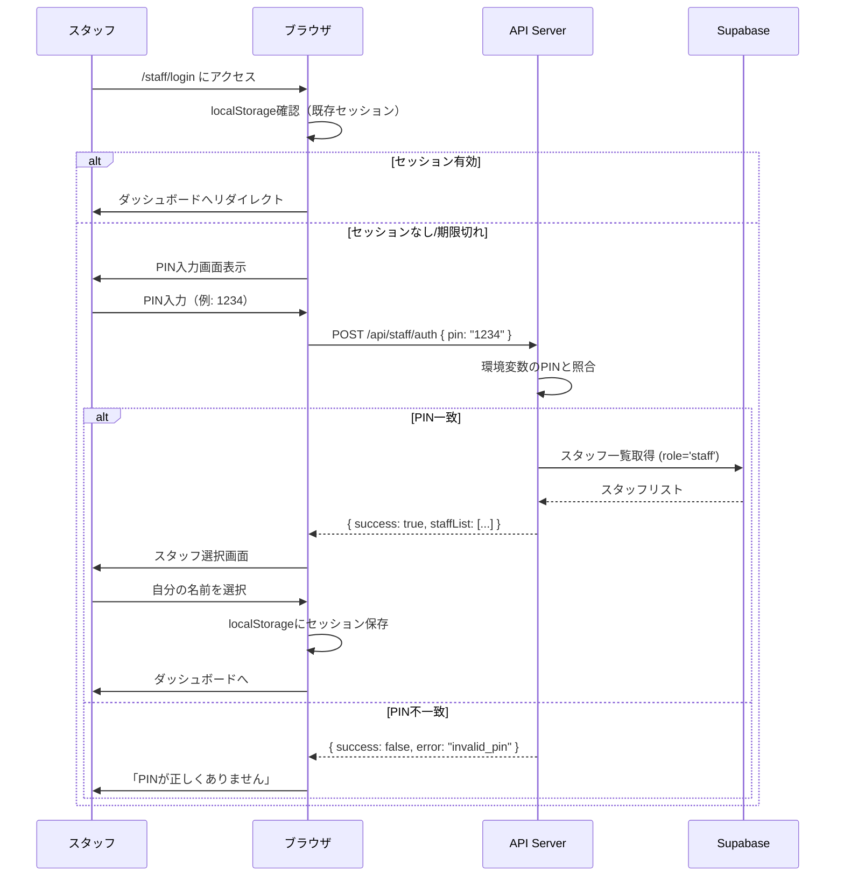

# スタッフ認証仕様書 (cOralup Platform)

> **実装完了**: 2024-12-02 (Agent 2)

## 1. MVP認証方式: 共通PIN認証 ✅ 実装済み

### 1.1 概要
展示会当日の運用を最優先とし、シンプルな共通PIN方式を採用。
セキュリティより利便性を重視（物理的に管理されたブース内での利用前提）。

### 1.2 仕様

| 項目 | 仕様 |
|------|------|
| PIN桁数 | **4桁** 数字のみ |
| 保存方法 | 環境変数 `STAFF_PIN_CODE` にプレーンテキスト（デフォルト: `1234`） |
| セッション | ブラウザ `localStorage` に認証状態を保存 |
| 有効期限 | **12時間**（展示会1日分） |
| スタッフ識別 | PIN認証後に名前を選択（`profiles` テーブルから、またはモックデータ） |

### 1.3 実装ファイル

| ファイル | 役割 |
|---------|------|
| `src/app/api/staff/auth/route.ts` | PIN認証API |
| `src/hooks/useStaffAuth.ts` | 認証Hook（localStorage管理） |
| `src/app/(exhibition)/staff/login/page.tsx` | PIN入力UI + スタッフ選択画面 |

### 1.4 認証フロー



### 1.5 localStorage構造

```typescript
interface StaffSession {
  staffId: string       // profiles.id
  staffName: string     // 表示名
  authenticatedAt: number // Unix timestamp
  expiresAt: number     // Unix timestamp (12時間後)
}

// キー
const STAFF_SESSION_KEY = 'coralup_staff_session'
```

### 1.6 API仕様

#### POST /api/staff/auth

**リクエスト:**
```json
{
  "pin": "1234"
}
```

**レスポンス（成功）:**
```json
{
  "success": true,
  "staffList": [
    { "id": "staff-1", "first_name": "太郎", "last_name": "山田", "avatar_url": null },
    { "id": "staff-2", "first_name": "花子", "last_name": "鈴木", "avatar_url": null }
  ]
}
```

**レスポンス（失敗）:**
```json
{
  "success": false,
  "error": "invalid_pin",
  "message": "PINが正しくありません"
}
```

---

## 2. 環境変数

```bash
# .env.local
STAFF_PIN_CODE=1234  # デフォルト値、本番では変更必須
```

---

## 3. モックモード

Supabaseが未接続の場合、以下のモックデータを返す:

```typescript
const mockStaffList = [
  { id: 'staff-1', first_name: '太郎', last_name: '山田', avatar_url: null },
  { id: 'staff-2', first_name: '花子', last_name: '鈴木', avatar_url: null },
  { id: 'staff-3', first_name: '次郎', last_name: '佐藤', avatar_url: null },
]
```

---

## 4. Phase 2: 個別PIN認証（将来）

### 4.1 概要
各スタッフに個別のPINを発行し、より安全な認証を実現。

### 4.2 仕様変更点

| 項目 | MVP | Phase 2 |
|------|-----|---------|
| PIN | 共通4桁 | 個別6桁 |
| 保存 | 環境変数 | DB（ハッシュ化） |
| 識別 | PIN後に選択 | PINで自動識別 |

---

## 5. セキュリティ考慮事項

### MVP（展示会）
- ✅ ブース内での物理的管理が前提
- ✅ 1日限りの利用
- ⚠️ PINが漏洩した場合は即座に環境変数を変更

### Phase 2以降
- ✅ 個別PIN + ハッシュ化
- ✅ ログイン試行制限
- ✅ セッション有効期限の厳格化
- ✅ 監査ログの記録
