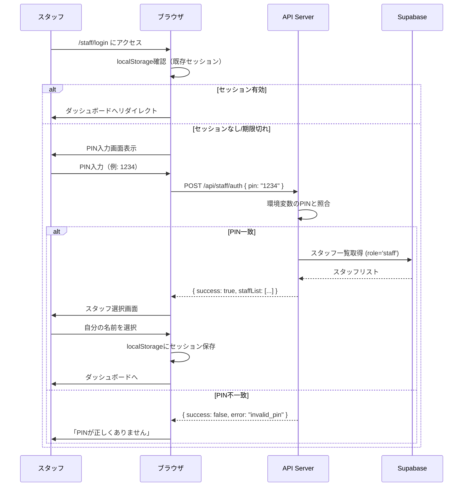

# スタッフ認証仕様書 (cOralup Platform)

## 1. MVP認証方式: 共通PIN認証

### 1.1 概要
展示会当日の運用を最優先とし、シンプルな共通PIN方式を採用。
セキュリティより利便性を重視（物理的に管理されたブース内での利用前提）。

### 1.2 仕様

| 項目 | 仕様 |
|------|------|
| PIN桁数 | **4桁** 数字のみ |
| 保存方法 | 環境変数 `STAFF_PIN_CODE` にプレーンテキスト |
| セッション | ブラウザ `localStorage` に認証状態を保存 |
| 有効期限 | **12時間**（展示会1日分） |
| スタッフ識別 | PIN認証後に名前を選択（`profiles` テーブルから） |

### 1.3 認証フロー



### 1.4 localStorage構造

```typescript
interface StaffSession {
  staffId: string       // profiles.id
  staffName: string     // 表示名
  authenticatedAt: number // Unix timestamp
  expiresAt: number     // Unix timestamp (12時間後)
}

// キー
const STAFF_SESSION_KEY = 'coralup_staff_session'
```

### 1.5 実装コード例

```typescript
// src/app/api/staff/auth/route.ts
export async function POST(request: NextRequest) {
  const { pin } = await request.json()
  
  // PIN照合
  if (pin !== process.env.STAFF_PIN_CODE) {
    return NextResponse.json(
      { success: false, error: 'invalid_pin' },
      { status: 401 }
    )
  }
  
  // スタッフ一覧取得
  const { data: staffList } = await supabase
    .from('profiles')
    .select('id, first_name, last_name, avatar_url')
    .eq('role', 'staff')
    .order('last_name')
  
  return NextResponse.json({ success: true, staffList })
}
```

```typescript
// src/hooks/useStaffAuth.ts
export function useStaffAuth() {
  const [session, setSession] = useState<StaffSession | null>(null)
  
  useEffect(() => {
    const stored = localStorage.getItem(STAFF_SESSION_KEY)
    if (stored) {
      const parsed = JSON.parse(stored) as StaffSession
      if (parsed.expiresAt > Date.now()) {
        setSession(parsed)
      } else {
        localStorage.removeItem(STAFF_SESSION_KEY)
      }
    }
  }, [])
  
  const login = (staffId: string, staffName: string) => {
    const session: StaffSession = {
      staffId,
      staffName,
      authenticatedAt: Date.now(),
      expiresAt: Date.now() + 12 * 60 * 60 * 1000 // 12時間
    }
    localStorage.setItem(STAFF_SESSION_KEY, JSON.stringify(session))
    setSession(session)
  }
  
  const logout = () => {
    localStorage.removeItem(STAFF_SESSION_KEY)
    setSession(null)
  }
  
  return { session, login, logout, isAuthenticated: !!session }
}
```

---

## 2. Phase 2: 個別PIN認証（将来）

### 2.1 概要
各スタッフに個別のPINを発行し、より安全な認証を実現。

### 2.2 仕様変更点

| 項目 | MVP | Phase 2 |
|------|-----|---------|
| PIN | 共通4桁 | 個別6桁 |
| 保存 | 環境変数 | DB（ハッシュ化） |
| 識別 | PIN後に選択 | PINで自動識別 |

### 2.3 DB設計

```sql
-- profiles テーブルに追加
ALTER TABLE profiles ADD COLUMN pin_hash TEXT;
ALTER TABLE profiles ADD COLUMN pin_attempts INTEGER DEFAULT 0;
ALTER TABLE profiles ADD COLUMN pin_locked_until TIMESTAMP;
```

### 2.4 ハッシュ化

```typescript
import bcrypt from 'bcrypt'

// PIN設定時
const setPIN = async (staffId: string, pin: string) => {
  const hash = await bcrypt.hash(pin, 10)
  await supabase
    .from('profiles')
    .update({ pin_hash: hash, pin_attempts: 0 })
    .eq('id', staffId)
}

// PIN検証時
const verifyPIN = async (staffId: string, pin: string) => {
  const { data } = await supabase
    .from('profiles')
    .select('pin_hash, pin_attempts, pin_locked_until')
    .eq('id', staffId)
    .single()
  
  // ロックチェック
  if (data.pin_locked_until && new Date(data.pin_locked_until) > new Date()) {
    throw new Error('アカウントがロックされています')
  }
  
  const isValid = await bcrypt.compare(pin, data.pin_hash)
  
  if (!isValid) {
    // 失敗カウント増加
    const attempts = data.pin_attempts + 1
    const lockUntil = attempts >= 5 
      ? new Date(Date.now() + 30 * 60 * 1000) // 30分ロック
      : null
    
    await supabase
      .from('profiles')
      .update({ 
        pin_attempts: attempts,
        pin_locked_until: lockUntil
      })
      .eq('id', staffId)
    
    throw new Error('PINが正しくありません')
  }
  
  // 成功時はリセット
  await supabase
    .from('profiles')
    .update({ pin_attempts: 0, pin_locked_until: null })
    .eq('id', staffId)
  
  return true
}
```

---

## 3. Phase 3: Clerk統合（将来）

### 3.1 概要
医院向けSaaS展開時には、Clerkを導入してエンタープライズレベルの認証を実現。

### 3.2 機能
- メール/パスワード認証
- Google/LINE SSO
- 多要素認証（MFA）
- 組織管理（マルチテナント）
- セッション管理ダッシュボード

---

## 4. セキュリティ考慮事項

### MVP（展示会）
- ✅ ブース内での物理的管理が前提
- ✅ 1日限りの利用
- ⚠️ PINが漏洩した場合は即座に環境変数を変更

### Phase 2以降
- ✅ 個別PIN + ハッシュ化
- ✅ ログイン試行制限
- ✅ セッション有効期限の厳格化
- ✅ 監査ログの記録

