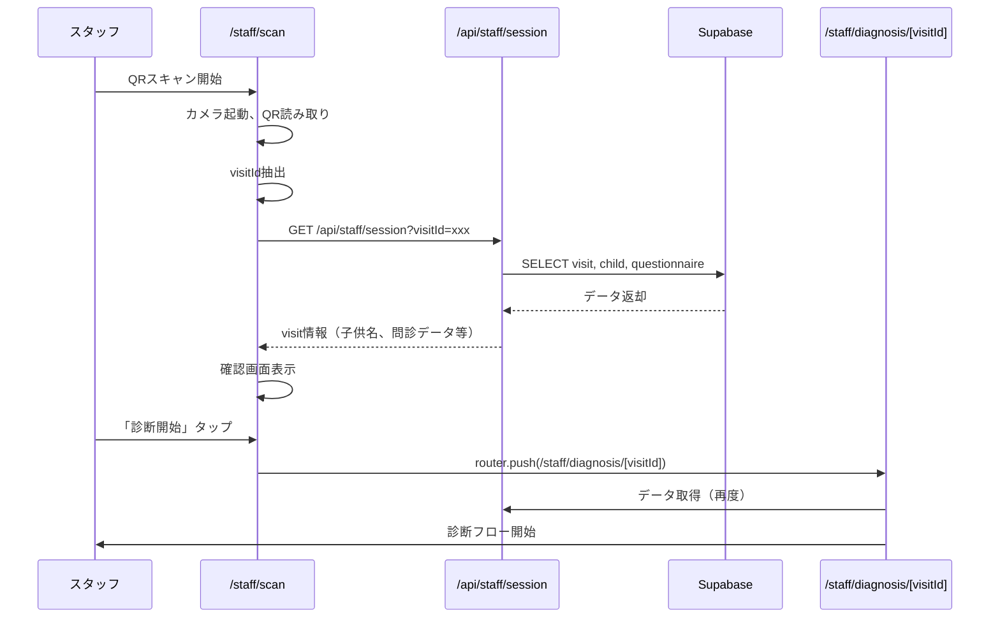

# QRコード仕様書 (cOralup Platform)

**最終更新: 2024-12-09**

## 1. 概要

親御さんのスマホに表示されるQRコードを、スタッフがスキャンすることで診断セッションを引き継ぐ。

---

## 2. 画面構成・URL設計

### 2.1 スタッフ側のQRスキャンフロー

```
┌─────────────────────────────────────────────────────────────┐
│ /staff/scan (QRスキャン専用画面)                             │
│   - QRScannerコンポーネント表示                              │
│   - 手動入力フォールバック                                   │
│   ↓ スキャン成功（visitId取得）                             │
├─────────────────────────────────────────────────────────────┤
│ /staff/diagnosis/[visitId] (診断フロー画面)                  │
│   - APIからvisit/child/questionnaire取得                    │
│   - 問診確認 → 写真撮影 → 診断入力 → レポート送信           │
└─────────────────────────────────────────────────────────────┘
```

### 2.2 URL設計の理由

| URL | 用途 | 理由 |
|-----|------|------|
| `/staff/scan` | QRスキャン専用 | エントリーポイント明確、シンプル |
| `/staff/diagnosis/[visitId]` | 診断フロー | URLにID含むためリロード耐性、途中離脱→再開可能 |
| `/staff/diagnosis/demo` | デモ用 | モックデータで動作確認（本番では使用しない） |

### 2.3 データフロー



---

## 3. QRコード仕様

### 3.1 エンコードデータ

```typescript
interface QRData {
  type: 'coralup_visit'  // 識別子（他のQRと区別）
  visitId: string        // visits.id (UUID)
  version: number        // QRフォーマットバージョン
}

// 実際のQR文字列（JSON）
{
  "type": "coralup_visit",
  "visitId": "550e8400-e29b-41d4-a716-446655440000",
  "version": 1
}
```

### 3.2 なぜ visit_id を使うか

| 候補 | 採用 | 理由 |
|------|------|------|
| `visit_id` | ✅ | セッション単位で一意。1回の来場に1QR |
| `child_id` | ❌ | 同じ子が複数回来場する可能性あり |
| `session_token` | ❌ | 有効期限管理が複雑になる |

### 3.3 QRコードサイズ・形式

| 項目 | 仕様 |
|------|------|
| エラー訂正レベル | **M**（15%復元可能） |
| サイズ | 画面幅の **80%**（最低200px） |
| 形式 | PNG または SVG |
| 色 | 黒（#000000）on 白（#FFFFFF） |

---

## 3. 生成ライブラリ

### 3.1 採用: `qrcode.react`

```bash
pnpm add qrcode.react
```

### 3.2 実装例

```tsx
// src/components/parent/QRDisplay.tsx
import { QRCodeSVG } from 'qrcode.react'

interface QRDisplayProps {
  visitId: string
  childName: string
}

export function QRDisplay({ visitId, childName }: QRDisplayProps) {
  const qrData = JSON.stringify({
    type: 'coralup_visit',
    visitId,
    version: 1
  })

  return (
    <div className="flex flex-col items-center p-8">
      <h1 className="text-xl font-bold mb-4">
        {childName}さんの受付QR
      </h1>
      
      <div className="bg-white p-4 rounded-lg shadow-lg">
        <QRCodeSVG
          value={qrData}
          size={280}
          level="M"
          includeMargin={true}
        />
      </div>
      
      <p className="mt-4 text-gray-600 text-center">
        このQRコードをスタッフに見せてください
      </p>
      
      {/* 受付番号（バックアップ） */}
      <p className="mt-2 text-sm text-gray-400">
        受付番号: {visitId.slice(0, 8).toUpperCase()}
      </p>
    </div>
  )
}
```

---

## 4. スキャン実装

### 4.1 採用ライブラリ: `html5-qrcode`

```bash
pnpm add html5-qrcode
```

### 4.2 実装例

```tsx
// src/components/staff/QRScanner.tsx
'use client'

import { useEffect, useRef, useState } from 'react'
import { Html5Qrcode } from 'html5-qrcode'

interface QRScannerProps {
  onScan: (visitId: string) => void
  onError: (error: string) => void
}

export function QRScanner({ onScan, onError }: QRScannerProps) {
  const scannerRef = useRef<Html5Qrcode | null>(null)
  const [isScanning, setIsScanning] = useState(false)

  useEffect(() => {
    const scanner = new Html5Qrcode('qr-reader')
    scannerRef.current = scanner

    const startScanning = async () => {
      try {
        await scanner.start(
          { facingMode: 'environment' }, // 背面カメラ
          {
            fps: 10,
            qrbox: { width: 250, height: 250 }
          },
          (decodedText) => {
            handleScan(decodedText)
          },
          () => {} // エラーは無視（スキャン中は常に発生）
        )
        setIsScanning(true)
      } catch (err) {
        onError('カメラを起動できません。カメラの権限を確認してください。')
      }
    }

    startScanning()

    return () => {
      if (scannerRef.current?.isScanning) {
        scannerRef.current.stop()
      }
    }
  }, [])

  const handleScan = (decodedText: string) => {
    try {
      const data = JSON.parse(decodedText)
      
      // 形式チェック
      if (data.type !== 'coralup_visit') {
        onError('このQRコードはcOralupのものではありません')
        return
      }
      
      if (!data.visitId) {
        onError('QRコードのデータが不正です')
        return
      }
      
      // スキャン成功
      scannerRef.current?.stop()
      onScan(data.visitId)
      
    } catch {
      onError('QRコードを読み取れません')
    }
  }

  return (
    <div className="flex flex-col items-center">
      <div id="qr-reader" className="w-full max-w-sm" />
      
      {isScanning && (
        <p className="mt-4 text-gray-600">
          親御さんのQRコードをカメラに向けてください
        </p>
      )}
    </div>
  )
}
```

---

## 5. フォールバック

### 5.1 手動入力

QRスキャンが失敗した場合、受付番号（visit_idの先頭8文字）で検索可能。

```tsx
// src/components/staff/ManualVisitSearch.tsx
export function ManualVisitSearch({ onFound }: { onFound: (visitId: string) => void }) {
  const [code, setCode] = useState('')
  const [loading, setLoading] = useState(false)
  const [error, setError] = useState('')

  const handleSearch = async () => {
    setLoading(true)
    setError('')
    
    const { data: visits } = await supabase
      .from('visits')
      .select('id, children(first_name, last_name)')
      .ilike('id', `${code}%`)
      .eq('status', 'questionnaire_completed')
      .limit(5)
    
    if (visits?.length === 1) {
      onFound(visits[0].id)
    } else if (visits?.length > 1) {
      // 複数候補がある場合は選択UI
      setError('複数の候補があります。もう少し入力してください')
    } else {
      setError('該当する受付が見つかりません')
    }
    
    setLoading(false)
  }

  return (
    <div className="p-4">
      <p className="text-sm text-gray-600 mb-2">
        QRが読み取れない場合は受付番号を入力
      </p>
      <div className="flex gap-2">
        <input
          type="text"
          value={code}
          onChange={(e) => setCode(e.target.value.toUpperCase())}
          placeholder="例: 550E8400"
          className="flex-1 px-3 py-2 border rounded"
          maxLength={8}
        />
        <button
          onClick={handleSearch}
          disabled={loading || code.length < 4}
          className="px-4 py-2 bg-blue-500 text-white rounded"
        >
          検索
        </button>
      </div>
      {error && <p className="text-red-500 text-sm mt-2">{error}</p>}
    </div>
  )
}
```

---

## 6. セキュリティ考慮

### 6.1 QRコードの有効期限

```typescript
// QR表示時にvisitのステータスをチェック
const isQRValid = (visit: Visit) => {
  // 問診完了済みかつ診断未開始
  if (visit.status !== 'questionnaire_completed') {
    return false
  }
  
  // 作成から24時間以内
  const createdAt = new Date(visit.created_at)
  const now = new Date()
  const hoursDiff = (now.getTime() - createdAt.getTime()) / (1000 * 60 * 60)
  
  return hoursDiff < 24
}
```

### 6.2 スキャン後の確認

スキャン成功後、必ず親御さんに本人確認を行う。

```tsx
// スキャン後の確認画面
<ConfirmationScreen
  childName={visit.children.first_name}
  parentName={visit.children.profiles.display_name}
  onConfirm={() => startDiagnosis()}
  onCancel={() => resetScanner()}
>
  <p>「{visit.children.last_name} {visit.children.first_name}」さんで間違いありませんか？</p>
</ConfirmationScreen>
```

