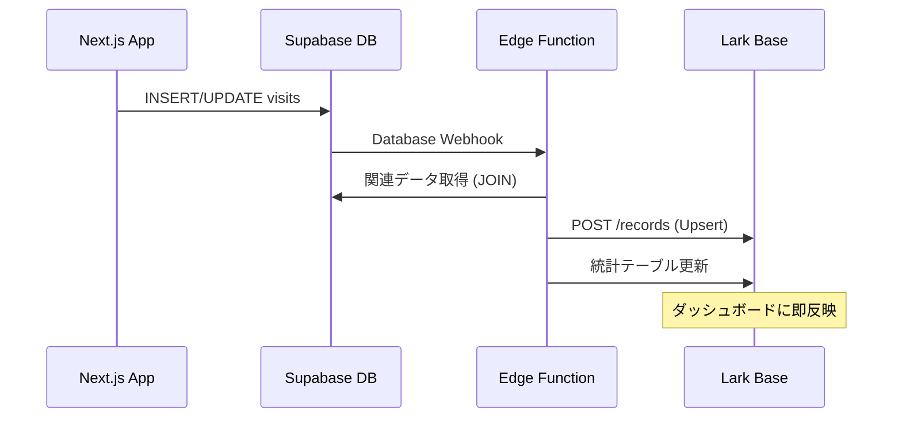

# Lark Base テーブル設計書

## 概要

展示会当日のリアルタイム監視用 Lark Base テーブル設計。
Supabase の visits テーブルと同期し、非エンジニアスタッフでも状況を把握できるダッシュボードを提供する。

---

## 1. テーブル構成

### テーブル1: `来場者ログ` (visits_log)

メインの来場者管理テーブル。visits テーブルと 1:1 で同期。

| フィールド名 | 型 | 説明 | Supabase対応 |
|-------------|-----|------|--------------|
| visit_id | テキスト | Supabase visits.id (UUID) | visits.id |
| child_name | テキスト | お子様の名前 | children.last_name + first_name |
| parent_name | テキスト | 親御さんの名前 | profiles.display_name |
| status | 単一選択 | 進捗状況 | visits.status |
| staff_name | テキスト | 担当スタッフ名 | profiles.display_name |
| visit_time | 日時 | 来場時刻 | visits.visit_date |
| updated_at | 日時 | 最終更新時刻 | - |
| reception_number | テキスト | 受付番号 | visits.reception_number |
| event_name | テキスト | イベント名 | events.name |
| child_age_months | 数値 | 月齢 | visits.child_age_months |
| diagnosis_summary | テキスト | 診断結果サマリ | oral_diagnoses.diagnosis_summary |

**status の選択肢:**
- `waiting` - 待機中
- `in_progress` - 診断中
- `completed` - 診断完了
- `report_sent` - レポート送信済み

---

### テーブル2: `リアルタイム集計` (realtime_stats)

本日の集計値を表示するテーブル。

| フィールド名 | 型 | 説明 |
|-------------|-----|------|
| metric_name | テキスト | 指標名 |
| value | 数値 | 値 |
| updated_at | 日時 | 更新時刻 |

**集計指標:**
- 本日の来場者数
- 待機中の人数
- 診断完了数
- レポート送信済み

---

### テーブル3: `異常検知アラート` (alerts)

システムが検知した異常を記録するテーブル。

| フィールド名 | 型 | 説明 |
|-------------|-----|------|
| alert_type | 単一選択 | アラート種別 |
| description | テキスト | 詳細説明 |
| visit_id | テキスト | 関連する visit ID |
| created_at | 日時 | 検知時刻 |
| resolved | チェックボックス | 解決済みか |

**alert_type の選択肢:**
- `timeout` - タイムアウト（30分以上待機）
- `error` - システムエラー
- `data_mismatch` - データ不整合

---

## 2. Lark Base セットアップ手順

### Step 1: Base アプリ作成

1. Lark にログイン
2. 「Base」を開く
3. 「新規作成」→「空のBase」
4. 名前: `cOralup 展示会監視`

### Step 2: テーブル作成

上記の設計に従い、3つのテーブルを作成。

### Step 3: App Token / Table ID 取得

1. Base の URL から `app_token` を取得
   - 例: `https://xxx.larksuite.com/base/APP_TOKEN_HERE`
2. 各テーブルの URL から `table_id` を取得
   - 例: `https://xxx.larksuite.com/base/xxx/TABLE_ID_HERE`

### Step 4: 環境変数設定

```env
# Lark App 認証情報
LARK_APP_ID=cli_xxxxxxxxxx
LARK_APP_SECRET=xxxxxxxxxx

# Lark Base 設定
LARK_BASE_APP_TOKEN=appXXXXXXXXXXXX
LARK_BASE_TABLE_ID=tblXXXXXXXXXXXX      # 来場者ログ
LARK_STATS_TABLE_ID=tblYYYYYYYYYYYY    # リアルタイム集計
LARK_ALERTS_TABLE_ID=tblZZZZZZZZZZZZ   # 異常検知アラート
```

---

## 3. ダッシュボードビュー設定

### 推奨ビュー

#### ビュー1: 「本日の来場者」
- フィルター: `visit_time` が今日
- ソート: `visit_time` 降順
- 表示カラム: child_name, status, staff_name, visit_time

#### ビュー2: 「待機中」
- フィルター: `status` = `waiting`
- ソート: `visit_time` 昇順（長く待っている順）
- 条件付き書式: 30分以上待機は赤背景

#### ビュー3: 「スタッフ別進捗」
- グループ化: `staff_name`
- 集計: 各ステータスの件数

#### ビュー4: 「アラート一覧」
- テーブル: alerts
- フィルター: `resolved` = false
- ソート: `created_at` 降順

---

## 4. 同期フロー



---

## 5. 注意事項

### API レート制限
- Lark API: 100 requests/min
- 大量更新時はバッチ処理を検討

### データ整合性
- visit_id をキーとして Upsert
- 削除は同期しない（Lark 側で手動削除）

### セキュリティ
- App Secret は環境変数で管理
- Edge Function 経由でのみアクセス

---

## 6. トラブルシューティング

### 同期されない場合
1. Edge Function のログを確認
2. Lark API のレスポンスを確認
3. 環境変数が正しく設定されているか確認

### トークンエラー
- App ID / Secret が正しいか確認
- アプリの権限設定を確認（Bitable の読み書き権限）

### レコードが重複する場合
- visit_id でのフィルターが正しく動作しているか確認
- テーブルの visit_id フィールドがテキスト型か確認

---

## 7. 診断結果テーブル（横持ち）

診断データをリアルタイムで集計・可視化するための横持ちテーブル。

### テーブル4: `診断結果` (diagnosis_results)

| フィールド名 | 型 | 説明 | Supabase対応 |
|-------------|-----|------|--------------|
| session_id | テキスト | セッションID | sessions.session_id |
| diagnosed_at | 日時 | 診断日時 | diagnosis_responses.answered_at |
| parent_name | テキスト | 親御さん名 | sessions.parent_name |
| child_name | テキスト | お子様名 | children.first_name |
| child_age_months | 数値 | 月齢 | 計算値 |
| staff_name | テキスト | 担当スタッフ | profiles.display_name |
| event_name | テキスト | イベント名 | events.name |
| 舌小帯短縮症 | 単一選択 | あり/なし | diagnosis_responses.value |
| 低位舌 | 単一選択 | あり/なし | diagnosis_responses.value |
| 口呼吸 | 単一選択 | 口呼吸/鼻呼吸/両方 | diagnosis_responses.value |
| 過蓋合 | 単一選択 | あり/なし | diagnosis_responses.value |
| 反対咬合 | 単一選択 | あり/なし | diagnosis_responses.value |
| 開咬 | 単一選択 | あり/なし | diagnosis_responses.value |
| 叢生 | 単一選択 | あり/なし | diagnosis_responses.value |
| ... | ... | （他の診断項目） | ... |

**ポイント:**
- Supabaseでは縦持ち（正規化）で保存
- Lark連携時に横持ちに変換（SQLビューまたはEdge Function）
- 集計・ダッシュボード表示に最適化

---

## 8. 問診結果テーブル（横持ち）

### テーブル5: `問診結果` (questionnaire_results)

| フィールド名 | 型 | 説明 | Supabase対応 |
|-------------|-----|------|--------------|
| session_id | テキスト | セッションID | sessions.session_id |
| answered_at | 日時 | 回答日時 | questionnaire_responses.answered_at |
| parent_name | テキスト | 親御さん名 | sessions.parent_name |
| child_name | テキスト | お子様名 | 問診回答から |
| child_birthday | 日付 | 生年月日 | 問診回答から |
| 睡眠_いびき | 単一選択 | はい/いいえ | questionnaire_responses.value |
| 睡眠_口ぽかん | 単一選択 | はい/いいえ | questionnaire_responses.value |
| 睡眠_寝相 | 複数選択 | うつ伏せ,仰向け等 | questionnaire_responses.value |
| 食事_好き嫌い | 単一選択 | はい/いいえ | questionnaire_responses.value |
| 食事_食べる速さ | 単一選択 | 早い/普通/遅い | questionnaire_responses.value |
| ... | ... | （他の問診項目） | ... |

---

## 9. 当日ダッシュボード構成

### 推奨レイアウト

```
┌─────────────────────────────────────────────────────────────────┐
│                    YourTIME 2024 ダッシュボード                   │
├─────────────────────────────────────────────────────────────────┤
│                                                                 │
│  ┌──────────┬──────────┬──────────┬──────────┐                 │
│  │ 本日診断数 │ 完了率   │ 平均時間  │ 待ち人数  │                 │
│  │   45件   │  89%    │  12分   │   3人   │                 │
│  └──────────┴──────────┴──────────┴──────────┘                 │
│                                                                 │
│  スタッフ別診断数              時間帯別診断数                     │
│  ┌─────────────────┐        ┌─────────────────┐                │
│  │ 山田: ████ 15件 │        │ 10時: ████ 12件│                │
│  │ 佐藤: ███ 12件  │        │ 11時: █████ 18件│               │
│  │ 田中: ██ 10件   │        │ 12時: ███ 10件 │                │
│  │ 鈴木: ██ 8件    │        │ 13時: ██ 5件   │                │
│  └─────────────────┘        └─────────────────┘                │
│                                                                 │
│  異常所見TOP5                                                   │
│  ┌─────────────────────────────────────────┐                   │
│  │ 1. 低位舌: 35% (16/45件)                │                   │
│  │ 2. 口呼吸: 28% (13/45件)                │                   │
│  │ 3. 舌小帯短縮症: 22% (10/45件)          │                   │
│  │ 4. 過蓋合: 18% (8/45件)                 │                   │
│  │ 5. 反対咬合: 11% (5/45件)               │                   │
│  └─────────────────────────────────────────┘                   │
│                                                                 │
└─────────────────────────────────────────────────────────────────┘
```

### Lark Base ダッシュボード機能で実現

1. **サマリーカード**: 数値フィールドの集計
2. **グラフ**: 棒グラフ、円グラフ
3. **条件付き書式**: 異常値のハイライト
4. **自動更新**: Webhook経由でリアルタイム反映

---

## 10. データ保存設計（縦持ち vs 横持ち）

### Supabase（正規化・縦持ち）

**メリット:**
- 項目追加が容易（テーブル変更不要）
- データ整合性が保たれる
- 履歴管理がしやすい

**テーブル構造:**
```
diagnosis_responses
├── session_id: ABC123
├── item_id: uuid-舌小帯短縮症
├── value: yes
└── answered_at: 2024-12-06 10:30:00

diagnosis_responses
├── session_id: ABC123
├── item_id: uuid-低位舌
├── value: yes
└── answered_at: 2024-12-06 10:30:00
```

### Lark Base（横持ち・集計用）

**メリット:**
- 集計・フィルタが直感的
- ダッシュボード表示に最適
- 非エンジニアでも理解しやすい

**テーブル構造:**
```
| session_id | 舌小帯短縮症 | 低位舌 | 口呼吸 | ... |
|------------|------------|--------|--------|-----|
| ABC123     | あり        | あり   | 口呼吸 | ... |
```

### 変換タイミング

```
Supabase (縦持ち) ──→ Edge Function (変換) ──→ Lark Base (横持ち)
                          │
                          └── SQLビューで横持ちも提供可能
```