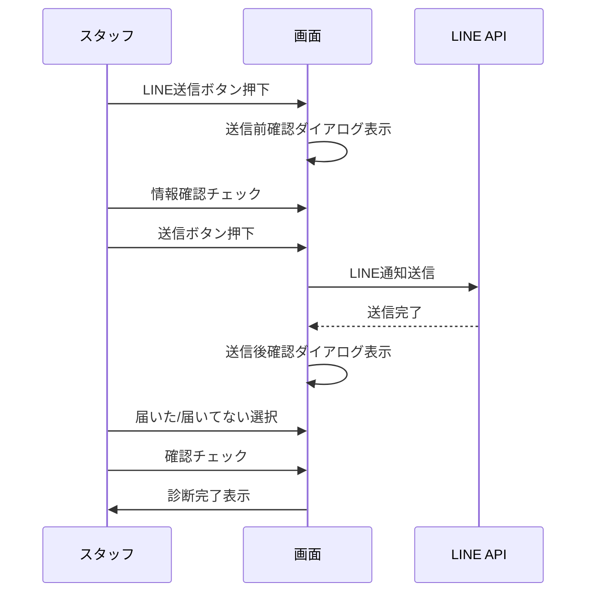

# レポートWebページ仕様書

## 概要
PDF出力からUUID形式のWebページに変更。スピードと確実性を重視。

## URL形式
```
/report/{uuid}
例: /report/550e8400-e29b-41d4-a716-446655440000
```

## ページ構成

### 1. ヘッダー
- 診断日・イベント名
- タイトル「分析シート」
- お子様の年齢・お名前

### 2. 写真セクション（3枚横並び）
| 横向き姿勢 | 正面姿勢 | 口腔内 |
|-----------|---------|--------|
| 3:4比率 | 3:4比率 | 3:4比率 |

**写真表示機能:**
- タップで拡大表示
- スライドで前後の写真に切り替え
- インジケーターで現在位置表示

### 3. 分析できること
- AI分析サマリー
- 姿勢と口腔の相関説明
- **編集モード時**: インラインテキストエリアで直接編集可能（リアルタイム反映）
- **確定後**: 読み取り専用表示

### 4. 評価セクション（2カラム）
- 姿勢評価: スコア/10 + 指摘事項
- 口腔評価: スコア/10 + 指摘事項

### 5. 月齢考慮コメント
- 年齢に応じた専門的アドバイス

### 6. フッター
- cOral upブランド
- 有効期限（90日）

## 技術仕様

### フロントエンド
- Next.js App Router
- Framer Motion（アニメーション）
- Tailwind CSS
- 印刷/PDF保存対応（@media print）

### API
```
GET /api/report/{id}
POST /api/report/create
```

### データ型
```typescript
interface ReportData {
  id: string
  childName: string
  childAge: number
  childAgeMonths?: number
  parentName: string
  eventName: string
  diagnosisDate: string
  photos: {
    postureSide?: string
    postureFront?: string
    oralFront?: string
  }
  aiAnalysis: {
    summary: string
    ageConsideration?: string
  }
  postureAnalysis?: {
    overallScore: number
    issues: string[]
  }
  oralAnalysis?: {
    overallScore: number
    issues: string[]
  }
}
```

## 実装ファイル
- `src/app/report/[id]/page.tsx` - レポート表示ページ
- `src/app/api/report/[id]/route.ts` - レポート取得API
- `src/app/api/report/create/route.ts` - レポート作成API
- `src/components/staff/ReportPreview.tsx` - レポートプレビューコンポーネント

## 編集モード管理

### 編集モード（確定前）
- 分析コメントをインラインテキストエリアで直接編集可能
- 編集内容はリアルタイムで反映（保存ボタン不要）
- 「レポートを確定」ボタンで確定モードに移行
- 写真タップで拡大表示

### 確定モード（確定後）
- 分析コメントは読み取り専用
- 「確定済み」バッジ表示
- 「編集に戻る」ボタンで編集モードに戻れる
- 「LINE送信」ボタンが有効化

## LINE送信確認フロー

### 送信前確認ダイアログ
1. **LINE連携アカウント名** - 送信先LINEユーザー名（デモ: 葉加瀬太郎）
2. **親御さん名** - 問診票の保護者名
3. **お子さん名・年齢** - 診断対象の情報
4. 「上記の情報を確認しました」チェックボックス

### 送信後確認ダイアログ
1. 「LINEが届いたことを確認してください」メッセージ
2. **「届いた」ボタン** - 確認完了
3. **「届いてない」ボタン** - 「近日中にお送りします」メッセージ表示
4. 確認完了チェックボックス
5. 「診断完了」表示

### 送信フロー


## ステータス
- [x] 基本実装完了
- [x] 分析シート形式UI
- [x] 写真スライド/タップ拡大機能
- [x] プレビュー画面でのコメント直接編集（インライン、保存不要）
- [x] 編集モード/確定モード分離
- [x] LINE送信前確認ダイアログ
- [x] LINE送信後確認ダイアログ（届いた/届いてない）
- [ ] 写真アップロード連携（Supabase Storage）
- [ ] LINE通知実装

## 診断デモページの分析フロー

### 入力チェックブロック
1. **写真チェック**（必須3枚）
   - 正面姿勢
   - 横向き姿勢
   - 口腔内（正面）
   
2. **診断項目チェック**（スタッフ入力の必須項目すべて）
   - 未入力項目は上部に表示（ソート済み）
   - タップで該当入力画面に遷移

3. **分析ボタン**
   - 全項目完了で有効化
   - 未完了時は非活性＋未入力数を表示

### 分析結果表示
1. レポートプレビュー（分析シート形式）
   - 写真タップで拡大表示
   - コメント直接編集可能（インラインテキストエリア、確定前）
2. 「レポートを確定」ボタン（コメント編集なしでも押せる）
3. 確定後「LINE送信」ボタン表示
4. LINE送信前に確認ダイアログ表示
5. LINE送信後に届いた確認ダイアログ表示
