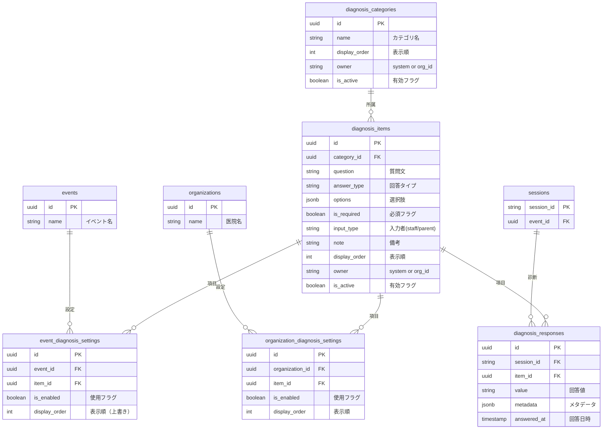

# 診断項目 DB設計書

**最終更新: 2024-12-10**

## 1. 設計方針

### 問題点（旧設計）

1. 診断項目がTypeScriptにハードコード → DB管理できない
2. イベント/医院ごとの項目カスタマイズができない
3. 回答がJSONBで保存 → 集計・分析が困難

### 解決策

- **マスタ/設定/データの3層構造**で柔軟性と追跡性を両立
- 全項目をDBに保持し、イベント/医院ごとに「使用する項目」を選択
- 回答を正規化テーブルに保存し、SQLで集計可能に

### ID設計方針（ハイブリッド方式）

カテゴリ・項目には**UUID（自動生成）**と**code（システム参照用）**の2つの識別子を持つ。

| 識別子 | 用途 | 特徴 |
|--------|------|------|
| id (UUID) | DB内部参照・外部キー | 自動生成、変更不可 |
| code | アプリ参照・分析・API連携 | 人間可読、安定識別子 |
| name | ユーザー表示 | 変更可能、多言語対応可 |

**メリット:**
- 分析時に`code`で安定参照（`WHERE code = 'tongue_tie'`）
- API連携時にcodeをキーにできる
- nameを変更してもcodeは維持（国際化対応）
- マイグレーションはUUID自動生成のまま

---

## 2. ER図



---

## 3. テーブル定義

### A. マスタ系（項目定義）

#### `diagnosis_categories` (診断カテゴリマスタ)

全てのカテゴリを定義。

| カラム | 型 | 説明 |
|--------|-----|------|
| id | UUID (PK) | |
| code | VARCHAR(50) UNIQUE | システム参照用コード |
| name | VARCHAR(100) | カテゴリ名（例: 舌、歯列・咬合、習癖） |
| description | TEXT | 説明 |
| display_order | INTEGER | 表示順 |
| owner | VARCHAR(50) | 'system'（cOralup管理）or organization_id |
| is_active | BOOLEAN | 有効フラグ |
| created_at | TIMESTAMP | |
| updated_at | TIMESTAMP | |

**カテゴリ一覧（システム標準）:**

| 表示順 | カテゴリ名 |
|--------|-----------|
| 1 | 習癖 |
| 2 | 舌 |
| 3 | 歯列・咬合 |
| 4 | 口唇 |
| 5 | 鼻・扁桃 |
| 6 | 顔面・頚部 |
| 7 | 呼吸 |
| 8 | 嚥下 |
| 9 | 食習慣 |
| 10 | 睡眠 |
| 11 | 足 |
| 12 | 全身 |
| 13 | 姿勢 |
| 14 | 靴 |
| 15 | 機能検査 |
| 16 | サーモグラフ |

#### `diagnosis_items` (診断項目マスタ)

全ての診断項目を定義。

| カラム | 型 | 説明 |
|--------|-----|------|
| id | UUID (PK) | |
| code | VARCHAR(50) UNIQUE | システム参照用コード |
| category_id | UUID (FK) | カテゴリ |
| question | VARCHAR(500) | 質問文 |
| answer_type | VARCHAR(20) | radio/checkbox/text/number/textarea |
| options | JSONB | 選択肢 `[{value, label}]` |
| is_required | BOOLEAN | 必須フラグ |
| input_type | VARCHAR(10) | 'staff' or 'parent' |
| note | TEXT | スタッフ向け備考 |
| placeholder | VARCHAR(200) | プレースホルダー |
| unit | VARCHAR(20) | 単位（数値用） |
| min_value | INTEGER | 最小値（数値用） |
| max_value | INTEGER | 最大値（数値用） |
| display_order | INTEGER | 表示順 |
| owner | VARCHAR(50) | 'system' or organization_id |
| is_active | BOOLEAN | 有効フラグ（論理削除） |
| created_at | TIMESTAMP | |
| updated_at | TIMESTAMP | |

---

### B. 設定系（イベント/医院ごとの使用項目）

#### `event_diagnosis_settings` (イベント別診断項目設定)

イベントごとに使用する項目を設定。

| カラム | 型 | 説明 |
|--------|-----|------|
| id | UUID (PK) | |
| event_id | UUID (FK) | イベント |
| item_id | UUID (FK) | 診断項目 |
| is_enabled | BOOLEAN | 使用フラグ |
| display_order | INTEGER | 表示順（上書き、NULLならマスタの順） |
| created_at | TIMESTAMP | |
| updated_at | TIMESTAMP | |

**UNIQUE制約**: (event_id, item_id)

#### `organization_diagnosis_settings` (医院別診断項目設定)

医院ごとのデフォルト設定。将来のSaaS化で使用。

| カラム | 型 | 説明 |
|--------|-----|------|
| id | UUID (PK) | |
| organization_id | UUID | 医院（将来FK） |
| item_id | UUID (FK) | 診断項目 |
| is_enabled | BOOLEAN | 使用フラグ |
| display_order | INTEGER | 表示順 |
| created_at | TIMESTAMP | |
| updated_at | TIMESTAMP | |

**UNIQUE制約**: (organization_id, item_id)

---

### C. データ系（実際の診断結果）

#### `diagnosis_responses` (診断回答データ)

実際の診断結果を保存。

| カラム | 型 | 説明 |
|--------|-----|------|
| id | UUID (PK) | |
| session_id | VARCHAR(10) (FK) | セッション |
| item_id | UUID (FK) | 診断項目 |
| value | TEXT | 回答値 |
| metadata | JSONB | 追加情報（写真URL等） |
| answered_by | UUID (FK) | 回答者（profiles、将来用） |
| answered_at | TIMESTAMP | 回答日時 |
| created_at | TIMESTAMP | |

**UNIQUE制約**: (session_id, item_id)

---

## 4. データフロー

```
┌─────────────────────────────────────────────────────────────────┐
│                    スキーマエディタ（管理画面）                    │
│  ・カテゴリの追加/編集/並び替え                                   │
│  ・項目の追加/編集/並び替え                                       │
│  ・選択肢の編集                                                  │
└─────────────────────┬───────────────────────────────────────────┘
                      │ 保存
                      ▼
┌─────────────────────────────────────────────────────────────────┐
│              diagnosis_categories / diagnosis_items              │
│                      （マスタテーブル）                           │
└─────────────────────┬───────────────────────────────────────────┘
                      │
        ┌─────────────┴─────────────┐
        │                           │
        ▼                           ▼
┌───────────────────┐     ┌───────────────────┐
│ イベント設定画面    │     │ 医院設定画面       │
│ ・使用項目選択      │     │ ・使用項目選択      │
│ ・表示順カスタム    │     │ ・表示順カスタム    │
└────────┬──────────┘     └────────┬──────────┘
         │ 保存                     │ 保存
         ▼                         ▼
┌───────────────────┐     ┌────────────────────────┐
│ event_diagnosis_  │     │ organization_diagnosis_│
│ settings          │     │ settings               │
└────────┬──────────┘     └────────────────────────┘
         │
         │ 診断画面表示時に参照
         ▼
┌─────────────────────────────────────────────────────────────────┐
│                    スタッフ診断画面                              │
│  ・イベント設定で有効な項目のみ表示                               │
│  ・カテゴリ順 → 項目順で表示                                     │
└─────────────────────┬───────────────────────────────────────────┘
                      │ 回答保存
                      ▼
┌─────────────────────────────────────────────────────────────────┐
│                    diagnosis_responses                          │
│  ・session_id + item_id で一意                                  │
│  ・回答値を正規化して保存                                        │
└─────────────────────────────────────────────────────────────────┘
```

---

## 5. ビュー定義

### `event_diagnosis_items_view` (イベント用診断項目一覧)

```sql
SELECT 
  e.id as event_id,
  e.name as event_name,
  dc.id as category_id,
  dc.name as category_name,
  dc.display_order as category_order,
  di.id as item_id,
  di.question,
  di.answer_type,
  di.options,
  di.is_required,
  di.input_type,
  di.note,
  di.placeholder,
  di.unit,
  COALESCE(eds.display_order, di.display_order) as item_order,
  COALESCE(eds.is_enabled, true) as is_enabled
FROM events e
CROSS JOIN diagnosis_items di
JOIN diagnosis_categories dc ON di.category_id = dc.id
LEFT JOIN event_diagnosis_settings eds 
  ON eds.event_id = e.id AND eds.item_id = di.id
WHERE di.is_active = true
  AND dc.is_active = true;
```

### `diagnosis_results_view` (診断結果詳細)

```sql
SELECT 
  dr.session_id,
  s.parent_name,
  dc.name as category_name,
  dc.display_order as category_order,
  di.question,
  di.answer_type,
  dr.value,
  dr.metadata,
  dr.answered_at,
  di.display_order as item_order
FROM diagnosis_responses dr
JOIN sessions s ON dr.session_id = s.session_id
JOIN diagnosis_items di ON dr.item_id = di.id
JOIN diagnosis_categories dc ON di.category_id = dc.id
ORDER BY dr.session_id, dc.display_order, di.display_order;
```

---

## 6. クエリ例

### イベント用の診断項目一覧を取得

```sql
SELECT 
  dc.name as category_name,
  dc.display_order as category_order,
  di.id,
  di.question,
  di.answer_type,
  di.options,
  di.is_required,
  di.input_type,
  COALESCE(eds.display_order, di.display_order) as item_order
FROM diagnosis_items di
JOIN diagnosis_categories dc ON di.category_id = dc.id
LEFT JOIN event_diagnosis_settings eds 
  ON eds.item_id = di.id AND eds.event_id = :event_id
WHERE di.is_active = true
  AND dc.is_active = true
  AND (eds.is_enabled = true OR eds.id IS NULL)
ORDER BY dc.display_order, item_order;
```

### 特定セッションの診断結果を取得

```sql
SELECT 
  dc.name as category_name,
  di.question,
  dr.value,
  dr.answered_at
FROM diagnosis_responses dr
JOIN diagnosis_items di ON dr.item_id = di.id
JOIN diagnosis_categories dc ON di.category_id = dc.id
WHERE dr.session_id = :session_id
ORDER BY dc.display_order, di.display_order;
```

### イベントごとの項目回答集計

```sql
SELECT 
  e.name as event_name,
  di.question,
  dr.value,
  COUNT(*) as count
FROM events e
JOIN sessions s ON s.status = 'completed'
JOIN diagnosis_responses dr ON dr.session_id = s.session_id
JOIN diagnosis_items di ON dr.item_id = di.id
GROUP BY e.name, di.question, dr.value
ORDER BY e.name, di.question, count DESC;
```

---

## 7. マイグレーションファイル

| ファイル | 内容 |
|---------|------|
| `20241205000000_diagnosis_master_tables.sql` | カテゴリ、項目、設定、回答テーブル作成 |
| `20241208000001_reseed_full_diagnosis_items.sql` | 診断項目マスターデータ投入 |
| `20241210000001_add_code_column.sql` | codeカラム追加・値設定 |

---

## 8. シードデータ

`20241208000001_reseed_full_diagnosis_items.sql` で全診断項目を投入。

投入項目数:
- カテゴリ: 16件
- 項目: 約60件

### カテゴリcode一覧

| code | name | display_order |
|------|------|---------------|
| habit | 習癖 | 1 |
| tongue | 舌 | 2 |
| dentition | 歯列・咬合 | 3 |
| lips | 口唇 | 4 |
| nose_tonsil | 鼻・扁桃 | 5 |
| face_neck | 顔面・頚部 | 6 |
| breathing | 呼吸 | 7 |
| swallowing | 嚥下 | 8 |
| eating_habit | 食習慣 | 9 |
| sleep | 睡眠 | 10 |
| foot | 足 | 11 |
| whole_body | 全身 | 12 |
| posture | 姿勢 | 13 |
| shoes | 靴 | 14 |
| function_test | 機能検査 | 15 |
| thermograph | サーモグラフ | 16 |

---

## 9. 権限マトリクス

| 操作 | cOralup管理者 | 医院管理者 | スタッフ |
|------|--------------|-----------|---------|
| カテゴリ追加 | ✅ | ❌ | ❌ |
| システム項目編集 | ✅ | ❌ | ❌ |
| 独自項目追加 | ✅ | ✅（owner付き） | ❌ |
| 表示ON/OFF | ✅ | ✅ | ❌ |
| 回答入力 | ✅ | ✅ | ✅ |
| 回答閲覧 | ✅ | ✅（自組織のみ） | ✅（自組織のみ） |
