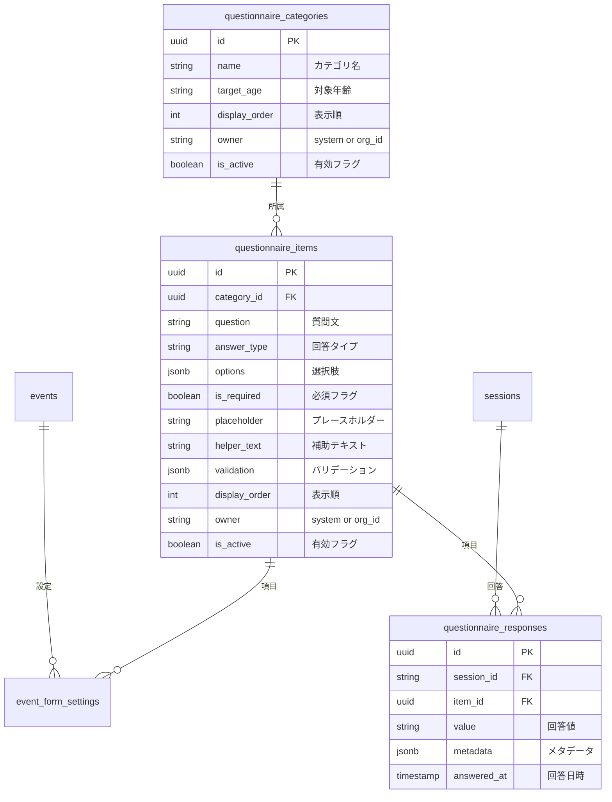

# 問診項目 DB設計書

**最終更新: 2024-12-06**

## 1. 設計方針

### 問題点（旧設計）

1. 問診項目がTypeScriptにハードコード → DB管理できない
2. 未就学児/小学生の切り替えがコードベース
3. 回答がJSONBで保存 → 集計・分析が困難

### 解決策

- 診断項目と同様の**マスタ/設定/データの3層構造**
- 対象年齢（target_age）でフィルタリング
- 回答を正規化テーブルに保存し、SQLで集計可能に

---

## 2. ER図



---

## 3. テーブル定義

### A. マスタ系（項目定義）

#### `questionnaire_categories` (問診カテゴリマスタ)

| カラム | 型 | 説明 |
|--------|-----|------|
| id | UUID (PK) | |
| name | VARCHAR(100) | カテゴリ名（例: 基本情報、睡眠） |
| description | TEXT | 説明 |
| target_age | VARCHAR(20) | 'preschool', 'elementary', 'all' |
| display_order | INTEGER | 表示順 |
| owner | VARCHAR(50) | 'system' or organization_id |
| is_active | BOOLEAN | 有効フラグ |
| created_at | TIMESTAMP | |
| updated_at | TIMESTAMP | |

**カテゴリ一覧（システム標準）:**

| 表示順 | カテゴリ名 | 対象年齢 |
|--------|-----------|----------|
| 1 | 基本情報 | all |
| 2 | きょうだい | preschool |
| 3 | スマホ・タブレット・TV視聴 | preschool |
| 4 | 睡眠の様子 | all |
| 5 | 睡眠時間 | all |
| 6 | 習い事 | all |
| 7 | 食事について | all |
| 8 | 食べ物の好み | preschool |
| 9 | 気になること | elementary |
| 10 | 同意事項 | all |

#### `questionnaire_items` (問診項目マスタ)

| カラム | 型 | 説明 |
|--------|-----|------|
| id | UUID (PK) | |
| category_id | UUID (FK) | カテゴリ |
| question | VARCHAR(500) | 質問文 |
| answer_type | VARCHAR(20) | radio/checkbox/text/number/textarea/select |
| options | JSONB | 選択肢 `[{value, label}]` |
| is_required | BOOLEAN | 必須フラグ |
| placeholder | VARCHAR(200) | プレースホルダー |
| helper_text | VARCHAR(500) | 補助テキスト |
| validation | JSONB | `{min, max, minLength, maxLength}` |
| display_order | INTEGER | 表示順 |
| owner | VARCHAR(50) | 'system' or organization_id |
| is_active | BOOLEAN | 有効フラグ |
| created_at | TIMESTAMP | |
| updated_at | TIMESTAMP | |

---

### B. 設定系

#### `event_form_settings` (イベント別フォーム設定)

問診・診断共通の設定テーブル。

| カラム | 型 | 説明 |
|--------|-----|------|
| id | UUID (PK) | |
| event_id | UUID (FK) | イベント |
| item_id | UUID | 項目ID |
| item_type | VARCHAR(20) | 'diagnosis' or 'questionnaire' |
| is_enabled | BOOLEAN | 使用フラグ |
| display_order | INTEGER | 表示順（上書き） |
| created_at | TIMESTAMP | |
| updated_at | TIMESTAMP | |

**UNIQUE制約**: (event_id, item_id, item_type)

---

### C. データ系

#### `questionnaire_responses` (問診回答データ)

| カラム | 型 | 説明 |
|--------|-----|------|
| id | UUID (PK) | |
| session_id | VARCHAR(10) (FK) | セッション |
| item_id | UUID (FK) | 問診項目 |
| value | TEXT | 回答値 |
| metadata | JSONB | 追加情報 |
| answered_at | TIMESTAMP | 回答日時 |
| created_at | TIMESTAMP | |

**UNIQUE制約**: (session_id, item_id)

---

## 4. データフロー

```
┌─────────────────────────────────────────────────────────────────┐
│                    親御さん問診画面                              │
│  ・対象年齢（未就学児/小学生）を選択                              │
│  ・該当カテゴリの項目を表示                                      │
└─────────────────────┬───────────────────────────────────────────┘
                      │ 回答入力
                      ▼
┌─────────────────────────────────────────────────────────────────┐
│              questionnaire_categories / questionnaire_items      │
│                      （マスタから項目取得）                       │
│              WHERE target_age = :age OR target_age = 'all'       │
└─────────────────────┬───────────────────────────────────────────┘
                      │ 回答保存
                      ▼
┌─────────────────────────────────────────────────────────────────┐
│                    questionnaire_responses                       │
│  ・session_id + item_id で一意                                  │
│  ・回答値を正規化して保存                                        │
└─────────────────────────────────────────────────────────────────┘
```

---

## 5. ビュー定義

### `event_questionnaire_items_view` (イベント用問診項目一覧)

```sql
SELECT 
  e.id as event_id,
  e.name as event_name,
  qc.id as category_id,
  qc.name as category_name,
  qc.target_age,
  qc.display_order as category_order,
  qi.id as item_id,
  qi.question,
  qi.answer_type,
  qi.options,
  qi.is_required,
  qi.placeholder,
  qi.helper_text,
  qi.validation,
  COALESCE(efs.display_order, qi.display_order) as item_order,
  COALESCE(efs.is_enabled, true) as is_enabled
FROM events e
CROSS JOIN questionnaire_items qi
JOIN questionnaire_categories qc ON qi.category_id = qc.id
LEFT JOIN event_form_settings efs 
  ON efs.event_id = e.id 
  AND efs.item_id = qi.id 
  AND efs.item_type = 'questionnaire'
WHERE qi.is_active = true
  AND qc.is_active = true;
```

### `questionnaire_results_view` (問診結果詳細)

```sql
SELECT 
  qr.session_id,
  s.parent_name,
  qc.name as category_name,
  qc.target_age,
  qc.display_order as category_order,
  qi.question,
  qi.answer_type,
  qr.value,
  qr.metadata,
  qr.answered_at,
  qi.display_order as item_order
FROM questionnaire_responses qr
JOIN sessions s ON qr.session_id = s.session_id
JOIN questionnaire_items qi ON qr.item_id = qi.id
JOIN questionnaire_categories qc ON qi.category_id = qc.id
ORDER BY qr.session_id, qc.display_order, qi.display_order;
```

---

## 6. クエリ例

### 対象年齢別の問診項目一覧を取得

```sql
SELECT 
  qc.name as category_name,
  qc.display_order as category_order,
  qi.id,
  qi.question,
  qi.answer_type,
  qi.options,
  qi.is_required,
  qi.display_order as item_order
FROM questionnaire_items qi
JOIN questionnaire_categories qc ON qi.category_id = qc.id
WHERE qi.is_active = true
  AND qc.is_active = true
  AND (qc.target_age = :target_age OR qc.target_age = 'all')
ORDER BY qc.display_order, qi.display_order;
```

### 特定セッションの問診結果を取得

```sql
SELECT 
  qc.name as category_name,
  qi.question,
  qr.value,
  qr.answered_at
FROM questionnaire_responses qr
JOIN questionnaire_items qi ON qr.item_id = qi.id
JOIN questionnaire_categories qc ON qi.category_id = qc.id
WHERE qr.session_id = :session_id
ORDER BY qc.display_order, qi.display_order;
```

### 問診項目ごとの回答集計

```sql
SELECT 
  qi.question,
  qr.value,
  COUNT(*) as count
FROM questionnaire_responses qr
JOIN questionnaire_items qi ON qr.item_id = qi.id
GROUP BY qi.question, qr.value
ORDER BY qi.question, count DESC;
```

---

## 7. マイグレーションファイル

| ファイル | 内容 |
|---------|------|
| `20241206000000_questionnaire_master_tables.sql` | カテゴリ、項目、回答、設定テーブル作成 |

---

## 8. シードデータ

`preschooler-form-schema.ts` と `elementary-form-schema.ts` の内容をDBに投入。

投入項目数:
- カテゴリ: 約10件
- 項目: 約30件

---

## 9. 対象年齢による項目制御

| カテゴリ | 未就学児 | 小学生 |
|---------|---------|--------|
| 基本情報 | ✅ | ✅ |
| きょうだい | ✅ | ❌ |
| スマホ・タブレット・TV視聴 | ✅ | ✅ |
| 睡眠の様子 | ✅ | ✅ |
| 睡眠時間 | ✅ | ✅ |
| 習い事 | ✅ | ✅ |
| 食事について | ✅ | ✅ |
| 食べ物の好み | ✅ | ❌ |
| 気になること | ❌ | ✅ |
| 同意事項 | ✅ | ✅ |

---

## 10. 権限マトリクス

| 操作 | cOralup管理者 | 医院管理者 | 親御さん |
|------|--------------|-----------|---------|
| カテゴリ追加 | ✅ | ❌ | ❌ |
| システム項目編集 | ✅ | ❌ | ❌ |
| 独自項目追加 | ✅ | ✅（owner付き） | ❌ |
| ラベル変更 | ✅ | ✅ | ❌ |
| 表示ON/OFF | ✅ | ✅ | ❌ |
| 回答入力 | ❌ | ❌ | ✅ |
| 回答閲覧 | ✅ | ✅（自組織のみ） | ✅（自分のみ） |

