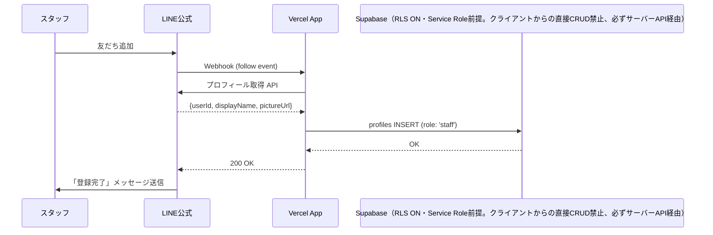
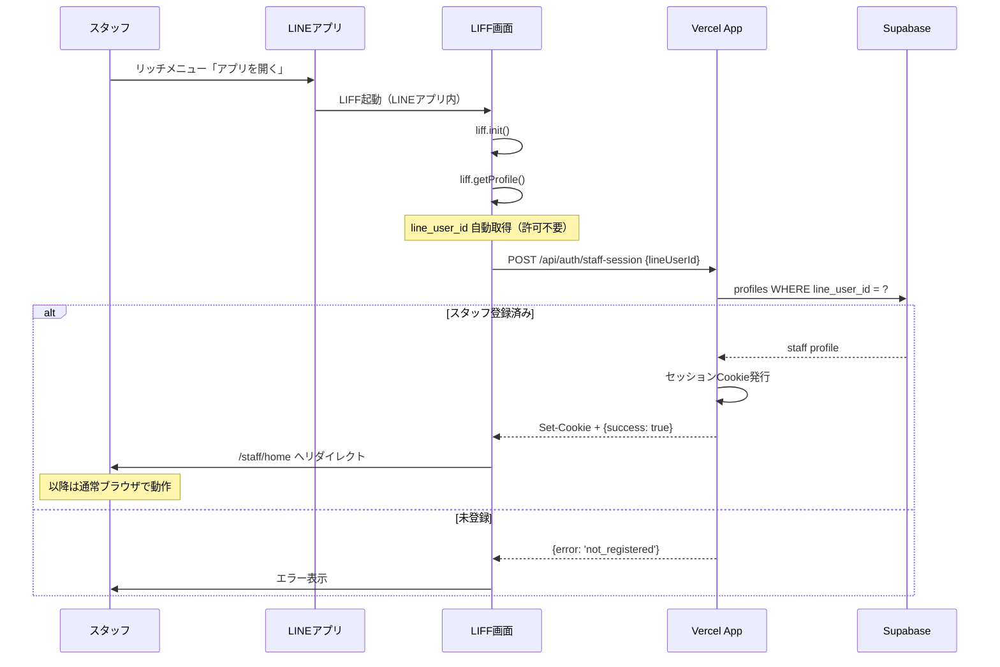

# スタッフLINE認証仕様書 (cOralup Platform)

**最終更新: 2024-12-08**

## 1. 概要

スタッフの識別・認証にLINE公式アカウント（Messaging API）+ LIFF（最小構成）を採用。
LIFFは初回ログイン時のみ使用し、以降は通常Webアプリ（Vercel）をブラウザで利用。

### 1.1 採用理由

| 観点 | LINE認証 | PIN + 名前選択 |
|------|----------|----------------|
| 識別精度 | line_user_idで100%確実 | 選び間違いリスクあり |
| なりすまし | 不可能 | 他人の名前選べてしまう |
| スタッフ追加 | 友だち追加で自動 | 手動でDB登録必要 |
| 運用コスト | 低い | 増減時に手動管理 |

### 1.2 なぜLIFF最小構成か

| 案 | チャネル数 | 初回UX | 実装コスト | 審査 |
|----|-----------|--------|-----------|------|
| Messaging + LINEログイン | 2つ | OAuth認可画面あり | 中 | 不要 |
| **Messaging + LIFF（初回のみ）** | **2つ** | **自動（許可不要）** | **低** ✅採用 | **不要** |
| LINEミニアプリ | 1つ | 自動 | 低 | 必要（1-2週間） |

- **Messaging API（友だち管理）+ LINE Login（LIFF認証）の2チャネル構成**
- LIFFはLINE Loginチャネル内で作成（Messaging APIチャネルでは不可）
- OAuth認証画面なし（LIFF内で自動認証）
- 2回目以降はCookieで認識（LIFFは初回のみ）
- **審査不要で即座に利用可能**（YourTIMEイベント対応に最適）

### 1.3 全体構成

```
┌─────────────────────────────────────────────────────────────────┐
│                         LINE Platform                          │
├─────────────────────────────────────────────────────────────────┤
│                                                                 │
│  ┌─────────────────────────────────────────────────────────┐   │
│  │         LINE公式アカウント「cOralupスタッフ」             │   │
│  │                   (Messaging API)                        │   │
│  │                                                          │   │
│  │  - 友だち追加Webhook → profiles作成                      │   │
│  │  - リッチメニュー → LIFF起動                             │   │
│  │  - LIFF（ログイン専用）→ line_user_id取得               │   │
│  │                                                          │   │
│  └──────────────────────────┬────────────────────────────────┘   │
│                             │                                   │
└─────────────────────────────┼───────────────────────────────────┘
                              │
              ┌───────────────┼───────────────┐
              │               │               │
              ↓               ↓               ↓
        友だち追加      初回ログイン     2回目以降
        (Webhook)       (LIFF)          (Cookie)
              │               │               │
              ↓               ↓               ↓
┌─────────────────────────────────────────────────────────────────┐
│                    Vercel (Next.js App)                         │
├─────────────────────────────────────────────────────────────────┤
│                                                                 │
│  /api/line/staff-webhook     - 友だち追加イベント処理           │
│  /api/auth/staff-session     - LIFF→セッション発行             │
│  /staff/liff-login           - LIFF専用ログイン画面（1画面のみ）│
│  /staff/home                 - ホーム画面（通常ブラウザ）       │
│  /staff/history              - 対応履歴一覧                     │
│  /staff/history/[sessionId]  - 対応詳細                         │
│                                                                 │
└─────────────────────────────────────────────────────────────────┘
              │
              ↓
┌─────────────────────────────────────────────────────────────────┐
│                         Supabase                                │
├─────────────────────────────────────────────────────────────────┤
│                                                                 │
│  profiles (role: 'staff')                                       │
│  ├── line_user_id  ← スタッフ識別キー                           │
│  ├── display_name                                               │
│  ├── first_name / last_name                                     │
│  └── avatar_url                                                 │
│                                                                 │
│  visits                                                         │
│  └── staff_profile_id  ← 対応スタッフ紐付け                     │
│                                                                 │
└─────────────────────────────────────────────────────────────────┘
```

---

## 2. LINE Developers 設定

### 2.1 必要なチャネル

| チャネル | 種類 | 用途 |
|----------|------|------|
| cOralupスタッフ | Messaging API | 友だち管理、通知送信、Webhook |
| cOralupスタッフ（ログイン用） | LINE Login | LIFFアプリ、認証 |

**📌 採用理由**: YourTIMEイベント（2024/12/21）まで時間がないため、審査不要で即座に利用可能な2チャネル構成を採用。将来的にはLINEミニアプリ（1チャネル構成）への移行を検討。

**⚠️ 重要**: LINEの仕様変更（2019/11/11）により、Messaging APIチャネルではLIFFアプリを追加できません。LINE Loginチャネルを別途作成する必要があります。

### 2.2 Messaging API チャネル設定

```yaml
チャネル名: cOralupスタッフ
チャネルタイプ: Messaging API
プロバイダー: cOralup

Webhook URL: https://your-app.vercel.app/api/line/staff-webhook
Webhook利用: ON
応答メッセージ: OFF（または適切なメッセージ設定）
```

### 2.3 LINE Login チャネル設定

```yaml
チャネル名: cOralupスタッフ（ログイン用）
チャネルタイプ: LINE Login
プロバイダー: cOralup

コールバックURL: https://your-app.vercel.app/staff/liff-login
スコープ: profile（プロフィール取得のみ）
```

### 2.4 LIFF設定（LINE Loginチャネル内）

```yaml
LIFFアプリ名: スタッフログイン
エンドポイントURL: https://your-app.vercel.app/staff/liff-login
サイズ: Full（全画面）
Scope: profile（プロフィール取得のみ）
ボットリンク機能: On (normal)
```

**注**: LIFFはLINE Loginチャネル内で作成します。

### 2.4 リッチメニュー設定

```yaml
メニュー名: スタッフメニュー
ボタン:
  - 名前: 「アプリを開く」
    アクション: URI
    URI: https://liff.line.me/{LIFF_ID}  ← LIFF URLを設定
```

**注**: 初回はLIFFで開く。2回目以降はブックマークからも可。

---

## 3. 環境変数

```env
# スタッフ用LINE Messaging API（友だち管理・Webhook用）
LINE_STAFF_CHANNEL_ID=xxxxx
LINE_STAFF_CHANNEL_SECRET=xxxxx
LINE_STAFF_CHANNEL_ACCESS_TOKEN=xxxxx

# スタッフ用LINE Login（LIFF認証用）
# 注意: LINE Loginチャネルは別途作成が必要（Messaging APIチャネルとは別）
LINE_STAFF_LOGIN_CHANNEL_ID=xxxxx
LINE_STAFF_LOGIN_CHANNEL_SECRET=xxxxx

# LIFF ID（LINE Loginチャネル内でLIFFアプリ作成時に発行）
NEXT_PUBLIC_STAFF_LIFF_ID=xxxxx-xxxxx

# セッション暗号化キー（JWT署名用）
STAFF_SESSION_SECRET=your-random-secret-key

# cOralup組織ID（profiles.organization_id用）
CORALUP_ORG_ID=xxxxx
```

**環境変数設定手順:**
1. LINE Developers ConsoleでMessaging APIチャネル作成 → `LINE_STAFF_CHANNEL_*` を取得
2. LINE Developers ConsoleでLINE Loginチャネル作成 → `LINE_STAFF_LOGIN_CHANNEL_*` を取得
3. LINE Loginチャネル内でLIFFアプリ作成 → `NEXT_PUBLIC_STAFF_LIFF_ID` を取得
4. `STAFF_SESSION_SECRET` は `openssl rand -hex 32` で生成
5. Vercel環境変数とローカル `.env.local` に設定

---

## 4. 認証フロー

### 4.1 初回セットアップフロー



### 4.2 初回ログインフロー（LIFF）



### 4.3 2回目以降のアクセス

```
ブックマーク or URL直接
    ↓
/staff/home
    ↓
Cookie有効? → Yes → そのまま表示
    ↓ No
/staff/login へリダイレクト
    ↓
「LINEアプリでログイン」案内
```

---

## 5. API設計

### 5.1 スタッフ用Webhook

```typescript
// src/app/api/line/staff-webhook/route.ts

import { NextRequest, NextResponse } from 'next/server'
import crypto from 'crypto'
import { supabase } from '@/lib/supabase'

export async function POST(request: NextRequest) {
  const body = await request.text()
  const signature = request.headers.get('x-line-signature')
  
  // 署名検証
  const hash = crypto
    .createHmac('SHA256', process.env.LINE_STAFF_CHANNEL_SECRET!)
    .update(body)
    .digest('base64')
  
  if (hash !== signature) {
    return NextResponse.json({ error: 'Invalid signature' }, { status: 401 })
  }
  
  const events = JSON.parse(body).events
  
  for (const event of events) {
    if (event.type === 'follow') {
      await handleFollow(event)
    } else if (event.type === 'unfollow') {
      await handleUnfollow(event)
    }
  }
  
  return NextResponse.json({ success: true })
}

async function handleFollow(event: any) {
  const userId = event.source.userId
  
  // LINEプロフィール取得
  const profile = await fetch(`https://api.line.me/v2/bot/profile/${userId}`, {
    headers: {
      Authorization: `Bearer ${process.env.LINE_STAFF_CHANNEL_ACCESS_TOKEN}`
    }
  }).then(res => res.json())
  
  // profiles に登録（既存チェック付き）
  const { data: existing } = await supabase
    .from('profiles')
    .select('id')
    .eq('line_user_id', userId)
    .single()
  
  if (!existing) {
    await supabase.from('profiles').insert({
      line_user_id: userId,
      display_name: profile.displayName,
      avatar_url: profile.pictureUrl,
      role: 'staff',
      organization_id: process.env.CORALUP_ORG_ID
    })
    
    // 登録完了メッセージ送信
    await sendLineMessage(userId, 
      `${profile.displayName}さん、cOralupスタッフとして登録されました！\n\n下のメニューから「アプリを開く」をタップしてログインしてください。`
    )
  }
}

async function handleUnfollow(event: any) {
  const userId = event.source.userId
  
  // スタッフ削除ではなく、フラグ更新に留める
  await supabase
    .from('profiles')
    .update({ is_active: false })
    .eq('line_user_id', userId)
    .eq('role', 'staff')
}

async function sendLineMessage(userId: string, text: string) {
  await fetch('https://api.line.me/v2/bot/message/push', {
    method: 'POST',
    headers: {
      'Content-Type': 'application/json',
      Authorization: `Bearer ${process.env.LINE_STAFF_CHANNEL_ACCESS_TOKEN}`
    },
    body: JSON.stringify({
      to: userId,
      messages: [{ type: 'text', text }]
    })
  })
}
```

### 5.2 セッション発行API（LIFF用）

```typescript
// src/app/api/auth/staff-session/route.ts

import { NextRequest, NextResponse } from 'next/server'
import { cookies } from 'next/headers'
import { SignJWT } from 'jose'
import { supabase } from '@/lib/supabase'

export async function POST(request: NextRequest) {
  try {
    const { lineUserId } = await request.json()
    
    if (!lineUserId) {
      return NextResponse.json(
        { error: 'lineUserId is required' },
        { status: 400 }
      )
    }
    
    // DBでスタッフ確認
    const { data: staff, error } = await supabase
      .from('profiles')
      .select('id, display_name, first_name, last_name, avatar_url, role, is_active')
      .eq('line_user_id', lineUserId)
      .eq('role', 'staff')
      .single()
    
    if (error || !staff) {
      return NextResponse.json(
        { error: 'not_registered' },
        { status: 404 }
      )
    }
    
    if (staff.is_active === false) {
      return NextResponse.json(
        { error: 'account_inactive' },
        { status: 403 }
      )
    }
    
    // セッショントークン生成
    const secret = new TextEncoder().encode(process.env.STAFF_SESSION_SECRET)
    const token = await new SignJWT({
      staffId: staff.id,
      staffName: staff.display_name || `${staff.last_name || ''}${staff.first_name || ''}`.trim() || 'スタッフ',
      role: staff.role
    })
      .setProtectedHeader({ alg: 'HS256' })
      .setIssuedAt()
      .setExpirationTime('7d')
      .sign(secret)
    
    // Cookie設定
    const cookieStore = await cookies()
    cookieStore.set('staff_session', token, {
      httpOnly: true,
      secure: process.env.NODE_ENV === 'production',
      sameSite: 'lax',
      maxAge: 7 * 24 * 60 * 60, // 7日
      path: '/'
    })
    
    return NextResponse.json({
      success: true,
      staff: {
        id: staff.id,
        name: staff.display_name || `${staff.last_name || ''}${staff.first_name || ''}`.trim()
      }
    })
    
  } catch (error) {
    console.error('Session creation error:', error)
    return NextResponse.json(
      { error: 'internal_error' },
      { status: 500 }
    )
  }
}
```

### 5.3 セッション検証ユーティリティ

```typescript
// src/lib/staff-auth.ts

import { cookies } from 'next/headers'
import { jwtVerify } from 'jose'

export interface StaffSession {
  staffId: string
  staffName: string
  role: string
}

export async function getStaffSession(): Promise<StaffSession | null> {
  const cookieStore = await cookies()
  const token = cookieStore.get('staff_session')?.value
  
  if (!token) return null
  
  try {
    const secret = new TextEncoder().encode(process.env.STAFF_SESSION_SECRET)
    const { payload } = await jwtVerify(token, secret)
    
    return {
      staffId: payload.staffId as string,
      staffName: payload.staffName as string,
      role: payload.role as string
    }
  } catch {
    return null
  }
}

export async function requireStaffSession(): Promise<StaffSession> {
  const session = await getStaffSession()
  if (!session) {
    throw new Error('Unauthorized')
  }
  return session
}
```

### 5.4 対応履歴API

```typescript
// src/app/api/staff/history/route.ts

import { NextRequest, NextResponse } from 'next/server'
import { supabase } from '@/lib/supabase'
import { requireStaffSession } from '@/lib/staff-auth'

export async function GET(request: NextRequest) {
  try {
    const session = await requireStaffSession()
    
    const { data, error } = await supabase
      .from('visits')
      .select(`
        id,
        visit_date,
        status,
        reception_number,
        session_id,
        children (
          id,
          first_name,
          last_name,
          birthday
        ),
        sessions (
          status,
          created_at
        )
      `)
      .eq('staff_profile_id', session.staffId)
      .order('visit_date', { ascending: false })
      .limit(50)
    
    if (error) throw error
    
    return NextResponse.json({ data })
  } catch (error) {
    return NextResponse.json(
      { error: 'Unauthorized' },
      { status: 401 }
    )
  }
}
```

---

## 6. 画面設計

### 6.1 LIFFログイン画面 `/staff/liff-login`（初回のみ）

```typescript
// src/app/staff/liff-login/page.tsx

'use client'

import { useEffect, useState } from 'react'
import { useRouter } from 'next/navigation'

export default function LiffLoginPage() {
  const router = useRouter()
  const [status, setStatus] = useState<'loading' | 'error' | 'not_registered'>('loading')
  const [errorMessage, setErrorMessage] = useState('')

  useEffect(() => {
    const initLiff = async () => {
      try {
        const liff = (await import('@line/liff')).default
        
        await liff.init({ 
          liffId: process.env.NEXT_PUBLIC_STAFF_LIFF_ID! 
        })
        
        // LINEログインしていない場合
        if (!liff.isLoggedIn()) {
          liff.login({ redirectUri: window.location.href })
          return
        }
        
        // プロフィール取得
        const profile = await liff.getProfile()
        
        // セッション発行API呼び出し
        const res = await fetch('/api/auth/staff-session', {
          method: 'POST',
          headers: { 'Content-Type': 'application/json' },
          body: JSON.stringify({ lineUserId: profile.userId })
        })
        
        const data = await res.json()
        
        if (res.ok && data.success) {
          // 成功 → ホームへ（通常ブラウザで開く）
          // LIFF内でもwindow.location.hrefで遷移可能
          window.location.href = '/staff/home'
        } else if (data.error === 'not_registered') {
          setStatus('not_registered')
        } else {
          setStatus('error')
          setErrorMessage(data.error || '認証に失敗しました')
        }
        
      } catch (error) {
        console.error('LIFF init error:', error)
        setStatus('error')
        setErrorMessage('LIFFの初期化に失敗しました')
      }
    }
    
    initLiff()
  }, [])

  if (status === 'loading') {
    return (
      <div className="min-h-screen flex flex-col items-center justify-center bg-gray-50">
        <div className="animate-spin rounded-full h-12 w-12 border-4 border-blue-500 border-t-transparent"></div>
        <p className="mt-4 text-gray-600">ログイン中...</p>
      </div>
    )
  }

  if (status === 'not_registered') {
    return (
      <div className="min-h-screen flex flex-col items-center justify-center bg-gray-50 p-4">
        <div className="bg-white rounded-xl shadow-lg p-6 max-w-sm w-full text-center">
          <div className="text-5xl mb-4">😢</div>
          <h1 className="text-xl font-bold text-gray-900 mb-2">未登録です</h1>
          <p className="text-gray-600 mb-4">
            スタッフとして登録されていません。<br/>
            LINE公式アカウント「cOralupスタッフ」を<br/>
            友だち追加してください。
          </p>
        </div>
      </div>
    )
  }

  return (
    <div className="min-h-screen flex flex-col items-center justify-center bg-gray-50 p-4">
      <div className="bg-white rounded-xl shadow-lg p-6 max-w-sm w-full text-center">
        <div className="text-5xl mb-4">⚠️</div>
        <h1 className="text-xl font-bold text-gray-900 mb-2">エラー</h1>
        <p className="text-gray-600 mb-4">{errorMessage}</p>
        <button
          onClick={() => window.location.reload()}
          className="bg-blue-500 text-white px-6 py-2 rounded-lg"
        >
          再試行
        </button>
      </div>
    </div>
  )
}
```

### 6.2 ログイン案内画面 `/staff/login`（Cookie切れ時）

```typescript
// src/app/staff/login/page.tsx

'use client'

export default function StaffLoginPage() {
  const liffUrl = `https://liff.line.me/${process.env.NEXT_PUBLIC_STAFF_LIFF_ID}`
  
  return (
    <div className="min-h-screen flex flex-col items-center justify-center bg-gray-50 p-4">
      <div className="w-full max-w-sm">
        <div className="text-center mb-8">
          <h1 className="text-2xl font-bold text-gray-900">cOralup Staff</h1>
          <p className="text-gray-600 mt-2">スタッフ専用アプリ</p>
        </div>
        
        <div className="bg-white rounded-xl shadow p-6 text-center">
          <p className="text-gray-600 mb-4">
            セッションが切れました。<br/>
            LINEからログインしてください。
          </p>
          
          <a
            href={liffUrl}
            className="w-full flex items-center justify-center gap-2 bg-[#06C755] hover:bg-[#05b04c] text-white font-medium py-3 px-4 rounded-lg transition-colors"
          >
            <svg className="w-6 h-6" viewBox="0 0 24 24" fill="currentColor">
              <path d="M19.365 9.863c.349 0 .63.285.63.631 0 .345-.281.63-.63.63H17.61v1.125h1.755c.349 0 .63.283.63.63 0 .344-.281.629-.63.629h-2.386c-.345 0-.627-.285-.627-.629V8.108c0-.345.282-.63.627-.63h2.386c.349 0 .63.285.63.63 0 .349-.281.63-.63.63H17.61v1.125h1.755zm-3.855 3.016c0 .27-.174.51-.432.596-.064.021-.133.031-.199.031-.211 0-.391-.09-.51-.25l-2.443-3.317v2.94c0 .344-.279.629-.631.629-.346 0-.626-.285-.626-.629V8.108c0-.27.173-.51.43-.595.06-.023.136-.033.194-.033.195 0 .375.104.495.254l2.462 3.33V8.108c0-.345.282-.63.63-.63.345 0 .63.285.63.63v4.771zm-5.741 0c0 .344-.282.629-.631.629-.345 0-.627-.285-.627-.629V8.108c0-.345.282-.63.627-.63.349 0 .631.285.631.63v4.771zm-2.466.629H4.917c-.345 0-.63-.285-.63-.629V8.108c0-.345.285-.63.63-.63.348 0 .63.285.63.63v4.141h1.756c.348 0 .629.283.629.63 0 .344-.281.629-.629.629M24 10.314C24 4.943 18.615.572 12 .572S0 4.943 0 10.314c0 4.811 4.27 8.842 10.035 9.608.391.082.923.258 1.058.59.12.301.079.766.038 1.08l-.164 1.02c-.045.301-.24 1.186 1.049.645 1.291-.539 6.916-4.078 9.436-6.975C23.176 14.393 24 12.458 24 10.314"/>
            </svg>
            LINEでログイン
          </a>
        </div>
        
        <p className="text-center text-sm text-gray-500 mt-6">
          初めての方は先にLINE公式アカウント<br/>
          「cOralupスタッフ」を友だち追加してください
        </p>
      </div>
    </div>
  )
}
```

### 6.3 ホーム画面 `/staff/home`

```typescript
// src/app/staff/home/page.tsx

import { redirect } from 'next/navigation'
import { getStaffSession } from '@/lib/staff-auth'
import { supabase } from '@/lib/supabase'
import Link from 'next/link'

export default async function StaffHomePage() {
  const session = await getStaffSession()
  
  if (!session) {
    redirect('/staff/login')
  }
  
  // 最近の対応を取得
  const { data: recentVisits } = await supabase
    .from('visits')
    .select(`
      id,
      visit_date,
      status,
      session_id,
      children (first_name, last_name, birthday)
    `)
    .eq('staff_profile_id', session.staffId)
    .order('visit_date', { ascending: false })
    .limit(5)
  
  return (
    <div className="min-h-screen bg-gray-50">
      {/* ヘッダー */}
      <header className="bg-white shadow-sm">
        <div className="px-4 py-4">
          <h1 className="text-lg font-bold">cOralup Staff</h1>
          <p className="text-sm text-gray-600">ようこそ、{session.staffName}さん</p>
        </div>
      </header>
      
      {/* メインメニュー */}
      <div className="p-4">
        <div className="grid grid-cols-2 gap-4">
          <Link
            href="/staff/session/new"
            className="bg-blue-500 hover:bg-blue-600 text-white rounded-xl p-6 text-center transition-colors"
          >
            <div className="text-3xl mb-2">📷</div>
            <div className="font-medium">QRスキャン</div>
          </Link>
          
          <Link
            href="/staff/history"
            className="bg-white hover:bg-gray-50 border rounded-xl p-6 text-center transition-colors"
          >
            <div className="text-3xl mb-2">📋</div>
            <div className="font-medium text-gray-700">対応履歴</div>
          </Link>
        </div>
      </div>
      
      {/* 最近の対応 */}
      <div className="p-4">
        <h2 className="text-sm font-medium text-gray-500 mb-2">最近の対応</h2>
        <div className="bg-white rounded-xl divide-y">
          {recentVisits?.map((visit) => {
            const child = visit.children as any
            const age = child?.birthday 
              ? Math.floor((Date.now() - new Date(child.birthday).getTime()) / (365.25 * 24 * 60 * 60 * 1000))
              : null
            
            return (
              <Link
                key={visit.id}
                href={`/staff/history/${visit.session_id}`}
                className="flex items-center justify-between p-4 hover:bg-gray-50"
              >
                <div>
                  <div className="font-medium">
                    {child?.last_name}{child?.first_name}
                    {age !== null && <span className="text-gray-500 ml-1">({age}歳)</span>}
                  </div>
                  <div className="text-sm text-gray-500">
                    {new Date(visit.visit_date).toLocaleString('ja-JP')}
                  </div>
                </div>
                <div className="text-gray-400">→</div>
              </Link>
            )
          })}
          
          {(!recentVisits || recentVisits.length === 0) && (
            <div className="p-4 text-center text-gray-500">
              まだ対応履歴がありません
            </div>
          )}
        </div>
      </div>
    </div>
  )
}
```

### 6.4 履歴一覧画面 `/staff/history`

```typescript
// src/app/staff/history/page.tsx

import { redirect } from 'next/navigation'
import { getStaffSession } from '@/lib/staff-auth'
import { supabase } from '@/lib/supabase'
import Link from 'next/link'

export default async function StaffHistoryPage() {
  const session = await getStaffSession()
  
  if (!session) {
    redirect('/staff/login')
  }
  
  const { data: visits } = await supabase
    .from('visits')
    .select(`
      id,
      visit_date,
      status,
      session_id,
      children (
        id,
        first_name,
        last_name,
        birthday
      )
    `)
    .eq('staff_profile_id', session.staffId)
    .order('visit_date', { ascending: false })
    .limit(50)
  
  return (
    <div className="min-h-screen bg-gray-50">
      <header className="bg-white shadow-sm sticky top-0">
        <div className="flex items-center px-4 py-4">
          <Link href="/staff/home" className="text-blue-500 mr-4">
            ← 戻る
          </Link>
          <h1 className="text-lg font-bold">対応履歴</h1>
        </div>
      </header>
      
      <div className="p-4">
        <div className="bg-white rounded-xl divide-y">
          {visits?.map((visit) => {
            const child = visit.children as any
            const age = child?.birthday 
              ? Math.floor((Date.now() - new Date(child.birthday).getTime()) / (365.25 * 24 * 60 * 60 * 1000))
              : null
            
            return (
              <Link
                key={visit.id}
                href={`/staff/history/${visit.session_id}`}
                className="flex items-center justify-between p-4 hover:bg-gray-50"
              >
                <div>
                  <div className="font-medium">
                    {child?.last_name}{child?.first_name}
                    {age !== null && <span className="text-gray-500 ml-1">({age}歳)</span>}
                  </div>
                  <div className="text-sm text-gray-500">
                    {new Date(visit.visit_date).toLocaleDateString('ja-JP')}
                  </div>
                </div>
                <div className="flex items-center gap-2">
                  <span className={`text-xs px-2 py-1 rounded ${
                    visit.status === 'completed' ? 'bg-green-100 text-green-700' :
                    visit.status === 'report_sent' ? 'bg-blue-100 text-blue-700' :
                    'bg-gray-100 text-gray-600'
                  }`}>
                    {visit.status === 'completed' ? '完了' :
                     visit.status === 'report_sent' ? '送信済' :
                     visit.status}
                  </span>
                  <span className="text-gray-400">→</span>
                </div>
              </Link>
            )
          })}
          
          {(!visits || visits.length === 0) && (
            <div className="p-4 text-center text-gray-500">
              対応履歴がありません
            </div>
          )}
        </div>
      </div>
    </div>
  )
}
```

### 6.5 詳細画面 `/staff/history/[sessionId]`

```typescript
// src/app/staff/history/[sessionId]/page.tsx

import { redirect, notFound } from 'next/navigation'
import { getStaffSession } from '@/lib/staff-auth'
import { supabase } from '@/lib/supabase'
import Link from 'next/link'

export default async function StaffHistoryDetailPage({
  params
}: {
  params: { sessionId: string }
}) {
  const session = await getStaffSession()
  
  if (!session) {
    redirect('/staff/login')
  }
  
  const { sessionId } = params
  
  // セッション情報取得
  const { data: sessionData } = await supabase
    .from('sessions')
    .select('*')
    .eq('session_id', sessionId)
    .single()
  
  if (!sessionData) {
    notFound()
  }
  
  // 問診回答取得
  const { data: questionnaireResponses } = await supabase
    .from('questionnaire_responses')
    .select(`
      id,
      value,
      questionnaire_items (
        question,
        category_id,
        questionnaire_categories (name)
      )
    `)
    .eq('session_id', sessionId)
  
  // 診断回答取得
  const { data: diagnosisResponses } = await supabase
    .from('diagnosis_responses')
    .select(`
      id,
      value,
      diagnosis_items (
        question,
        category_id,
        diagnosis_categories (name)
      )
    `)
    .eq('session_id', sessionId)
  
  return (
    <div className="min-h-screen bg-gray-50">
      <header className="bg-white shadow-sm sticky top-0">
        <div className="flex items-center px-4 py-4">
          <Link href="/staff/history" className="text-blue-500 mr-4">
            ← 戻る
          </Link>
          <h1 className="text-lg font-bold">対応詳細</h1>
        </div>
      </header>
      
      <div className="p-4 space-y-4">
        {/* 基本情報 */}
        <div className="bg-white rounded-xl p-4">
          <h2 className="font-medium mb-2">基本情報</h2>
          <dl className="text-sm space-y-1">
            <div className="flex justify-between">
              <dt className="text-gray-500">セッションID</dt>
              <dd>{sessionId}</dd>
            </div>
            <div className="flex justify-between">
              <dt className="text-gray-500">対応日時</dt>
              <dd>{new Date(sessionData.created_at).toLocaleString('ja-JP')}</dd>
            </div>
            <div className="flex justify-between">
              <dt className="text-gray-500">ステータス</dt>
              <dd>{sessionData.status}</dd>
            </div>
          </dl>
        </div>
        
        {/* 問診結果 */}
        <div className="bg-white rounded-xl p-4">
          <h2 className="font-medium mb-2">問診結果</h2>
          {questionnaireResponses && questionnaireResponses.length > 0 ? (
            <dl className="text-sm space-y-2">
              {questionnaireResponses.map((r) => {
                const item = r.questionnaire_items as any
                return (
                  <div key={r.id} className="flex justify-between">
                    <dt className="text-gray-500">{item?.question}</dt>
                    <dd>{r.value}</dd>
                  </div>
                )
              })}
            </dl>
          ) : (
            <p className="text-sm text-gray-500">問診データなし</p>
          )}
        </div>
        
        {/* 診断結果 */}
        <div className="bg-white rounded-xl p-4">
          <h2 className="font-medium mb-2">診断結果</h2>
          {diagnosisResponses && diagnosisResponses.length > 0 ? (
            <dl className="text-sm space-y-2">
              {diagnosisResponses.map((r) => {
                const item = r.diagnosis_items as any
                return (
                  <div key={r.id} className="flex justify-between">
                    <dt className="text-gray-500">{item?.question}</dt>
                    <dd>{r.value}</dd>
                  </div>
                )
              })}
            </dl>
          ) : (
            <p className="text-sm text-gray-500">診断データなし</p>
          )}
        </div>
        
        {/* レポートリンク */}
        <Link
          href={`/staff/report/${sessionId}`}
          className="block bg-blue-500 text-white text-center py-3 rounded-xl font-medium"
        >
          レポートを見る
        </Link>
      </div>
    </div>
  )
}
```

---

## 7. DB変更

### 7.1 profiles テーブル追加カラム

```sql
-- profiles に is_active カラム追加（未追加の場合）
ALTER TABLE profiles ADD COLUMN IF NOT EXISTS is_active BOOLEAN DEFAULT true;

-- インデックス追加
CREATE INDEX IF NOT EXISTS idx_profiles_line_user_id_role 
ON profiles(line_user_id, role);
```

### 7.2 診断時のスタッフ紐付け

診断開始時（QRスキャン時）に `visits.staff_profile_id` を設定する。

```typescript
// 診断開始時
const startDiagnosis = async (sessionId: string, staffId: string) => {
  // visits レコード作成 or 更新
  await supabase
    .from('visits')
    .upsert({
      session_id: sessionId,
      staff_profile_id: staffId,
      visit_date: new Date().toISOString(),
      status: 'in_progress'
    }, {
      onConflict: 'session_id'
    })
}
```

---

## 8. セキュリティ考慮

| 項目 | 対策 |
|------|------|
| セッションハイジャック | httpOnly Cookie + HTTPS |
| CSRF | SameSite=Lax |
| トークン漏洩 | 7日間有効期限 + JWT署名検証 |
| 権限昇格 | role確認（staff以外は拒否） |
| LIFF偽装 | line_user_idはLINE Platform経由でのみ取得可能 |

---

## 9. 運用手順

### 9.1 新スタッフ追加

1. スタッフに「cOralupスタッフ」LINE公式のQRコードを渡す
2. 友だち追加してもらう
3. 自動で profiles に登録される
4. リッチメニューからアプリを開いてもらう（初回はLIFF）
5. 2回目以降はブックマークからでもOK

### 9.2 スタッフ削除

1. LINE公式からブロックしてもらう（自動で is_active = false）
2. または管理画面から `is_active = false` に設定

---

## 10. 今後の拡張

| Phase | 機能 |
|-------|------|
| Phase 2 | スタッフへの通知（対応完了時） |
| Phase 3 | リーダー向け全員履歴閲覧 |
| Phase 4 | トレーナー向けLINE統合 |
