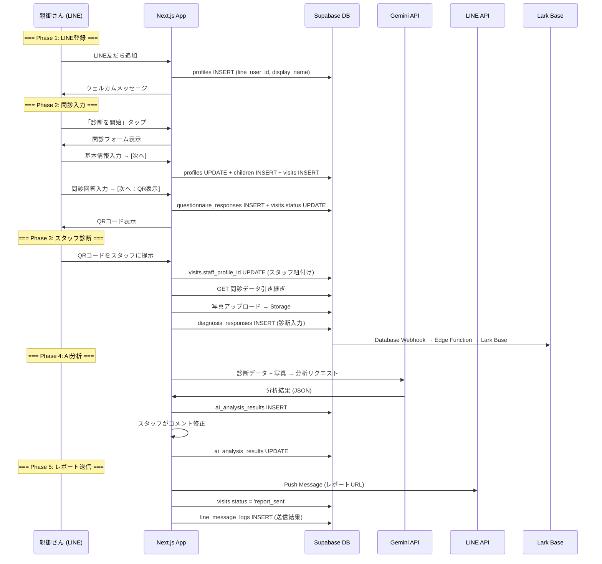

# 本番テストフロー仕様書

**最終更新: 2024-12-09**

---

## 1. 概要

### 1.1 目的
YourTIMEイベント（2024/12/21）に向けて、本番環境（id URL）で実データフローをテストし、全機能の動作を確認する。

### 1.2 環境方針

| 環境 | URL例 | 用途 | DB接続 |
|------|-------|------|--------|
| **demo** | `/demo/...` | UI確認、営業デモ | なし（モック） |
| **本番** | `/{id}/...` | 実データフロー、テスト、本番運用 | Supabase本番 |

**結論**: 初回イベント前は **本番環境（id URL）でテスト** を行う。理由：
- データが少ない今がチャンス（テストデータは後でクリア可能）
- LINE連携、Storage、AI分析はモックでは確認不可
- 二重メンテ回避

---

## 2. 全体データフロー



---

## 3. Phase別 詳細仕様

### 3.1 Phase 1: LINE登録

#### 処理フロー
```
1. 親御さんがLINE公式アカウントを友だち追加
2. LINE Webhook → POST /api/line/webhook
3. profiles テーブルに即時INSERT
   - line_user_id: LINE User ID
   - display_name: LINEの表示名
   - role: 'parent'
4. ウェルカムメッセージ送信
```

#### DB操作
```sql
INSERT INTO profiles (
  id, line_user_id, display_name, role, organization_id
) VALUES (
  gen_random_uuid(), 
  'U1234567890abcdef', 
  'LINE太郎',
  'parent',
  (SELECT id FROM organizations WHERE slug = 'coralup')
);
```

#### 確認項目
- [ ] 友だち追加後、profiles に即時登録されるか
- [ ] display_name が正しく取得されるか
- [ ] ウェルカムメッセージが送信されるか

---

### 3.2 Phase 2: 問診入力

#### 処理フロー
```
1. 親御さんが「診断を開始」ボタンをタップ
2. 問診フォーム（基本情報）表示
3. 基本情報入力 → [次へ] ボタン
   → POST /api/parent/basic-info
   → profiles UPDATE (電話番号等)
   → children INSERT (お子様情報)
   → visits INSERT (来場記録)
4. 問診回答入力 → [次へ：QR表示] ボタン
   → POST /api/parent/questionnaire
   → questionnaire_responses INSERT (回答)
   → visits.status = 'questionnaire_completed'
5. QRコード表示（visit_id をエンコード）
```

#### DB操作 (基本情報)
```sql
-- profiles 更新
UPDATE profiles SET
  name = '保護者 太郎',
  phone = '090-1234-5678'
WHERE line_user_id = 'U1234567890abcdef';

-- children 作成
INSERT INTO children (
  id, parent_profile_id, name, birthday, gender
) VALUES (
  gen_random_uuid(),
  (SELECT id FROM profiles WHERE line_user_id = 'U1234567890abcdef'),
  'お子様 花子',
  '2018-05-15',
  'female'
);

-- visits 作成
INSERT INTO visits (
  id, child_id, event_id, status
) VALUES (
  gen_random_uuid(),
  :child_id,
  (SELECT id FROM events WHERE slug = 'yourtime-2024'),
  'registered'
);
```

#### DB操作 (問診回答)
```sql
-- questionnaire_responses 作成（正規化）
INSERT INTO questionnaire_responses (
  id, visit_id, item_id, value
) VALUES
  (gen_random_uuid(), :visit_id, :item_uuid_1, 'yes'),
  (gen_random_uuid(), :visit_id, :item_uuid_2, 'snoring,prone'),
  (gen_random_uuid(), :visit_id, :item_uuid_3, 'mouth_breathing');

-- visits ステータス更新
UPDATE visits SET
  status = 'questionnaire_completed',
  questionnaire_completed_at = NOW()
WHERE id = :visit_id;
```

#### 確認項目
- [ ] 基本情報が profiles, children, visits に正しく保存されるか
- [ ] 問診回答が questionnaire_responses に正しく保存されるか
- [ ] QRコードに正しい visit_id が含まれるか
- [ ] visits.status が 'questionnaire_completed' に更新されるか

---

### 3.3 Phase 3: スタッフ診断

#### 処理フロー
```
1. スタッフがQRコードをスキャン
   → GET /api/staff/session?visit_id=xxx
   → 問診データ取得・表示
2. スタッフ紐付け
   → visits.staff_profile_id = スタッフのprofile_id
3. 写真撮影
   → POST /api/upload → Supabase Storage
   → visit_photos INSERT
4. 診断入力
   → 項目変更のたびに Auto Save
   → diagnosis_responses INSERT/UPDATE
5. 診断完了
   → visits.status = 'diagnosis_completed'
```

#### DB操作 (スタッフ紐付け)
```sql
UPDATE visits SET
  staff_profile_id = :staff_profile_id,
  diagnosis_started_at = NOW()
WHERE id = :visit_id;
```

#### DB操作 (写真保存)
```sql
INSERT INTO visit_photos (
  id, visit_id, photo_type, storage_path, url
) VALUES (
  gen_random_uuid(),
  :visit_id,
  'front_posture',
  'visits/:visit_id/front_posture.jpg',
  'https://xxx.supabase.co/storage/v1/object/public/photos/...'
);
```

#### DB操作 (診断回答)
```sql
-- diagnosis_responses 作成（正規化）
INSERT INTO diagnosis_responses (
  id, visit_id, item_id, value, staff_profile_id
) VALUES
  (gen_random_uuid(), :visit_id, :item_uuid_1, 'yes', :staff_id),
  (gen_random_uuid(), :visit_id, :item_uuid_2, 'mild', :staff_id),
  (gen_random_uuid(), :visit_id, :item_uuid_3, 'mouth', :staff_id);

-- visits ステータス更新
UPDATE visits SET
  status = 'diagnosis_completed',
  diagnosis_completed_at = NOW()
WHERE id = :visit_id;
```

#### Lark同期（リアルタイム）
```
visits テーブル UPDATE
    ↓ Database Webhook
Supabase Edge Function (sync-to-lark)
    ↓ Lark Base API
Lark Base「来場者ログ」テーブルに反映
```

#### 確認項目
- [ ] QRスキャンで問診データが正しく引き継がれるか
- [ ] スタッフ紐付けが正しく行われるか
- [ ] 写真がSupabase Storageに正しくアップロードされるか
- [ ] 診断回答が diagnosis_responses に正しく保存されるか
- [ ] Lark Baseにリアルタイムで反映されるか

---

### 3.4 Phase 4: AI分析

#### 処理フロー
```
1. スタッフが「AI分析実行」ボタン押下
   → POST /api/ai/analyze
2. データ収集
   → visits + children + questionnaire_responses + diagnosis_responses
3. Gemini API呼び出し
   → プロンプト生成 → 分析リクエスト
4. 分析結果保存
   → ai_analysis_results INSERT
5. スタッフがコメント修正（任意）
   → ai_analysis_results UPDATE
```

#### AI分析用データ取得
```sql
SELECT 
  v.id as visit_id,
  c.name as child_name,
  c.birthday,
  c.gender,
  -- 問診回答
  (
    SELECT jsonb_object_agg(qi.question, qr.value)
    FROM questionnaire_responses qr
    JOIN questionnaire_items qi ON qr.item_id = qi.id
    WHERE qr.visit_id = v.id
  ) as questionnaire_data,
  -- 診断回答
  (
    SELECT jsonb_object_agg(di.question, dr.value)
    FROM diagnosis_responses dr
    JOIN diagnosis_items di ON dr.item_id = di.id
    WHERE dr.visit_id = v.id
  ) as diagnosis_data,
  -- 写真URL
  (
    SELECT jsonb_agg(jsonb_build_object('type', vp.photo_type, 'url', vp.url))
    FROM visit_photos vp
    WHERE vp.visit_id = v.id
  ) as photos
FROM visits v
JOIN children c ON v.child_id = c.id
WHERE v.id = :visit_id;
```

#### DB操作 (分析結果保存)
```sql
INSERT INTO ai_analysis_results (
  id, visit_id, model, prompt, raw_response, 
  summary, recommendations, staff_edited, created_at
) VALUES (
  gen_random_uuid(),
  :visit_id,
  'gemini-1.5-pro',
  :prompt_text,
  :raw_json_response,
  '太郎くんの診断結果について...',
  '["舌のトレーニングをおすすめします", "鼻呼吸を意識しましょう"]',
  false,
  NOW()
);
```

#### DB操作 (コメント修正)
```sql
UPDATE ai_analysis_results SET
  summary = '（修正後の）太郎くんの診断結果について...',
  recommendations = '["修正後のアドバイス1", "修正後のアドバイス2"]',
  staff_edited = true,
  edited_at = NOW(),
  edited_by = :staff_profile_id
WHERE visit_id = :visit_id;
```

#### 確認項目
- [ ] AI分析が正しく実行されるか
- [ ] 分析結果が ai_analysis_results に保存されるか
- [ ] スタッフがコメントを修正できるか
- [ ] 修正内容がDBに反映されるか

---

### 3.5 Phase 5: レポート送信

#### 処理フロー
```
1. スタッフが「LINEで送信」ボタン押下
   → POST /api/line/send-report
2. レポートURL生成
   → /report/{visit_id} (公開ページ)
3. LINE Push Message送信
   → LINE Messaging API
4. 送信結果記録
   → line_message_logs INSERT
5. ステータス更新
   → visits.status = 'report_sent'
```

#### DB操作 (送信記録)
```sql
-- LINE送信ログ
INSERT INTO line_message_logs (
  id, visit_id, line_user_id, message_type, 
  status, sent_at, response
) VALUES (
  gen_random_uuid(),
  :visit_id,
  :line_user_id,
  'report',
  'success', -- or 'failed'
  NOW(),
  :line_api_response
);

-- visits ステータス更新
UPDATE visits SET
  status = 'report_sent',
  report_sent_at = NOW()
WHERE id = :visit_id;
```

#### 確認項目
- [ ] LINEにレポートが正しく送信されるか
- [ ] 送信成功/失敗がDBに記録されるか
- [ ] visits.status が 'report_sent' に更新されるか
- [ ] 親御さんがレポートURLを開けるか

---

## 4. テストシナリオ

### 4.1 通しテスト（Happy Path）

| # | 操作 | 期待結果 | 確認DB |
|---|------|----------|--------|
| 1 | LINE友だち追加 | ウェルカムメッセージ受信 | profiles |
| 2 | 「診断を開始」タップ | 問診フォーム表示 | - |
| 3 | 基本情報入力 → [次へ] | 次画面遷移 | profiles, children, visits |
| 4 | 問診回答入力 → [次へ：QR表示] | QRコード表示 | questionnaire_responses |
| 5 | スタッフがQRスキャン | 問診データ表示 | visits.staff_profile_id |
| 6 | 写真撮影 | プレビュー表示 | visit_photos, Storage |
| 7 | 診断入力 | 自動保存 | diagnosis_responses |
| 8 | AI分析実行 | 分析結果表示 | ai_analysis_results |
| 9 | コメント修正 | 修正内容保存 | ai_analysis_results |
| 10 | LINE送信 | LINE受信 | line_message_logs, visits |
| 11 | レポートURL確認 | レポート表示 | - |

### 4.2 エラーケーステスト

| # | シナリオ | 期待動作 |
|---|----------|----------|
| 1 | LINE未登録で問診開始 | エラーメッセージ表示 |
| 2 | ネットワーク切断中に問診保存 | ローカル保存 → 再接続時同期 |
| 3 | 写真アップロード失敗 | リトライUI表示 |
| 4 | AI分析タイムアウト | エラー表示 + 手動入力案内 |
| 5 | LINE送信失敗 | 失敗ログ記録 + リトライボタン |

---

## 5. テストスケジュール

```
Phase 1: 本番環境テスト（12/9〜12/15）
├── 12/9-10: LINE登録〜問診フロー
├── 12/11-12: スタッフ診断〜AI分析
├── 12/13-14: レポート送信〜通しテスト
└── 12/15: 不具合修正

Phase 2: クリーンアップ（12/16〜12/18）
├── テストデータ削除
├── 本番データ確認
└── 最終リハーサル

Phase 3: イベント当日（12/21）
└── 本番運用
```

---

## 6. API一覧（本番フロー用）

### 6.1 親御さん向けAPI

| メソッド | パス | 説明 | 認証 |
|----------|------|------|------|
| POST | `/api/line/webhook` | LINE Webhook受信 | LINE署名検証 |
| POST | `/api/parent/basic-info` | 基本情報保存 | なし（LINE経由） |
| POST | `/api/parent/questionnaire` | 問診回答保存 | なし（LINE経由） |
| GET | `/api/questionnaire/items` | 問診項目取得 | なし |

### 6.2 スタッフ向けAPI

| メソッド | パス | 説明 | 認証 |
|----------|------|------|------|
| GET | `/api/staff/session` | セッションデータ取得 | Service Role |
| GET | `/api/staff/analysis-data` | 分析画面データ取得 | Service Role |
| POST | `/api/staff/analysis-data` | レポート保存 | Service Role |
| GET | `/api/staff/report` | レポートデータ取得 | Service Role |
| POST | `/api/staff/report` | レポート保存 | Service Role |
| POST | `/api/upload` | 写真アップロード | Service Role |
| POST | `/api/diagnoses` | 診断回答保存 | Service Role |
| POST | `/api/ai/analyze` | AI分析実行 | Service Role |
| POST | `/api/line/send-report` | レポート送信 | Service Role |

### 6.3 管理画面API

| メソッド | パス | 説明 | 認証 |
|----------|------|------|------|
| GET/POST | `/api/admin/schemas` | スキーマCRUD | ADMIN_API_KEY |
| GET/PUT/DELETE | `/api/admin/schemas/[id]` | スキーマ個別操作 | ADMIN_API_KEY |
| GET/POST | `/api/admin/diagnosis-schema` | 診断スキーマCRUD | ADMIN_API_KEY |

---

## 7. 関連ドキュメント

| ファイル | 内容 |
|----------|------|
| [03-ユーザーフロー詳細.md](./03-ユーザーフロー詳細.md) | UI設計詳細 |
| [04-データフロー設計.md](./04-データフロー設計.md) | データ同期設計 |
| [06-DB設計書.md](./06-DB設計書.md) | テーブル定義 |
| [18-環境変数・設定仕様書.md](./18-環境変数・設定仕様書.md) | 環境変数一覧 |
| [28-スタッフLINE認証仕様書.md](./28-スタッフLINE認証仕様書.md) | スタッフ認証 |

