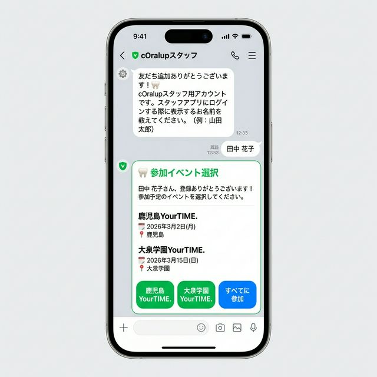
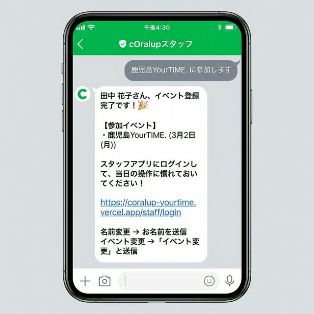
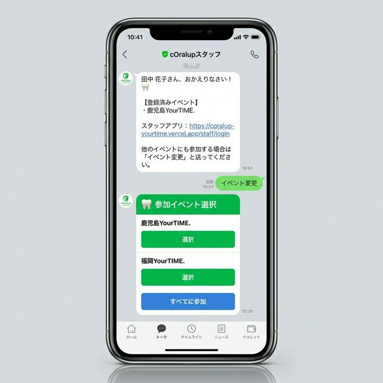

# スタッフイベント登録フロー仕様書

**最終更新: 2026-02-16**
**関連仕様書**: [28-スタッフLINE認証仕様書.md](28-スタッフLINE認証仕様書.md)

---

## 1. 概要

スタッフが LINE 友だち追加時に、**名前登録**に加えて**参加予定イベントの選択**を行うフロー。
イベント×スタッフの紐付けは `event_staffs`（多対多の中間テーブル）で管理する。

### 1.1 方式選定

| 方式 | 説明 | 採否 |
|------|------|------|
| A: `event_staffs` テーブル（中間テーブル） | 多対多を正規化で表現。イベントごとの属性（役割・ブース番号等）保持可能 | ✅ 採用 |
| B: `profiles.event_ids` 配列カラム | シンプルだが非正規化。イベントごとの属性が持てない | ❌ |
| C: `profiles.selected_event_id` 単一カラム | 最もシンプルだが複数イベント参加に非対応 | ❌ |

**採用理由**: 将来的なシフト管理・ブース番号管理・出欠管理への拡張性を担保するため、方式Aを採用。

---

## 2. データベース設計

### 2.1 テーブル構成

```
profiles ──< event_staffs >── events
  (スタッフ)   (中間テーブル)    (イベント)
```

### 2.2 `event_staffs` テーブル

| カラム | 型 | 制約 | 説明 |
|--------|------|------|------|
| `id` | UUID | PK, DEFAULT gen_random_uuid() | 主キー |
| `event_id` | UUID | FK → events.id, NOT NULL, ON DELETE CASCADE | イベント |
| `profile_id` | UUID | FK → profiles.id, NOT NULL, ON DELETE CASCADE | スタッフ |
| `role` | VARCHAR(50) | DEFAULT 'staff' | そのイベントでの役割（staff / lead / admin） |
| `booth_number` | INTEGER | nullable | ブース番号 |
| `status` | VARCHAR(20) | DEFAULT 'confirmed' | confirmed / pending / cancelled |
| `notes` | TEXT | nullable | メモ（自由記述） |
| `created_at` | TIMESTAMPTZ | DEFAULT NOW() | 作成日時 |
| `updated_at` | TIMESTAMPTZ | DEFAULT NOW() | 更新日時 |

**複合ユニーク制約**: `UNIQUE(event_id, profile_id)` — 同じスタッフが同じイベントに重複登録されることを防止

### 2.3 `events` テーブル（既存 + 新規データ）

| event_id (文字列) | name | start_date | venue | status |
|------------|------|------------|-------|--------|
| `osaka-yourtime-2025` | 大阪YourTIME. | 2025-12-21 | 大阪 | completed |
| `kagoshima-yourtime-2026` | 鹿児島YourTIME. | 2026-03-01 | 鹿児島 | active |
| `oizumigakuen-yourtime-2026` | 大泉学園YourTIME. | 2026-03-15 | 大泉学園 | active |

### 2.4 ER図

```
┌──────────────────────┐       ┌──────────────────────┐       ┌──────────────────────┐
│      profiles        │       │    event_staffs       │       │       events          │
├──────────────────────┤       ├──────────────────────┤       ├──────────────────────┤
│ id (PK)              │◄──────│ profile_id (FK)       │       │ id (PK)              │
│ line_user_id         │       │ event_id (FK)        │──────►│ event_id (UNIQUE)     │
│ display_name         │       │ role                 │       │ name                 │
│ role                 │       │ booth_number         │       │ start_date           │
│ secondary_role       │       │ status               │       │ end_date             │
│ is_active            │       │ notes                │       │ venue                │
│ avatar_url           │       │ created_at           │       │ status               │
│ last_activity_at     │       │ updated_at           │       │ created_at           │
│ created_at           │       │                      │       │ updated_at           │
│ updated_at           │       │ UNIQUE(event_id,     │       │                      │
│                      │       │        profile_id)   │       │                      │
└──────────────────────┘       └──────────────────────┘       └──────────────────────┘
```

---

## 3. ユーザーワークフロー

### 3.1 新規スタッフ登録フロー（全体図）

```
  スタッフ        LINE          Webhook API        DB(profiles)    DB(event_staffs)    DB(events)
    │               │               │                 │                │                  │
    │  友だち追加    │               │                 │                │                  │
    ├──────────────►│               │                 │                │                  │
    │               │ follow event  │                 │                │                  │
    │               ├──────────────►│                 │                │                  │
    │               │               │  SELECT profile │                │                  │
    │               │               ├────────────────►│                │                  │
    │               │               │  (存在しない)    │                │                  │
    │               │               │◄────────────────┤                │                  │
    │               │               │  INSERT profile │                │                  │
    │               │               │  role='staff'   │                │                  │
    │               │               ├────────────────►│                │                  │
    │               │               │                 │                │                  │
    │  ウェルカムMsg │               │                 │                │                  │
    │◄──────────────┤◄──────────────┤                 │                │                  │
    │ 「お名前を     │               │                 │                │                  │
    │  教えてね」    │               │                 │                │                  │
    │               │               │                 │                │                  │
    │  名前を入力    │               │                 │                │                  │
    │  「山田太郎」  │               │                 │                │                  │
    ├──────────────►│               │                 │                │                  │
    │               │ message event │                 │                │                  │
    │               ├──────────────►│                 │                │                  │
    │               │               │ UPDATE profile  │                │                  │
    │               │               │ displayName=    │                │                  │
    │               │               │  '山田太郎'     │                │                  │
    │               │               ├────────────────►│                │                  │
    │               │               │                 │                │                  │
    │               │               │ SELECT active   │                │                  │
    │               │               │ events          │                │                  │
    │               │               ├─────────────────┼────────────────┼─────────────────►│
    │               │               │  [鹿児島, 大泉] │                │                  │
    │               │               │◄────────────────┼────────────────┼──────────────────┤
    │               │               │                 │                │                  │
    │ Flexメッセージ │               │                 │                │                  │
    │ (ボタン選択)   │               │                 │                │                  │
    │◄──────────────┤◄──────────────┤                 │                │                  │
    │               │               │                 │                │                  │
    │ ボタン押下     │               │                 │                │                  │
    │「鹿児島に参加」│               │                 │                │                  │
    ├──────────────►│               │                 │                │                  │
    │               │ postback      │                 │                │                  │
    │               ├──────────────►│                 │                │                  │
    │               │               │ INSERT          │                │                  │
    │               │               │ event_staffs    │                │                  │
    │               │               ├────────────────┼───────────────►│                  │
    │               │               │                 │                │                  │
    │ 登録完了Msg    │               │                 │                │                  │
    │◄──────────────┤◄──────────────┤                 │                │                  │
    │ 「登録完了！   │               │                 │                │                  │
    │  ログインURL」 │               │                 │                │                  │
    │               │               │                 │                │                  │
```

### 3.2 状態遷移図（スタッフ登録ステータス）

```
┌────────────────────────────────────────────────────────────┐
│                                                            │
│  ┌──────────┐   友だち追加    ┌──────────┐   名前入力     │
│  │ 未登録    │───────────────►│ 名前待ち  │──────────────►│
│  │(profileなし)│              │(displayName│               │
│  └──────────┘               │  = null)  │               │
│                              └──────────┘               │
│                                    │                      │
│                                    │ ブロック              │
│                                    ▼                      │
│                              ┌──────────┐               │
│                              │ 非アクティブ│               │
│                              │(isActive   │               │
│                              │  = false)  │◄─── ブロック ─┤
│                              └──────────┘               │
│                                    │                      │
│                                    │ 再follow             │
│                                    ▼                      │
│  ┌──────────┐                ┌──────────┐               │
│  │イベント  │◄──── 名前入力 ──│ 名前待ち  │               │
│  │選択待ち  │                │(復帰後)   │               │
│  │(active   │                └──────────┘               │
│  │ events   │                                            │
│  │ 0件)     │                                            │
│  └──────────┘                                            │
│       │                                                   │
│       │ ボタン押下                                         │
│       ▼                                                   │
│  ┌──────────┐                                            │
│  │ 登録完了  │   ← 通常の最終状態                          │
│  │(event_   │   「イベント変更」で再選択可能                │
│  │ staffs有) │                                            │
│  └──────────┘                                            │
│                                                            │
└────────────────────────────────────────────────────────────┘
```

### 3.3 各ステップでのテーブル変更

| ステップ | トリガー | profiles | event_staffs | events |
|---------|---------|----------|-------------|--------|
| ① 友だち追加 | follow event | INSERT (role='staff', displayName=null, isActive=true) | - | - |
| ② 名前入力 | message event | UPDATE (displayName='山田太郎') | - | - |
| ③ イベント選択 | postback event | - | INSERT (event_id, profile_id) | - |
| ④ ブロック | unfollow event | UPDATE (isActive=false) | - (保持) | - |
| ⑤ 再follow | follow event | UPDATE (isActive=true) | - | - |
| ⑥ 名前変更 | message event | UPDATE (displayName='新しい名前') | - | - |
| ⑦ イベント変更 | message「イベント変更」 | - | INSERT (新イベント追加、既存は保持) | - |

---

## 4. エッジケース分析と対策

### 4.1 ユーザー操作のエッジケース

| # | シナリオ | 対策 | 実装箇所 |
|---|---------|------|---------|
| E1 | **名前入力前にスタンプや画像を送信** | `event.message.type !== 'text'` で無視 | handleMessage() |
| E2 | **名前として空文字を送信** | `text.length === 0` チェック→再入力促す | handleMessage() |
| E3 | **名前として50文字超の文を送信** | `text.length > 50` チェック→制限告知 | handleMessage() |
| E4 | **名前としてURLを送信** | 正規表現でURL検出→「名前を入力してください」 | handleMessage() |
| E5 | **名前入力後、イベントボタンを押さずにまた名前を送信** | 初回のみイベント選択送信、2回目以降は名前更新のみ | isFirstRegistration フラグ |
| E6 | **イベントボタンを2回押す** | `UNIQUE(event_id, profile_id)` + `onConflictDoNothing` | handleEventSelection() |
| E7 | **ブロック→再follow** | isActive を true に復活、名前・イベント情報は保持 | handleFollow() |
| E8 | **ブロック→再follow→名前未登録だった** | ウェルカムメッセージから再開 | handleFollow() |
| E9 | **ブロック→再follow→イベント未選択だった** | イベント選択メッセージを再送 | handleFollow() |
| E10 | **「イベント変更」と送信** | イベント選択Flexメッセージを再送、既存登録は維持 | handleMessage() |
| E11 | **「ヘルプ」と送信** | 使い方メッセージを返信 | handleMessage() |
| E12 | **イベントが0件の時に友だち追加** | 名前だけ登録、「イベントが登録されたらお知らせ」メッセージ | sendEventSelectionMessage() |
| E13 | **古いFlex Messageのボタンを後から押す（イベント終了後）** | events テーブルで存在チェック、見つからない場合は案内 | handleEventSelection() |
| E14 | **既に親として登録済みの人がスタッフアカウントを追加** | secondaryRole='staff' を設定（既存profileを更新） | handleFollow() |
| E15 | **同一ユーザーが短時間に複数回followを送信** | DB操作は冪等（存在チェック→更新 or INSERT） | handleFollow() |

### 4.2 システム障害のエッジケース

| # | シナリオ | 対策 | 実装箇所 |
|---|---------|------|---------|
| S1 | **LINE プロフィール取得 API 失敗** | try-catch でフォールバック、displayName='スタッフ'で続行 | handleFollow() |
| S2 | **DB書き込み失敗（event_staffs INSERT）** | try-catch で個別エラーハンドリング、ログ出力 | handleEventSelection() |
| S3 | **LINE メッセージ送信失敗** | 最大2回リトライ。429(Rate Limit)は指数バックオフ | sendMessage() |
| S4 | **Webhook 全体エラー** | 個別イベントのtry-catch隔離、1件失敗しても他は処理続行 | POST() |
| S5 | **postback データが不正** | `event.postback?.data` の null チェック | handlePostback() |
| S6 | **環境変数未設定** | `!` アサーションで起動時にクラッシュ（意図的） | 定数定義部 |

### 4.3 Flex Message の制約

| 制約 | 内容 | 対策 |
|------|------|------|
| ボタンの `label` | 最大20文字 | `truncateLabel()` で20文字に切り詰め |
| ボタン数 | Flex Message の body に制限あり | イベント数が多すぎる場合は paging 検討（現状3件なら問題なし） |
| postback の `data` | 最大300文字 | UUID×複数でも問題なし（UUID=36文字×3件=108文字+区切り） |
| `altText` | 非Flex対応端末用のテキスト | 「参加イベントを選択してください」 |

---

## 5. コマンド一覧

スタッフが LINE トークで送信できるコマンド：

| コマンド | 動作 | 例 |
|---------|------|-----|
| (名前テキスト) | 名前を登録/変更 | 「山田 太郎」 |
| `イベント変更` | イベント選択画面を再表示 | 「イベント変更」 |
| `イベント選択` | 同上 | 「イベント選択」 |
| `ヘルプ` | 使い方を表示 | 「ヘルプ」 |
| `使い方` | 同上 | 「使い方」 |

---

## 6. 実装ファイル

| ファイル | 役割 | 変更内容 |
|---------|------|---------|
| `src/db/schema/events.ts` | Drizzle スキーマ | `eventStaffs` テーブル追加、relations 定義 |
| `src/app/api/line/staff-webhook/route.ts` | Webhook API | postback ハンドラ追加、イベント選択フロー全体 |
| `supabase/migrations/20260216000000_event_staffs_and_events.sql` | マイグレーション | テーブル作成・イベント登録・既存スタッフ紐付け |

---

## 7. マイグレーション手順

```bash
# 1. Drizzle スキーマを DB に反映（event_staffs テーブル作成）
npm run db:push

# 2. イベントデータ登録 + 既存スタッフ紐付け（SQL実行）
# Supabase SQL Editor で以下のファイル内容を実行:
# supabase/migrations/20260216000000_event_staffs_and_events.sql
```

---

## 8. テストケース

### 8.1 正常系

| # | テストケース | 期待結果 |
|---|------------|---------|
| T1 | 新規ユーザーが友だち追加 | ウェルカムメッセージ受信、profiles に INSERT |
| T2 | T1の後に名前入力 | イベント選択 Flex Message 受信 |
| T3 | T2の後にイベントボタン押下 | event_staffs に INSERT、完了メッセージ受信 |
| T4 | T3の後に「すべてに参加」ボタン押下 | 全イベントが event_staffs に INSERT |
| T5 | 登録完了後に名前変更 | profiles.displayName 更新、イベント選択は再送されない |
| T6 | 「イベント変更」送信 | イベント選択 Flex Message 再受信 |

### 8.2 異常系

| # | テストケース | 期待結果 |
|---|------------|---------|
| T7 | 名前入力前にスタンプ送信 | 無視（何も返さない） |
| T8 | 51文字以上のテキスト送信 | エラーメッセージ返信 |
| T9 | URL送信 | 「名前を入力してください」メッセージ返信 |
| T10 | イベントボタン2回押し | 2回目は onConflictDoNothing、正常メッセージ返信 |
| T11 | ブロック→再follow | isActive=true に復帰、名前・イベント情報保持 |
| T12 | activeイベント0件時に友だち追加 | 名前だけ登録、「イベントが登録されたら〜」メッセージ |

---

## 9. LINE メッセージの文面

### 9.1 ウェルカムメッセージ（名前入力促進）

```
${lineDisplayName}さん、友だち登録ありがとうございます！🦷

cOralupスタッフ用アカウントです。

スタッフアプリにログインする際に表示するお名前を教えてください。

（例：山田 太郎）
```

### 9.2 イベント選択 Flex Message

```
🦷 参加イベント選択

${displayName}さん、登録ありがとうございます！

参加予定のイベントを選択してください。

---
鹿児島YourTIME.
📅 2026年3月1日(日)　📍 鹿児島

大泉学園YourTIME.
📅 2026年3月15日(日)　📍 大泉学園
---

[🟢 鹿児島YourTIME.]
[🟢 大泉学園YourTIME.]
[🔵 すべてに参加]
```

### 9.3 登録完了メッセージ

```
${displayName}さん、イベント登録完了です！🎉

【参加イベント】
・鹿児島YourTIME.（3月1日(日)）

スタッフアプリにログインして、当日の操作に慣れておいてください！

https://coralup-yourtime.vercel.app/staff/login

名前変更 → お名前を送信
イベント変更 →「イベント変更」と送信
```

### 9.4 再follow時（登録済みスタッフ）

```
${displayName}さん、おかえりなさい！🦷

【登録済みイベント】
・鹿児島YourTIME.

スタッフアプリ：https://coralup-yourtime.vercel.app/staff/login

他のイベントにも参加する場合は「イベント変更」と送ってください。
```

### 9.5 ヘルプメッセージ

```
【cOralupスタッフBot 使い方】

・お名前をメッセージで送信 → 名前変更
・「イベント変更」→ 参加イベント再選択
・「ヘルプ」→ この画面

スタッフアプリ：https://coralup-yourtime.vercel.app/staff/login
```

---

## 10. UIイメージ

### 10.1 新規登録フロー（名前入力 → イベント選択）



**フロー概要:**
1. 友だち追加時にウェルカムメッセージが自動送信される
2. ユーザーが名前を入力（例：「田中 花子」）
3. Flex Message でイベント選択ボタンが表示される
4. 個別イベント or「すべてに参加」をタップ

### 10.2 登録完了メッセージ



**フロー概要:**
1. ボタンタップ時に `displayText`（例：「鹿児島YourTIME. に参加します」）が表示される
2. 登録完了メッセージにはログインURL・操作案内が含まれる

### 10.3 再follow時 + イベント変更



**フロー概要:**
1. ブロック解除 or 再follow時に登録済みイベントを表示
2. 「イベント変更」と送信するとイベント選択画面を再表示

---

## 11. 既存スタッフのイベント紐付け

### 11.1 概要

この機能を追加する前に登録済みのスタッフには、2つの方法でイベントを紐付けできる。

### 11.2 方法A: 一斉通知スクリプト（推奨）

**スクリプト**: `scripts/notify-staff-event-selection.ts`

```bash
# DRY RUN（送信せず対象者の確認のみ）
npx tsx scripts/notify-staff-event-selection.ts --dry-run

# 本番送信
npx tsx scripts/notify-staff-event-selection.ts
```

**動作:**
1. `displayName` 登録済み かつ `event_staffs` レコードなしのスタッフを抽出
2. 各スタッフに Flex Message（イベント選択ボタン）を LINE Push 送信
3. スタッフがボタンをタップすると、通常の postback フローで `event_staffs` に登録される

**出力例（DRY RUN）:**
```
========================================
既存スタッフ イベント選択メッセージ送信
モード: 🔍 DRY RUN（実際には送信しません）
========================================

📅 対象イベント（2件）:
   - 鹿児島YourTIME. (2026年3月1日) [active]
   - 大泉学園YourTIME. (2026年3月15日) [active]

👥 全スタッフ数: 12
✅ イベント登録済み: 3
📨 今回の送信対象: 9

--- 送信対象スタッフ ---
   山田 太郎 (active: true, lineUserId: U1234567...)
   田中 花子 (active: true, lineUserId: U8901234...)
   ...

🔍 DRY RUN モードのため、送信をスキップします。
```

### 11.3 方法B: 自動フォールバック（受動的）

既存スタッフが次にBotとやり取りした時に自動対応される：

| 既存スタッフの行動 | システムの挙動 |
|-------------------|---------------|
| ブロック→再follow | イベント未選択なら選択画面を表示 |
| メッセージを送信（名前変更） | 名前更新のみ。「イベント変更」と送れる旨を案内 |
| 「イベント変更」と送信 | イベント選択画面を表示 |

### 11.4 方法C: SQL直接実行（管理者向け）

全既存スタッフを特定のイベントに一括紐付け：

```sql
-- scripts/seed-events.sql の一部
INSERT INTO event_staffs (event_id, profile_id, role, status)
SELECT e.id, p.id, 'staff', 'confirmed'
FROM profiles p
CROSS JOIN events e
WHERE e.event_id = 'kagoshima-yourtime-2026'
  AND (p.role = 'staff' OR p.secondary_role = 'staff')
  AND p.display_name IS NOT NULL
ON CONFLICT (event_id, profile_id) DO NOTHING;
```

### 11.5 推奨手順

```
1. npm run db:push                           # テーブル構造反映
2. Supabase SQL Editor で seed-events.sql 実行  # イベントデータ登録
3. npx tsx scripts/notify-staff-event-selection.ts --dry-run  # 対象確認
4. npx tsx scripts/notify-staff-event-selection.ts            # 一斉送信
```

