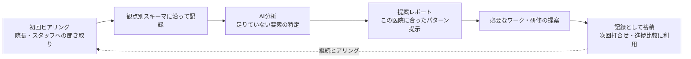

# コンサル支援AI 構想メモ

> 本資料は2026-08-05の勝田つかささんとの打合せ（口頭書き起こし）をもとに、コンサル支援AI側の論点だけを切り出して整理したものです。アプリSaaS/トレーナーマッチングの構想は別紙 `2026-08-企画書_医院SaaS-トレーナーマッチングモデル.md` を参照してください。ここに書いた項目・観点・ツール形態は**すべてたたき台**であり、確定は次回8/7(金)打合せ以降です。

---

## 0. 位置づけ（8/6追記）

このコンサル支援AIは、勝田さん個別の業務効率化ツールにとどまらない位置づけを木幡さんから与えられています。

- 木幡さん自身の直近のファイナンス課題の解決につながる可能性がある。
- **K's ClassicまたはE-spiral**（`~/os/dashboard.md`の戦略ナラティブにある通り、coralupの窓口企業はE-spiral、KS Classicとの請求元切替が論点）の**フロント商品・強み**になり得る。
- 「勝田さん専用の受託開発」ではなく、**サービス化して横展開できる軸**として作る意図がある。

このため、5章の段階設計（Step A〜D）や4章のフレームワーク設計は、勝田さんの医院コンサル業務に閉じず、他のコンサル系クライアント・他事業への転用（汎用フレームワーク化・ホワイトラベル化しやすい構造）を意識して判断する必要があります。

### 0.1 プロダクトの帰属（8/6追記）

- 請求元（K's Classic / E-spiral）は未確定・後回しでよい。E-spiralは法人ゆえすぐ利益にならない扱いが面倒という理由で、いったん保留。
- **プロダクトとしての帰属先は cOral up**。「cOral upが小児向け医院コンサルの強みとして提供できるWebアプリ」という位置づけで進める。
- ゴール: cOral upのクライアント（医院）が増えても勝田さんが疲弊せず、かつクライアントの満足度を今より高い水準で維持できる状態を、いつでも作れるようにすること。

### 0.2 このプロダクトで壊したい障壁（木幡さんのスタンス、8/6追記）

木幡さんが明示した狙いなので、設計判断のたびに立ち返る前提として残します。

- 見込み客・既存クライアントが「絶対あった方がいい」と思いつつ導入に踏み切らない典型パターンは、**①活用イメージが具体的についていない**、**②求めると金額が上がりそうだから遠慮する（自分でやる方を選ぶ）**という2つの心理障壁だと仮説立てている。
- どちらも本当に「そこまで求めていない」のではなく、**ROI（費用対効果）が見えていないから遠慮している**だけの可能性が高い、という読み。
- したがって、このプロダクトの核心的な価値は「機能を増やすこと」自体ではなく、**ROIを明確に可視化し、依頼者・クライアントの双方に理解させること**にある。5章の「顧客側ポータル（Step C）で評価推移・成果の経緯が見える」という設計は、この障壁を壊すための中核機能であり、後回しにできる付加価値ではない。
- 一方で、木幡さん自身も「安く受けすぎるとK's Classic/E-spiralのビジネスとしては危険」という緊張関係を自覚している。**「安くやってあげたい」気持ちと「事業として持続可能な価格で受ける」ことの両立**が、料金設計（別紙7章の料金たたき台、および本紙5.2のStep設計）の裏テーマになる。ROIを可視化できれば、値引きせずとも顧客が高い価格に納得しやすくなる、というのが狙いの筋。

---

## 1. 誰の・何の課題を・どう解決するか（1文）

医院向けの「組織づくり・運用定着」コンサルを一人で回している勝田さんに対し、ヒアリング内容の記録・分析・可視化・提案作成をAIが肩代わりすることで、コンサルの質と再現性を落とさずに手数を増やせる状態を作る構想です。

---

## 2. 勝田さんの現状の課題（打合せからの要約）

- **仕組みは作れるが「運用」が定着しない**: メソッド自体は教えられるが、医院側が実務に落とし込めず「ものはあるのに使えていない」状態になりがち。
- **院長とスタッフの目線のズレ**: 院長がスタッフに任せきりで、どこを目指すかが揃っていないケースが多い。
- **チームビルド・KPI設計がコンサル業務の中心になりつつある**: 契約率など、まず追う指標を最初に決める必要がある。
- **事務作業の手離れができていない**: LINEで個人宛に連絡が来る→自分が事務にパスする、という手間が残っている。
- **コンサル用シート類がまだ「しっくりきていない」**: 現状使っているシートに納得感がなく、AIで整理し直したいという意向。
- **記録・分析が属人化している**: 初回ヒアリングの内容から医院ごとの傾向を分析し、視覚化・提案する部分を、今は勝田さん個人の経験と勘に依存している。

木幡さん側の要約（36:00〜）: 「ヒアリングした内容を、AIが自動でアウトプット（提案の形）として出す」＝ YourTIMEの問診→AI分析→レポートという構造を、医院組織診断に置き換えたもの。これが「YourTIMEとは別のcOral up診断AI」というイメージの出どころです。

---

## 3. コンセプト：医院組織診断AI（仮称）

YourTIMEが「子どもの口腔機能」を問診→評価軸→AI分析→レポートで扱うのと同じ構造を、「医院の組織状態」に当てはめる構想です。

YourTIMEとの違い: 対象が「子ども個人の口腔機能」ではなく「医院という組織」。回答者も子ども1人ではなく院長・スタッフ複数人にまたがり得るため、観点の設計はYourTIMEの診断項目をそのまま流用できません（別スキーマとして新規に設計する前提）。

---

## 4. ヒアリング項目・観点フレームワーク（たたき台・要確認）

打合せで語られた課題（ミッション・ビジョン、リソース、チーム、運用定着、目線のズレ、KPI）から逆算した仮の観点軸です。8/7の打合せで勝田さんの実際のヒアリング項目・過去のシートと突き合わせて確定してください。

| 観点軸 | 見たいこと | ヒアリング例（たたき台） |
|---|---|---|
| ①ミッション・ビジョン | 医院として何を目指しているか、院長の言葉で言語化できているか | 「この医院が5年後どうなっていたいですか」「それをスタッフに話したことはありますか」 |
| ②院長×スタッフの目線ギャップ | 院長が思う目指す先と、スタッフが理解している目指す先が一致しているか | 院長・スタッフそれぞれに同じ質問をして差分を見る |
| ③既存の仕組みの有無と稼働状況 | 導入済みのプログラム・システムが実際に運用されているか、形骸化していないか | 「今使っている仕組みは何ですか」「それは誰が、どのくらいの頻度で使っていますか」 |
| ④チーム体制・役割分担 | 誰が何を担当し、責任の所在が明確か | 「口腔育成プログラムは誰が主担当ですか」「その人が休んだら誰が代わりますか」 |
| ⑤KPI・目標設定 | 追うべき数字が決まっているか（契約率など） | 「今、何の数字を追っていますか」「目標値はありますか」 |
| ⑥リソース（人・時間・予算） | コンサル施策を実行する余力が現実にあるか | 「新しい取り組みに割ける時間・人手はどのくらいですか」 |
| ⑦継続フォロー体制 | 診療後の空白期間（1〜3か月）をフォローする仕組みがあるか | 「診療が終わった後、ご家庭とどう接点を持っていますか」 |
| ⑧制度・算定への意識 | 2026年改定（口腔機能管理料等）への理解・活用意向 | 「口腔機能管理料の算定状況、今後の意向を教えてください」 |

**出力イメージ**: 上記8軸をレーダーチャート等で可視化し、「この医院は①③が弱く、②のギャップが大きい」→「だからこのワーク・この研修が合う」という提案まで一気通貫で出す、というのが木幡さんの言う「通算がヒアリングしたものを自動でアウトプットする」の具体像です。

> ⚠️ この8軸・質問例はあくまで書き起こしからの逆算です。勝田さんが実際に使っている評価軸・過去の相談実績と一致するかは未確認。8/7打合せで「今使っているシートを見せてもらう」ところから始めるのが安全です。

---

## 5. ツール形態：8/6時点で方針転換（要確認）

打合せ直後（8/5, 39:07〜）の時点では、木幡さんが「専用アプリ」か「Claude/ChatGPTの使い方を教える」かを尋ね、勝田さんが「アプリを作るより使い方を教える方が早い」と答えていたため、当初は**汎用AI＋プロンプト/テンプレ集（B案）**を本命としていました。

8/6、木幡さんから方針拡張の指示が入りました。要旨:

- Notta/Zoomの文字起こしを自動で「つーさんロジック」（4章の観点フレームワーク）に落とし込み、基準項目ごとの現状整理と今後のアクションを自動でアウトプットしたい。
- それを**コンサル先（医院）ごとの進捗管理Webアプリ**として提供し、医院側が自分の履歴・評価推移・議事録を見られる**顧客側ポータル**を持たせたい。
- 「ドライブ共有や資料で十分ではあるが、cOral up自体のサービス事例・営業素材にもなるので、やりすぎるくらいでいい」という位置づけ。
- 併せて、勝田さん向けの**顧客管理・サービス管理**（顧客ごとにどのサービスをいくらで・いつからいつまで提供しているか）も欲しい。
- 価値の核心は「資料を見て現状把握」ではなく、**支援の経緯・時系列が医院側にも見える**こと（○日○回目のMTG議事録、評価項目ごとの推移が見える）。

この指示により、5章の推奨は**B案（汎用AI＋プロンプト集）を出発点としつつ、C案寄りの軽量Webアプリへ早めに引き上げる**方向へ更新します。専用アプリを最初から作らないという結論だけを固定せず、「どこまでを最初から作るか」を選択肢として再整理します（下記5.2）。

### 5.1 類似の既存サービスはあるか（要調査への回答）

「ぶっちゃけスプレッドシートでいいか」「そういうサービスって既存でもない？」という問いに対する調査結果です。

- **部品としては存在します**: 議事録AI（Otter、Fireflies、Notta自体、国内だとJAPAN AIラボやマネーフォワードが紹介する各種ツール）は「文字起こし→要約→ToDo抽出」までを提供済みです。
- **コンサル/会計事務所向けの統合プラットフォームも存在します**: 代表例が [Canopy](https://curatesuite.com/accounting/articles/accounting-practice-management-software)（AI議事録メモ取り＋CRM＋顧客ポータル＋請求を1本化、月額$74/ユーザー〜）。Dock、Copilot（copilot.com）等の「クライアントポータルSaaS」も、進捗・契約・成果物を顧客に見せる用途で使われています。
- **ただし、これらは汎用テンプレートであり「つーさん固有の評価軸（4章のような観点フレームワーク）」には対応していません**。文字起こし→自社ロジックでの項目別評価→顧客ポータルでの推移表示、という一気通貫の組み合わせは、汎用ツールの組み合わせでは実現できても、既製品1本では見つかりませんでした。ここが「cOral upが作る意味」＝差別化ポイントになり得ます。
- 結論: 「議事録要約」だけならOtter/Fireflies/Nottaで足りますが、「つーさんロジックでの評価・推移・顧客ポータル」を求めるなら自作（または大幅カスタマイズ）が必要、という調査結果です。

Sources:
- [Best AI Practice Management Software in 2026 | CurateSuite](https://curatesuite.com/accounting/articles/accounting-practice-management-software)
- [10 Best AI Tools for Consultants Reviewed in 2026](https://thedigitalprojectmanager.com/tools/best-ai-tools-for-consultants/)
- [AI議事録自動作成ツール14選 | アスピック](https://www.aspicjapan.org/asu/article/1742)
- [要約ができるAI議事録ツールおすすめ12選 | JAPAN AI ラボ](https://japan-ai.co.jp/media/2380/)

### 5.2 段階設計（案・要確認）

「やりすぎるくらいでいい」という方針は理解しつつ、Spec-First原則（UX→API→型定義を先に固めてから作る）と衝突しないよう、**最終形は大きく描きつつ、着手順は小さく割る**案です。

| 段階 | 中身 | 判断根拠 |
|---|---|---|
| **Step A（8月末目標）** | 文字起こし（Notta/Zoom）→ 4章フレームワークに沿った項目別整理＋次アクション、をAIプロンプトで手動実行。出力はGoogleドキュメント/スプレッドシートにまず貯める | 4章の観点軸自体が未確定（8/7で勝田さんとすり合わせ）なため、フレームワークが固まる前にDB設計に入るのは手戻りリスクが高い |
| **Step B** | Step Aの出力を溜める場所を、スプレッドシートから軽量Webアプリ（医院ごとのタイムライン表示・評価推移グラフ）へ移す。勝田さん側の入力・確認画面から着手 | フレームワークが数件の実運用で検証された後。既存YourTIMEのDB/RLS設計資産（医院テナント分離）を流用できる可能性が高い |
| **Step C** | 医院側（顧客）ポータルを開放し、議事録・評価推移・次のアクションを医院自身が見られるようにする | Step Bで勝田さんの運用が回ってから。顧客に見せる=品質保証が必要なため、社内検証が先 |
| **Step D** | 顧客管理・サービス管理（サービス種別・単価・提供期間・契約期間の一覧管理）を追加し、コンサル業務全体の管理画面として統合 | 契約数が増えてスプレッドシート管理が辛くなったタイミングが自然な着手点。急がなくても構造的に後付けしやすい部分 |

技術的な補足: cOral upは既にNext.js + Supabase（RLSでテナント分離）の構成を持っており（`docs/designe/00-プロジェクト概要サマリー.md`参照）、Step B以降はこの資産の上に「医院向けSaaS」（別紙）と共通のマルチテナント基盤を使い回せる可能性があります。作るなら、アプリSaaS側と別サービスに分けず、同じ基盤上の別モジュールとして設計するのが二重投資を避ける観点で妥当です（要アーキテクチャ確認）。

---

## 6. その他、勝田さんが欲しいと言っていたもの（優先度は未整理）

- **LINE事務の手離れ**: 個人宛LINEに直接連絡が来て事務にパスする手間をなくしたい。窓口の自動振り分け・一次対応の仕組み化が必要（39:43〜）。
- **ミーティング記録の要約**: コンサル訪問後の打合せ内容をAIで要約したい（35:16）。
- **コンサル用シート類の整理**: 既存シートが「しっくりきていない」ため、AIと一緒に作り直したい（34:36〜）。
- **記録の共有方法**: 専用アプリより、Googleドライブの共有フォルダにレポート・記録を置いて「いつでも見れる」形の方が現実的という発言あり（39:43〜40:18）。
- **将来的なデータ構造イメージ**: パートナー/トレーナーごと、メニュー（元プログラム／コンサルプログラム）ごとに、誰といつどんな打合せをしたかを記録に残したい（40:26〜41:02）。これは専用アプリのDB設計ではなく、まずは共有シート/フォルダの構造として実現できる可能性があります。

---

## 7. スケジュール・確認事項

- **次回打合せ**: 8/7(金) 11:00〜12:30（仮）、藤棚近く。明石のクリニック訪問と前後する可能性あり、時間は確定待ち。
- 勝田さん側の宿題: 「どんなコンサルをしたいか」を打合せまでに整理しておく（本人発言、41:05）。イメージ図（イラスト化したもの）が既にある可能性あり、次回持参を確認。
- 木幡さん側の宿題: 上記フレームワーク（4章）とツール形態（5章）のたたき台を持って、8/7ですり合わせる。
- **目標**: 8月末までに最初の形（プロンプト/テンプレ一式、または簡易フレームワーク）を作る（41:46の発言ベース）。
- 予算感: 勝田さんはまだ想像できないとのこと。木幡さん側でリサーチして提示する約束（41:57〜42:06）。

---

## 8. 今回、木幡さんに確認・判断してほしいこと

1. 4章の8観点軸は「たたき台」でよいか、それとも8/7で勝田さんの既存シートを見てから作り直すか。
2. 5.2の段階設計（Step A〜D）でよいか。特に「Step A（プロンプト＋スプレッドシート止まり）を8月末目標にまず出す」で合意してよいか、それとも最初からWebアプリ（Step B相当）に着手するか。
3. Step B以降を作る場合、アプリSaaS側（別紙）と技術基盤を共有する前提でよいか（Supabase/RLSの医院テナント基盤を両サービスで使い回す想定）。
4. 「LINE事務の手離れ」「ミーティング要約」「シート整理」「記録のGoogleドライブ共有」「顧客管理（サービス・単価・契約期間）」のうち、どれを最初に着手するか（優先度）。
5. 医院側ポータル（Step C）を作る場合、議事録や評価推移をクライアントに見せることについて、勝田さん・医院双方の合意形成（何を見せて何を見せないか）をいつ確認するか。
