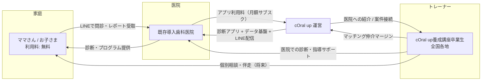

# cOral up マネタイズモデル企画書骨子
## 医院向けアプリサブスク + トレーナーマッチング仲介

> 本資料は**構想検証用**です。2026-08-05 の木幡さんとの壁打ちセッションで固まった前提をもとに、アナリストが骨子化したものです。料金・制度要件・トレーナー体制はすべて未確定であり、実証前に確定します。誇張を避け、未確認事項は「未確認」「要専門家確認」と明記しています。
>
> 参照元: 本セッション壁打ち／`docs/designe/00-企画書_ビジョン.md`（2025-12-16）／`docs/designe/00-プロジェクト概要サマリー.md`／`docs/proposals/2026-01-existing-app-valuation.md`／`20260605_MTGメモ.md`／Lafullien企画書（`~/projects/lafullien-nutrition-support/50_企画/10_企画書スライド.md`、構成トーンの参考）

---

## 1. 概要：誰に、何を、どういう形で

cOral upは現在、歯科医院にイベント用診断アプリ（親御さん問診 → スタッフ診断入力 → AI分析 → LINEレポート送信）を提供し、紙の口腔育成プログラムを並行提供しています。

本企画は、この「イベント診断 → 紙プログラム」の関係を、**アプリ主体の継続課金モデル**へ発展させる構想です。

- **初期ターゲット**: 新規開拓ではなく、**既にcOral upプログラムを導入している歯科医院**。既存関係の深耕から始めます。
- **構造**: 医院・トレーナー（cOral up養成講座卒業生）・家庭（ママさん/患者）の三者構造。
- **家庭側は無料**: Lafullienと同様、ママさん側には直接課金しません。
- **収益は2本立て**: ①医院向けアプリ利用料（サブスク）、②トレーナー ⇄ 医院／ママさんのマッチング仲介マージン（将来）。

これは既存ビジョン文書のPhase 3（医院向けSaaS）とPhase 5（マッチングプラットフォーム）を、既存導入医院起点で接続し直したものに相当します。

---

## 2. 誰の・何の課題を・どう解決するか（1文）

口腔育成に取り組みたいが継続フォローの人手と記録の仕組みが足りない既存導入医院に対し、イベントで実証済みの診断アプリを日常運用向けサブスクとして提供し、全国のcOral upトレーナーを医院・家庭へ接続することで、「診断して終わり」を「記録が残り、専門家が伴走し続ける」状態へ変える構想です。

---

## 3. ビジネスモデル可視化（三者構造）

- **医院 → 運営**: アプリ利用料（サブスク）。収益の第1の柱。
- **トレーナー ⇄ 医院／ママさん**: 運営が紹介・接続し、成立時に仲介マージンを得る。第2の柱（将来）。
- **家庭**: 無料。LINEを入口に診断体験・レポート・継続フォローを受ける側。課金対象にしない。

---

## 4. 現状 → 将来像

| 観点 | 現状（2026-08時点） | 将来像（本構想） |
|---|---|---|
| 提供形態 | イベント単発の診断アプリ + 紙のプログラム | 医院の日常運用に組み込んだアプリ + デジタル記録 |
| 収益 | イベント運営・講座収入が中心。アプリは実質無償のマーケ資産 | 医院サブスク + マッチング仲介の継続収益 |
| データ | イベントごとの診断データ（Supabaseに正規化保存済み） | 子どもごとの経年記録。医院の管理・算定エビデンスに接続 |
| トレーナー | 講座卒業生は各地にいるが、稼働機会が体系化されていない | 医院・家庭への紹介経路を運営が提供し、稼働機会を可視化 |
| 医院との関係 | プログラム導入 + イベント協力 | アプリを介した継続的な関係（解約されない理由をデータで作る） |

技術的には、既存アプリはマルチテナント化（組織別RLS）を前提に設計されており（プロジェクト概要サマリー Phase 3）、イベント版から医院版への拡張は新規開発ではなく既存資産の展開です。

---

## 5. 三者それぞれが「続ける理由」（仮説）

### 医院
- 口腔機能管理の記録・文書提供がアプリに残り、算定業務と患者説明の手間が減る（第6章）。
- 「AI診断とLINEレポートがある医院」としての差別化・自費メニュー化の余地。
- 人手が足りない局面で、トレーナーを紹介してもらえる。

### トレーナー
- 講座で学んだスキルを使う「現場」（医院サポート・個別相談）が運営経由で得られる。
- 診断・記録ツールを自前で用意しなくてよい。
- ※ただし専属利用は前提にしない（第8章のリスク参照）。

### 家庭（ママさん）
- 無料。いつものLINEで、子どもの口腔発達の記録とレポートが手元に残る。
- イベントの単発診断で終わらず、経過を見てもらえる安心感。
- 必要なら地域のトレーナーに相談できる（将来）。

いずれも仮説であり、実証（第9章）で継続意向を確認します。

---

## 6. 2026年（令和8年度）歯科診療報酬改定との接続

2026年6月1日施行の改定で、口腔機能管理の評価が拡充されました。医院がアプリに課金する動機として「**算定に必要な評価・記録・文書提供のエビデンスをアプリが半自動で残す**」ことが効く可能性があります。

### 6.1 制度側の事実（出典付き）

| 項目 | 内容 | 出典 |
|---|---|---|
| 小児口腔機能管理料の2区分化 | 評価項目3項目以上該当で小機能1（90点）、2項目該当で小機能2（50点）。対象は「口腔機能発達不全症の18歳未満の患者」 | [docswellスライド](https://docswell.com/s/daitoku0110/ZN71YQ-R8-dental-management-fee)、[Arxia解説](https://arxia.co.jp/columns/oral-function-fee-2026) |
| 口腔機能管理料（成人）の2区分化 | 口腔機能低下症で、口腔細菌定量検査・咀嚼能力検査・咬合圧検査・口腔粘膜湿潤度検査・舌圧検査のいずれか1つ以上実施で口機能1（90点）、検査未実施の確認は口機能2（50点） | 同上 |
| 口腔機能実地指導料の新設 | 46点・月1回。研修受講歯科衛生士が歯科医師の指示で実地指導し、文書提供した場合。施設基準に処遇改善の取組を含む。経過措置は2027年5月31日まで | [IOCiL解説](https://iocil.jp/column/0694/)、[ortc記事](https://ortc.jp/topics/dental-business/dental-fee-revision-2026) |

### 6.2 小機能の評価項目の中身（調査結果・一部未確認）

- 評価項目の実体は、口腔機能発達不全症のチェックリスト（咀嚼機能・嚥下機能・食行動・構音機能・栄養（体格）・口呼吸等の「その他」項目、いわゆるC項目）に基づくと解説されています。二次情報（[Wise-mg解説](https://www.wise-mg.com/blog/004/)）には「1歳半まで／以降で参照するC項目範囲が異なる」旨の記載がありますが、判定基準の記述が「3項目以上/2項目」という他ソースと整合しない部分があり、**正式な項目リストと年齢区分別の判定基準は本調査では一次情報（厚労省告示・疑義解釈）で確認できていません**。
- **要専門家確認**: 令和8年3月告示・疑義解釈資料、および日本歯科医学会「口腔機能発達不全症に関する基本的な考え方」の最新版で、評価項目の正式名称・項目数・年齢区分を確定すること。アプリの診断スキーマをこの項目に対応させるかどうかの設計判断は、この確認後に行います。

### 6.3 アプリが医院の算定業務にどう効き得るか（仮説）

- 小機能1/2は「評価項目の該当数」で点数が分かれるため、**該当項目の評価記録を毎回構造化して残すこと自体が算定エビデンス**になります。cOral upアプリの問診・診断スキーマは既にDBで管理・編集可能であり、評価項目に沿ったスキーマを組めば、紙の管理計画書作成より記録負荷を下げられる可能性があります。
- 口腔機能実地指導料は「文書提供」が算定要件（初回必須、以降は状態変化時または6か月ごと。出典: IOCiL）。アプリのLINEレポート送信は文書提供の運用を軽くする候補ですが、**LINE配信レポートが算定上の「文書により提供」に該当するかは未確認**であり、要専門家確認（地方厚生局照会等）です。
- 注意: アプリはあくまで記録・文書化の支援であり、診断・算定の主体は歯科医師・医院です。「算定できるようになる」とは訴求せず、「算定に伴う記録・文書業務を軽くする」に訴求をとどめます。

### 6.4 トレーナーは口腔機能実地指導料の担い手になり得るか（現状評価）

- 算定の実施者は**歯科衛生士に限定**されています。したがって、歯科衛生士資格を持たないトレーナーは、講座内容にかかわらず担い手になれません。
- 研修要件は「歯科医師又は歯科衛生士を主体とする団体又は学会等が主催する、口腔機能発達不全症**および**口腔機能低下症の概要・検査法・訓練法・実地指導方法等の研修」で、原則対面とされています（出典: IOCiL。歯科医師会・歯科衛生士会・日本老年歯科医学会・日本小児歯科学会等が例示。各地の保険医協会等も対応講習会を開催中）。
- **cOral up養成講座が現状この要件に該当するかは未確認**であり、少なくとも次の3点が論点です（要専門家確認）:
  1. 主催主体が「歯科医師又は歯科衛生士を主体とする団体又は学会等」と認められるか（民間講座の位置づけ）。
  2. カリキュラムが小児（発達不全症）だけでなく**成人（低下症）まで**の検査法・訓練法・実地指導方法を含むか。
  3. 対面実施要件を満たすか。
- 方向性の選択肢（断定しない）:
  - **A案**: 養成講座はあくまで独自価値（口腔育成の実践スキル）として位置づけ、算定要件研修は既存の学会・協会研修の受講を案内する。すぐ動ける現実解。
  - **B案**: 歯科衛生士資格を持つトレーナーに限り、要件充足研修の受講を支援し「実地指導料に対応できるDHトレーナー」として医院へ紹介する。マッチングの訴求力になる可能性。
  - **C案**: 将来的に、要件を満たす主体（歯科医師・歯科衛生士主体の団体等）との共催などで講座自体の要件適合を検討する。ハードルと所要期間が不明なため、専門家確認後に判断。
- 経過措置（施設基準の届出は2027年5月31日まで「受講予定」で可）があるため、医院側には「今から研修受講とアプリでの記録体制を整える」提案が時限性のあるフックになり得ます。

---

## 7. 料金たたき台（すべて未確定）

以下は議論用のたたきです。税の扱い、契約期間、解約条件、超過時の扱い、無料期間の有無はすべて実証前に確定します。参考値として、2026-01の資産査定書では「歯科医院ライセンス5万円/月」「トレーナー向けサブスク1万円/月」を仮置きしていました。

### 7.1 医院向けサブスク

| | 案A: 定額シンプル | 案B: 診断件数3段階 | 案C: 導入期モニター |
|---|---|---|---|
| 構成 | 一律 30,000円/月 | 月20件まで 15,000円 / 月50件まで 30,000円 / 無制限 50,000円 | 3か月無料または半額 → 案AかBへ移行 |
| 狙い | 説明が簡単。既存医院に出しやすい | 利用量と価格の納得感。Lafullienの段階制と同型 | 既存導入医院の心理障壁を下げ、実証データを取る |
| 懸念 | 小規模医院に高く、大規模医院に安い | 「診断件数」の定義とカウント方法の設計が必要 | 無料期間後の解約リスク。移行条件を先に合意する必要 |

### 7.2 トレーナーマッチング仲介（将来）

| | 案A: 成果報酬率 | 案B: 紹介固定料 | 案C: トレーナー側月額 |
|---|---|---|---|
| 構成 | 成立した報酬額の10〜20%を仲介マージン | 医院⇄トレーナー成立1件につき定額（例: 10,000〜30,000円） | トレーナーが掲載・紹介枠として月額（例: 3,000〜10,000円） |
| 懸念 | 報酬額の把握と直取引化（中抜き）リスク | 継続案件の価値を取りこぼす | 稼働機会が少ない初期は払う理由が弱い |

- 初期はトレーナー供給が薄い（第8章）ため、マッチングは収益化を急がず、まず無料〜低率で接続実績を作る選択肢も含めて検討します。
- 未確定: マージン率、支払フロー（運営経由か直接か）、トレーナーの業務委託契約・保険、家庭向け個別相談の価格帯。

---

## 8. 既知のリスク・未解決の論点

### 8.1 トレーナーの専属性問題（中心論点）

トレーナーはcOral up以外の学び・資格・活動を持っていることが多く、cOral upのアプリだけを専属的に使うかどうかは個人差があります。これを前提として扱います。

- 対応の方向性（選択肢として提示、断定しない）:
  - **排他契約を求めない設計**: 専属を要求すると、そもそも登録してもらえない・関係が壊れるリスク。マルチプラットフォーム利用を前提に「cOral up経由の案件ではcOral upアプリで記録する」程度の緩い規約にとどめる案。
  - **アプリ側で選ばれる価値を作る**: 記録の引き継ぎ・レポートの質・医院との接続のスムーズさなど、使う理由を機能で作り、契約で縛らない案。
  - **段階設計**: 通常トレーナーは自由、運営が案件を優先配分する「認定枠」だけ一定のコミット（利用・品質基準）を求める案。

### 8.2 トレーナー供給の薄さ（2026-06 MTGメモより）

- マスタートレーナー5人、うち現地対応を任せられるのは実質2人。養成講座も10人→5人と縮小傾向。ビジネス意識・レスポンス速度の個人差が大きい。
- つーさん自身が「人に任せきれない」状態であり、マッチングの供給側が細い。**マッチング事業は「トレーナーが十分いる」前提を置かず、医院サブスクを先行させ、マッチングは数件の手動接続から始める**のが現実的と考えられます。

### 8.3 その他の論点

- **算定支援の訴求限界**: 6.3の通り、LINEレポートの文書提供該当性・評価項目の正式リストが未確認のうちは、「点数が取れる」系の訴求はできない。確認前は「記録・説明が楽になる」訴求に限定。
- **医療広告・薬機法まわり**: 「AI診断」という表現を医院の日常診療文脈で使う際の表現規制。要専門家確認。
- **個人情報・データの取扱主体**: イベント時と異なり、医院の継続診療データを預かる形になる。同意設計・保存期間・医院間分離（既存のRLS設計を医院テナントへ拡張）を実運用前に確定。
- **紙プログラムとの関係**: 紙を廃止するのか併売するのか。紙の売上を食う可能性（カニバリ）と、紙が好きな医院・家庭の存在。

---

## 9. 検証ステップ（粒度感のたたき）

### Step 0（〜2週間）: 制度・前提の確認
- 小機能評価項目の一次情報確認、LINEレポートの文書提供該当性、養成講座の研修要件適合性を専門家（保険医協会・地方厚生局・顧問等）へ確認。
- 既存導入医院リストから、実証候補1〜2医院を選定。

### Step 1（〜1か月）: 既存導入医院ヒアリング
- 確認事項: 口腔機能管理料・実地指導料の算定状況と意向／記録・文書提供の現在の手間／月額いくらなら払うか（案A/B/Cへの反応）／トレーナー紹介ニーズの有無／紙プログラムの継続希望。

### Step 2（90日実証、1医院から）
- イベント版アプリを医院日常運用向けに最小改修（医院テナント・継続記録・経過比較）し、1医院で運用。
- 測る指標: 診断件数／記録にかかる時間の変化／家庭のLINE継続率／医院の継続意向と支払意向／スタッフの運用負荷。
- 重大ゲート（平均で相殺しない）: 医院間データ越境がない／同意なしの情報共有がない／レポート誤送信がない。

### Step 3: マッチングの手動パイロット
- 稼働可能なトレーナー2名程度で、医院サポート案件を運営が手動で接続。マージンは取らないか名目程度にし、成立条件・トラブルパターンを先に学ぶ。

---

## 10. 今回、木幡さんに確認・判断してほしいこと

1. 初期ターゲットとする既存導入医院を具体的にどこにするか（1〜2医院の実名候補）。
2. 医院サブスクの価格レンジ感覚: 案A（一律3万円）/ 案B（件数3段階）/ 案C（モニター先行）のどれをたたきにヒアリングするか。
3. トレーナー専属性の扱い: 排他を求めない前提でよいか（8.1のどの方向性で規約を設計するか）。
4. マッチングの収益化タイミング: 初期は無料の手動接続でよいか、最初からマージンを設定するか。
5. cOral up養成講座と実地指導料研修要件の関係: 6.4のA/B/C案のどれを軸に専門家確認を進めるか。
6. 紙プログラムの位置づけ: アプリ移行後も併売するか。
7. Step 0の専門家確認（制度要件）を誰に依頼するか（顧問・保険医協会・知り合いの歯科医師等）。

---

### 付記: 本資料で「未確認」「要専門家確認」とした事項の一覧

- 小児口腔機能管理料の評価項目の正式リスト・年齢区分別判定基準（一次情報未確認。二次情報間に不整合あり）
- LINEレポート送信が算定上の「文書により提供」に該当するか
- cOral up養成講座が口腔機能実地指導料の研修要件（主催主体・カリキュラム範囲・対面実施）に適合するか
- 医療広告表現（「AI診断」等）の規制適合
- 個人情報の取扱主体・同意設計・保存期間
- 料金・契約条件の全数値

出典: [docswell 令和8年度改定スライド](https://docswell.com/s/daitoku0110/ZN71YQ-R8-dental-management-fee) / [ortc 2026改定解説](https://ortc.jp/topics/dental-business/dental-fee-revision-2026) / [Arxia 口腔機能管理料2026](https://arxia.co.jp/columns/oral-function-fee-2026) / [IOCiL 口腔機能実地指導料](https://iocil.jp/column/0694/) / [Wise-mg 小児口腔機能管理料](https://www.wise-mg.com/blog/004/) / [東京歯科保険医協会 講習会案内](https://www.tokyo-sk.com/news1/37006/)
